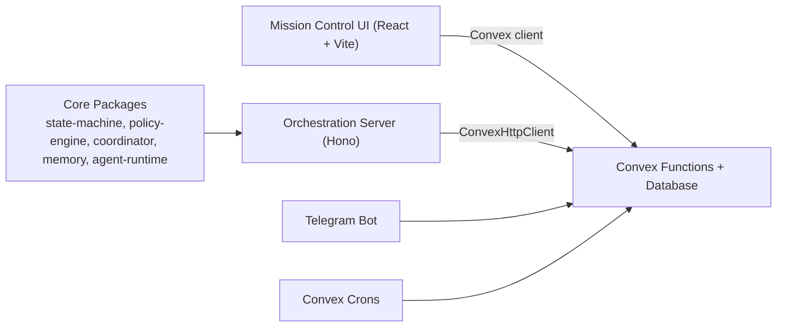

# Mission Control

Mission Control is an operator-first control plane for autonomous agent teams.

It gives product and operations teams a way to run agent work with deterministic task states, policy guardrails, approvals, and auditable execution history.

## Who It Is For

- Operators managing live agent workflows
- Engineering/product teams that need safe automation with human override
- Teams that care about trust, traceability, and budget controls

## Key Capabilities

- Deterministic task lifecycle (`INBOX -> ... -> DONE/CANCELED`) with transition rules
- Risk-aware policy engine (`ALLOW`, `NEEDS_APPROVAL`, `DENY`) with explainability
- Approvals Center for pending/approved/denied decisions with reason capture
- Approval escalation queue + dual-control decisions for RED actions
- Task Timeline + audit stream (`taskEvents`) across transitions, approvals, runs, and operator actions
- Dry-run simulation for transition/policy validation before execution
- Agent Registry with operator controls (`ACTIVE`, `PAUSED`, `DRAINED`, `QUARANTINED`)
- System operator mode controls (`NORMAL`, `PAUSED`, `DRAINING`, `QUARANTINED`)
- Saved views + task watch subscriptions for operator workflows
- Global search and command palette for tasks/agents/approvals

## Architecture



Primary docs:
- [Architecture](./docs/ARCHITECTURE.md)
- [Intelligence Layer Plan](./docs/INTELLIGENCE_LAYER_PLAN.md)
- [Decisions](./docs/DECISIONS.md)

## Repository Structure

```text
apps/
  mission-control-ui/        React operator dashboard
  orchestration-server/      Hono runtime host
packages/
  state-machine/             Task transition validation
  policy-engine/             Risk/approval rules
  coordinator/               Decomposition/delegation logic
  memory/                    Session/project/global memory
  agent-runtime/             Agent lifecycle + heartbeat
  context-router/            Intent routing
  model-router/              Model abstraction
  telegram-bot/              Telegram integration
convex/
  schema.ts                  Source-of-truth data model
  tasks.ts                   Task lifecycle + updates + simulation
  policy.ts                  Policy evaluation + explainability
  approvals.ts               Approval request/decision APIs
  search.ts                  Global search endpoint
docs/
  architecture/plans/roadmaps/release docs
```

## Quickstart

### Prerequisites

- Node.js 18+
- pnpm 9+
- Convex account/project

### Install

```bash
pnpm install
```

### Configure environment

1. Copy base env:

```bash
cp .env.example .env.local
```

2. Start Convex dev once and copy the deployment URL:

```bash
pnpm convex:dev
```

3. Create UI env at `apps/mission-control-ui/.env.local`:

```bash
echo "VITE_CONVEX_URL=<your-convex-url>" > apps/mission-control-ui/.env.local
```

### Run locally (recommended)

Terminal 1:
```bash
pnpm convex:dev
```

Terminal 2:
```bash
pnpm dev:ui
```

Optional (orchestration runtime):
```bash
pnpm dev:orch
```

## Developer Scripts

| Command | Purpose |
|---|---|
| `pnpm dev:ui` | Run UI locally |
| `pnpm convex:dev` | Run Convex local backend |
| `pnpm dev:orch` | Run orchestration server |
| `pnpm ci:typecheck` | CI-grade typecheck lane |
| `pnpm ci:test` | CI-grade test lane |
| `pnpm convex:seed` | Seed baseline data |

## How It Works

### 1) Task lifecycle

- New tasks are created in `INBOX`
- Operators/agents move tasks through explicit transition rules
- Status updates are validated by the state machine before persistence
- Every transition is written to `taskTransitions` and reflected in timeline views

### 2) Policy checks and approvals

- Policy engine evaluates risk level, budget context, assignee status, and action type
- Output decision:
  - `ALLOW`
  - `NEEDS_APPROVAL`
  - `DENY`
- Explainability surfaces include triggered rules, required approvals, and remediation hints
- Approvals Center handles escalation, dual-control decisions, and reason capture

### 3) Operator controls

- Agent Registry provides per-agent control (`Activate`, `Pause`, `Drain`, `Quarantine`)
- Operator Controls panel sets system mode (`NORMAL`, `PAUSED`, `DRAINING`, `QUARANTINED`)
- Squad-level controls support rapid incident response
- System remains auditable through activity logs and timeline artifacts

## Observability & Debugging

- Monitoring dashboard: activity severity, error events, performance snapshots
- Task timeline: transitions, activities, runs/tool calls, policy context
- Health endpoint/query: quick system posture check
- Convex Dashboard: inspect raw records and function traces during development

## Quality Gates

Run before merging:

```bash
pnpm ci:typecheck
pnpm ci:test
```

A GitHub Actions workflow is included at `.github/workflows/ci.yml`.

## Roadmap (Aligned to Intelligence Layer Plan)

- **Now (0–2 weeks)**: harden operator workflows, improve policy explainability, close docs/contract drift
- **Next (2–6 weeks)**: mandatory project scoping + authz checks, index/perf optimizations, duplicate path cleanup
- **Later (6+ weeks)**: executor hardening, offline policy/routing eval harness, richer export/reporting

See [docs/ROADMAP.md](./docs/ROADMAP.md) for detail.

## Contributing

1. Keep changes small and reviewable.
2. Update docs for behavior changes.
3. Preserve state-machine and policy invariants.
4. Include tests for transition/policy behavior when logic changes.
5. Run `pnpm ci:typecheck` and `pnpm ci:test` before PR.
