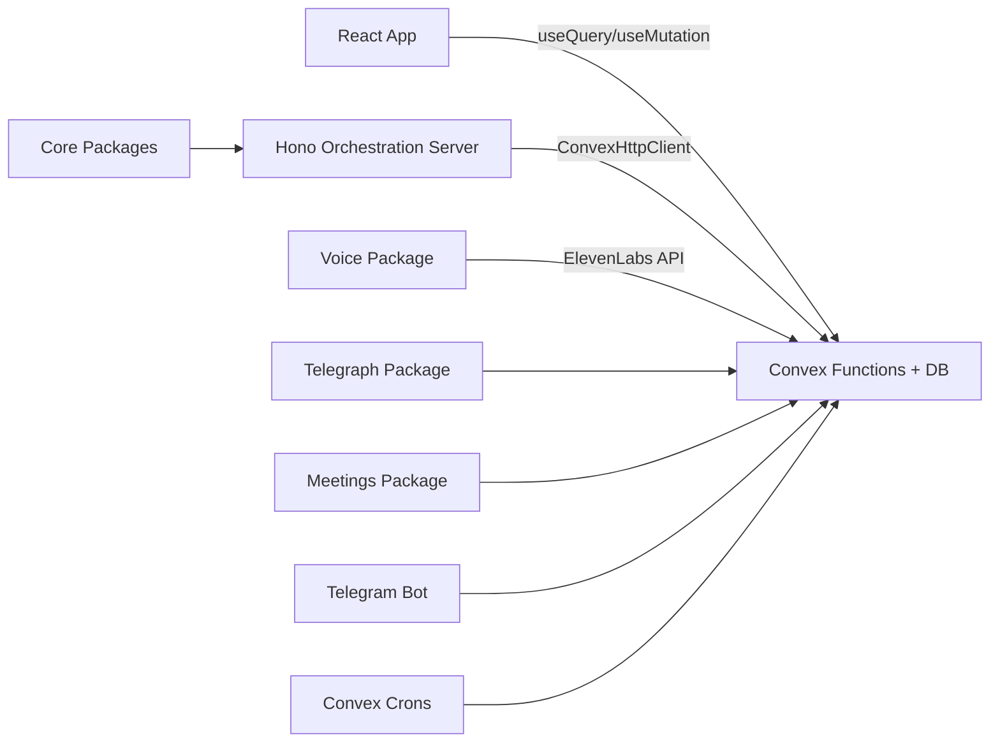
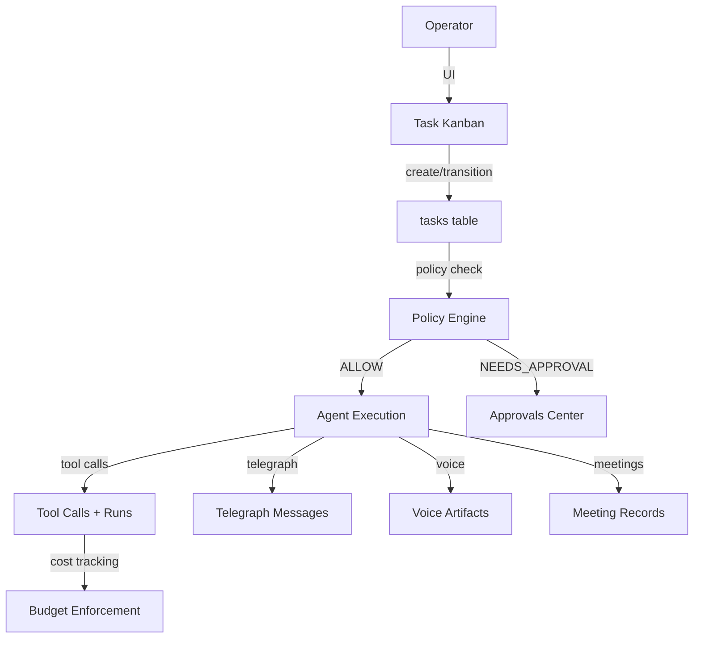

# Mission Control

**Multi-repo agent org operating system for the OpenClaw ecosystem.**

Mission Control is a self-hosted orchestration and observability control plane for autonomous AI agent squads. It manages agent identity and governance, task lifecycle, policy and approvals, async and synchronous communications, voice/avatar interactions, meeting orchestration, and incident-level auditability across multiple projects.

## Architecture



- **Frontend:** React 18 + TypeScript + Vite (single-page app, inline styles, dark theme)
- **Backend:** Convex serverless functions + database (27+ tables, source of truth)
- **Real-time:** Convex reactive subscriptions (no WebSocket/SSE)
- **Orchestration:** Hono server for coordinator ticks and agent lifecycle
- **Packages:** 14 packages in `packages/` (state-machine, policy-engine, voice, telegraph, meetings, etc.)

## Capabilities

### 🔄 Multi-Agent Workflows (NEW)
**Inspired by [Antfarm](https://github.com/snarktank/antfarm)**

Deterministic, multi-agent workflows with automatic retries and human escalation:

- **4 Built-in Workflows**:
  - `feature-dev` (7 agents): plan → setup → implement → verify → test → PR → review
  - `bug-fix` (6 agents): triage → investigate → setup → fix → verify → PR
  - `security-audit` (7 agents): scan → prioritize → setup → fix → verify → test → PR
  - `code-review` (4 agents): analyze → security → style → approve

- **Core Principles**:
  - Deterministic execution (same steps, same order, every time)
  - Agent verification (separate verifier checks implementer's work)
  - Fresh context per step (Ralph loop pattern)
  - Automatic retry with exponential backoff
  - Escalation to human approval when retries exhausted

- **Complete System**:
  - YAML-based workflow definitions (`workflows/*.yaml`)
  - Real-time dashboard with step-by-step progress
  - Standalone executor with PM2 support
  - CLI for workflow management (`mc workflow`)
  - Performance metrics and analytics
  - Bottleneck detection
  - Context passing via `{{variables}}`
  - Status markers ("STATUS: done")

- **Testing**: Comprehensive test suite for renderer, parser, and loader
- **Monitoring**: Metrics dashboard tracking success rates, durations, retries, escalations

See [docs/WORKFLOWS.md](docs/WORKFLOWS.md) for full documentation.

### Agent Identity + Governance (OpenClaw-aligned)
- **IDENTITY.md / SOUL.md / TOOLS.md** templates derived from OpenClaw reference
- Identity validator enforcing required fields (name, creature, vibe, emoji)
- Soul change audit logging (per OpenClaw: "If you change SOUL.md, tell the user")
- Compliance dashboard with "fix-it" workflows for missing/invalid identities
- CI enforcement blocking PRs with non-compliant templates

### Voice + Avatar
- ElevenLabs TTS synthesis via Convex actions
- Audio stored in Convex file storage with transcript logging
- Avatar animation (agent emoji with speaking state via framer-motion)
- Swappable provider interfaces (TTSProvider, AvatarProvider)

### Telegraph Communications
- Internal async messaging (pure Convex, no external deps)
- Telegram bridge via existing telegram-bot package
- Thread-to-task/approval/incident linking
- Safety: final replies only to external surfaces (no streaming)

### Meeting Orchestration
- Schedule meetings with org chart participants
- Auto-generated agendas and notes templates
- Action item extraction and conversion to tasks with owners + due dates
- Calendar-ready JSON payloads (iCal-compatible)
- Zoom-ready provider interface (Manual provider first)

### Org Model
- Hierarchical: Organization -> Projects -> Squads -> Agents
- Roles: CEO (one per project), LEAD, SPECIALIST, INTERN
- Org assignments separate from capability roles (one agent, multiple project positions)

### Control Plane
- 9-state deterministic task lifecycle (INBOX -> ASSIGNED -> IN_PROGRESS -> REVIEW -> DONE)
- Policy engine with GREEN/YELLOW/RED risk classification
- Approval workflows with dual-control for RED-risk actions
- Budget enforcement (per-agent daily, per-task, per-run caps)
- Loop detection (comment storms, review ping-pong, retry limits)
- Emergency controls (PAUSE, DRAIN, QUARANTINE)

## Data Flow



## Session Bootstrap

Per OpenClaw AGENTS template, every agent session starts with:

1. Read SOUL.md (from `agentIdentities.soulContent`)
2. Read project config (USER.md equivalent)
3. Read today + yesterday memory entries
4. Read long-term memory (MEMORY.md equivalent)
5. Load safety reminders

Implementation: `convex/sessionBootstrap.ts` -> `session.bootstrap` action

## Local Development

### Prerequisites

- Node.js 18+
- pnpm 9+
- Convex account and CLI (`npx convex dev`)

### Setup

```bash
# Clone the repository
git clone https://github.com/jaydubya818/MissionControl.git
cd MissionControl

# Install dependencies
pnpm install

# Start Convex dev (in a separate terminal)
npx convex dev

# Start the UI dev server
pnpm --filter mission-control-ui dev
```

### ARM Migration Validation (UI)

Once both servers are running, open `http://127.0.0.1:5173`.

1. Open `ARM -> Directory`.
2. Click `Seed Mission Control Demo` to load dense cross-section demo data.
3. Click `Run Instance Ref Backfill` to populate legacy `agentId` mappings to ARM `instanceId`/`versionId`.
4. Click `Run Tenant Backfill` to populate missing `tenantId` values on legacy records.
5. Confirm migration counters in the `Migration Ops` panel move toward zero for missing refs and tenant gaps.
6. Validate ARM views:
   - `ARM -> Policies`
   - `ARM -> Deployments`
   - `ARM -> Audit`
   - `ARM -> Telemetry`

### Environment Variables

| Variable | Required | Description |
|---|---|---|
| `CONVEX_DEPLOYMENT` | Yes | Convex deployment URL |
| `ARM_COMPAT_MODE` | Recommended | `true` keeps legacy-pref read compatibility; set `false` only after ARM cutover soak |
| `ELEVENLABS_API_KEY` | For voice | ElevenLabs API key for TTS synthesis |
| `TELEGRAM_BOT_TOKEN` | For Telegram | Telegram bot token for Telegraph Telegram bridge |
| `TELEGRAM_CHAT_ID` | For Telegram | Default Telegram chat ID for notifications |

Create a `.env` file in the project root:

```env
CONVEX_DEPLOYMENT=your-deployment-url
ARM_COMPAT_MODE=true
ELEVENLABS_API_KEY=your-elevenlabs-key
TELEGRAM_BOT_TOKEN=your-bot-token
TELEGRAM_CHAT_ID=your-chat-id
```

## Safety and Policy

Mission Control enforces these safety defaults (aligned with OpenClaw AGENTS.default):

1. **No directory/secret dumps** -- Tool calls that list directories or expose secrets are blocked by policy engine rules.
2. **No destructive commands** -- Destructive operations require explicit approval (RED risk classification).
3. **Final replies only** -- External messaging surfaces (Telegram) receive only complete, non-streaming messages.
4. **Untrusted DM input** -- Inbound direct messages are flagged as untrusted and evaluated by the policy engine.
5. **Session bootstrap required** -- Agents must read SOUL.md, project context, and memory before acting.
6. **Soul change audit** -- SOUL.md modifications trigger operator notification and audit log entries.
7. **Private data protection** -- Agents are instructed not to share private data in group/public channels.

Enforcement layers:
- **Runtime:** Policy engine rules (`packages/policy-engine/src/rules.ts`)
- **UI:** Warning indicators in Identity Compliance Dashboard
- **CI:** Template validation and agent identity compliance checks
- **Documentation:** Safety section in SOUL.md template

## Project Structure

```
MissionControl/
├── apps/
│   ├── mission-control-ui/    # React 18 + Vite frontend
│   ├── orchestration-server/  # Hono coordinator + agent runtime
│   └── workflow-executor/     # Standalone workflow executor (NEW)
├── convex/                    # Convex functions + schema (backend)
│   ├── schema.ts              # 30+ tables (source of truth)
│   ├── tasks.ts               # Task CRUD + state machine
│   ├── agents.ts              # Agent registration + lifecycle
│   ├── workflows.ts           # Workflow definitions (NEW)
│   ├── workflowRuns.ts        # Workflow execution state (NEW)
│   ├── workflowMetrics.ts     # Performance analytics (NEW)
│   ├── identity.ts            # Identity/Soul governance
│   ├── telegraph.ts           # Async messaging
│   ├── voice.ts               # TTS synthesis
│   ├── meetings.ts            # Meeting orchestration
│   ├── orgAssignments.ts      # Org hierarchy
│   └── sessionBootstrap.ts    # Session start logic
├── packages/
│   ├── shared/                # Types + constants + utilities
│   ├── state-machine/         # Transition validation
│   ├── policy-engine/         # Risk classification + safety
│   ├── workflow-engine/       # Multi-agent workflow execution (NEW)
│   ├── cli/                   # mc workflow commands (NEW)
│   ├── voice/                 # TTSProvider + ElevenLabs
│   ├── telegraph/             # TelegraphProvider + internal/Telegram
│   ├── meetings/              # MeetingProvider + Manual
│   ├── coordinator/           # Task decomposition + delegation
│   ├── agent-runtime/         # Agent lifecycle + heartbeat
│   ├── memory/                # Session + project + global memory
│   ├── model-router/          # Multi-model routing
│   ├── context-router/        # Intent classification
│   ├── openclaw-sdk/          # External agent integration
│   └── telegram-bot/          # Telegram bot
├── workflows/                 # Multi-agent workflow definitions (NEW)
│   ├── feature-dev.yaml       # Feature development (7 agents)
│   ├── bug-fix.yaml           # Bug fix (6 agents)
│   ├── security-audit.yaml    # Security audit (7 agents)
│   └── code-review.yaml       # Code review (4 agents) (NEW)
├── templates/                 # OpenClaw-derived templates
│   ├── IDENTITY.md
│   ├── SOUL.md
│   └── TOOLS.md
├── agents/                    # Agent persona YAML files
├── docs/                      # Architecture, roadmap, plans
├── scripts/                   # Setup and utility scripts
│   ├── seed-workflows.ts      # Load workflows into Convex
│   └── setup-workflows.sh     # Complete workflow setup (NEW)
└── .github/workflows/         # CI pipeline
```

## Documentation

- [Architecture](docs/ARCHITECTURE.md) -- System topology, data model, module overview
- **[Workflows](docs/WORKFLOWS.md) -- Multi-agent workflow orchestration (NEW)**
- **[Workflows Quick Start](docs/WORKFLOWS_QUICKSTART.md) -- Get started in 5 minutes (NEW)**
- **[Creating Workflows](docs/CREATING_WORKFLOWS.md) -- Custom workflow guide (NEW)**
- **[Workflow Examples](docs/WORKFLOW_EXAMPLES.md) -- Practical workflow patterns (NEW)**
- **[Workflow Executor](docs/WORKFLOW_EXECUTOR.md) -- Deployment guide (NEW)**
- **[Workflow CLI](docs/WORKFLOW_CLI.md) -- Command-line interface (NEW)**
- **[Workflow Metrics](docs/WORKFLOW_METRICS.md) -- Performance analytics (NEW)**
- [OpenClaw Integration Map](docs/OPENCLAW_INTEGRATION_MAP.md) -- How MC connects to OpenClaw
- [Plan vs Reality](docs/PLAN_VS_REALITY.md) -- Gap analysis
- [Intelligence Layer Plan](docs/INTELLIGENCE_LAYER_PLAN.md) -- Control plane design
- [Roadmap](docs/ROADMAP.md) -- Now/Next/Later phases
- [Security Audit](docs/SECURITY_AUDIT.md) -- Security checklist
- [PRD](docs/PRD_V2.md) -- Product requirements
- [Frontend Guidelines](docs/FRONTEND_GUIDELINES.md) -- UI conventions
- [Backend Structure](docs/BACKEND_STRUCTURE.md) -- Convex architecture
- [App Flow](docs/APP_FLOW.md) -- Navigation and user flows

## License

Private. All rights reserved.
