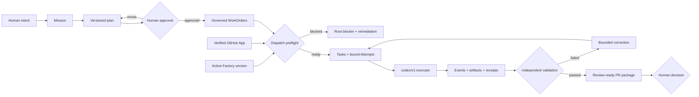
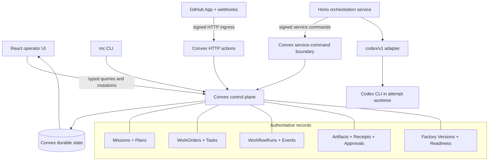

# Mission Control

## AI Software Factory for governed autonomous delivery

Mission Control turns AI coding agents into a governed, measurable software
delivery system. It coordinates human intent, repository access, plans,
WorkOrders, execution agents, policy, evidence, pull requests, and release
decisions without surrendering human authority.

> Mission Control is not another coding assistant. It is the control plane that
> makes autonomous software delivery bounded, inspectable, recoverable, and
> reviewable.

## Software Factory: governed recursive self-improvement

The Mission Control Software Factory is designed as a **governed Recursive
Self-Improvement (RSI) and continuous-learning system**. It continuously
researches operator-approved sources, learns from delivery evidence, recommends
improvements, implements approved changes, verifies the result, measures the
outcome, and uses that evidence to propose the next bounded iteration.

The operating loop is:

`research -> verify -> recommend -> approve -> implement -> validate -> measure -> iterate`

This allows the factory to evaluate new engineering practices and technology
and apply useful advances to Mission Control without becoming an uncontrolled
self-modifying agent. External content is treated as untrusted evidence, not
authority. Recommendations cannot approve themselves, and every repository,
workflow, skill, verifier, model-route, or policy change must follow the normal
Mission Control hierarchy:

`Mission -> WorkOrder -> Task -> Attempt -> evidence -> pull request -> release`

Continuous read-only research may run within explicit source, cost, time, and
retention limits. Material changes still require governed scope, independent
verification, measurable acceptance criteria, rollback controls, and the
appropriate human decision.

- [Governed Continuous Learning implementation plan](docs/plans/2026-08-08-feat-governed-continuous-learning-plan.md)
- [Governed Continuous Learning operator and source contract](docs/software-factory/CONTINUOUS_LEARNING.md)
- [Mission Control North Star](docs/product/mission-control-north-star.md)

---


*The Command Center turns a large delivery portfolio into a ranked queue of
decisions, blockers, and evidence—not a wall of agent activity.*

## The five-minute tour

Evaluating this project? In plain terms: Mission Control lets a human describe
an outcome, approve a plan, and then supervise AI coding agents that do the
work — inside hard boundaries, with every action budgeted, logged, verified by
someone other than the agent that did it, and merged only by a human. These
are the load-bearing pieces, mapped to the code that implements them:

| Claim | Where it lives |
|---|---|
| **Execution loop & harness** — poll → decompose → delegate → monitor → escalate; durable lease-based workers; idempotent, sequenced event streams; frozen execution envelopes | [`packages/coordinator/src/loop.ts`](packages/coordinator/src/loop.ts) · [`convex/executionWorker.ts`](convex/executionWorker.ts) · [`convex/lib/executionManifest.ts`](convex/lib/executionManifest.ts) |
| **Agent definitions** — 13 declarative personas with risk profiles, allowed tools, and per-run/daily budget caps | [`agents/`](agents/) (e.g. [`agents/coder.yaml`](agents/coder.yaml)) |
| **Governance & control** — risk-tiered policy evaluation, budget enforcement, human approvals, signed service commands, per-attempt worktrees with enforced file-scope boundaries | [`packages/policy-engine/src/evaluator.ts`](packages/policy-engine/src/evaluator.ts) · [`convex/approvals.ts`](convex/approvals.ts) · [`convex/serviceCommands.ts`](convex/serviceCommands.ts) · [`apps/orchestration-server/src/factoryPathScope.ts`](apps/orchestration-server/src/factoryPathScope.ts) |
| **Evaluations** — deterministic rubric-weighted grading with auto-fail gates and committed real baseline-vs-candidate model runs; 8-dimension operator evals; context evals | [`roles/support_triage_agent/evals/`](roles/support_triage_agent/evals/) ([results](roles/support_triage_agent/evals/runs/README.md)) · [`convex/operatorEvals.ts`](convex/operatorEvals.ts) · [`convex/context/evals.ts`](convex/context/evals.ts) |
| **Self-improvement** — a meta loop that proposes verifier, skill, eval-scenario, and rule changes, gated by human approval | [`convex/factory/metaLoop.ts`](convex/factory/metaLoop.ts) · [`convex/loopEngineering.ts`](convex/loopEngineering.ts) |
| **Skills framework** — typed frontmatter standard with a linter enforced in CI | [`skills/`](skills/) · [`packages/context-tools/src/skillFrontmatter.ts`](packages/context-tools/src/skillFrontmatter.ts) |
| **Proof, not demo** — live App-authored pull requests with browser-captured evidence bundles | [PR #61](https://github.com/jaydubya818/MissionControl/pull/61) · [PR #62](https://github.com/jaydubya818/MissionControl/pull/62) · [PR #72](https://github.com/jaydubya818/MissionControl/pull/72) · [`docs/testing/evidence/`](docs/testing/evidence/) |

Scale and hygiene: a ~200K-line TypeScript monorepo (16 packages, 3 apps,
158-table Convex schema), 190+ test suites plus Playwright E2E, and a CI
pipeline with typecheck, lint, unit, build, startup-smoke, and skill-quality
gates. The [Project status](#project-status) table below states plainly what
is implemented versus deferred.

## Contents

- [Why software factories and Mission Control matter](#why-software-factories-and-mission-control-matter)
- [Project status](#project-status)
- [The delivery contract](#the-delivery-contract)
- [How the factory works](#how-the-factory-works)
- [What is implemented](#what-is-implemented)
- [Live golden-path proof](#live-golden-path-proof)
- [Operator surfaces](#operator-surfaces)
- [System architecture](#system-architecture)
- [Local development](#local-development)
- [Verification](#verification)
- [Security model](#security-model)
- [Product and architecture documents](#product-and-architecture-documents)

## Why software factories and Mission Control matter

AI-assisted development begins as a one-to-one interaction: one developer asks
one agent to make a change, watches the result, and reviews the diff. That model
can improve individual throughput, but it does not become a reliable delivery
system simply by opening more agent sessions.

As developers begin supervising tens or hundreds of agents across multiple
repositories and products, the bottleneck moves from code generation to
coordination. The operator can no longer keep every plan, branch, permission,
dependency, retry, validation result, and release decision in working memory.
More agents without a control plane create more unfinished work, conflicting
changes, review pressure, cost, and risk.

A chat interface scales conversations. A software factory scales governed work.

### Coding agent, software factory, and Mission Control

These are three different layers:

| Layer | Primary responsibility | What it must not decide alone |
|---|---|---|
| **Coding agent** | Execute a bounded task, use approved tools, report events, and produce artifacts | Product intent, its own authority, acceptance, merge, or release |
| **Software Factory** | Freeze the repository, workflow, executor, policy, budget, verifier, and recovery contract used to produce changes repeatedly | Whether a business outcome is worth pursuing or whether its own output is acceptable |
| **Mission Control** | Coordinate Missions and Factories across projects; route attention, enforce governance, retain lineage, and present evidence to human operators | Product judgment, risk acceptance, or irreversible decisions reserved for people |

The Factory is the production system for a repository. Mission Control is the
portfolio-level operating system that lets a human direct many Factories without
managing every agent interaction manually.

### What breaks when agent fleets grow

| Control problem | Without a control plane | Mission Control response |
|---|---|---|
| **Intent** | Prompts drift away from the approved outcome | Versioned Missions, plans, WorkOrders, and acceptance criteria |
| **Concurrency** | Agents collide on branches, files, migrations, and shared dependencies | Repository and code-scope bindings, dependency-aware dispatch, and one active mutating Attempt per repository |
| **Authority** | Broad credentials and ambient permissions make every worker overpowered | Server-side authorization, named capabilities, short-lived provider credentials, and risk-tiered approvals |
| **Context** | Each agent receives a different or stale picture of the system | Frozen execution envelopes, versioned workflows, exact revisions, and durable source references |
| **Verification** | Workers mark themselves done and weak results move downstream | Independent receipts mapped to acceptance criteria, with pass, fail, stale, conflicting, and waived states |
| **Human attention** | Developers poll chats and logs until supervision becomes the bottleneck | Exception-first queues that rank blockers, pending decisions, failed evidence, and remediation |
| **Cost and capacity** | Retries and parallel work consume budgets invisibly | Attempt, runtime, and cost budgets plus provider-capacity and scheduler signals |
| **Continuity** | A process restart or lost chat destroys operational state | Durable Tasks, Attempts, events, leases, receipts, and idempotent commands |
| **Accountability** | It is difficult to explain who authorized a change or why it shipped | End-to-end lineage from intent through plan, execution, PR, approval, release, and production evidence |

### The developer becomes an operator

At fleet scale, the human role changes. Developers spend less time driving each
keystroke and more time setting intent, defining constraints, reviewing
exceptions, making risk decisions, and accepting evidence. Agents own bounded
execution, iteration, validation support, recovery, and evidence collection.

Mission Control is designed so one operator can quickly answer:

- What outcome matters most right now?
- Which work is blocked, and what exact decision or evidence will unblock it?
- Which agent may change which repository and code scope?
- What changed relative to the approved plan?
- Which acceptance criteria passed, failed, became stale, or were waived?
- How much time, cost, and retry budget remains?
- Can the work be paused, cancelled, replayed, or recovered safely?
- What is actually ready for human review, merge, or release?

This repository is designed for that future operating model, but it does **not**
claim that the current V1 has been production load-tested with hundreds of live
agents. The current foundation instead proves one complete, browser-operable,
repository-backed golden path with durable evidence and safe recovery. Correct
control primitives come before fleet-size claims.

## Project status

Mission Control is in active V1 development.

The governed factory foundation is implemented: repository identity, GitHub App
readiness, immutable Factory versions, activation gates, signed service
commands, the `codex/v1` executor contract, and exact execution bindings are in
the codebase and covered by automated tests. WorkOrders can also freeze an
executable verification contract with mandatory checks, negative constraints,
change budgets, criterion-level evidence requirements, and an independently
computed WorkOrder verdict.

The real Codex-to-GitHub pull-request golden path is implemented and proven
against this repository. A private, repository-scoped GitHub App created real
pull requests through just-in-time installation tokens after the durable worker
claimed a bound Attempt, ran `codex/v1`, enforced the approved changed-file
scope, pushed the server-owned branch, and persisted the exact lineage. Browser
proof covers cancellation, immutable retries, failure, success, refresh,
process restart, and idempotent PR reconciliation.

The Mission acceptance path now reconciles a current passing Worker receipt and
complete structured handoff into a linked non-independent assertion. Assertions
that require independent validation remain Validator-only. Mission drafts bind
the accountable owner, team, repository, and approved code scopes, while
mutating plan blueprints release explicit commands, attempt and time limits,
budget, and stop conditions into their WorkOrders.

GitHub follow-up reads no longer depend on a personal or global token. The
Factory mints a short-lived installation token for the exact bound repository,
normalizes pull-request and check-run webhook identities, validates the
factory-authored WorkOrder/Attempt/Task lineage, and exposes signature-valid
delivery outcomes in the operator UI. Browser proof showed PR evidence leaving
quarantine and linking automatically without a control-plane repair command.

An enforced `REQUIRES_HUMAN_REVIEW` verdict now creates a durable publication
checkpoint instead of failing the Attempt. Unconditional approval appends an
approval-linked `VERIFIED` receipt and reclaims the same Attempt at
`PUBLISHING`; the worker rechecks the exact candidate SHA and does not rerun
`codex/v1` or independent verification. Immediately before the first GitHub
write, the worker consumes a short-lived publication permit bound to the exact
Attempt lease and candidate. Conditional approval, rejection, expiry, or a
revision request closes the Attempt fail-closed so changed conditions require a
new governed retry. Authenticated operators and tools can enumerate pending
Factory review checkpoints with `GET /approval-decisions?projectId=...`; the
executor still has no self-approval authority.

This implementation landed in [PR #72](https://github.com/jaydubya818/MissionControl/pull/72)
with green smoke, typecheck, lint, unit, build, E2E, and preview checks.

The same-Attempt continuation was also exercised live across a full
orchestration-process restart. The persisted verified candidate resumed only
after browser approval, consumed a candidate-bound publication permit, and was
published by the repository-scoped GitHub App as [PR #73](https://github.com/jaydubya818/MissionControl/pull/73).
The generated canary PR passed every check and was closed unmerged after the
proof was captured. The audit IDs, event counts, and screenshots are recorded in
[`docs/testing/evidence/pr-72-human-review-resume/`](docs/testing/evidence/pr-72-human-review-resume/README.md).

This closes the single-repository delivery and review proof; it does not make a
broad production-scale claim. Unified review evidence, governed staging, and
human-approved production-release automation are implemented. The first
production qualification remains in progress, while remote sandbox enforcement,
learning-ledger CRUD, trust scoring, verified-throughput metrics, additional
providers, and fleet-scale scheduling remain deferred.

| Capability | Status |
|---|---|
| Mission planning and human plan approval | Implemented |
| Governed WorkOrders, Tasks, Attempts, and evidence records | Implemented |
| GitHub App identity, least-privilege readiness, signed webhooks, ephemeral CI reads, and replay ledger | Implemented and browser-proven |
| Immutable Factory configuration, readiness assessment, and activation | Implemented |
| Signed service commands and durable command receipts | Implemented |
| `codex/v1` executor adapter with sandbox, events, health, and cancellation | Implemented |
| Dispatch preflight and immutable execution envelope | Implemented |
| Durable Codex worker through exact GitHub pull request | Implemented and browser-proven |
| Worker receipt and handoff reconciliation into Mission assertions | Implemented and browser-proven |
| Independent verification before pull-request publication | Implemented |
| Durable human-review pause and same-Attempt publication resume | Implemented |
| Exact-Attempt unified review evidence package | Implemented and browser-proven |
| Built Node ESM orchestration startup smoke | Implemented and enforced in CI |
| Governed staging deployment and independent verification | Implemented |
| Human-approved production deployment, verification, and promotion | Implemented; qualification in progress |
| Remote sandbox enforcement | Deferred |
| Learning ledger, trust scoring, and verified-throughput metrics | Deferred |
| FDE engagement workspace and additional connectors | Post-V1 |

The original repository baseline, approved implementation sequence, and live
proof are recorded in the
[existing-system assessment](docs/mission-control-existing-system-assessment.md),
[V1 program plan](docs/plans/2026-08-02-feat-ai-software-factory-v1-program-plan.md),
[completed golden-path todo](todos/024-ready-p1-real-codex-github-pr-golden-path.md),
[Mission evidence reconciliation](todos/029-complete-p1-reconcile-worker-evidence-into-mission-acceptance.md),
[authenticated GitHub CI ingestion](todos/030-complete-p1-authenticate-github-webhook-ci-ingestion.md),
and [browser evidence report](docs/testing/evidence/real-codex-github-pr-golden-path/README.md).

## The delivery contract

Mission Control uses one authoritative hierarchy:

```text
Company
└── Workspace
    └── Repository
        └── Active Factory version
            └── Mission
                └── Approved Plan
                    └── WorkOrder
                        └── Task
                            └── Attempt / WorkflowRun
                                ├── ordered events
                                ├── artifacts and changed files
                                └── verification receipts

Pull Request → Merge → Deployment → Activation → Production Verification
```

Each layer has a separate responsibility:

- A **Mission** captures the intended outcome, constraints, sources, budget,
  stop condition, and acceptance criteria.
- A **Plan** is versioned, reviewable, and must be approved before material
  implementation begins.
- A **WorkOrder** is the governed delivery and acceptance contract released
  from that plan.
- A **Task** is a bounded operational unit inside a WorkOrder.
- An **Attempt** is one immutable execution try against an exact WorkOrder
  revision and Factory version.
- **Evidence** proves or disproves acceptance criteria. A worker report does not
  prove completion.
- Pull request, merge, deployment, activation, and production verification are
  distinct states. None silently implies the next.

## How the factory works


```mermaid
flowchart LR
    H["Human intent"] --> M["Mission"]
    M --> P["Versioned plan"]
    P --> A{"Human approval"}
    A -->|approved| W["Governed WorkOrders"]
    A -->|revise| P

    F["Active Factory version"] --> G{"Dispatch preflight"}
    GH["Verified GitHub App"] --> G
    W --> G

    G -->|blocked| X["Root blocker + remediation"]
    G -->|ready| T["Tasks + bound Attempts"]
    T --> C["codex/v1 executor"]
    C --> E["Events + artifacts + receipts"]
    E --> V{"Independent validation"}
    V -->|failed| R["Bounded correction"]
    R --> T
    V -->|passed| PR["Review-ready PR package"]
    PR --> D{"Human decision"}
```

Before a Mission-linked Attempt exists, dispatch revalidates the exact active
Factory version, configuration digest, repository and GitHub access, workflow,
executor, policy, verifiers, host, budget, recovery controls, branch/worktree,
and allowed tools. A blocked check returns one actionable root cause without
creating a run.

## What is implemented

### 1. Company, workspace, and repository boundaries

The control plane models:

`Company → Workspace → Repository → Code Scope`

Repository identity is portable and separate from a developer's local checkout.
Monorepos can define repository-relative code scopes, owning teams, execution
environments, review requirements, and overlap policy. Local execution uses a
separate host binding.

Authorization is resolved server-side. The browser does not decide which
company, workspace, repository, team, or delivery record an operator may act on.

### 2. Mission and plan governance

The Mission workspace supports draft, planning, proposal, rejection, revision,
approval, WorkOrder release, execution, validation, acceptance, cancellation,
and supersession states. Approved plans retain assertions, WorkOrder blueprints,
dependencies, risk, cost, rollback, and independent-validation requirements.

Task completion does not accept a WorkOrder, and WorkOrder completion does not
accept a Mission.

### 3. GitHub App trust boundary

GitHub is the only V1 Git provider. Mission Control records the App installation
identity and capability evidence for an exact workspace repository. It checks:

- repository installation identity;
- exact least-privilege permissions;
- required webhook subscriptions;
- verification freshness; and
- connection degradation, suspension, removal, or revocation.

Webhook HMAC is validated against the untouched request body before parsing.
Every GitHub delivery GUID is recorded in a replay-aware ledger, and duplicates
cannot repeat PR, CI, review, or improvement-loop effects. Installation tokens,
OAuth tokens, App private keys, client secrets, and webhook secrets are never
stored in product records.

See [GitHub App Connection and Webhook Contract](docs/security/github-app-connection.md).

### 4. Versioned Factory configuration

A Software Factory is a thin, repository-bound configuration aggregate. It
references existing platform records instead of creating a second execution
system.

Each immutable Factory version freezes:

- repository;
- workflow version;
- executor adapter and version;
- governance policy;
- environment;
- cost, runtime, and attempt budgets;
- independent verifiers;
- GREEN, YELLOW, or RED risk boundary; and
- pause, resume, cancel, and retry posture.

Readiness checks GitHub, repository access, workflow, `codex/v1`, policy,
budget, verifiers, sandbox host, and recovery controls. Activation requires a
current passing assessment for the exact configuration digest. Material changes
create a new version and leave the previous version auditable.

The UI lives under **Settings → Workspaces & Repositories**.

### 5. Human and service authority separation

Human actions, service commands, GitHub webhooks, and internal scheduler work use
different trust boundaries.

The orchestration service signs outbound commands with a replay-resistant HMAC
envelope containing the service identity, named capability, workspace,
repository, command ID, issue/expiry time, and exact payload digest. Convex
retains accepted, denied, failed, succeeded, and replayed command receipts
without storing credentials or command bodies.

Public clients cannot claim `SYSTEM` or `AGENT` authority to dispatch work.

See [Service Command Authentication](docs/security/service-command-authentication.md).

### 6. Codex executor adapter

V1 supports one production executor contract: `codex/v1`. Deterministic fake
adapters are test fixtures only.

The adapter provides:

- capability discovery;
- configuration validation;
- low-confidence cost/runtime estimates;
- ordered execution events;
- read-only and workspace-write isolation;
- repository-relative allowed paths;
- bounded timeouts;
- cancellation;
- explicit no-resume semantics for the in-process `codex/v1` session;
- health reporting; and
- bounded, redacted diagnostics.

Factory workflow checkpoints are a separate control-plane concern. A verified
Attempt may resume at publication after human approval without pretending the
underlying Codex session itself is resumable.

The adapter executes an already-approved Attempt. It cannot approve a plan,
widen repository scope, activate a Factory, validate its own work, merge a PR,
or release software.

See [Executor Adapter Contract](docs/architecture/executor-adapter-contract.md).

### 7. Governed execution envelope

Every Mission-linked WorkflowRun can retain the exact Factory version and
digest, repository, host, executor, policy, environment, branch, worktree,
allowed tools, WorkOrder revision, and model-routing lineage used at dispatch.

Dispatch is idempotent and enforces one active mutating Attempt per repository
across Missions. Read-only work may coexist when policy allows it. Historical
runs without the new binding remain visibly marked as legacy rather than being
presented as governed.

### 8. Evidence and operator control

Mission Control already retains WorkOrder events, Attempt events, run artifacts,
approval decisions, verification receipts, PR/CI evidence, audit activity, and
release records. Operator surfaces prioritize required decisions, failed or
stale evidence, blockers, and remediation before routine agent activity.

The evidence model distinguishes pass, fail, stale, unknown, waived,
conflicting, and not-applicable states. The run inspector derives one fail-closed
review package from the exact Attempt, frozen WorkOrder revision, commit, open
pull request, CI result, changed files, risks, and rollback guidance. Missing or
mismatched lineage remains visibly blocked instead of borrowing WorkOrder-wide
evidence. See the [review evidence browser proof](docs/testing/evidence/v1-review-browser-hardening/README.md).

## Live golden-path proof

The completed browser-operated path is:

`Mission → approved Plan → WorkOrder → Task → Attempt → evidence → commit → pull request → operator acceptance`


*The recovered Mission reached `Validated` with 1/1 assertion coverage after
the worker receipt, structured handoff, WorkOrder acceptance, and final operator
decision were recorded through the browser.*

Three App-authored pull requests prove complementary parts of the path:

- [PR #61](https://github.com/jaydubya818/MissionControl/pull/61) is the clean,
  recovered Mission proof. It binds the approved Mission hierarchy to branch
  `mc/8aw15s8c7z3d`, commit
  `2fd0a5a0773560b05174776857545d7cd3bc5f95`, the exact changed file, and the
  review-ready PR. The Mission, WorkOrder, and Task reached their accepted
  terminal states.
- [PR #62](https://github.com/jaydubya818/MissionControl/pull/62) preserves the
  cancellation, two failed retries, and successful fourth Attempt. It proves
  immutable retry history, approved verification-command execution, exact file
  scope, process-restart reconciliation, and duplicate-PR prevention.
- [PR #63](https://github.com/jaydubya818/MissionControl/pull/63) is the complete
  browser-only proof for Mission evidence reconciliation and authenticated
  GitHub CI ingestion. It proves a 1/1 reconciled Mission assertion, accepted
  Mission/WorkOrder/Task states, a signature-valid `pull_request.edited`
  delivery, exact head `478e531b6c62ec552597e540a3205fb645560a2e`, and
  automatic WorkOrder/Attempt correlation without repair commands.

All three proof pull requests were created by the private Mission Control GitHub
App, completed all nine repository checks successfully, and were closed
unmerged after evidence capture. The App is installed only on
`jaydubya818/MissionControl` with Metadata read, Checks read, Contents write, and
Pull requests write.

The production implementation did not merge through those proof artifacts. It
landed through [implementation PR #67](https://github.com/jaydubya818/MissionControl/pull/67),
with recovery and review hardening in
[PR #71](https://github.com/jaydubya818/MissionControl/pull/71) and the final
exact-Attempt review package in
[PR #80](https://github.com/jaydubya818/MissionControl/pull/80). Governed
production-release automation landed separately in
[PR #82](https://github.com/jaydubya818/MissionControl/pull/82).

See the [durable worker and GitHub publication contract](docs/software-factory/durable-codex-github-pr.md)
and the [complete browser evidence report](docs/testing/evidence/real-codex-github-pr-golden-path/README.md)
for persisted identifiers, screenshots, state coverage, and deterministic test
results.

Merge and production promotion remain human decisions. The first governed
production qualification is tracked in
[todo 040](todos/040-in-progress-p0-qualify-production-automation.md).
Additional Git providers, remote sandbox enforcement, and hundred-agent scaling
remain deferred until the single-repository release path is operationally
qualified.

## Operator surfaces

The EOS V2 shell uses a route-maturity registry. Live routes are available by
default; Preview and Demo routes remain labeled and can be hidden.

The screenshots below use the deterministic `sf-demo` fixture. Counts,
timestamps, names, and outcomes are demonstration data—not measured production
throughput or a claim of 100-agent load validation.

### Governed execution queue


Work Orders turn approved intent into an executable contract. The operator can
filter by repository, state, risk, assignment, requestor, and verification;
inspect automation lineage; and see the next action before dispatching or
accepting work.

### Approval and audit trail


The audit surface retains lifecycle changes, approvals, denials, deployment
events, and policy decisions so a high-volume agent fleet remains explainable
after the fact.

| Route | Operator job | Maturity |
|---|---|---|
| `/v2/command-center` | Triage decisions, blockers, risk, and delivery attention | Live |
| `/v2/missions` | Define outcomes and manage Mission planning | Live |
| `/v2/mission-detail` | Inspect plan, WorkOrders, execution, and acceptance | Live |
| `/v2/control-work-orders` | Govern, dispatch, verify, and accept WorkOrders | Live |
| `/v2/tasks` | Inspect operational Tasks and Attempts | Live |
| `/v2/projects` | Configure workspaces, repositories, GitHub App readiness, code scopes, and Factory versions | Live |
| `/v2/audit` | Review approvals and audit history | Live |
| `/v2/harness-loops` | Inspect governed improvement-loop evidence | Live |
| `/v2/trace-inspector` | Inspect detailed execution lineage | Preview |

## System architecture


```mermaid
flowchart TB
    UI["React operator UI"] -->|typed queries and mutations| CX["Convex control plane"]
    CLI["mc CLI"] --> CX

    GH["GitHub App + webhooks"] -->|signed HTTP ingress| HTTP["Convex HTTP actions"]
    HTTP --> CX

    ORCH["Hono orchestration service"] -->|signed service commands| SC["Convex service-command boundary"]
    SC --> CX
    ORCH --> ADAPTER["codex/v1 adapter"]
    ADAPTER --> CODEX["Codex CLI in attempt worktree"]

    CX --> DB[("Convex durable state")]
    DB --> UI

    subgraph "Authoritative records"
      M["Missions + Plans"]
      W["WorkOrders + Tasks"]
      R["WorkflowRuns + Events"]
      E["Artifacts + Receipts + Approvals"]
      F["Factory Versions + Readiness"]
    end

    CX --- M
    CX --- W
    CX --- R
    CX --- E
    CX --- F
```

Convex is the source of truth. The Hono service hosts orchestration and executor
integration; it does not own a competing delivery lifecycle. Product data is
accessed through Convex queries, mutations, actions, internal functions, and
HTTP actions—there is no separate Express REST backend.

## Repository map

| Path | Responsibility |
|---|---|
| `apps/mission-control-ui/` | React operator application and EOS V2 shell |
| `apps/orchestration-server/` | Hono ingress, service-command client, agent coordination, and `codex/v1` runtime |
| `apps/workflow-executor/` | Standalone executor for versioned workflow graphs |
| `convex/` | Authoritative schema, domain commands, policies, GitHub ingress, evidence, and projections |
| `packages/workflow-engine/` | Workflow execution and executor-adapter contracts |
| `packages/policy-engine/` | Policy evaluation primitives |
| `packages/agent-runtime/` | Agent lifecycle and heartbeat behavior |
| `packages/context-*` | Context routing, manifests, activation, and tooling |
| `workflows/` | Versioned YAML workflow definitions |
| `scripts/mc` | Mission Control CLI |
| `docs/` | Product doctrine, architecture, security contracts, plans, and verification evidence |

## Technology

- React 18, TypeScript, Vite, Tailwind CSS 4, and shadcn/ui
- Convex for durable state, typed server functions, scheduled work, and HTTP
  ingress
- Hono for the orchestration service
- pnpm workspaces and Turborepo
- Vitest for unit and contract tests
- Playwright and Axe for browser and accessibility checks
- Codex CLI as the approved V1 execution runtime

## Local development

### Prerequisites

- Node.js 18 or newer
- pnpm 9 or newer
- A Convex development deployment

### First-time setup

```bash
git clone https://github.com/jaydubya818/MissionControl.git
cd MissionControl
pnpm install
cp .env.example .env.local
npx convex dev
```

On first use, Convex creates or connects a development deployment. Copy the
generated `CONVEX_URL` to `VITE_CONVEX_URL` in `.env.local`, then start the
normal development stack:

```bash
pnpm run dev
```

Open [http://localhost:5173](http://localhost:5173), or the next port printed by
Vite if 5173 is already in use.

### Deterministic Software Factory demo

The supported demo runs from the main repository and starts Convex, the
workflow executor, and the V2 operator UI:

```bash
pnpm run dev:demo
```

In a second terminal:

```bash
pnpm run convex:seed:demo:force
```

Open
[http://localhost:5199/v2/command-center](http://localhost:5199/v2/command-center)
and select **Software Factory Demo** (`sf-demo`). This is a deterministic local
operator demo; the separate live GitHub PR proof is documented above.

Optional knowledge graph import:

```bash
pnpm run import:knowledge-graph:demo
```

See [Run the demo](docs/site/get-started/run-the-demo.md) and
[Run Commands](docs/guides/RUN.md).

## Production-bound configuration

Local demo mode does not require live GitHub credentials. A real GitHub App
connection requires the server-side variables documented in
[GitHub App Connection and Webhook Contract](docs/security/github-app-connection.md),
including the App identity, OAuth client, private key, webhook secret, and
Mission Control callback URL.

Authenticated orchestration additionally requires:

- `ORCHESTRATION_API_TOKEN` for inbound Hono requests;
- `MISSION_CONTROL_SERVICE_COMMAND_SECRET` in orchestration and Convex;
- optional matching `MISSION_CONTROL_SERVICE_ID`; and
- a valid `CODEX_EXECUTABLE` path when the bundled default is unavailable.

Secrets must remain server-side and must never use a `VITE_` prefix.

### Built orchestration service

Production startup uses compiled Node ESM artifacts rather than the development
`tsx` loader:

```bash
pnpm run ci:prepare
pnpm --filter @mission-control/orchestration-server build
pnpm --filter @mission-control/orchestration-server start
```

Runtime workspace packages use explicit `.js` ESM specifiers in emitted code.
The startup smoke loads the same compiled entrypoint with network listeners and
workers disabled, so extensionless or directory-import regressions fail before
deployment:

```bash
pnpm run smoke:orchestration-start
```

## Built-in workflows

The repository includes six YAML workflow definitions:

- `feature-dev`
- `bug-fix`
- `code-review`
- `security-audit`
- `quality-audit`
- `loop-engineering`

They are installed into the versioned workflow catalog and snapshotted onto
Attempts so later catalog edits do not rewrite execution history.

## Verification

Run the same primary checks used by CI:

```bash
pnpm run typecheck
pnpm run test
pnpm run lint
pnpm run build
pnpm run smoke:orchestration-start
```

Critical browser checks:

```bash
pnpm run test:e2e:critical
```

CI also runs a smoke test, a public Convex runtime-contract guard, skill-quality
gates, the built orchestration startup check, unit/contract suites, and the UI
build. The hosted E2E job currently
depends on live Convex infrastructure and is non-blocking; production release
evidence must therefore include an explicit local or isolated-environment
browser run.

## Security model

- Human, service, scheduler, webhook, and GitHub installation identities remain
  separate.
- Sensitive actions enforce company, workspace, repository, delivery-record,
  and named-permission scope server-side.
- Factory activation and Mission dispatch fail closed on missing or stale
  evidence.
- External webhook delivery is signed, deduplicated, and replay-aware.
- Service commands are signed, scoped, short-lived, and replay-resistant.
- Installation tokens and service credentials are not stored in product
  records.
- Repository mutation is constrained to an attempt worktree and approved
  repository-relative paths.
- The worker that creates a material change cannot be the only validator.
- Merge remains human-only in V1.

Security and governance contracts:

- [Human and Service Authorization Matrix](docs/security/human-service-authorization-matrix.md)
- [GitHub App Connection](docs/security/github-app-connection.md)
- [Service Command Authentication](docs/security/service-command-authentication.md)
- [Evidence Retention Policy](docs/security/evidence-retention-policy.md)

## Product and architecture documents

- [Mission Control North Star](docs/product/mission-control-north-star.md)
- [V1 Product Strategy](docs/product/mission-control-v1-product-strategy.md)
- [Existing-System Assessment](docs/mission-control-existing-system-assessment.md)
- [AI Software Factory V1 Program Plan](docs/plans/2026-08-02-feat-ai-software-factory-v1-program-plan.md)
- [ESM startup and human-review resume plan](docs/plans/2026-08-11-fix-esm-startup-human-review-resume-plan.md)
- [V1 Product Decisions](docs/decisions/ai-software-factory-v1-decisions.md)
- [Company, Workspace, and Repository Control Plane](docs/architecture/company-workspace-repository-control-plane.md)
- [Executor Adapter Contract](docs/architecture/executor-adapter-contract.md)
- [Graph Engineering](docs/software-factory/GRAPH_ENGINEERING.md)
- [Loop Engineering](docs/software-factory/LOOP_ENGINEERING.md)

## Product doctrine

Mission Control optimizes for approved-plan-to-review-ready-PR time, evidence
completeness, first-pass validation, bounded recovery, operator attention, cost
per accepted WorkOrder, and developer trust.

Agent activity, token count, lines generated, and PR volume are not success
metrics.

## License

MIT
