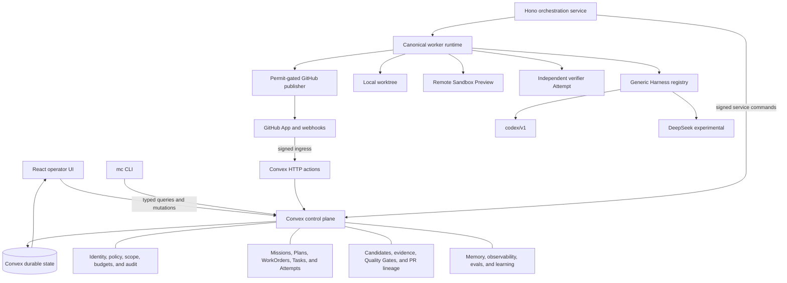

# Mission Control

**The governed control plane for human-directed, agent-executed software
delivery.**

Humans define intent and retain authority. Coding agents perform bounded work.
Deterministic systems enforce scope, policy, verification, currentness, and
evidence before a change becomes eligible for human acceptance.

[](https://github.com/jaydubya818/MissionControl/actions/workflows/ci.yml)
[](LICENSE)
[](#project-status-and-proof)
[](https://www.typescriptlang.org/)


Mission Control is not another coding agent and it is not a chat wrapper. It is
the durable authority and evidence layer above coding agents, execution
harnesses, repositories, CI systems, and deployment tooling.

Its purpose is simple:

> Turn approved software intent into independently verified, review-ready pull
> requests without giving agents authority to approve their own work.

## Contents

- [Why Mission Control exists](#why-mission-control-exists)
- [What Mission Control is](#what-mission-control-is)
- [Operating principles](#operating-principles)
- [The governed delivery lifecycle](#the-governed-delivery-lifecycle)
- [Who owns each decision](#who-owns-each-decision)
- [Core capabilities](#core-capabilities)
- [Operator experience](#operator-experience)
- [System architecture](#system-architecture)
- [Project status and proof](#project-status-and-proof)
- [Current limitations](#current-limitations)
- [Quickstart](#quickstart)
- [Software Factory demo](#software-factory-demo-local-end-to-end)
- [Development and verification](#development-and-verification)
- [Security model](#security-model)
- [Repository map](#repository-map)
- [Documentation](#documentation)

## Why Mission Control exists

AI-assisted development starts as a one-to-one interaction: a developer asks an
agent to make a change, watches it work, and reviews the result. That model stops
scaling when one operator is responsible for many agents, repositories, branches,
plans, retries, and release decisions.

At fleet scale, code generation is not the hardest problem. Coordination and
trust are.

Without a control plane:

- prompts drift away from the approved outcome;
- agents receive broad, ambient permissions;
- multiple workers collide on repositories and branches;
- retries consume time and money without a bounded recovery policy;
- worker completion is mistaken for verified success;
- evidence becomes stale while optimistic status labels remain green;
- operators reconstruct decisions from chat transcripts and raw logs; and
- a process restart or agent handoff destroys operational context.

Mission Control addresses those failures with versioned intent, explicit
authority, immutable execution Attempts, independent verification, exact
repository lineage, durable state, and exception-first operator workflows.

**A chat interface scales conversations. Mission Control scales governed work.**

## What Mission Control is

Mission Control coordinates three distinct layers:

| Layer | Primary responsibility | Must not decide alone |
| --- | --- | --- |
| **Coding agent** | Execute one bounded task, use admitted tools, report events, and produce artifacts | Product intent, its own authority, independent verification, acceptance, merge, or release |
| **Software Factory** | Freeze the repository, workflow, executor, policy, budget, verifier, and recovery contract used to produce a candidate | Whether the business outcome is worth pursuing or whether its own output is acceptable |
| **Mission Control** | Coordinate Missions and Factories, enforce governance, retain lineage, route attention, and present evidence | Product judgment, risk acceptance, or irreversible decisions reserved for people |

The Factory is the production system for one repository and one exact
configuration. Mission Control is the portfolio-level operating system that lets
a human direct many governed Factories without supervising every agent action.

Mission Control is deliberately **not**:

- an autonomous software executive;
- a general-purpose multi-agent chat application;
- a replacement for GitHub, CI, or code review;
- a model leaderboard that can bypass security eligibility;
- a test runner whose green result silently authorizes a merge;
- an agent-activity dashboard optimized for messages, tokens, or generated code;
- a self-modifying system that can promote its own policies or workflows; or
- a claim of production operation at hundred-agent or enterprise-fleet scale.

## Operating principles

The product is built around a small set of non-negotiable rules.

### Intent over activity

The primary object is the desired outcome, not an agent session, chat message,
token count, or generated task list.

### Exceptions over feeds

Default operator surfaces prioritize decisions, blockers, failed or stale
evidence, unsafe conditions, and aging work. Routine activity remains available
for inspection without competing for attention.

### Evidence over assertions

A worker report or `COMPLETED` status is not proof. Completion requires
source-linked artifacts and independently produced evidence against the approved
acceptance criteria.

### Durable state over conversation

Intent, plans, decisions, execution state, events, artifacts, receipts, and
approvals survive context limits, process restarts, retries, model changes, and
agent handoffs.

### Policy before autonomy

Repository scope, identity, tools, secrets, capabilities, risk, budgets, and
recovery limits are resolved before execution begins. Unknown or stale authority
fails closed.

### Independent validation

The actor that produced a material change cannot be the sole authority that
certifies it.

### One authoritative lifecycle

Mission, Plan, WorkOrder, Task, Attempt, evidence, pull request, acceptance,
merge, deployment, and production verification remain separate states. No lower
state silently completes its parent.

## The governed delivery lifecycle

The authoritative hierarchy is:

```text
Company
└── Workspace
    └── Repository
        ├── Project Constitution revision
        ├── Active Factory version
        └── Mission
            └── Mission Spec revision
                └── Approved Plan + Quality Contract
                    └── WorkOrder
                        └── Task
                            └── Attempt / WorkflowRun
                                ├── frozen execution manifest
                                ├── Attempt-bound Context Package
                                ├── ordered events and artifacts
                                └── immutable candidate

Candidate → Verification Subject → frozen Verification Plan
          → independent verifier Attempt → evidence and receipt
          → Quality Gate Decision → exact-current pull request
          → authorized human acceptance

Pull Request → Merge → Deployment → Activation → Production Verification
```

The same system can be summarized at two levels:

- **Builder loop:** `Intent → Plan → Configure agents, harnesses, skills, and tools → Execute → Verify and evaluate → Deliver → Observe → Improve`
- **Governed delivery lifecycle:** `Mission → approved Plan → WorkOrder → Task → Attempt → candidate → independent evidence → pull request → human decision → release → observed outcome → governed learning`

Each arrow is a gate, not an optimistic handoff.

| Stage | What happens | What it does not authorize |
| --- | --- | --- |
| **Define** | A human records the desired outcome, business reason, constraints, scope, risks, stop condition, and acceptance criteria | Planning or execution |
| **Specify** | Immutable Mission Spec and Project Constitution revisions make requirements attributable and testable | Plan approval |
| **Plan** | An agent or operator proposes a versioned implementation plan, dependencies, WorkOrder blueprints, validation assertions, budget, and rollback approach | WorkOrder release or dispatch |
| **Approve** | An authorized human approves one exact Plan revision and its compiled Quality Contract | Agent execution |
| **Release** | Mission Control materializes governed WorkOrders idempotently from the approved Plan | Dispatch or acceptance |
| **Preflight** | Repository identity, code scope, Factory version, executor capability, host health, policy, credentials, capacity, and budget are checked | Bypassing a failed or unknown readiness check |
| **Execute** | An admitted harness performs a bounded Attempt under a fenced lease in a local worktree or approved remote sandbox | Self-verification, publication, or acceptance |
| **Recover** | Failures are classified; immutable retries use a new Attempt; recovery is bounded by policy and budget | Repeating failed work indefinitely |
| **Verify** | A separate verifier evaluates the exact immutable candidate against a frozen Verification Plan and records criterion-level evidence | WorkOrder acceptance or merge |
| **Publish** | A candidate-bound permit and short-lived GitHub App credential create or reconcile an exact-current pull request | Merge or release |
| **Accept** | An authorized human reviews the evidence package and accepts, rejects, or requests revision | Automatic merge or deployment |
| **Learn** | Accepted evidence may become advisory signals, experiments, and improvement proposals | Automatic policy, workflow, or repository mutation |

The distinction is intentional:

```text
execution completed ≠ verification passed
verification passed ≠ exact-current gate eligible
gate eligible ≠ WorkOrder accepted
WorkOrder accepted ≠ pull request merged
pull request merged ≠ production verified
```

## Who owns each decision

Mission Control separates judgment, execution, and enforcement.

| Actor | Owns | Cannot independently do |
| --- | --- | --- |
| **Human operator** | Intent, Plan approval, risk decisions, acceptance, merge, release, and waivers within assigned authority | Bypass server-side policy or invent missing evidence |
| **Planning agent** | Repository research, implementation options, risk identification, and proposed Plans | Approve its Plan or dispatch consequential work |
| **Execution harness** | Bounded code changes and structured result production inside one frozen Attempt | Expand scope, verify itself, publish, accept, merge, or deploy |
| **Worker runtime** | Admission, leasing, heartbeats, execution coordination, candidate collection, and recovery | Grant itself broader authority or accept output |
| **Independent verifier** | Execute the frozen Verification Plan against the exact candidate and produce evidence | Change the candidate, publish it, or accept the WorkOrder |
| **GitHub App publisher** | Publish an exact permitted candidate with a short-lived installation token | Verify, accept, merge, or deploy |
| **Deterministic control plane** | Identity, policy, budgets, digests, currentness, isolation, state transitions, and authority gates | Replace product judgment or silently waive a failed gate |
| **Memory, observability, and learning systems** | Advisory context, diagnostics, traces, scores, signals, and proposals | Gain execution, verification, acceptance, or promotion authority |

Human approval is not a decorative UI state. It is a server-enforced authority
boundary. Passing execution and verification only make a WorkOrder eligible for
acceptance; they do not accept it.

## Core capabilities

### Governed Mission intake and planning

- Versioned Missions, Mission Specs, Project Constitutions, and Plans.
- Structured outcomes, constraints, non-goals, repository scope, risks, budgets,
  stop conditions, and measurable acceptance criteria.
- Deterministic Spec Quality checks for ambiguity, placeholders, contradictions,
  testability, scope, and evidence coverage.
- Human-readable Plan submission, rejection, revision, approval, and immutable
  lineage.
- Idempotent compilation of an approved Plan into Quality Contracts and
  WorkOrders.

### Repository and Factory control

- Explicit `Company → Workspace → Repository → Code Scope` ownership.
- Portable repository identity separate from a developer's local checkout.
- Versioned Factory definitions binding repository, harness, workflow, policy,
  model route, budgets, sandbox profile, and verifier configuration.
- Evidence-based readiness checks before activation and dispatch.
- Repository classification as `PUBLIC`, `INTERNAL`, `CONFIDENTIAL`, or
  `RESTRICTED`, with fail-closed remote-execution policy.

### Durable execution and recovery

- Attempt-scoped immutable execution manifests.
- Atomic worker claims, fenced leases, heartbeats, capacity admission, and stale
  owner recovery.
- Repository and worktree ownership with collision prevention.
- Local persistent-worker and bounded Remote Sandbox backends.
- Immutable retry, cancellation, failure, and recovery history.
- Structured run events, tool calls, artifacts, changed-file records, and cost
  observations.

### Verification-first delivery

- Machine-readable Quality Contracts compiled from exact approved Plan intent.
- Immutable candidate identity and Verification Subject digests.
- Separate verifier Attempts with frozen Verification Plans.
- Criterion-level evidence with verifier identity, environment, subject,
  freshness, and currentness.
- Fail-closed handling for missing, failed, stale, conflicting, or unknown
  evidence.
- Quality Gate Decisions that cannot be manufactured by the producing worker.

### Exact pull-request lineage

- GitHub App installation readiness and least-privilege publication identity.
- Candidate-bound publication permits.
- Just-in-time installation tokens that are not persisted in delivery records.
- Exact repository, branch, commit, candidate, pull-request head, check, and
  evidence correlation.
- Signed webhook ingestion, replay protection, and visible uncorrelated evidence
  rather than guessed lineage.
- Human merge remains separate from Mission Control's V1 acceptance boundary.

### Advisory intelligence

- Factory Memory retrieves attributable context and freezes a minimal Context
  Package onto an exact Attempt.
- Observability and Evals retain traces, observations, datasets, experiments,
  and diagnostic scores without gaining acceptance authority.
- Factory Learning converts evidence into signals, clusters, controlled
  experiments, and proposed improvements.
- Improvement promotion returns through a new Mission and human-approved Plan.

### Operator control

- Exception-first Command Center for blocked work, pending decisions, failed
  evidence, risk, and aging.
- Mission and WorkOrder workspaces with explicit next actions.
- Approval packets that show authority, scope, policy, evidence, and the effect
  of the decision.
- Task and Attempt inspection, verification traces, immutable retry history, and
  recovery controls.
- Audit history for lifecycle changes, decisions, denials, policy evaluations,
  and release activity.

## Operator experience

Mission Control is designed for a developer becoming an operator of multiple
concurrent delivery streams. The default experience answers:

- What outcome matters most right now?
- Which work is blocked and what exact decision will unblock it?
- Which worker may change which repository and code scope?
- What changed relative to the approved Plan?
- Which acceptance criteria passed, failed, became stale, or were waived?
- How much execution, retry, time, and cost budget remains?
- Can the work be paused, cancelled, retried, or recovered safely?
- What is actually ready for review, acceptance, merge, or release?

### Command Center

The Command Center ranks operator attention by risk, urgency, age, and evidence
state instead of presenting a wall of agent activity.


### WorkOrders

WorkOrders turn approved intent into governed delivery contracts. Operators can
inspect scope, risk, assignment, approval, execution, verification, and the next
valid action without reconstructing state from logs.


### Audit and evidence

The audit surface retains approvals, denials, lifecycle changes, deployment
events, and policy decisions so agent-executed work remains explainable after the
fact.


Primary V1 operator routes include:

| Route | Operator job |
| --- | --- |
| `/v2/command-center` | Triage decisions, blockers, risk, and delivery attention |
| `/v2/missions` | Define outcomes and manage Mission planning |
| `/v2/mission-detail` | Inspect Plan, WorkOrders, execution, evidence, and acceptance |
| `/v2/factory` | Select a governed recipe and inspect recent Factory execution |
| `/v2/control-work-orders` | Govern, dispatch, verify, and accept WorkOrders |
| `/v2/tasks` | Inspect operational Tasks and Attempts |
| `/v2/projects` | Configure workspaces, repositories, code scopes, GitHub App readiness, and Factory versions |
| `/v2/trace-inspector` | Inspect execution trees, timelines, observations, evals, and datasets |
| `/v2/memory` | Inspect provenance-backed Memory, graph data, and Context Packages |
| `/v2/audit` | Review decisions, denials, policy outcomes, and lifecycle history |

Preview and Demo routes are explicitly labeled and can be hidden. A component
does not become a production feature merely because it exists in the codebase.

## Eval integrity

Mission Control includes a receipt-first Eval Control Plane for measuring the
governed software-factory path without granting evals authority to approve,
merge, release, or accept work.

- **Sealed cases.** Candidate adapters receive public probes, never assertions
  or negative controls.
- **Fail-closed accounting.** Missing, duplicate, skipped, malformed, or
  harness-invalid cases cannot be reported as passing.
- **Reproducible receipts.** Every run binds its suite, baseline, revision,
  adapter, dataset, configuration, seed, timestamps, costs, and artifact hashes.
- **Tamper resistance.** Every golden case has a deliberately degraded negative
  control that CI must detect.
- **Honest status.** Blocking regressions fail the receipt; advisory evidence
  gaps remain visible instead of being averaged away.

The V1 Mission Control golden suite currently reports **6/6 blocking cases**,
**7/7 negative controls**, and **zero baseline regressions**. Cost and token
attribution remains an explicit advisory gap, so the receipt is truthfully
`WARN` and publication-eligible rather than a misleading perfect score.

```bash
pnpm run eval:mission-control
```

Operators can inspect receipts under **Intelligence → Observability & Evals →
Eval library**. See the [architecture](docs/architecture/eval-control-plane-v1.md)
and [browser evidence](docs/testing/evidence/eval-control-plane-v1/README.md).

## System architecture


```mermaid
flowchart TB
    UI["React operator UI"] -->|"typed queries and mutations"| CX["Convex control plane"]
    CLI["mc CLI"] --> CX

    GH["GitHub App and webhooks"] -->|"signed ingress"| HTTP["Convex HTTP actions"]
    HTTP --> CX

    ORCH["Hono orchestration service"] -->|"signed service commands"| CX
    ORCH --> WORKER["Canonical worker runtime"]
    WORKER --> REG["Generic Harness registry"]
    REG --> CODEX["codex/v1"]
    REG --> DEEP["DeepSeek experimental"]
    WORKER --> LOCAL["Local worktree"]
    WORKER --> REMOTE["Remote Sandbox Preview"]
    WORKER --> VERIFY["Independent verifier Attempt"]
    WORKER --> PUBLISH["Permit-gated GitHub publisher"]
    PUBLISH --> GH

    CX --> DB[("Convex durable state")]
    DB --> UI

    CX --- AUTH["Identity, policy, scope, budgets, and audit"]
    CX --- DELIVERY["Missions, Plans, WorkOrders, Tasks, and Attempts"]
    CX --- EVIDENCE["Candidates, evidence, Quality Gates, and PR lineage"]
    CX --- ADVISORY["Memory, observability, evals, and learning"]
```

### Architectural responsibilities

- **Convex is the source of truth.** Product state, lifecycle commands, policy,
  audit, evidence, projections, schedules, and signed ingress live in Convex.
- **The React UI is an operator client.** It never decides authority from local
  state or client-provided role labels.
- **The Hono service is an orchestration boundary.** It hosts long-running worker
  behavior, harness adapters, sandbox integration, verification commands, and
  GitHub publication. It does not own a competing delivery lifecycle.
- **The harness owns execution reliability, not business authority.** Every
  admitted harness/model/backend tuple has an exact capability contract.
- **GitHub remains the V1 review system.** Mission Control produces governed,
  evidence-backed pull requests; it does not replace human code review or merge.

There is no separate Express REST product backend. UI and CLI product access
uses Convex queries, mutations, actions, internal functions, and HTTP actions.

## Project status and proof

Mission Control is in **active V1 development**.

The honest current claim is:

> Mission Control is a strong, human-governed production-pilot architecture with
> a qualified delivery kernel. It is not yet a fleet-scale autonomous software
> factory or a generally certified Remote Sandbox platform.

### What has been proven

- A browser-operated path from Mission and approved Plan through WorkOrder,
  Task, Attempt, evidence, pull request, and human acceptance.
- Real Mission Control GitHub App pull requests with exact repository, branch,
  commit, changed-file, check, Attempt, and Mission lineage.
- Immutable cancellation, failure, retry, and successful recovery history.
- Process restart and browser refresh without losing terminal state or creating
  duplicate pull requests.
- Independent verification and exact-current evidence before acceptance.
- A deterministic V3 qualification of 15 accepted controlled workloads across
  bug fixes, features, refactors, security/policy changes, and migrations.
- Seventeen deliberate failure injections that failed closed.
- A bounded 3/3 live Remote Sandbox cohort with Attempt-scoped credentials and
  verified cleanup.
- A deterministic Factory Incident Command control plane with append-only
  lifecycle, scoped command authority, independent observed-effect evidence,
  and separately authorized restoration.

The complete evidence is retained in:

- [Real Codex-to-GitHub browser golden path](docs/testing/evidence/real-codex-github-pr-golden-path/README.md)
- [System Factory E2E V2 qualification](docs/testing/evidence/system-factory-e2e-v2/README.md)
- [Production Factory Pilot V3](docs/testing/evidence/production-factory-pilot-v3/README.md)
- [Capability Maturity Ledger](docs/product/software-factory-capability-maturity.md)


The public client/backend runtime contract is versioned in
[`convex/lib/runtimeContract.ts`](convex/lib/runtimeContract.ts). Update it only
when deployed clients and backend functions cannot safely interoperate.

Current public client/backend runtime contract: **v51**.

### Factory Incident Command (Experimental)

Runtime contract v51 adds a browser-operable incident control plane for the
governed lifecycle:

`Clarify → Contain → Observe → Isolate → Restore → Correct → Prevent → Measure`

Incident Command deliberately separates a command being issued, the executor
acknowledging it, and evidence that the intended effect was actually observed.
An acknowledgment is diagnostic evidence; it cannot certify containment.
Restoration is a new consequential action and requires its own current,
incident-scoped authority. Stale, revoked, replayed, forged, or cross-workspace
authority and evidence fail closed. Incident transitions depend on durable,
append-only receipts whose authority, provenance, scope, and currentness can be
independently verified.

This capability remains **Experimental**. Deterministic contract and threat
tests are complete, but they do not establish general production incident
actuation, broad provider coverage, or autonomous emergency authority.

## Current limitations

Qualification evidence proves contracts at exact revisions. It does not prove
general production safety, sustained organizational adoption, provider economics,
or operation at arbitrary scale.

Current boundaries include:

- **Real product pilot pending.** The broad V3 population used controlled,
  disposable workload repositories. The real GitHub golden path was deliberately
  narrow. Sustained consequential work on a named product repository remains the
  next promotion gate.
- **Remote Sandbox — Production-pilot eligible; Preview.** The qualification
  status is **Production-pilot eligible; Preview** and includes a **3/3 live exe.dev cohort**,
  but outbound egress is not yet provider-enforced and the Codex installation is
  ephemeral. This is bounded live pilot evidence, not general production
  certification.
- **Guarded Auto is disabled.** Model/harness/backend routing remains advisory or
  pinned until sample size, quality margin, cost coverage, and hard eligibility
  meet policy.
- **Merge and deployment remain human decisions.** Mission Control V1 stops at
  evidence-backed acceptance and review-ready pull requests.
- **Cost attribution is incomplete.** Token and latency data exist, but complete
  model, provider, sandbox, and cost-per-accepted-outcome coverage does not.
- **Tool and MCP authority remains narrow.** Mission Control retains the local
  Phase 3 fixture and qualifies one real Context7 `query-docs` operation for a
  fixed public React documentation query. No write operation, dynamic discovery
  authority, connector breadth, or general harness MCP runtime is admitted.
- **Incident Command — Experimental.** The canonical browser-operable lifecycle
  and deterministic control plane are implemented. Qualification is bounded to
  approved synthetic/qualification activity; real production incident
  actuation, broad provider integration, and autonomous emergency authority
  remain outside the admitted scope.
- **Enterprise tenancy is not fully qualified.** Company, workspace, repository,
  and server-side authorization boundaries exist; sustained cross-company and
  service-identity evidence is still required before public multi-tenant claims.
- **Adoption is not production-proven.** There is no sustained design-partner
  cohort, onboarding baseline, satisfaction series, or fleet-scale reliability
  record.

The [Capability Maturity Ledger](docs/product/software-factory-capability-maturity.md)
is the canonical source for each capability's status, evidence, limitation, and
next promotion gate.

## Quickstart

### Prerequisites

- Node.js 20+
- pnpm 9+
- A Convex development deployment

### First-time setup
For the standard local run, the only values you need are the Convex development
deployment values. Run `pnpm exec convex dev --once` to create or link the
deployment, then copy `CONVEX_URL` into `VITE_CONVEX_URL`. The `.env.example`
file is a reference for optional settings and development-safe defaults; it does
not need to be copied before Convex setup.

| Variable | Purpose | Where it comes from |
| --- | --- | --- |
| `CONVEX_DEPLOYMENT` | Identifies the Convex development deployment | Created by `pnpm exec convex dev --once` |
| `CONVEX_URL` | Connects the application to the Convex backend | Written by `convex dev` |
| `VITE_CONVEX_URL` | Connects the browser UI to Convex | Copy `CONVEX_URL` into `.env.local` |

```bash
git clone https://github.com/jaydubya818/MissionControl.git
cd MissionControl
corepack enable
pnpm install
pnpm exec convex dev --once
```

Convex creates or links a development deployment and writes `CONVEX_URL`. If
only `CONVEX_URL` is generated, copy that value to `VITE_CONVEX_URL` in
`.env.local`:

```bash
CONVEX_URL=https://your-deployment.convex.cloud
VITE_CONVEX_URL=https://your-deployment.convex.cloud
```

Start Convex and the UI:

```bash
pnpm run dev
```

Open <http://localhost:5173>. If Vite selects another port, use the URL printed
in the terminal.

Authentication defaults to the repository's legacy development provider.
Clerk-backed human identity requires the corresponding browser and Convex
configuration described in `.env.example`; demo identity is local-only.

## Software Factory demo (local end to end)

The deterministic demo is the fastest way to understand the complete product
model without external coding, sandbox, or GitHub providers.

Start the demo runtime in one terminal:

```bash
pnpm run dev:demo
```

After Convex reports that functions are ready, seed the demo from a second
terminal:

```bash
pnpm run convex:seed:demo:force
```

Open <http://localhost:5199/v2/command-center> and select **Software Factory
Demo** (`sf-demo`).

The demo starts:

- the Convex development backend;
- the versioned workflow graph executor; and
- the EOS V2 operator UI on port `5199`.

Use it to inspect:

1. Command Center attention and decision queues.
2. Mission intent and approved Plan state.
3. WorkOrder approval, dispatch, and verification gates.
4. Task and Attempt lifecycle evidence.
5. Factory configuration and repository readiness.
6. Trace Inspector observations and evals.
7. Factory Memory, graph data, and frozen Context Packages.
8. Audit, decision, and evidence history.

The seeded names, counts, timestamps, and outcomes are fixture data. The demo is
not proof of production throughput, hundred-agent capacity, external provider
operation, or autonomous delivery.

For the preserved Software Factory Research Lab, use
`pnpm run dev:research-lab`. The Research Lab and deterministic demo are
intentionally separate runtime profiles and both use port `5199`; stop one before
starting the other.

See [Run the demo](docs/site/get-started/run-the-demo.md) for the complete smoke
test and troubleshooting guide.

## Development and verification

### Common commands

| Command | Purpose |
| --- | --- |
| `pnpm run dev` | Start Convex and the standard UI |
| `pnpm run dev:ui` | Start only the Vite UI |
| `pnpm run dev:demo` | Start the deterministic demo backend, workflow executor, and V2 UI |
| `pnpm run dev:research-lab` | Start the preserved Research Lab profile |
| `pnpm run dev:orchestration` | Start the Hono orchestration service |
| `pnpm run build` | Build every workspace package and app that declares a build |
| `pnpm run typecheck` | Type-check the workspace after preparing internal packages |
| `pnpm run test` | Run package, application, and Convex tests |
| `pnpm run test:e2e:critical` | Run critical accessibility, dashboard, and V2 route browser tests |
| `pnpm run lint` | Run type checking and skill validation |
| `pnpm run release:security` | Run dependency, authorization, secret, and Factory documentation gates |
| `pnpm run qualify:factory` | Run deterministic full-system Factory qualification |

The repository uses Vitest for unit and contract tests, Playwright for browser
evidence, and a runtime-contract guard for intentional public Convex API changes.

### Built-in workflows

Versioned YAML workflows live in `workflows/`:

- `bug-fix`
- `code-review`
- `continuous-research`
- `feature-dev`
- `loop-engineering`
- `quality-audit`
- `security-audit`

Workflow definitions can be snapshotted onto runs so later edits do not rewrite
the execution contract of historical Attempts.

### Production worker warning

The canonical `codex/v1` Factory worker is disabled by default. Do not enable it
by setting `CODEX_FACTORY_WORKER_ENABLED=true` until the target repository,
GitHub App installation, Factory version, worker identity, code scope, policy,
host, and verification readiness are current and verified.

The orchestration process requires server-only credentials. Never expose
`CONVEX_SERVICE_AUTH_TOKEN`, service-command secrets, GitHub App private keys,
installation tokens, provider-management credentials, or sandbox credentials in
`VITE_*` variables.

See [Run Commands](docs/guides/RUN.md) and the
[full technical overview](docs/OVERVIEW.md#production-bound-configuration) before
starting a live worker.

## Security model

Mission Control assumes that repository content, external text, memory, tool
output, model output, and worker result payloads are untrusted data.

Core security boundaries include:

- server-side human and service identity resolution;
- company, workspace, repository, environment, and code-scope authorization;
- named capabilities and default-deny admission;
- separate human and service command surfaces;
- HMAC-verified webhook and service-command ingress;
- idempotency, replay protection, and durable audit records;
- short-lived GitHub and inference credentials;
- secrets excluded from browser configuration, events, artifacts, and logs;
- repository classification and risk-proportional execution policy;
- immutable candidates and exact-subject independent verification;
- candidate-bound publication permits;
- bounded retries, budgets, cancellation, pause, and kill controls; and
- human acceptance, merge, release, and risk authority.

Remote execution is not considered generally certified. Sensitive remote work
must fail closed unless the exact Factory and sandbox profile satisfy repository
classification, isolation, credential, egress, runtime, cleanup, and evidence
requirements.

Security documentation:

- [Security Policy](SECURITY.md)
- [Human and service authorization matrix](docs/security/human-service-authorization-matrix.md)
- [Verification plane threat model](docs/security/verification-plane-threat-model.md)
- [Remote Sandbox threat model](docs/security/remote-sandbox-threat-model.md)
- [GitHub App connection model](docs/security/github-app-connection.md)
- [Evidence retention policy](docs/security/evidence-retention-policy.md)

Report suspected vulnerabilities privately to the repository owner. Do not put
live credentials, exploitable production details, or customer data in a public
issue.

## Repository map

| Path | Responsibility |
| --- | --- |
| `apps/mission-control-ui/` | React operator application and EOS V2 shell |
| `apps/orchestration-server/` | Hono ingress, signed service commands, canonical Factory worker, harness adapters, sandbox runtime, verifier, and GitHub publisher |
| `apps/workflow-executor/` | Standalone executor for versioned workflow graphs |
| `convex/` | Authoritative schema, lifecycle commands, policy, GitHub ingress, evidence, schedules, and projections |
| `packages/workflow-engine/` | Workflow graph, Generic Harness, Verification Subject and Plan, independence, and currentness contracts |
| `packages/policy-engine/` | Risk and policy evaluation primitives |
| `packages/agent-runtime/` | Agent lifecycle and heartbeat behavior |
| `packages/memory/` | Provider-neutral Memory ingestion, retrieval, graph, Context Package, and eval algorithms |
| `packages/context-router/` | Context selection and routing |
| `packages/context-tools/` | Context manifest and activation tooling |
| `packages/model-router/` | Model and executable Factory tuple routing |
| `workflows/` | Versioned YAML workflow definitions |
| `skills/` | Mission Control agent integration skills |
| `scripts/mc` | Mission Control CLI |
| `tests/e2e/` | Browser-operated critical paths and accessibility checks |
| `docs/testing/evidence/` | Revision-specific qualification and browser evidence |
| `docs/` | Product doctrine, architecture, security, operations, plans, and evidence |

### Technology

- React 18, TypeScript, Vite, Tailwind CSS 4, and shadcn/ui
- Convex for durable state, typed server functions, scheduled work, and HTTP
  ingress
- Hono for long-running orchestration and external executor integration
- pnpm workspaces and Turborepo
- Vitest and Playwright
- GitHub App installation tokens and signed webhooks
- Local worktrees and an optional exe.dev Remote Sandbox backend

## Documentation

Start with the document that matches the question you are trying to answer.

| Document | Use it for |
| --- | --- |
| [Full technical overview](docs/OVERVIEW.md) | Complete rationale, lifecycle, implementation, architecture, security, local operation, and evidence |
| [Mission Control North Star](docs/product/mission-control-north-star.md) | Product promise, operating doctrine, V1 boundary, and decision filter |
| [V1 Product Strategy](docs/product/mission-control-v1-product-strategy.md) | Primary users, golden path, priorities, and ship gates |
| [Capability Maturity Ledger](docs/product/software-factory-capability-maturity.md) | Canonical capability status, evidence, limitation, owner, and next promotion gate |
| [Run Commands](docs/guides/RUN.md) | Supported local runtime profiles and troubleshooting |
| [Run the demo](docs/site/get-started/run-the-demo.md) | Deterministic demo walkthrough and smoke tests |
| [Golden-path proof](docs/testing/evidence/real-codex-github-pr-golden-path/README.md) | Browser-operated Codex-to-GitHub evidence, persisted identifiers, retries, and screenshots |
| [Generic Harness Contract](docs/architecture/generic-harness-contract-v1.md) | Provider-neutral execution lifecycle and admission contract |
| [Execution Routing](docs/architecture/execution-routing-v1.md) | Model, harness, backend eligibility and routing policy |
| [Remote Sandbox execution](docs/architecture/remote-sandbox-execution.md) | Remote execution boundary and security posture |
| [Factory Memory](docs/architecture/factory-memory-context-intelligence.md) | Advisory retrieval, graph, Context Packages, and phase gates |
| [Factory Learning](docs/architecture/factory-learning-continuous-improvement.md) | Signals, experiments, proposal-only improvement, and promotion governance |
| [Contributing](CONTRIBUTING.md) | Issue and pull-request expectations |

Architecture documents define intended contracts. Plans describe proposed or
historical work. Evidence packages prove behavior at an exact revision. When a
status claim differs, current source and retained evidence take precedence, and
the Capability Maturity Ledger should be corrected.

## Contributing

Issues and focused pull requests are welcome. Small fixes can go directly to a
pull request; discuss larger capabilities or behavioral changes in an issue
first. See [CONTRIBUTING.md](CONTRIBUTING.md).

Please keep changes aligned with the V1 product promise: clearer intent, safer
autonomy, stronger verification, better evidence and traceability, faster
approved-Plan-to-PR flow, reliable recovery, or greater developer trust.

## License

Mission Control is licensed under the [MIT License](LICENSE).
