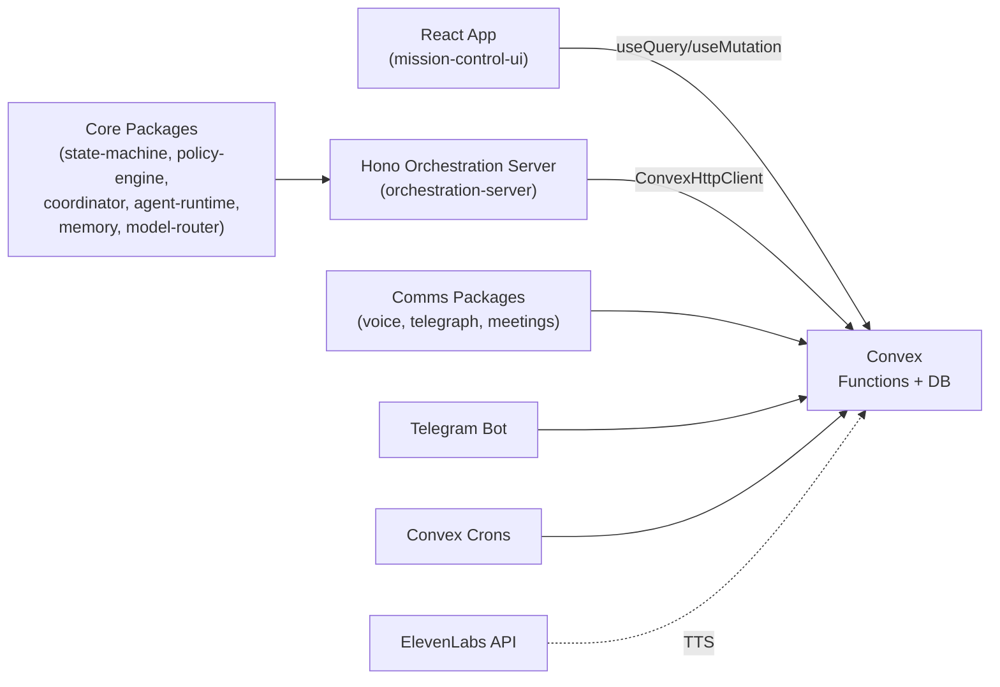
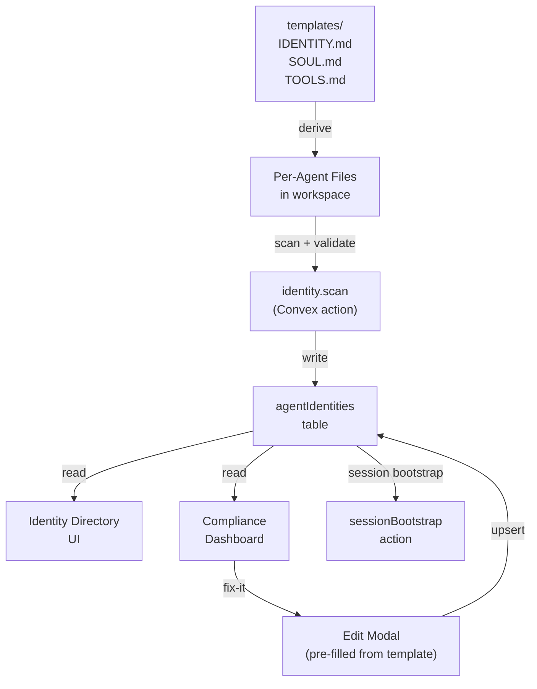
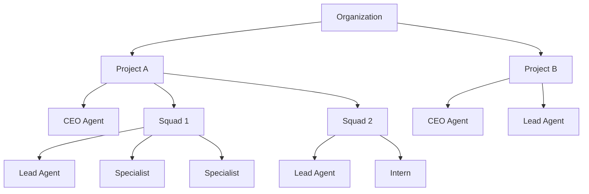
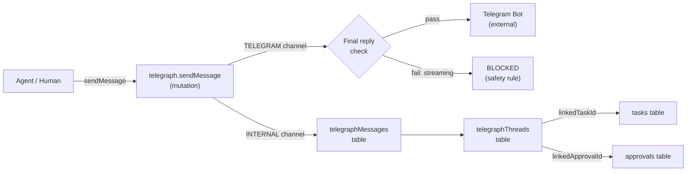
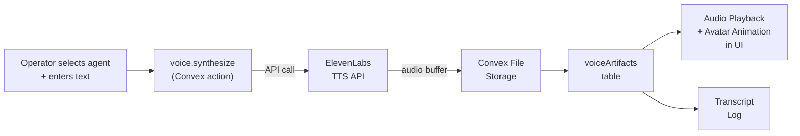
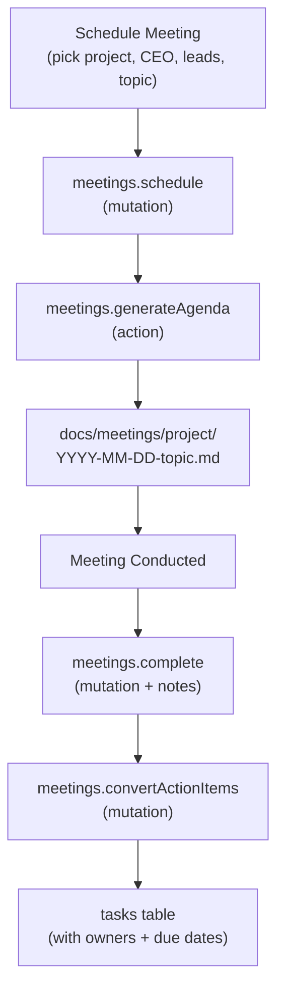
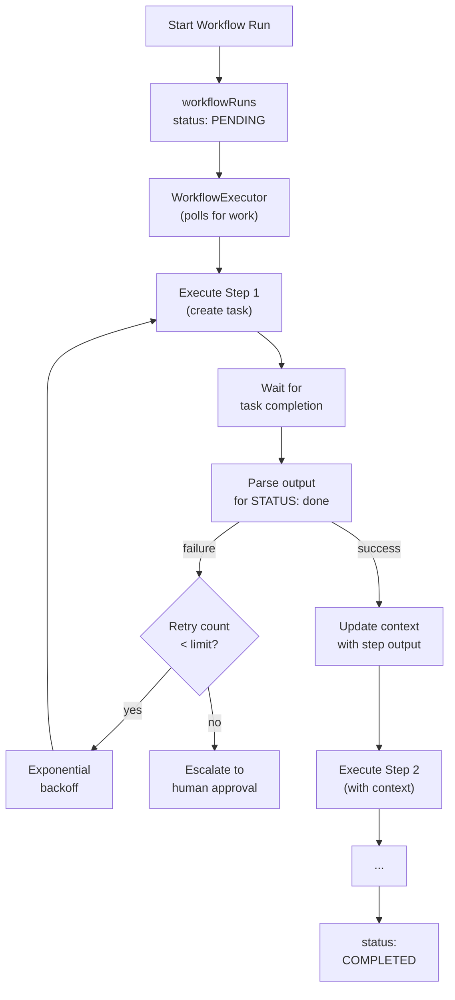

# Mission Control Architecture

Last updated: 2026-02-09

## 1. System Purpose

Mission Control is a multi-repo agent org operating system for the OpenClaw ecosystem. It manages agent identity and governance, task lifecycle, policy and approvals, communications, voice/avatar interactions, meeting orchestration, and incident-level auditability across one or more projects.

Primary outcomes:
- Govern agent identity and behavior via OpenClaw-aligned IDENTITY/SOUL/TOOLS files.
- Keep work moving through a deterministic task state machine.
- Enforce guardrails (risk, approvals, budgets, containment).
- Enable async and synchronous agent communications (Telegraph + Meetings).
- Give operators clear control and observability.
- Preserve traceability for "what happened, who, why, and cost."

## 2. Runtime Architecture

Notes:
- Convex is the source of truth for all operational state.
- UI talks directly to Convex via reactive subscriptions; there is no separate REST layer.
- Orchestration server hosts coordinator ticks and agent lifecycle scaffolding.
- Voice synthesis uses Convex actions to call ElevenLabs; audio is stored in Convex file storage.
- Telegraph internal messages are pure Convex mutations; Telegram provider bridges to the telegram-bot package.
- Meeting orchestration generates markdown artifacts and stores records in Convex.

## 3. Identity/Soul Governance Flow

Every agent must have:
- **IDENTITY.md**: name, creature, vibe, emoji, avatar path
- **SOUL.md**: behavioral rules, personality, boundaries
- **TOOLS.md**: environment-specific notes

Validation enforces required fields per OpenClaw templates. CI blocks PRs with missing or invalid identity files.

## 4. Org Hierarchy

Roles: `CEO`, `LEAD`, `SPECIALIST`, `INTERN`

- The `agents` table stores capability-level role.
- The `orgAssignments` table maps agents to projects with positional roles (an agent can be CEO of one project and Lead of another).
- Queries: `org.getProjectOrg`, `org.getCEO`, `org.getLeads`

## 5. Telegraph Communications

Safety enforcement: messages to external channels (TELEGRAM) must be final/complete -- no streaming or partial replies allowed.

## 6. Voice Pipeline

Provider interfaces (`TTSProvider`, `AvatarProvider`) allow vendor swapping. ElevenLabs is the first concrete TTS provider. Default avatar uses the agent's emoji with CSS animation.

## 7. Meeting Lifecycle

Provider interfaces (`MeetingProvider`) support Manual (markdown generation) and future Zoom integration. Manual provider generates agenda, notes template, calendar payload, and action items.

## 8. Workflow Orchestration (NEW)

**Inspired by [Antfarm](https://github.com/snarktank/antfarm)**

**Key Components:**

- **Workflow Definitions** (`workflows/*.yaml`): YAML files defining agents, steps, inputs, expectations, retry limits
- **Workflow Engine** (`packages/workflow-engine`): Executor, renderer, parser, loader
- **Convex Tables**: `workflows`, `workflowRuns` (execution state tracking)
- **UI Components**: `WorkflowDashboard`, `WorkflowRunPanel`, `WorkflowSelector`
- **Coordinator Integration**: Automatic workflow triggering based on task patterns

**Built-in Workflows:**
1. `feature-dev` (7 agents): plan → setup → implement → verify → test → PR → review
2. `bug-fix` (6 agents): triage → investigate → setup → fix → verify → PR
3. `security-audit` (7 agents): scan → prioritize → setup → fix → verify → test → PR

See [WORKFLOWS.md](./WORKFLOWS.md) for full documentation.

## 9. Core Modules

### Frontend (`apps/mission-control-ui/src`)
- App shell: `App.tsx`, `TopNav.tsx`, `Sidebar.tsx`
- Work views: Kanban, Task Drawer, DAG, monitoring/health/cost/analytics
- Control surfaces: approvals modal, policy modal, command palette, keyboard shortcuts
- Identity/Soul: Identity Directory, Soul Detail, Compliance Dashboard
- Communications: Telegraph Inbox, Telegraph Thread
- Voice: Voice Panel (Talk as Agent)
- Meetings: Meetings View, Meeting Detail Modal
- **Workflows**: `WorkflowDashboard`, `WorkflowRunPanel`, `WorkflowSelector` (NEW)
- Project scoping via React context (`projectId` propagated to queries)

### Backend (`convex/`)
- Domain functions: `tasks.ts`, `agents.ts`, `approvals.ts`, `runs.ts`, `messages.ts`, `policy.ts`, `taskRouter.ts`, `search.ts`, `monitoring.ts`, `health.ts`
- Identity/governance: `identity.ts`, `sessionBootstrap.ts`
- Communications: `telegraph.ts`, `voice.ts`, `meetings.ts`
- Org model: `orgAssignments.ts`
- **Workflows**: `workflows.ts`, `workflowRuns.ts` (NEW)
- Support: `reviews.ts`, `agentLearning.ts`, `executionRequests.ts`, `executorRouter.ts`, `webhooks.ts`, `loops.ts`, `standup.ts`, `coordinator.ts`
- Schema: `schema.ts` (29+ tables, including `workflows` and `workflowRuns`)

### Orchestration Runtime (`apps/orchestration-server`)
- Hono process for coordinator ticks and agent lifecycle scaffolding.
- Uses Convex queries/mutations via ConvexHttpClient.

### Shared Packages (`packages/`)
- `state-machine`: transition primitives/validation
- `policy-engine`: risk/approval logic + safety defaults
- `coordinator`: decomposition/delegation loops
- `agent-runtime`: lifecycle/persona/heartbeat loop
- `context-router`, `model-router`, `memory`, `shared`
- `openclaw-sdk`: external agent integration
- `telegram-bot`: Telegram bot for commands + notifications
- `voice`: TTSProvider + AvatarProvider interfaces + ElevenLabs implementation
- `telegraph`: TelegraphProvider interface + internal + Telegram providers
- `meetings`: MeetingProvider interface + Manual provider

## 9. Data Model & Storage

Storage is Convex tables (27+ tables):

**Core:**
- `projects`: workspace isolation boundary
- `tasks`: canonical task object with state, assignment, artifacts, budget, provenance
- `taskTransitions`: immutable transition audit log
- `taskEvents`: canonical task event stream for timeline/audit
- `approvals`: high-risk approval workflow
- `runs` + `toolCalls`: execution and cost telemetry
- `messages`: thread stream per task
- `activities`: generic audit/event log
- `alerts`: incident/health events

**Identity/Governance:**
- `agents`: agent records with identity fields (name, emoji, role, status, workspace, soul hash)
- `agentIdentities`: parsed IDENTITY/SOUL/TOOLS content with validation status
- `orgAssignments`: per-project org positions (CEO/LEAD/SPECIALIST/INTERN)

**Communications:**
- `telegraphMessages`: async messaging between agents/humans
- `telegraphThreads`: thread containers linked to tasks/approvals/incidents
- `voiceArtifacts`: TTS audio references + transcripts
- `meetings`: meeting records with agenda, participants, action items

**Operator:**
- `operatorControls`: execution posture (NORMAL/PAUSED/DRAINING/QUARANTINED)
- `savedViews`: operator filter presets
- `watchSubscriptions`: user watchlist subscriptions

## 10. State Machine Overview

Canonical runtime states:
- `INBOX`, `ASSIGNED`, `IN_PROGRESS`, `REVIEW`, `NEEDS_APPROVAL`, `BLOCKED`, `FAILED`, `DONE`, `CANCELED`

Key invariants:
- Task creation starts in `INBOX`.
- Status changes go through `tasks.transition`.
- Transition permissions vary by actor type (`AGENT`, `HUMAN`, `SYSTEM`).
- Artifact requirements validated for key edges.
- `DONE` and `CANCELED` are terminal.
- `FAILED` is terminal but recoverable to `INBOX` by human only.

## 11. Policy Engine Overview

Policy evaluation (`convex/policy.ts` + `convex/lib/riskClassifier.ts`):
- Agent status safety gates (quarantined/paused/drained/offline)
- Budget constraints (daily/per-run)
- Risk classification for tool actions (`GREEN`/`YELLOW`/`RED`)
- Allowlists/blocklists (shell, network, file read/write)
- Safety defaults: block directory dumps, secret patterns, streaming to external surfaces, untrusted DM input
- Approval requirement triggers
- Operator control mode gates

Decisions returned: `ALLOW`, `NEEDS_APPROVAL`, `DENY`

## 12. Safety Defaults

Enforced across runtime, UI, policy engine, and CI:

1. **No directory/secret dumps** -- Block tool calls that list directories or expose secrets in chat.
2. **No destructive commands** -- Require explicit approval for destructive operations.
3. **Final replies only** -- External messaging surfaces (Telegram) receive only complete, non-streaming messages.
4. **Untrusted DM input** -- Inbound DMs flagged with `inputTrustLevel: UNTRUSTED` for policy evaluation.
5. **Session bootstrap required** -- Agents must read SOUL.md, USER.md, and memory files before acting.
6. **Soul change audit** -- Any modification to SOUL.md triggers a user notification and audit log entry.
7. **Private data protection** -- Agents must not share private data, contact info, or internal notes in group/public channels.

## 13. Current Gaps

1. Project isolation incomplete in some read paths.
2. Audit/event path partially unified (legacy consumers still read `taskTransitions` + `activities` directly).
3. Orchestration server contains stub/manual behavior.
4. Some contract drift between Convex uppercase and legacy lowercase representations.
5. Performance risks from `.collect()` + in-memory filtering patterns.
6. Zoom meeting provider not yet implemented (Manual provider only).
7. Voice requires ElevenLabs API key; no fallback TTS provider yet.
