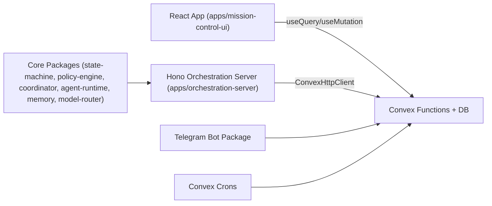

# Mission Control Architecture

Last updated: 2026-02-08

## 1. System Purpose

Mission Control is an operator-facing control plane for autonomous agent work. It manages task lifecycle, policy and approvals, execution telemetry, and incident-level auditability across one or more projects.

Primary outcomes:
- Keep work moving through a deterministic task state machine.
- Enforce guardrails (risk, approvals, budgets, containment).
- Give operators clear control and observability.
- Preserve traceability for "what happened, who, why, and cost."

## 2. Runtime Architecture

Notes:
- Convex is the source of truth for operational state.
- UI talks directly to Convex; there is no separate REST layer for the app.
- Orchestration server exists but remains partially integrated (several endpoints/flows are stubs).

## 3. Core Modules

### Frontend (`apps/mission-control-ui/src`)
- App shell: `App.tsx`, `TopNav.tsx`, `Sidebar.tsx`
- Work views: Kanban, Task Drawer, monitoring/health/cost/analytics
- Control surfaces: approvals modal, policy modal, command palette, keyboard shortcuts
- Project scoping via React context (`projectId` propagated to many queries)

### Backend (`convex/`)
- Domain functions: `tasks.ts`, `agents.ts`, `approvals.ts`, `runs.ts`, `messages.ts`, `policy.ts`, `taskRouter.ts`, `search.ts`, `monitoring.ts`, `health.ts`
- Support domains: `reviews.ts`, `agentLearning.ts`, `executionRequests.ts`, `executorRouter.ts`, `webhooks.ts`, `loops.ts`, `standup.ts`, `seed.ts`
- Schema: `schema.ts` (projects, tasks, agents, runs, toolCalls, approvals, activities, alerts, etc.)

### Orchestration Runtime (`apps/orchestration-server`)
- Hono process that runs coordinator ticks and agent lifecycle scaffolding.
- Currently uses Convex queries/mutations but still contains non-final integration paths and defaults.

### Shared Packages (`packages/`)
- `state-machine`: transition primitives/validation
- `policy-engine`: risk/approval logic
- `coordinator`: decomposition/delegation loops
- `agent-runtime`: lifecycle/persona heartbeat loop
- `context-router`, `model-router`, `memory`, `shared`, `openclaw-sdk`, `telegram-bot`
- `agent-runner`: deprecated legacy path still present

## 4. Data Model & Storage

Storage is Convex tables (selected critical entities):
- `projects`: workspace isolation boundary
- `tasks`: canonical task object with state, assignment, artifacts, budget, provenance
- `taskTransitions`: immutable transition audit log
- `taskEvents`: canonical task event stream for timeline/audit surfaces
- `approvals`: high-risk approval workflow
- `runs` + `toolCalls`: execution and cost telemetry
- `messages`: thread stream per task
- `activities`: generic audit/event log
- `alerts`: incident/health events
- `operatorControls`: execution posture (`NORMAL`, `PAUSED`, `DRAINING`, `QUARANTINED`)
- `savedViews`: operator filter presets for reusable workflows
- `watchSubscriptions`: user watchlist subscriptions for task/entity updates
- `executionRequests`, `webhooks`, `reviews`, `agentPerformance`, `taskDependencies`

## 5. State Machine Overview

Canonical runtime states in Convex tasks:
- `INBOX`, `ASSIGNED`, `IN_PROGRESS`, `REVIEW`, `NEEDS_APPROVAL`, `BLOCKED`, `FAILED`, `DONE`, `CANCELED`

Key invariants:
- Task creation is server-enforced to start in `INBOX`.
- Status changes must go through `tasks.transition`.
- Transition permissions vary by actor type (`AGENT`, `HUMAN`, `SYSTEM`).
- Artifact requirements are validated for key edges (for example `ASSIGNED -> IN_PROGRESS` needs work plan; `IN_PROGRESS -> REVIEW` needs deliverable/checklist).

## 6. Policy Engine Overview

Policy evaluation (`convex/policy.ts` + `convex/lib/riskClassifier.ts`) evaluates:
- Agent status safety gates (quarantined/paused/drained/offline)
- Budget constraints (daily/per-run)
- Risk classification for tool actions (`GREEN`/`YELLOW`/`RED`)
- Allowlists/blocklists (shell, network, file read/write)
- Approval requirement triggers (risk/role/budget and transition rules)
- Operator control mode gates (`PAUSED`/`DRAINING`/`QUARANTINED`)

Decisions currently returned:
- `ALLOW`
- `NEEDS_APPROVAL`
- `DENY`

## 7. API Surface (High-Level)

Convex query/mutation entry points are the operational API:
- Tasks: CRUD/list/search/timeline/transition
- Agents: register/heartbeat/list/status controls
- Approvals: request/list/approve/deny/expire
- Runs/toolCalls: execution accounting and spend/budget tracking
- Monitoring/health: status, audit export, performance/error views
- Router/coordinator: recommendations, auto-assign, decomposition

## 8. UI Pages / Operational Surfaces

Current main views in top navigation:
- Tasks, DAG, Chat, Council, Calendar, Projects, Memory, Captures, Docs, People, Org, Office, Search

Primary operator workflows:
- Kanban + task drawer for execution management
- Approval decisions
- Agent status control (pause/resume and per-agent status updates)
- Monitoring and health dashboards
- Command palette/search

## 9. Current Gaps (Plan vs Reality)

1. Project isolation is incomplete:
- Many queries still allow cross-project reads when `projectId` is omitted.
- Authorization and role checks are minimal/inconsistent.

2. Audit/event path is now partially unified but still has overlap:
- `taskEvents` is canonical for timelines, but legacy consumers still read `taskTransitions` + `activities` directly.
- Export/report pipelines should fully standardize on `taskEvents`.

3. Partial orchestration integration:
- Orchestration server and executor routing include stub/manual behavior.
- Some plan docs overstate "completed" end-to-end automation.

4. Contract drift and duplicated logic:
- Multiple state machine representations (Convex uppercase vs legacy lowercase libs).
- Duplicate report-generation paths (`tasks.exportIncidentReport` and `reports.generateIncidentReport`).

5. Performance risks:
- Several queries rely on broad `.collect()` + in-memory filtering.
- Some N+1 patterns (timeline/report joins across runs/tool calls).

6. UI contract and consistency issues:
- Search result shape mismatch in header search implementation.
- Mixed interaction patterns (some polished flows, some placeholder controls).

7. DX/operations:
- CI exists, but local `convex codegen` can fail in restricted-network environments due telemetry-side network calls.
- Scripts/docs include some hardcoded environment URLs and local paths.
