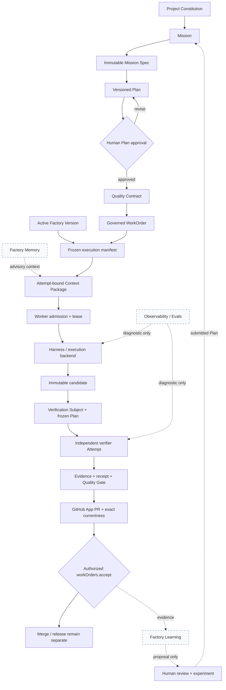
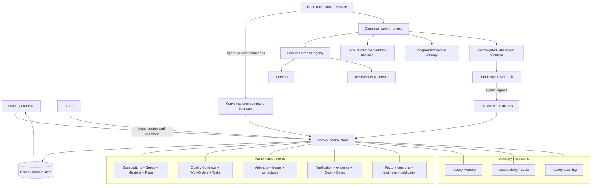

# Mission Control

> This is the complete Mission Control overview, moved out of the root README
> so that the README can serve as a front door. Nothing here has been cut.
> For install and first run, see the [README](../README.md).

## Governed control plane for AI software factories

Mission Control is the operating system and control plane for human-directed,
agent-executed software delivery. Humans define intent, approve consequential
decisions, and retain authority. Agents and coding harnesses perform bounded
engineering work. Deterministic code enforces admission, scope, lineage,
verification, currentness, publication, and acceptance gates.

It coordinates the complete governed lifecycle from Project Constitution and
Mission Spec through Plan approval, WorkOrders, Attempts, independent
verification, evidence, pull-request publication, human acceptance, and
proposal-only learning.

The factory can be summarized at two levels:

- **Builder loop:** `Intent → Plan → Configure agents, harnesses, skills, and tools → Execute → Verify and evaluate → Deliver → Observe → Improve`
- **Governed delivery lifecycle:** `Mission → approved Plan → WorkOrder → Task → Attempt → candidate → independent evidence → pull request → human decision → release → observed outcome → governed learning`

Agent definitions, skills, tools, and harnesses configure execution; they do
not create a second lifecycle or authority hierarchy.

> Mission Control is not an AI coding agent, multi-agent chat application,
> workflow UI, or test runner. It is the durable authority layer that composes
> those capabilities into a bounded, inspectable, recoverable delivery system.

## Software Factory: governed recursive self-improvement

The Mission Control Software Factory supports **governed recursive improvement
and continuous learning**. It can turn attributable delivery evidence into
signals, recurring clusters, reviewable Improvement Candidates, controlled
experiments, and a submitted Mission Plan. A separate human Plan approval is
still required before a WorkOrder is released, and execution remains a later
governed decision.

The operating loop is:

`research -> verify -> recommend -> approve -> implement -> validate -> measure -> iterate`

This allows the factory to evaluate new engineering practices without becoming
an uncontrolled self-modifying agent. External content is untrusted evidence,
not authority. Recommendations cannot approve or apply themselves, and every
repository, workflow, skill, verifier, model route, or policy change follows the
normal Mission Control hierarchy:

`Mission -> WorkOrder -> Task -> Attempt -> evidence -> pull request -> release`

The separate continuous-research path remains intentionally narrower:
operator-triggered Web/RSS research with atomic artifact, observation, cursor,
and verification-receipt lineage. A verified run can seed a frozen Research
Brief, followed by an explicitly dispatched read-only claim extractor and a
distinct evidence verifier over only those frozen observations. Broad discovery
and repository mutation remain outside that research path.

The manual research executor now uses an atomic workspace lease, lease-fenced
state writes, owner heartbeats, durable cursor checkpoints, reasoned retries,
stale-owner recovery, budget reservations, workspace concurrency admission,
automatic quarantine, and audited pause/drain/kill controls. A bounded live
Research Lab drill independently verified each control and restored the
workspace to `NORMAL`. This proof does not enable recurrence: scheduled claims
still fail closed while `continuousSchedulingEnabled` is `false`.

- [Governed Continuous Learning implementation plan](plans/2026-08-08-feat-governed-continuous-learning-plan.md)
- [Governed Continuous Learning operator and source contract](software-factory/CONTINUOUS_LEARNING.md)
- [Mission Control North Star](product/mission-control-north-star.md)

---


_The Command Center turns a large delivery portfolio into a ranked queue of
decisions, blockers, and evidence—not a wall of agent activity._

## Contents

- [Why software factories and Mission Control matter](#why-software-factories-and-mission-control-matter)
- [Project status](#project-status)
- [Humans, agents, and deterministic code](#humans-agents-and-deterministic-code)
- [The delivery contract](#the-delivery-contract)
- [End-to-end Factory lifecycle](#end-to-end-factory-lifecycle)
- [What is implemented](#what-is-implemented)
- [Governance and authority](#governance-and-authority)
- [Live golden-path proof](#live-golden-path-proof)
- [Operator surfaces](#operator-surfaces)
- [System architecture](#system-architecture)
- [Local development](#local-development)
- [System qualification](#system-qualification)
- [Verification](#verification)
- [Security model](#security-model)
- [For contributors](#for-contributors)
- [Architecture and deep dives](#architecture-and-deep-dives)

## Why software factories and Mission Control matter

AI-assisted development begins as a one-to-one interaction: one developer asks
one agent to make a change, watches the result, and reviews the diff. That model
can improve individual throughput, but it does not become a reliable delivery
system simply by opening more agent sessions.

As developers begin supervising tens or hundreds of agents across multiple
repositories and products, the bottleneck moves from code generation to
coordination. The operator can no longer keep every plan, branch, permission,
dependency, retry, validation result, and release decision in working memory.
More agents without a control plane create more unfinished work, conflicting
changes, review pressure, cost, and risk.

A chat interface scales conversations. A software factory scales governed work.

### Coding agent, software factory, and Mission Control

These are three different layers:

| Layer                | Primary responsibility                                                                                                                          | What it must not decide alone                                                        |
| -------------------- | ----------------------------------------------------------------------------------------------------------------------------------------------- | ------------------------------------------------------------------------------------ |
| **Coding agent**     | Execute a bounded task, use approved tools, report events, and produce artifacts                                                                | Product intent, its own authority, acceptance, merge, or release                     |
| **Software Factory** | Freeze the repository, workflow, executor, policy, budget, verifier, and recovery contract used to produce changes repeatedly                   | Whether a business outcome is worth pursuing or whether its own output is acceptable |
| **Mission Control**  | Coordinate Missions and Factories across projects; route attention, enforce governance, retain lineage, and present evidence to human operators | Product judgment, risk acceptance, or irreversible decisions reserved for people     |

The Factory is the production system for a repository. Mission Control is the
portfolio-level operating system that lets a human direct many Factories without
managing every agent interaction manually.

### What breaks when agent fleets grow

| Control problem       | Without a control plane                                                 | Mission Control response                                                                                      |
| --------------------- | ----------------------------------------------------------------------- | ------------------------------------------------------------------------------------------------------------- |
| **Intent**            | Prompts drift away from the approved outcome                            | Versioned Missions, plans, WorkOrders, and acceptance criteria                                                |
| **Concurrency**       | Agents collide on branches, files, migrations, and shared dependencies  | Repository and code-scope bindings, dependency-aware dispatch, and one active mutating Attempt per repository |
| **Authority**         | Broad credentials and ambient permissions make every worker overpowered | Server-side authorization, named capabilities, short-lived provider credentials, and risk-tiered approvals    |
| **Context**           | Each agent receives a different or stale picture of the system          | Frozen execution envelopes, versioned workflows, exact revisions, and durable source references               |
| **Verification**      | Workers mark themselves done and weak results move downstream           | Independent receipts mapped to acceptance criteria, with pass, fail, stale, conflicting, and waived states    |
| **Human attention**   | Developers poll chats and logs until supervision becomes the bottleneck | Exception-first queues that rank blockers, pending decisions, failed evidence, and remediation                |
| **Cost and capacity** | Retries and parallel work consume budgets invisibly                     | Attempt, runtime, and cost budgets plus provider-capacity and scheduler signals                               |
| **Continuity**        | A process restart or lost chat destroys operational state               | Durable Tasks, Attempts, events, leases, receipts, and idempotent commands                                    |
| **Accountability**    | It is difficult to explain who authorized a change or why it shipped    | End-to-end lineage from intent through plan, execution, PR, approval, release, and production evidence        |

The current production-convergence work therefore prioritizes stronger
evidence and narrower authority—not more agents or model choices. Repository
data classification now participates in Factory admission. Unclassified and
non-public repositories remain eligible for approved local execution but cannot
use Remote Sandbox unless immutable profile evidence independently proves
provider-enforced egress. The same policy is re-evaluated when a Factory version
is created, assessed, dispatched, claimed by a worker, and scheduled for
independent verification.

The next promotion gate is one named product-repository pilot with at least ten
accepted WorkOrders, an eight-stage preflight incident drill, actual or
explicitly unknown cost attribution, observed outcomes, failure evidence, and a
human `GO` or `NO_GO` decision. Guarded Auto, autonomous merge, autonomous
deployment, and learning promotion remain disabled. Factory Incident Command,
the first read-only MCP broker proof, shared QA/product/design intent, and
outcome-aware routing follow only after that pilot evidence exists.

### The developer becomes an operator

At fleet scale, the human role changes. Developers spend less time driving each
keystroke and more time setting intent, defining constraints, reviewing
exceptions, making risk decisions, and accepting evidence. Agents own bounded
execution, iteration, validation support, recovery, and evidence collection.

Mission Control is designed so one operator can quickly answer:

- What outcome matters most right now?
- Which work is blocked, and what exact decision or evidence will unblock it?
- Which agent may change which repository and code scope?
- What changed relative to the approved plan?
- Which acceptance criteria passed, failed, became stale, or were waived?
- How much time, cost, and retry budget remains?
- Can the work be paused, cancelled, replayed, or recovered safely?
- What is actually ready for human review, merge, or release?

This repository is designed for that future operating model, but it does **not**
claim that the current V1 has been production load-tested with hundreds of live
agents. The current foundation instead proves one complete, browser-operable,
repository-backed golden path with durable evidence and safe recovery. Correct
control primitives come before fleet-size claims.

## Project status

Mission Control is in active V1 development.

The repository has a deterministic full-system V1 qualification with known
limitations. It composes governed intent, Factory configuration, worker
admission, local, fake-remote, and bounded live-remote execution, immutable
candidates, independent verification, exact pull-request currentness, canonical
WorkOrder acceptance, and the human-gated learning continuation. This is strong
implementation proof; it is not a claim of fleet-scale production operation or
general Remote Sandbox certification.

The current public client/backend runtime contract is **v40**.

| Capability                                 | Current status                                   | Boundary                                                                                        |
| ------------------------------------------ | ------------------------------------------------ | ----------------------------------------------------------------------------------------------- |
| Governed Missions and Plan approval        | **Live; system-qualified**                       | One-repository V1 golden path; consequential execution still requires separate gates            |
| Spec-Driven Mission Intake                 | **Merged and qualified; default off**            | Project flag `missions.spec-intake-v1`; `FINALIZED` means planning-ready only                   |
| Quality Contracts                          | **Implemented; accepted normative architecture** | Immutable projection of approved Plan intent, not a second planning system                      |
| Verification Factory / policy-v2           | **Implemented; system-qualified**                | Exact-subject, independent, fail-closed verification before acceptance                          |
| Factory Memory                             | **Implemented; default off by phase**            | Advisory retrieval and Attempt-bound Context Packages; no acceptance authority                  |
| Observability / Evals                      | **Live diagnostic system**                       | Traces, scores, datasets, and experiments explain quality; they do not decide acceptance        |
| Factory Learning V1                        | **Implemented; advisory**                        | Deterministic signals through human-reviewed experiments and submitted Plans; no auto-promotion |
| Progressive Factory experience and recipes | **Live**                                         | Presentation and composition only; backend policy remains authoritative                         |
| Generic Harness Contract                   | **Production architecture**                      | One execution-only lifecycle with exact capability admission                                    |
| Codex adapter                              | **Production admission**                         | Canonical `codex/v1` path                                                                       |
| DeepSeek Harness                           | **Experimental; disabled by default**            | Exact pinned local persistent-worker path only                                                  |
| Repository execution classification        | **Implemented; fail-closed**                     | New repositories default to `INTERNAL`; sensitive remote execution requires provider-enforced egress evidence |
| Real product-repository pilot gates         | **Implemented; pilot pending**                   | Deterministic preflight and exit assessment exist; the named team and ten accepted WorkOrders remain real-world evidence work |
| Remote Sandbox N=1                         | **Production-pilot eligible; Preview**           | 3/3 live exe.dev cohort; provider-enforced egress and sustained real-work evidence remain missing |
| Loom admission                             | **Future**                                       | Configuration discovery and fixtures exist; no pinned runtime adapter                           |
| System Qualification                       | **V1 merged; known limitations**                 | Deterministic command plus durable repository evidence; no live-provider claim                  |

The canonical status, evidence, limitation, and promotion gate for each major
capability is maintained in the
[Software Factory Capability Maturity Ledger](product/software-factory-capability-maturity.md).

The original baseline and delivery history remain available in the
[existing-system assessment](mission-control-existing-system-assessment.md),
[V1 program plan](plans/2026-08-02-feat-ai-software-factory-v1-program-plan.md),
and [real Codex-to-GitHub browser proof](testing/evidence/real-codex-github-pr-golden-path/README.md).

## Humans, agents, and deterministic code

Mission Control deliberately separates judgment, execution, and enforcement.

| Layer                    | Owns                                                                                                                                     | Does not own                                                                 |
| ------------------------ | ---------------------------------------------------------------------------------------------------------------------------------------- | ---------------------------------------------------------------------------- |
| **Humans**               | Intent, planning-ready specifications, Plan approval, consequential recommendations, acceptance, merge, release, and risk decisions      | Routine bounded execution or reconstruction of raw agent logs                |
| **Agents and harnesses** | Planning support, investigation, code changes, bounded engineering work, candidate production, and structured handoff                    | Their own authority, independent verification, acceptance, merge, or release |
| **Deterministic code**   | Admission, scope, budgets, tests, verification checks, digests, immutable lineage, currentness, security boundaries, and authority gates | Product judgment or silent substitution for a required human decision        |

Agents propose and execute. Deterministic systems validate and govern. Humans
retain the decisions whose consequences require judgment or authority.

## The delivery contract

Mission Control uses one authoritative hierarchy:

```text
Company
└── Workspace
    └── Repository
        ├── Project Constitution revision
        ├── Active Factory version
        └── Mission
            └── Mission Spec revision
                └── Approved Plan + Quality Contract projection
                    └── WorkOrder
                        └── Task
                            └── Attempt / WorkflowRun
                                ├── frozen execution manifest + Context Package
                                ├── immutable candidate
                                └── ordered events and artifacts

Candidate → Verification Subject → frozen Verification Plan
          → independent verifier Attempt → evidence and receipt
          → Quality Gate Decision → exact-current pull request
          → workOrders.accept

Pull Request → Merge → Deployment → Activation → Production Verification
```

Each layer has a separate responsibility:

- A **Project Constitution** and immutable **Mission Spec** capture attributable
  planning principles, measurable outcomes, requirements, non-goals, and
  acceptance expectations.
- A **Plan** binds exact Spec and Constitution lineage, is versioned and
  reviewable, and must be approved before it can release WorkOrders.
- A **Quality Contract** is the machine-readable projection of that exact
  approved Plan. It has no independent mutable lifecycle.
- A **WorkOrder** is the governed delivery and acceptance contract released
  from that plan.
- A **Task** is a bounded operational unit inside a WorkOrder.
- An **Attempt** is one immutable execution try against an exact WorkOrder
  revision, Factory version, worker lease, execution manifest, and optional
  frozen Context Package.
- A **candidate** is an exact output of execution, not a success declaration.
- **Evidence** proves or disproves acceptance criteria. A worker report does not
  prove completion.
- Pull request, merge, deployment, activation, and production verification are
  distinct states. None silently implies the next.

## End-to-end Factory lifecycle



1. **Intent.** A Project Constitution provides immutable planning principles;
   the Mission captures the desired outcome and governed scope.
2. **Specification.** Immutable Mission Spec revisions use stable requirement
   identities, deterministic quality checks, structured clarification,
   measurable outcomes, acceptance expectations, and explicit non-goals.
3. **Planning.** A versioned Plan binds the exact Spec and Constitution
   revisions and maps requirements into assertions and WorkOrder blueprints.
4. **Human approval.** A separate human decision approves one exact Plan
   revision and releases WorkOrders. It does not dispatch execution.
5. **Context engineering.** Factory Memory retrieves attributable context and
   freezes a minimal Context Package onto the exact Attempt. This context is
   advisory and cannot change frozen intent.
6. **Execution.** Server-authoritative worker admission checks identity,
   session, generation, capabilities, capacity, Factory Version, and backend
   before issuing a fenced lease. The selected harness executes the frozen
   manifest.
7. **Candidate production.** The Attempt returns an exact candidate and
   normalized untrusted result. Harness completion is not verification.
8. **Independent verification.** Mission Control creates an immutable
   Verification Subject, freezes a Verification Plan, runs a separate verifier
   Attempt, and records evidence and receipts against the exact candidate.
9. **Publication and currentness.** A candidate-bound permit gates GitHub App
   publication. Pull-request head, checks, candidate, subject, and evidence must
   remain exact-current.
10. **Human acceptance.** `workOrders.accept` is the canonical WorkOrder
    acceptance boundary. Passing execution and verification only make work
    eligible for acceptance; they do not write acceptance themselves.
11. **Learning.** Evidence can become bounded signals, clusters, Improvement
    Candidates, experiments, and recommendations. Promotion returns through a
    new Mission and submitted Plan with a separate human approval.

## What is implemented

### 1. Company, workspace, and repository boundaries

The control plane models:

`Company → Workspace → Repository → Code Scope`

Repository identity is portable and separate from a developer's local checkout.
Monorepos can define repository-relative code scopes, owning teams, execution
environments, review requirements, and overlap policy. Local execution uses a
separate host binding.

Authorization is resolved server-side. The browser does not decide which
company, workspace, repository, team, or delivery record an operator may act on.

Repository connections also carry an audited `PUBLIC`, `INTERNAL`,
`CONFIDENTIAL`, or `RESTRICTED` data classification. New connections default to
`INTERNAL`; legacy records without a value are treated as sensitive rather than
silently downgraded. The selected classification is frozen into the immutable
Factory version and execution manifest, then compared with the live repository
at readiness, dispatch, worker claim, and independent-verification admission.
A later reclassification therefore requires a new Factory version instead of
silently changing an active execution boundary.

### 2. Spec-driven Mission intake and Plan governance

The Mission workspace supports draft, planning, proposal, rejection, revision,
approval, WorkOrder release, execution, validation, acceptance, cancellation,
and supersession. The default-off Spec Intake V1 adds immutable, attributable
Project Constitution and Mission Spec revisions before the Plan.

The deterministic Spec Quality evaluator checks required sections, stable and
unique identities, placeholders, measurable outcomes, testability, structured
clarifications, contradictions, repository scope, and acceptance/evidence
coverage. Answering a clarification or changing scope creates a new revision.
`FINALIZED` means one exact revision is complete enough for planning; it does
not approve a Plan, release a WorkOrder, or authorize execution.

Plan submission and approval revalidate the exact Spec, evaluation, and
Constitution IDs and digests. A newer Spec never silently rebinds an existing
Plan. Historical Plans without Spec lineage remain readable and are labeled as
legacy rather than receiving invented provenance.

The conceptual trace is explicit:

```text
Spec requirement
  → Plan assertion
  → WorkOrder blueprint
  → acceptance criterion
  → verification check and evidence expectation
```

Approved Plans retain assertions, WorkOrder blueprints, dependencies, risk,
cost, rollback, and independent-validation requirements. Task completion does
not accept a WorkOrder, and WorkOrder completion does not accept a Mission.

### 3. Quality Contracts and verification-first delivery

A Quality Contract is the canonical machine-readable projection of one exact
approved Plan and its governed Mission intent. It carries the Plan's
requirements, assertions, invariants, assurance expectations, and approval
policy into scoped WorkOrder specifications. The execution manifest then binds
that frozen quality definition to the active Factory Version, repository,
policy, runtime, budget, and verifier configuration.

It is not a second mutable planning system. Changing quality intent requires a
new Plan revision and human approval, which produces a new digest.

Mission Control treats these states as deliberately different:

```text
execution completed ≠ verification passed
verification passed ≠ exact-current gate eligible
gate eligible ≠ WorkOrder accepted
WorkOrder accepted ≠ pull request merged
pull request merged ≠ production verified
```

An execution Attempt produces an immutable candidate. The control plane binds
that candidate into a Verification Subject, freezes a Verification Plan, and
runs a logically independent verifier Attempt. Mandatory deterministic checks,
change budgets, negative constraints, evidence envelopes, criterion receipts,
and an append-only Quality Gate Decision remain bound to the exact WorkOrder
revision, source, candidate, verifier, and policy.

Missing, stale, skipped, unconfigured, errored, insufficiently independent, or
conflicting proof cannot become verified success. A moved pull-request head
invalidates current eligibility until a new exact subject and verification
lineage pass. Verification only establishes eligibility; acceptance still
occurs through `workOrders.accept`.

See the [verification-first WorkOrder contract](software-factory/verification-first-workorder-contract.md)
and [Quality Contract domain contracts](software-factory/verification-first-domain-contracts.md).

### 4. Versioned Factory configuration and service authority

A Software Factory is a thin, repository-bound configuration aggregate. It
references existing platform records instead of creating a second execution
system.

Each immutable Factory version freezes the repository, workflow, executor and
harness, governance policy, environment and backend, budgets, independent
verifiers, GREEN/YELLOW/RED risk boundary, and recovery posture. Readiness
checks repository and GitHub access, exact harness capabilities, workflow,
policy, budget, verifiers, worker/backend, and recovery controls. Activation
requires a current passing assessment for the exact configuration digest.
Material changes create a new version and leave the previous version auditable.

Human actions, service commands, GitHub webhooks, and internal scheduler work
use different trust boundaries. The orchestration service signs outbound
commands with a replay-resistant HMAC envelope containing service identity,
named capability, scope, command ID, issue/expiry time, and exact payload
digest. Convex retains accepted, denied, failed, succeeded, and replayed command
receipts without storing credentials or command bodies. Public clients cannot
claim `SYSTEM` or `AGENT` authority to dispatch work.

The UI lives under **Settings → Workspaces & Repositories**. See
[Service Command Authentication](security/service-command-authentication.md).

### 5. Generic Harness Contract and worker runtime

Mission Control separates the governed execution lifecycle from any particular
coding harness. Every admitted adapter implements one provider-neutral
lifecycle:

```text
prepare → execute → optional handle-scoped cancel → collectResult → cleanup
```

The adapter publishes an exact capability manifest: harness and source pin,
adapter/version, effective configuration digest, model routes, filesystem and
tool support, isolation/backend requirements, cancellation/cleanup behavior,
telemetry availability, maturity, and prohibited authorities. A worker must
advertise matching capabilities and digests before admission.

Normalized harness results are untrusted diagnostics. Missing token, cost,
model-request, or retry telemetry remains `null`; Mission Control never invents
zeroes. Repository state is recomputed outside the harness. `codex/v1` is the
production-admitted path. DeepSeek Harness is experimental, local
persistent-worker only, disabled by default, and admitted only when its exact
checkout, build, runtime, model, and configuration digests match. Loom is
future admission work: discovery and fixtures exist, but no pinned,
authenticated runtime adapter has been qualified.

The worker runtime adds stable worker identity, ephemeral process session,
server-derived generation, exact capabilities, and slot capacity. Claiming an
Attempt atomically enforces current registration, repository and backend
access, capability/configuration match, readiness, heartbeat, and server-counted
capacity before issuing a lease bound to worker, session, generation, and a
random fence ID.

Lease renewal and all hardened writes recheck that tuple. Stale sessions cannot
report evidence or authorize publication. Protected ownership manifests record
the exact worktree and process outside the agent-writable tree. Unknown or
expired execution ownership becomes `LOST`, preserves the workspace, and
requires a new Attempt. Automated cleanup is non-forced and occurs only after
exact ownership, terminated-process, clean-tree, published-head, and repository
proof; ambiguity fails closed to `PRESERVED`.

See the [Generic Harness Contract](architecture/generic-harness-contract-v1.md)
and [worker runtime operations](software-factory/worker-runtime-operations.md).

### 6. Remote Sandbox execution

Remote Sandbox is an optional execution backend beneath the same worker,
Attempt, lease, verification, publication, and acceptance lifecycle. A
provider-neutral `SandboxProvider` allocates one Attempt-scoped resource,
starts the frozen workload, returns a bounded content-addressed result bundle,
and proves exact teardown.

The sandbox receives no GitHub App, Mission Control service,
provider-management, or long-lived inference credentials. The host validates
all identities and digests, materializes the patch into a clean owned worktree,
independently verifies the candidate, revokes the Attempt credential, and
requires provider resource-absence proof before publication can proceed.

Current status is **Production-pilot eligible; Preview**. The deterministic
`FakeSandboxProvider` proves lifecycle, failure, credential revocation,
materialization, independent verification, publication handoff, and cleanup
without provider spend. A later bounded live exe.dev cohort completed 3/3
first-pass Attempts with exact credential revocation and resource-absence proof.
Provider-enforced outbound egress is not proven, Codex installation remains
ephemeral, the live sample contains only three Attempts, and the exercised
repositories were disposable workloads. Sensitive and unclassified
repositories therefore fail closed on Remote Sandbox while governed local
execution remains eligible. These limits prevent general production
certification.

See [Remote Sandbox Runtime](software-factory/remote-sandbox-runtime.md).

### 7. Factory Memory and Context Packages

Factory Memory is a provenance-backed advisory projection over repository and
Mission Control sources. It supports redacted ingestion, bounded deterministic
retrieval, typed entities and relationships, graph neighborhoods, retrieval
planning, and minimal immutable Context Packages bound to one exact Attempt.

Every selected item retains source, revision, scope, derivation, and digest.
Retrieved content is untrusted data. Memory can recommend verification checks
and record context-quality observations, but it cannot establish subject
identity, independence, currentness, a verdict, or acceptance. Its five phases
are workspace-scoped and default off.

See [Factory Memory and Context Intelligence](architecture/factory-memory-context-intelligence.md).

### 8. Observability and Evals

Canonical traces and nested observations let operators reconstruct execution
across Attempts, human/agent/code phases, worker and harness identity,
model/configuration, tool activity, verification, failures, retries, and later
learning lineage. The Trace Inspector supports execution-tree and timeline
views, filters, redacted input/output inspection, evidence links, usage when
reported, and truthful unknowns.

Versioned eval definitions, scores, datasets, and experiments measure and
compare behavior. They are diagnostic and advisory: an eval score never becomes
a verification receipt, exact-current Quality Gate Decision, or acceptance.

### 9. Factory Learning and continuous improvement

Factory Learning projects explicit evidence into a bounded governed loop:

```text
Evidence
  → immutable Signals
  → deterministic repository-scoped Clusters
  → Improvement Candidates
  → Human Review
  → frozen Experiment
  → Recommendation
  → Mission + submitted Plan
  → separate human Plan approval
```

Signals can describe repeated context misses, deterministic-gate opportunities,
recurring verification failures, configuration drift, repeated human
corrections, retry/recovery patterns, routing mismatches, or unnecessary agent
usage. V1 uses deterministic extractors and exact-signature clustering with no
model calls.

Learning records are advisory and cannot rewrite a Factory Version, recipe,
prompt, skill, route, policy, credential, lease, verification record, or
acceptance result. Even a promoted recommendation returns to the ordinary
Mission/Plan/WorkOrder path.

See [Factory Learning architecture](architecture/factory-learning-continuous-improvement.md)
and [self-improvement governance](decisions/factory-self-improvement-governance.md).

### 10. Progressive Factory experience and recipes

The same backend authority is presented at three levels:

| Level            | Purpose                                                                                                                     |
| ---------------- | --------------------------------------------------------------------------------------------------------------------------- |
| **Basic**        | Opinionated workflows, recommended defaults, outcome, progress, verification, approvals, and next action                    |
| **Intermediate** | Workflow, context, verification, roles, routing intent, harness posture, gates, and retry bounds                            |
| **Advanced**     | Exact IDs, digests, Factory Versions, Attempts, harnesses, workers, leases, evidence, lineage, memory, traces, and learning |

The experience level is a browser-local presentation preference. It cannot
change authorization, policy, persistence, verification, or backend behavior.

The recipe catalog provides proven starting shapes—Scout, Plan, Build, Quality,
Build + Test, Build + Review, Plan + Build + Test, and Full SDLC. Deterministic
rules recommend a recipe and retain the recommendation/override as composition
provenance. Recipes resolve to canonical versioned workflows and Factory
configuration; they do not create a second workflow engine or lower policy.

See [Progressive Factory Experience](site/software-factory-enhancement/progressive-factory-experience.md).

### 11. GitHub App publication and exact currentness

GitHub is the V1 Git provider. Mission Control records the App installation and
least-privilege capability evidence for an exact workspace repository, verifies
freshness and degradation, validates webhook HMAC against the untouched body,
and deduplicates every delivery GUID through a replay-aware ledger.

Publication requires a short-lived permit bound to the exact candidate,
Attempt, active lease, and approval checkpoint. The GitHub App publisher is the
only component with controlled repository publication authority. It uses
just-in-time installation tokens; installation tokens, OAuth tokens, private
keys, client secrets, and webhook secrets are never stored in product records.

Pull-request head, checks, Factory-authored branch/commit, candidate, subject,
receipt, and WorkOrder/Attempt lineage are re-evaluated for exact currentness.
A changed head preserves old evidence as history and blocks acceptance until a
new exact lineage passes.

See [GitHub App Connection and Webhook Contract](security/github-app-connection.md).

### 12. Governed execution envelope and evidence

Every Mission-linked WorkflowRun can retain the exact Factory version and
digest, repository, host, harness manifest, executor, policy, environment,
branch, worktree, allowed tools, WorkOrder revision, Quality Contract,
Context Package, model route, backend, and base SHA used at dispatch.

Dispatch is idempotent and enforces one active mutating Attempt per repository
across Missions. Read-only work may coexist when policy allows it. Historical
runs without the new binding remain visibly marked as legacy rather than being
presented as governed.

Mission Control retains WorkOrder and Attempt events, run artifacts, approval
decisions, verification receipts, PR/CI evidence, audit activity, and release
records. Operator surfaces prioritize required decisions, failed or stale
evidence, blockers, and remediation before routine agent activity.

The evidence model distinguishes pass, fail, stale, unknown, waived,
conflicting, and not-applicable states. The run inspector derives one
fail-closed review package from the exact Attempt, frozen WorkOrder revision,
commit, open pull request, CI result, changed files, risks, and rollback
guidance. Missing or mismatched lineage remains visibly blocked instead of
borrowing WorkOrder-wide evidence. See the
[review evidence browser proof](testing/evidence/v1-review-browser-hardening/README.md).

### 13. Real product-repository pilot gates

The production pilot uses two deterministic, human-governed checks around the
normal browser lifecycle. `pnpm run pilot:preflight -- <manifest>` blocks first
dispatch until the repository, team, champion, forward-deployed engineer,
incident commander, local or remote execution boundary, ten-WorkOrder
portfolio, eight failure drills, and retained human authorities are explicit.

After the observation window, `pnpm run pilot:assess -- <manifest>` requires at
least ten accepted results spanning bug fix, feature, refactor, and
security/policy work. Every accepted result must retain exact intent-to-PR
lineage, human acceptance and merge decisions, review and recovery measures,
six cost components, and an observed outcome with incident or rollback linkage
when applicable. Unavailable cost remains `null` with a reason and coverage
impact; it cannot support an efficiency claim.

The exit gate permits a fully evidenced `NO_GO` result but never a silent pass.
It requires zero authority-boundary, cross-company, secret, or repository-scope
escapes and preserves Guarded Auto, autonomous merge, autonomous deployment,
and learning promotion as disabled. See the
[real product-repository pilot operations](software-factory/production-pilot-operations.md)
and [example evidence manifest](software-factory/production-pilot-manifest.example.json).

## Governance and authority

Execution, verification, publication, and acceptance are separate authorities.
No subsystem gains a later authority merely because it completed an earlier
step.

| System                | Can execute                     | Can verify                             | Can publish                             | Can accept                          |
| --------------------- | ------------------------------- | -------------------------------------- | --------------------------------------- | ----------------------------------- |
| Harness               | Yes, within a frozen Attempt    | No                                     | No                                      | No                                  |
| Worker runtime        | Orchestrates admitted execution | No independent authority               | Permit-gated handoff only               | No                                  |
| Remote Sandbox        | Yes, within one Attempt         | No                                     | No                                      | No                                  |
| Factory Memory        | No                              | Advisory guidance only                 | No                                      | No                                  |
| Observability / Evals | No                              | Diagnostic scoring only                | No                                      | No                                  |
| Factory Learning      | No                              | No                                     | No                                      | No                                  |
| Independent verifier  | Verification checks only        | Yes, against a frozen subject and plan | No                                      | No independent acceptance authority |
| GitHub App publisher  | No                              | No                                     | Controlled, exact-candidate publication | No                                  |
| Human operator        | Governs intent and dispatch     | Reviews evidence and exceptions        | Governs approval, merge, and release    | Yes, on the primary V1 path         |

`workOrders.accept` is the canonical WorkOrder acceptance boundary and the only
implementation that writes the `WORK_ORDER_ACCEPTED` transition. It rejects
active execution, requires a completed eligible run, checks required approvals,
and, for enforced policy-v2 work, recomputes exact-current verification and its
Quality Gate Decision before moving the WorkOrder to `DONE`.

The primary governed V1 product path is explicit acceptance by an authorized
human. Current `main` also retains limited orchestration and legacy automation
callers that invoke this same server-side mutation, including one automation
verification path after recording passing receipts. They are not a second
acceptance store or lifecycle, but the
[human/service authorization matrix](security/human-service-authorization-matrix.md)
correctly treats migration of remaining service callers as unfinished before
production promotion. No harness, worker, sandbox, memory, observability, or
learning record can independently manufacture acceptance.

## Live golden-path proof

The completed browser-operated path is:

`Mission → approved Plan → WorkOrder → Task → Attempt → evidence → commit → pull request → operator acceptance`


_The recovered Mission reached `Validated` with 1/1 assertion coverage after
the worker receipt, structured handoff, WorkOrder acceptance, and final operator
decision were recorded through the browser._

Three App-authored pull requests prove complementary parts of the path:

- [PR #61](https://github.com/jaydubya818/MissionControl/pull/61) is the clean,
  recovered Mission proof. It binds the approved Mission hierarchy to branch
  `mc/8aw15s8c7z3d`, commit
  `2fd0a5a0773560b05174776857545d7cd3bc5f95`, the exact changed file, and the
  review-ready PR. The Mission, WorkOrder, and Task reached their accepted
  terminal states.
- [PR #62](https://github.com/jaydubya818/MissionControl/pull/62) preserves the
  cancellation, two failed retries, and successful fourth Attempt. It proves
  immutable retry history, approved verification-command execution, exact file
  scope, process-restart reconciliation, and duplicate-PR prevention.
- [PR #63](https://github.com/jaydubya818/MissionControl/pull/63) is the complete
  browser-only proof for Mission evidence reconciliation and authenticated
  GitHub CI ingestion. It proves a 1/1 reconciled Mission assertion, accepted
  Mission/WorkOrder/Task states, a signature-valid `pull_request.edited`
  delivery, exact head `478e531b6c62ec552597e540a3205fb645560a2e`, and
  automatic WorkOrder/Attempt correlation without repair commands.

All three proof pull requests were created by the private Mission Control GitHub
App, completed all nine repository checks successfully, and were closed
unmerged after evidence capture. The App is installed only on
`jaydubya818/MissionControl` with Metadata read, Checks read, Contents write, and
Pull requests write.

The production implementation did not merge through those proof artifacts. It
landed through [implementation PR #67](https://github.com/jaydubya818/MissionControl/pull/67),
with recovery and review hardening in
[PR #71](https://github.com/jaydubya818/MissionControl/pull/71) and the final
exact-Attempt review package in
[PR #80](https://github.com/jaydubya818/MissionControl/pull/80). Governed
production-release automation landed separately in
[PR #82](https://github.com/jaydubya818/MissionControl/pull/82).

See the [durable worker and GitHub publication contract](software-factory/durable-codex-github-pr.md)
and the [complete browser evidence report](testing/evidence/real-codex-github-pr-golden-path/README.md)
for persisted identifiers, screenshots, state coverage, and deterministic test
results.

Merge and production promotion remain human decisions. The deterministic
full-system V1 qualification now composes this golden path with worker/runtime,
memory, policy-v2 verification, exact currentness, Remote Sandbox abstraction,
observability, and learning. Live Remote Sandbox certification, additional Git
providers, and hundred-agent operation remain unqualified.

## Operator surfaces

The EOS V2 shell uses a route-maturity registry. Live routes are available by
default; Preview and Demo routes remain labeled and can be hidden.

The screenshots below use the deterministic `sf-demo` fixture. Counts,
timestamps, names, and outcomes are demonstration data—not measured production
throughput or a claim of 100-agent load validation.

### Governed execution queue


Work Orders turn approved intent into an executable contract. The operator can
filter by repository, state, risk, assignment, requestor, and verification;
inspect automation lineage; and see the next action before dispatching or
accepting work.

### Approval and audit trail


The audit surface retains lifecycle changes, approvals, denials, deployment
events, and policy decisions so a high-volume agent fleet remains explainable
after the fact.

| Route                     | Operator job                                                                                | Maturity |
| ------------------------- | ------------------------------------------------------------------------------------------- | -------- |
| `/v2/command-center`      | Triage decisions, blockers, risk, and delivery attention                                    | Live     |
| `/v2/missions`            | Define outcomes and manage Mission planning                                                 | Live     |
| `/v2/mission-detail`      | Inspect plan, WorkOrders, execution, and acceptance                                         | Live     |
| `/v2/factory`             | Start from a governed recipe and inspect recent Factory execution                           | Live     |
| `/v2/control-work-orders` | Govern, dispatch, verify, and accept WorkOrders                                             | Live     |
| `/v2/tasks`               | Inspect operational Tasks and Attempts                                                      | Live     |
| `/v2/memory`              | Inspect provenance-backed Memory, graph, and Context Packages                               | Live     |
| `/v2/trace-inspector`     | Inspect execution trees, timelines, evals, and datasets                                     | Live     |
| `/v2/projects`            | Configure workspaces, repositories, GitHub App readiness, code scopes, and Factory versions | Live     |
| `/v2/audit`               | Review approvals and audit history                                                          | Live     |
| `/v2/harness-loops`       | Inspect governed improvement-loop evidence                                                  | Live     |

## System architecture



Convex is the source of truth. The Hono service hosts orchestration and executor
integration; it does not own a competing delivery lifecycle. Product data is
accessed through Convex queries, mutations, actions, internal functions, and
HTTP actions—there is no separate Express REST backend.

## Repository map

| Path                         | Responsibility                                                                                                                   |
| ---------------------------- | -------------------------------------------------------------------------------------------------------------------------------- |
| `apps/mission-control-ui/`   | React operator application and EOS V2 shell                                                                                      |
| `apps/orchestration-server/` | Hono ingress, signed service-command client, canonical worker, harness adapters, sandbox runtime, verifier, and GitHub publisher |
| `apps/workflow-executor/`    | Standalone executor for versioned workflow graphs                                                                                |
| `convex/`                    | Authoritative schema, domain commands, policies, GitHub ingress, evidence, and projections                                       |
| `packages/workflow-engine/`  | Workflow, Generic Harness, Verification Subject/Plan, independence, and currentness contracts                                    |
| `packages/policy-engine/`    | Policy evaluation primitives                                                                                                     |
| `packages/agent-runtime/`    | Agent lifecycle and heartbeat behavior                                                                                           |
| `packages/memory/`           | Provider-neutral Factory Memory ingestion, retrieval, graph, Context Package, and eval algorithms                                |
| `packages/context-*`         | Context routing, manifests, activation, and tooling                                                                              |
| `workflows/`                 | Versioned YAML workflow definitions                                                                                              |
| `scripts/mc`                 | Mission Control CLI                                                                                                              |
| `docs/`                      | Product doctrine, architecture, security contracts, plans, and verification evidence                                             |

## Technology

- React 18, TypeScript, Vite, Tailwind CSS 4, and shadcn/ui
- Convex for durable state, typed server functions, scheduled work, and HTTP
  ingress
- Hono for the orchestration service
- pnpm workspaces and Turborepo
- Vitest for unit and contract tests
- Playwright and Axe for browser and accessibility checks
- Codex CLI as the production-admitted V1 harness; DeepSeek Harness remains experimental

## Local development

### Prerequisites

- Node.js 18 or newer; Node 20 matches CI
- pnpm 9 or newer; the repository pins `pnpm@9.0.0`
- Git
- A Convex development deployment
- Codex CLI only when exercising the real `codex/v1` worker path

### First-time setup

```bash
git clone https://github.com/jaydubya818/MissionControl.git
cd MissionControl
corepack enable
pnpm install
cp .env.example .env.local
pnpm exec convex dev --once
```

On first use, Convex creates or connects a development deployment and records
its deployment settings locally. Ensure the generated `CONVEX_URL` is also set
as `VITE_CONVEX_URL` in `.env.local`, then start the normal development stack:

```bash
pnpm run dev
```

Open [http://localhost:5173](http://localhost:5173), or the next port printed by
Vite if 5173 is already in use.

### Deterministic Software Factory demo

The supported demo runs from the main repository and starts Convex, the
workflow executor, and the V2 operator UI:

```bash
pnpm run dev:demo
```

In a second terminal:

```bash
pnpm run convex:seed:demo:force
```

Open
[http://localhost:5199/v2/command-center](http://localhost:5199/v2/command-center)
and select **Software Factory Demo** (`sf-demo`). This is a deterministic local
operator demo; the separate live GitHub PR proof is documented above.

To open the preserved Research Lab on port 5199 without seeding the Software
Factory Demo or starting autonomous executors, use:

```bash
pnpm run dev:research-lab
```

Use either `dev:demo` or `dev:research-lab` for a given port 5199 session; they
are distinct local profiles.

Optional knowledge graph import:

```bash
pnpm run import:knowledge-graph:demo
```

See [Run the demo](site/get-started/run-the-demo.md) and
[Run Commands](guides/RUN.md).

## Production-bound configuration

Start from [.env.example](../.env.example). Local demo mode does not require live
GitHub or remote-provider credentials.

| Area                    | Important configuration                                                                                                                                                           | Notes                                                                                                                  |
| ----------------------- | --------------------------------------------------------------------------------------------------------------------------------------------------------------------------------- | ---------------------------------------------------------------------------------------------------------------------- |
| Convex client           | `VITE_CONVEX_URL`                                                                                                                                                                 | Public client URL; must match the active local deployment                                                              |
| Human authentication    | `VITE_AUTH_MODE`, optional `VITE_CLERK_PUBLISHABLE_KEY`, `MC_BOOTSTRAP_OWNER_SUBJECT`, `MC_BOOTSTRAP_TENANT_SLUG`                                                                 | Bootstrap values belong on the Convex deployment and should be removed after use                                       |
| Orchestration ingress   | `ORCHESTRATION_API_TOKEN`                                                                                                                                                         | Server-side bearer token for Hono endpoints                                                                            |
| Signed service commands | `MISSION_CONTROL_SERVICE_COMMAND_SECRET`, optional matching `MISSION_CONTROL_SERVICE_ID`                                                                                          | Configure the same secret in orchestration and Convex                                                                  |
| Canonical worker        | `CODEX_FACTORY_WORKER_ENABLED`, `CODEX_WORKER_PROJECT_ID`, `CODEX_WORKER_REPOSITORY_ID`, `CODEX_WORKER_CHECKOUT_ROOT`, `CODEX_WORKER_HOST_ID`, `CODEX_WORKER_MAX_CONCURRENT_RUNS` | Keep disabled until repository, Factory, GitHub App, and worker readiness are current                                  |
| Harness runtime         | `CODEX_EXECUTABLE`; optional DeepSeek enablement and exact checkout root                                                                                                          | DeepSeek is experimental and disabled by default                                                                       |
| GitHub App              | `GITHUB_APP_ID`, private key or key-file path, OAuth client values, and `GITHUB_WEBHOOK_SECRET`                                                                                   | Follow the [GitHub App contract](security/github-app-connection.md); use repository-scoped installation authority |
| Remote Sandbox          | `CODEX_WORKER_REMOTE_SANDBOX_ENABLED`, `EXEDEV_IDENTITY_FILE`, `OPENROUTER_MANAGEMENT_API_KEY`                                                                                    | Preview only; configuration does not establish live certification                                                      |

Project flags such as `missions.spec-intake-v1` and the five
`factory-memory.*` phases are stored and authorized in the control plane, not
enabled by client environment variables. All secrets must remain server-side
and must never use a `VITE_` prefix.

### Built orchestration service

Production startup uses compiled Node ESM artifacts rather than the development
`tsx` loader:

```bash
pnpm run ci:prepare
pnpm --filter @mission-control/orchestration-server build
pnpm --filter @mission-control/orchestration-server start
```

Runtime workspace packages use explicit `.js` ESM specifiers in emitted code.
The startup smoke loads the same compiled entrypoint with network listeners and
workers disabled, so extensionless or directory-import regressions fail before
deployment:

```bash
pnpm run smoke:orchestration-start
```

## Built-in workflows

The repository includes six YAML workflow definitions:

- `feature-dev`
- `bug-fix`
- `code-review`
- `security-audit`
- `quality-audit`
- `loop-engineering`

They are installed into the versioned workflow catalog and snapshotted onto
Attempts so later catalog edits do not rewrite execution history.

The operator-facing Factory recipes described above are composition presets
over these canonical workflows and active Factory Versions. A recipe selection
never becomes a parallel workflow authority.

## System qualification

Mission Control exposes one deterministic full-system qualification command:

```bash
pnpm run qualify:factory
```

The merged level is **System Qualification V1: qualified with known
limitations**. The command composes the governed Mission/Plan/Quality Contract
lineage with WorkOrders, Factory Versions, Context Packages, worker admission
and leases, immutable candidates, separate verifier Attempts, policy-v2
evidence/currentness, GitHub publication fixtures, canonical acceptance,
observability, learning, deliberate failure/recovery cases, and the relevant
repository validation gates. It also runs the full test suite, lint/typecheck,
runtime-contract guard, production build, orchestration startup smoke, and
whitespace check.

Durable evidence, exact identities, failures, limitations, browser coverage,
and reproduction details live under
[System Factory E2E V1 evidence](testing/evidence/system-factory-e2e-v1/README.md).
The command covers deterministic non-browser qualification; the evidence record
documents the separate browser journey.

This qualification uses `FakeSandboxProvider` and deterministic GitHub lineage
fixtures. It does **not** certify a live Remote Sandbox provider, mutate an
external product repository, prove the deferred two-company live identity gate,
or demonstrate fleet-scale production operation.

## Verification

Run the same primary checks used by CI:

```bash
pnpm run typecheck
pnpm run test
pnpm run lint
pnpm run build
pnpm run smoke:orchestration-start
pnpm run ci:runtime-contract
pnpm run docs:factory-check
```

Critical browser checks:

```bash
pnpm run test:e2e:critical
```

CI also runs a smoke test, a public Convex runtime-contract guard, skill-quality
gates, the built orchestration startup check, unit/contract suites, and the UI
build. The hosted E2E job currently
depends on live Convex infrastructure and is non-blocking; production release
evidence must therefore include an explicit local or isolated-environment
browser run.

## Security model

- Human, service, scheduler, webhook, and GitHub installation identities remain
  separate.
- Implemented sensitive paths resolve company, workspace, repository,
  delivery-record, and named-permission scope server-side; the authorization
  matrix tracks remaining legacy service-caller migrations explicitly.
- Factory activation and Mission dispatch fail closed on missing or stale
  evidence.
- External webhook delivery is signed, deduplicated, and replay-aware.
- Service commands are signed, scoped, short-lived, and replay-resistant.
- Installation tokens and service credentials are not stored in product
  records.
- Repository mutation is constrained to an attempt worktree and approved
  repository-relative paths.
- The worker that creates a material change cannot be the only validator.
- Sandbox results remain quarantined until host validation, independent
  verification, credential revocation, and resource-absence proof succeed.
- Memory, observability, evals, and learning remain advisory and cannot satisfy
  acceptance.
- Merge remains human-only in V1.

Security and governance contracts:

- [Human and Service Authorization Matrix](security/human-service-authorization-matrix.md)
- [GitHub App Connection](security/github-app-connection.md)
- [Service Command Authentication](security/service-command-authentication.md)
- [Evidence Retention Policy](security/evidence-retention-policy.md)

## For contributors

Changes must preserve the existing control-plane boundaries:

- **One acceptance authority.** `workOrders.accept` remains the canonical
  WorkOrder acceptance transition. Do not add a competing status, writer, or
  acceptance API.
- **No duplicate control planes.** Extend Mission, Plan, WorkOrder, Task,
  Attempt, evidence, pull-request, and release records rather than creating a
  parallel lifecycle for a provider or feature.
- **Harnesses and agents are execution infrastructure.** They may produce
  candidates and diagnostics; they do not own policy, verification,
  publication, acceptance, or merge.
- **Deterministic before interpretive.** Prefer explicit checks, stable IDs,
  digests, allowlists, exact comparisons, and bounded algorithms before model
  interpretation when practical.
- **Immutable lineage.** Revisions, candidates, subjects, plans, evidence,
  decisions, and Attempts remain attributable. Newer data supersedes history;
  it does not rewrite it.
- **Server-authoritative admission.** Identity, permissions, repository scope,
  capabilities, capacity, policy, budget, leases, and currentness are checked
  at the control-plane boundary.
- **Advisory stays advisory.** Memory, traces, evals, and learning cannot become
  evidence or authority by implication.
- **Exact evidence and currentness.** Never borrow proof from another Attempt,
  candidate, pull-request head, WorkOrder revision, verifier, or policy.
- **Fail closed on ambiguity.** Missing, stale, conflicting, unknown, malformed,
  or unverifiable state blocks progression and preserves evidence for review.
- **Qualify new capabilities.** Add focused deterministic proof, failure and
  recovery coverage, authorization checks, browser evidence where applicable,
  and compose the capability into System Qualification before promotion.

Start with the [Mission Control North Star](product/mission-control-north-star.md),
[verification-first architecture decisions](decisions/verification-first-architecture-decisions.md),
[worker runtime decision](decisions/worker-runtime-leases-recovery.md), and
[self-improvement governance](decisions/factory-self-improvement-governance.md).

## Architecture and deep dives

- [Mission Control North Star](product/mission-control-north-star.md)
- [V1 Product Strategy](product/mission-control-v1-product-strategy.md)
- [Governed Missions Contract](software-factory/governed-missions-contract.md)
- [Spec-Driven Mission Intake V1 qualification](validation/2026-08-16-spec-driven-mission-intake-v1.md)
- [Quality Contract and Verification Domain Contracts](software-factory/verification-first-domain-contracts.md)
- [Verification-First Architecture Decisions](decisions/verification-first-architecture-decisions.md)
- [Generic Harness Contract](architecture/generic-harness-contract-v1.md)
- [Worker Runtime Operations and Recovery](software-factory/worker-runtime-operations.md)
- [Remote Sandbox Runtime](software-factory/remote-sandbox-runtime.md)
- [Factory Memory and Context Intelligence](architecture/factory-memory-context-intelligence.md)
- [Factory Learning and Continuous Improvement](architecture/factory-learning-continuous-improvement.md)
- [Software Factory Capability Maturity Ledger](product/software-factory-capability-maturity.md)
- [Real Product-Repository Pilot Operations](software-factory/production-pilot-operations.md)
- [System Qualification V1 Evidence](testing/evidence/system-factory-e2e-v1/README.md)

## Product doctrine

Mission Control optimizes for approved-plan-to-review-ready-PR time, evidence
completeness, first-pass validation, bounded recovery, operator attention, cost
per accepted WorkOrder, and developer trust.

Agent activity, token count, lines generated, and PR volume are not success
metrics.

## License

MIT
