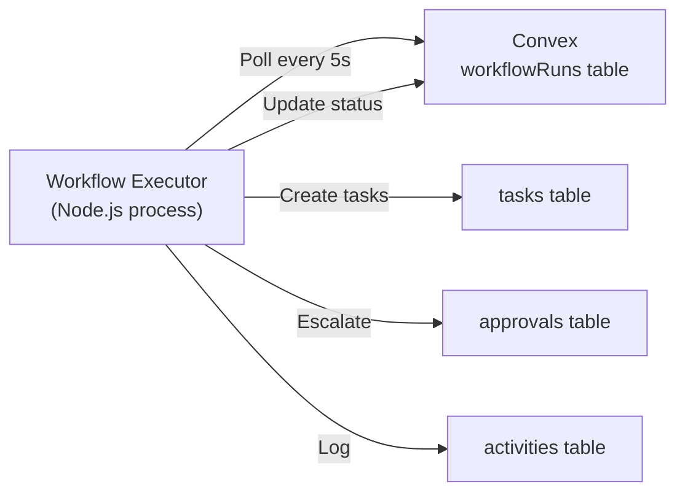

# Workflow Executor Deployment Guide

The Workflow Executor is a standalone process that polls for workflow runs and executes steps with retry/escalation logic.

## Architecture



The executor:
1. Polls for workflow runs in PENDING/RUNNING status
2. Executes the current step by creating a task
3. Waits for task completion
4. Parses output for "STATUS: done"
5. Updates context and advances to next step
6. Retries on failure, escalates when exhausted

## Deployment Options

### Option 1: Standalone Process (Recommended)

Run as a long-lived Node.js process with PM2 for auto-restart.

**Pros:**
- Independent of Convex deployment
- Easy to scale (multiple instances)
- Graceful shutdown handling
- Health check endpoint
- PM2 monitoring and logs

**Cons:**
- Requires separate hosting
- Additional infrastructure

### Option 2: Convex Cron

Run as a Convex cron job (polling every 10-30 seconds).

**Pros:**
- No separate infrastructure
- Automatic scaling
- Integrated with Convex

**Cons:**
- Limited execution time per tick
- Less control over polling frequency
- No graceful shutdown

### Option 3: Integrated with Orchestration Server

Add to existing Hono orchestration server.

**Pros:**
- Reuses existing infrastructure
- Single deployment
- Shared monitoring

**Cons:**
- Couples workflow execution to orchestration server
- Restart affects both systems

## Setup (Option 1: Standalone Process)

### 1. Configure Environment

Create `.env` file in `apps/workflow-executor/`:

```bash
CONVEX_URL=https://your-deployment.convex.cloud
POLL_INTERVAL_MS=5000
STEP_TIMEOUT_MS=60000
HEALTH_CHECK_PORT=3001
```

### 2. Build the Executor

```bash
cd apps/workflow-executor
pnpm install
pnpm build
```

### 3. Run in Development

```bash
pnpm dev
```

You should see:
```
🤖 Mission Control Workflow Executor
=====================================
Convex URL: https://...
Poll Interval: 5000ms
Step Timeout: 60000ms

🏥 Health check endpoint: http://localhost:3001/health

▶️  Starting workflow executor...

[WorkflowExecutor] Started
```

### 4. Run in Production with PM2

Install PM2:
```bash
npm install -g pm2
```

Start the executor:
```bash
pm2 start ecosystem.config.js
```

Monitor:
```bash
pm2 logs workflow-executor
pm2 monit
```

Stop:
```bash
pm2 stop workflow-executor
```

Restart:
```bash
pm2 restart workflow-executor
```

### 5. Configure Auto-Start on Boot

```bash
pm2 startup
pm2 save
```

## Configuration

### Environment Variables

| Variable | Description | Default |
|----------|-------------|---------|
| `CONVEX_URL` | Convex deployment URL | Required |
| `POLL_INTERVAL_MS` | How often to check for work | 5000 (5s) |
| `STEP_TIMEOUT_MS` | Default step timeout | 60000 (60s) |
| `HEALTH_CHECK_PORT` | Health check HTTP port | None |

### PM2 Configuration

Edit `ecosystem.config.js`:

```javascript
{
  name: "workflow-executor",
  instances: 1,              // Number of instances
  autorestart: true,         // Auto-restart on crash
  max_memory_restart: "500M", // Restart if memory exceeds
  kill_timeout: 5000,        // Graceful shutdown timeout
  max_restarts: 10,          // Max restarts per minute
}
```

## Monitoring

### Health Check

The executor exposes a health check endpoint:

```bash
curl http://localhost:3001/health
```

Response:
```json
{
  "status": "healthy",
  "uptime": 3600,
  "timestamp": "2026-02-09T12:00:00.000Z"
}
```

### Logs

**PM2 Logs:**
```bash
pm2 logs workflow-executor
pm2 logs workflow-executor --lines 100
pm2 logs workflow-executor --err  # Errors only
```

**Log Files:**
- `apps/workflow-executor/logs/out.log` — Standard output
- `apps/workflow-executor/logs/error.log` — Errors

### Metrics

Monitor executor performance:
- Workflow runs processed per minute
- Average step execution time
- Retry frequency
- Escalation rate

View in Workflow Metrics Dashboard (UI).

## Scaling

### Horizontal Scaling

Run multiple executor instances:

```bash
pm2 start ecosystem.config.js -i 3  # 3 instances
```

Executors coordinate via Convex:
- Each polls independently
- Convex ensures no duplicate work
- Load distributes automatically

### Vertical Scaling

Increase resources for single instance:
- More CPU: Faster step execution
- More memory: Handle larger contexts
- Faster network: Quicker Convex communication

## Troubleshooting

### Executor Not Processing Runs

**Symptoms:**
- Workflow runs stuck in PENDING
- No log activity

**Solutions:**
1. Check executor is running: `pm2 list`
2. Check logs: `pm2 logs workflow-executor`
3. Verify `CONVEX_URL` is correct
4. Check network connectivity to Convex

### High Memory Usage

**Symptoms:**
- Executor restarts frequently
- Memory grows over time

**Solutions:**
1. Increase `max_memory_restart` in PM2 config
2. Check for memory leaks in custom workflows
3. Reduce `POLL_INTERVAL_MS` to process fewer runs concurrently

### Slow Step Execution

**Symptoms:**
- Steps take longer than expected
- Timeouts occurring

**Solutions:**
1. Increase `STEP_TIMEOUT_MS`
2. Check agent performance (are agents claiming tasks?)
3. Review step complexity (break into smaller steps)
4. Check Convex function performance

### Executor Crashes

**Symptoms:**
- PM2 shows restarts
- Error logs show uncaught exceptions

**Solutions:**
1. Review error logs: `pm2 logs workflow-executor --err`
2. Check for unhandled promise rejections
3. Verify all dependencies installed
4. Update to latest version

## Graceful Shutdown

The executor handles shutdown signals gracefully:

```bash
# Graceful shutdown (waits for current work)
pm2 stop workflow-executor

# Force shutdown
pm2 kill
```

On shutdown:
1. Stops polling for new work
2. Finishes current step execution
3. Closes Convex connection
4. Exits cleanly

## Security

### API Keys

Store sensitive keys in `.env` (never commit):
```bash
CONVEX_URL=https://...
ANTHROPIC_API_KEY=...
```

### Network Security

- Executor only needs outbound HTTPS to Convex
- No inbound connections required (except health check)
- Use firewall rules to restrict access

### Process Isolation

Run executor as non-root user:
```bash
pm2 start ecosystem.config.js --uid executor --gid executor
```

## Performance Tuning

### Poll Interval

Adjust based on load:
- High load: 3000ms (3s) — More responsive
- Normal load: 5000ms (5s) — Balanced
- Low load: 10000ms (10s) — Less overhead

### Concurrency

Process multiple runs in parallel:
```javascript
// In executor.ts
const runs = await this.client.query(api.workflowRuns.list, {
  status: "RUNNING",
  limit: 10, // Process up to 10 runs per tick
});
```

### Batch Operations

Batch Convex mutations when possible:
- Update multiple steps in one mutation
- Batch context updates

## Backup and Recovery

### Executor Failure

If executor crashes:
1. Workflow runs remain in database (RUNNING status)
2. Restart executor
3. Executor resumes from current step
4. No data loss

### Convex Outage

If Convex is unavailable:
1. Executor logs connection errors
2. Continues polling (with backoff)
3. Resumes when Convex returns
4. No manual intervention needed

## Production Checklist

- [ ] Environment variables configured
- [ ] PM2 installed and configured
- [ ] Health check endpoint accessible
- [ ] Logs directory writable
- [ ] Auto-start on boot configured
- [ ] Monitoring alerts set up
- [ ] Backup strategy defined
- [ ] Rollback plan documented

---

**Next**: [Workflow CLI Guide](./WORKFLOW_CLI.md)
