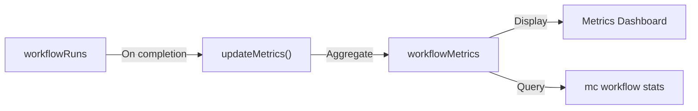

# Workflow Metrics Guide

Track and analyze workflow performance with Mission Control's metrics system.

## Overview

The metrics system provides:
- **Real-time monitoring** — Track active workflow runs
- **Performance analytics** — Success rates, durations, bottlenecks
- **Historical trends** — 30-day rolling windows
- **Bottleneck detection** — Identify problematic steps
- **Escalation tracking** — Monitor human intervention needs

## Architecture



Metrics are:
- Calculated on workflow run completion
- Aggregated per workflow
- Stored in 30-day rolling windows
- Updated automatically

## Metrics Dashboard (UI)

Access via: `http://localhost:5173/workflows/metrics`

### Summary Cards

Top-level metrics across all workflows:

- **Total Runs** — All workflow executions
- **Success Rate** — Percentage completed successfully
- **Avg Duration** — Mean execution time
- **Total Retries** — Sum of all step retries
- **Escalations** — Runs requiring human approval

### Per-Workflow Metrics

Detailed stats for each workflow:

- **Runs** — Total executions
- **Success** — Success rate percentage
- **Avg Time** — Average duration
- **Retries** — Total retry count
- **Bottlenecks** — Steps with high failure/retry rates

### Bottleneck Analysis

Identifies problematic steps:

```
implement: 35% failure, 2.3 avg retries
verify: 18% failure, 1.2 avg retries
```

Bottlenecks are steps with:
- Failure rate > 10%
- Average retries > 0.5

## Metrics API

### Query Metrics

**Get workflow metrics:**
```typescript
const metrics = await client.query(api.workflowMetrics.getWorkflowMetrics, {
  workflowId: "feature-dev",
  projectId: "proj_123",
});
```

**Get all metrics:**
```typescript
const allMetrics = await client.query(api.workflowMetrics.getAllMetrics, {
  projectId: "proj_123",
});
```

**Get summary:**
```typescript
const summary = await client.query(api.workflowMetrics.getSummary, {
  projectId: "proj_123",
});
```

### Update Metrics

Metrics update automatically when a workflow run completes.

**Manual refresh:**
```typescript
await client.mutation(api.workflowMetrics.refreshAll, {});
```

## Metrics Schema

### workflowMetrics Table

```typescript
{
  workflowId: string;
  projectId?: Id<"projects">;
  
  // Time period
  periodStart: number;
  periodEnd: number;
  
  // Execution stats
  totalRuns: number;
  successfulRuns: number;
  failedRuns: number;
  pausedRuns: number;
  successRate: number; // 0-1
  
  // Timing stats
  avgDurationMs: number;
  minDurationMs: number;
  maxDurationMs: number;
  
  // Step stats
  avgStepsCompleted: number;
  totalRetries: number;
  totalEscalations: number;
  
  // Bottlenecks
  bottlenecks: Array<{
    stepId: string;
    failureRate: number;
    avgRetries: number;
  }>;
  
  lastUpdated: number;
}
```

## Key Metrics Explained

### Success Rate

**Formula:** `successfulRuns / totalRuns`

**Interpretation:**
- **> 90%** — Excellent (workflow is reliable)
- **70-90%** — Good (some issues, but manageable)
- **50-70%** — Poor (needs workflow improvements)
- **< 50%** — Critical (workflow is broken)

**Improving:**
- Review failed runs for patterns
- Adjust retry limits
- Improve step instructions
- Add verification gates

### Average Duration

**Formula:** `sum(completedAt - startedAt) / completedRuns`

**Interpretation:**
- **< 30 min** — Fast (good for iterative workflows)
- **30-60 min** — Normal (typical for feature-dev)
- **1-2 hours** — Slow (consider breaking into smaller workflows)
- **> 2 hours** — Very slow (needs optimization)

**Improving:**
- Parallelize independent steps
- Reduce step timeouts
- Optimize agent prompts
- Cache expensive operations

### Retry Rate

**Formula:** `totalRetries / (totalRuns * avgStepsPerRun)`

**Interpretation:**
- **< 0.1** — Excellent (steps rarely fail)
- **0.1-0.3** — Normal (occasional failures)
- **0.3-0.5** — High (steps failing frequently)
- **> 0.5** — Critical (workflow is unreliable)

**Improving:**
- Increase retry limits for flaky steps
- Improve error handling in agents
- Add pre-conditions to steps
- Review step expectations

### Escalation Rate

**Formula:** `totalEscalations / totalRuns`

**Interpretation:**
- **< 5%** — Excellent (autonomous)
- **5-15%** — Normal (occasional human input)
- **15-30%** — High (frequent intervention)
- **> 30%** — Critical (not autonomous)

**Improving:**
- Increase retry limits
- Improve agent capabilities
- Add fallback strategies
- Simplify complex steps

## Bottleneck Detection

### What is a Bottleneck?

A step that:
- Fails frequently (> 10% failure rate)
- Requires many retries (> 0.5 avg retries)
- Slows down workflow execution

### Example Bottleneck

```typescript
{
  stepId: "implement",
  failureRate: 0.35,  // 35% of runs fail at this step
  avgRetries: 2.3,    // Average 2.3 retries per run
}
```

### Addressing Bottlenecks

1. **Review step definition**
   - Is the input clear?
   - Are expectations realistic?
   - Is the timeout sufficient?

2. **Improve agent capabilities**
   - Update persona instructions
   - Add examples to AGENTS.md
   - Provide better context

3. **Break down the step**
   - Split into smaller steps
   - Add verification gates
   - Reduce complexity

4. **Adjust retry strategy**
   - Increase retry limit
   - Add exponential backoff
   - Implement circuit breaker

## Monitoring Best Practices

### 1. Set Baselines

Track initial metrics to establish baselines:
```
feature-dev:
  Success rate: 85%
  Avg duration: 45 min
  Retry rate: 0.15
  Escalation rate: 8%
```

### 2. Monitor Trends

Watch for degradation:
- Success rate dropping
- Duration increasing
- Retry rate climbing
- New bottlenecks appearing

### 3. Alert on Anomalies

Set up alerts for:
- Success rate < 70%
- Escalation rate > 20%
- New bottlenecks detected
- Duration > 2x baseline

### 4. Review Regularly

Weekly review:
- Check all workflow metrics
- Investigate failures
- Address bottlenecks
- Optimize slow workflows

### 5. A/B Test Changes

When improving workflows:
1. Record baseline metrics
2. Make changes
3. Run 10+ test runs
4. Compare metrics
5. Keep or revert

## Performance Optimization

### Optimize for Success Rate

**Goal:** > 90% success rate

**Strategies:**
- Increase retry limits
- Improve error handling
- Add validation steps
- Simplify complex steps

### Optimize for Speed

**Goal:** < 30 min for most workflows

**Strategies:**
- Parallelize independent steps
- Reduce step timeouts
- Cache expensive operations
- Use faster models

### Optimize for Autonomy

**Goal:** < 5% escalation rate

**Strategies:**
- Increase retry limits
- Add fallback strategies
- Improve agent capabilities
- Simplify decision points

## Exporting Metrics

### Export to CSV

```typescript
const metrics = await client.query(api.workflowMetrics.getAllMetrics, {});

const csv = [
  "Workflow,Success Rate,Avg Duration,Retries,Escalations",
  ...metrics.map(m => 
    `${m.workflowId},${m.successRate},${m.avgDurationMs},${m.totalRetries},${m.totalEscalations}`
  )
].join("\n");

console.log(csv);
```

### Export to JSON

```typescript
const metrics = await client.query(api.workflowMetrics.getAllMetrics, {});
console.log(JSON.stringify(metrics, null, 2));
```

### Integration with Analytics

Send metrics to external analytics:

```typescript
// Example: Send to DataDog
const metrics = await client.query(api.workflowMetrics.getSummary, {});

await fetch("https://api.datadoghq.com/api/v1/series", {
  method: "POST",
  headers: {
    "DD-API-KEY": process.env.DATADOG_API_KEY,
    "Content-Type": "application/json",
  },
  body: JSON.stringify({
    series: [
      {
        metric: "workflow.success_rate",
        points: [[Date.now() / 1000, metrics.successRate]],
      },
      {
        metric: "workflow.avg_duration",
        points: [[Date.now() / 1000, metrics.avgDurationMs]],
      },
    ],
  }),
});
```

## Troubleshooting

### Metrics Not Updating

**Symptoms:**
- Dashboard shows stale data
- Metrics don't reflect recent runs

**Solutions:**
1. Manually refresh: `mc workflow refresh-metrics`
2. Check executor is running
3. Verify runs are completing
4. Check Convex logs for errors

### Inaccurate Metrics

**Symptoms:**
- Success rate seems wrong
- Duration doesn't match reality

**Solutions:**
1. Verify time period (30-day window)
2. Check for incomplete runs
3. Review calculation logic
4. Refresh metrics: `refreshAll()`

### Missing Bottlenecks

**Symptoms:**
- Known problematic steps not flagged

**Solutions:**
1. Check failure rate threshold (> 10%)
2. Check retry threshold (> 0.5)
3. Verify enough runs for analysis (> 10)
4. Review step statistics manually

---

**Next**: [Workflow Examples](./WORKFLOW_EXAMPLES.md)
