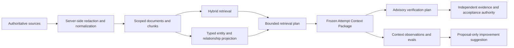

# Factory Memory and Context Intelligence

## Decision

Factory Memory is an additive, provenance-backed projection over Mission
Control and repository sources. Convex remains the governed record for durable
workspace data. Provider-neutral TypeScript algorithms in `packages/memory`
define deterministic ingestion, retrieval, graph, planning, packaging, and eval
behavior, with an in-memory adapter for tests and fixtures.

Factory Memory never becomes acceptance truth. It may explain a WorkOrder,
select a bounded Attempt context snapshot, and influence an advisory
verification plan. Only independent objective evidence can satisfy acceptance.

## Five gated phases

| Phase                          | Flag                               | Contract                                                                                                                                         |
| ------------------------------ | ---------------------------------- | ------------------------------------------------------------------------------------------------------------------------------------------------ |
| Hybrid Factory RAG             | `factory-memory.hybrid`            | Redact, hash, chunk, scope, retrieve, deduplicate, rank, and budget sources with provenance.                                                     |
| Typed relationships            | `factory-memory.relationships`     | Store closed-vocabulary directional edges with endpoint scope, provenance, derivation, and confidence for inferred edges.                        |
| Agentic retrieval              | `factory-memory.agentic-retrieval` | Plan code, architecture, incident, verification, history, and graph retrieval with at most three observable sufficiency iterations.              |
| Factory Knowledge Graph        | `factory-memory.knowledge-graph`   | Resolve entities and inspect bounded neighborhoods and paths through a provider-neutral graph contract.                                          |
| Autonomous Context Engineering | `factory-memory.context-engine`    | Freeze minimal purpose-ranked Context Packages for exact Attempts; diff revisions and graph paths; evaluate outcomes; propose improvements only. |

All flags default off. Factory Memory flags are workspace-scoped and require
Factory permissions to read or change. Later phases do not change legacy
execution behavior while disabled.

## Authority and data flow

The projection stores source IDs, revisions, timestamps, derivation, and paths.
It references WorkOrders, Attempts, and FactoryDefinitionVersions rather than
copying their mutable authority. A Context Package is immutable after freeze
and an Attempt can bind to at most one digest.

## Scope and security invariants

- Workspace scope is mandatory for every Factory Memory API and storage key.
- Repository filtering is applied before ranking or graph exposure.
- Relationship endpoints must share workspace and repository scope.
- Source text and structured metadata are bounded and redacted before
  persistence; retrieval observations are sanitized again.
- Retrieved content is untrusted data. It cannot grant tool, identity,
  permission, execution, approval, or acceptance authority.
- Inferred relationships require a bounded confidence value and are labeled in
  every operator projection.
- Search candidates, selected items, context tokens, graph depth, graph nodes,
  fan-out, and refinement iterations have hard server-side caps.

## Provider boundary

`FactoryMemoryStore` and `FactoryKnowledgeGraph` expose normalized scoped
operations. The deterministic semantic adapter uses stable hashed features for
offline CI and demo operation. A future embedding, vector, or graph provider
must preserve the same filtering, provenance, budget, and normalized result
contracts; it cannot leak provider-specific queries into the UI or governance
domain.

Convex full-text search is the durable lexical path. External vector search is
deferred until measured quality or scale justifies an action boundary and fixed
embedding model contract.

## Operator surfaces

Knowledge → Memory provides Overview, Memory, Graph, and Context tabs. The
Execution Run Inspector shows the frozen package for the exact Attempt. Every
surface includes loading, empty, disabled, and bounded-result states, and
distinguishes authoritative, deterministic, and inferred knowledge.

## Deterministic evidence

The `shop-service-five-phase-v1` fixture covers auth middleware, orders API,
billing dependency, ADR-004, INC-12, two tests, a failed WorkOrder, objective
verification evidence, and a regression case. It proves all five phases,
stable package digests and diffs, bounded traversal/refinement, redaction,
workspace isolation, advisory verification influence, and a small-relevant vs
large-noisy context comparison without a live model or external store.

## Rollout and rollback

Enable phases in order for one workspace and repository. Stop rollout on any
scope leak, secret persistence, provenance loss, acceptance coupling, budget
violation, or material latency regression. Disable the affected flag to return
to the previous execution path; retain the rebuildable projection for audit and
diagnosis.
