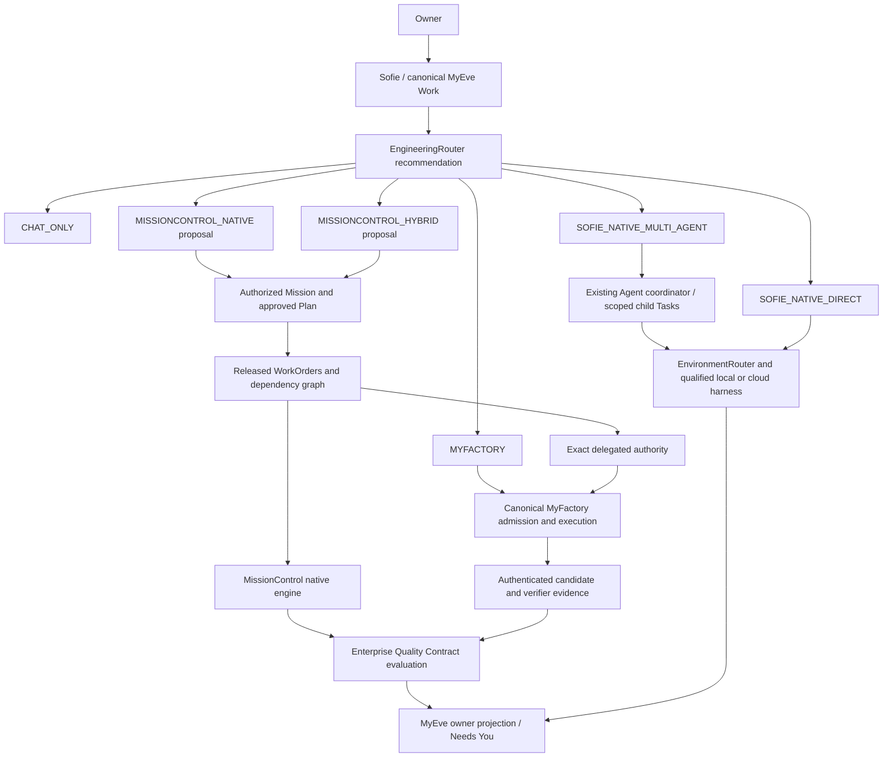
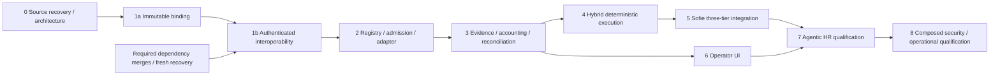

# Implement enterprise factory orchestration

Status: Phase 0 recovered; first Phase 1 contract checkpoint in progress. No enterprise integration release is qualified.

The owner approved three independent execution tiers and directed this work to start on canonical main. Executable integration waits for the required dependency changes to merge. This plan does not authorize production deployment, paid model calls, external-alpha changes, generated application publication, merges, or tester grants. Engineering branch commits and pushes are requested separately in the checkpoint discipline.

## 1. Executive objective

Preserve Sofie's native execution, MyFactory's bounded software factory, and MissionControl's native enterprise engine. Add bounded MyFactory delegation under MissionControl governance. Completion requires E1 through E10, including actual composed execution, database recovery, browser journeys, and independent security review.

## 2. Current architecture

Read [the source inventory](SOURCE_INVENTORY.md) before changing runtime contracts. MissionControl owns state in Convex and execution in the orchestration server. Its existing factory definitions are repository-bound native configurations. MyFactory owns admitted WorkOrders, Runs, candidate custody, verification, and local or PostgreSQL accounting. MyEve owns Work, routing, owner authority, and Result/Proof projection. Relay owns communication authorization. Skillz main is a portable skill distribution; the governed MySkills platform is an unmerged dependency.

Historical qualification records establish their original scope only. This checkpoint has not requalified live services.

## 3. Target architecture

Routing does not admit execution. Local harness availability does not grant Owner Computer access. A delegation is correlation and scoped authority, never a replacement Work lifecycle.

## 4. Canonical ownership

Use existing Mission, Plan, WorkOrder, Task, and workflowRun records in MissionControl. Keep MyEve Work and MyFactory WorkOrder IDs separate. Store an explicit crosswalk, never cast a Convex ID into a MyFactory UUID. MissionControl decides enterprise acceptance. MyFactory decides its own execution and verification outcomes. MyEve presents the owning system's decisions.

## 5. Repository compatibility

Apply [the compatibility crosswalk](COMPATIBILITY.md). The first contract is a MissionControl-owned immutable binding. It records canonical IDs, revision identities, digests, policy, and partner request identity outside the strict MyFactory payload. It grants no authority.

## 6. Reuse existing capabilities

Reuse factoryDefinitions, factoryDefinitionVersions, factoryReadinessAssessments, workflowRuns, verificationReceipts, existing Quality Contracts, provider liability, and company authorization. Preserve native worktree and sandbox providers. Reuse MyFactory parseCloudPrepare, authenticated Result verification, dispatch storage, spend policy, and candidate custody. Reuse MyEve RouteAdmissionService, WorkStore, environment routing, native qualification, and Needs You.

## 7. Missing integration contracts

Implement explicit versions for external registration and qualification, prepare/admit, dispatch receipt, status, stop, result/evidence retrieval, reservation/settlement, reconciliation, and revocation. Separate transport authentication, authority validation, and durable admission. Define non-enumerating errors and explicit retry semantics per operation. Never retry an ambiguous dispatch.

Phase 1a implements only immutable correlation and exact-binding comparison. Later Phase 1 work must authenticate messages and validate current authority. A shape validator or matching digest is not authentication.

## 8. Proposed source changes

Phase 1a adds `packages/shared/src/factoryDelegationBinding.ts`, its Vitest suite, and the package export. It changes no native dispatch call sites. Later changes belong in MissionControl's `convex/factory/`, `convex/lib/`, `convex/schema.ts`, and a narrow orchestration-server adapter. MyEve changes belong beside `lib/engineering/route-admission.ts` and `lib/digital-worker/routing.ts` after the release dependencies merge. Change MyFactory only where its canonical admission lacks the required protocol extension.

## 9. Proposed persistence

Keep canonical records in their owning databases. Extend registry semantics only after separating a native factory configuration from an external service identity. Add subordinate delegation correlations and an outbox/inbox tied to the existing WorkOrder revision and Attempt. Index tenant, workspace, delegation identity, partner request, and idempotency key. Enforce duplicate-content conflicts transactionally. Add schema, generated types, queries, and tests in the same checkpoint. Do not deploy a schema in this mission.

## 10. Authentication and authorization

Inventory existing MissionControl service-command signing, MyFactory request authentication and Ed25519 Result signatures, and Relay signing-envelope v2. Do not reuse a protocol's signing domain for a new operation. Bind caller, audience, tenant/workspace, operation, delegation, version, payload digest, expiration, and revocation. Derive principals from authenticated server context. Re-read current authority before effects. Select the exact transport extension only after the partner dependency merges and its trust contract is re-inspected.

## 11. Factory registration

Register native and MyFactory systems only. Keep connection health independent from qualification evidence and admission. Bind qualification to exact FactoryVersion, capability set, environment, security scope, verifier, corpus, and expiration. Compute ELIGIBLE, INELIGIBLE, or UNKNOWN; UNKNOWN denies dispatch. Apply hard policy before cost or reliability preferences. Do not reinterpret native DRAFT/ACTIVE/ARCHIVED labels as external security qualification.

## 12. Delegation lifecycle

Correlate the enterprise Attempt to one partner request and admitted Run. Persist preparation, authority issuance, outbox delivery, partner acknowledgment, and reconciliation observations. The partner remains the execution lifecycle owner. A lost response leaves ambiguity; reconcile by exact request identity. At most one authoritative intake and writer may exist. Conflicting duplicate content denies; identical duplicate content returns the original result without another effect.

## 13. Preserve native execution

MyFactory remains optional. Run existing native factory tests with no MyFactory endpoint or credentials. Preserve execution manifests, leases, writer fencing, source identity, verifier Attempts, recovery, and publication controls. The first contract adds no runtime dependency.

## 14. Hybrid execution

After E2 through E5, compose one native WorkOrder, one delegated WorkOrder, and one downstream integration WorkOrder. Schedule only after dependencies, approvals, capacity, and budget are satisfied. Existing `SERIAL_MUTATIONS` policy remains authoritative until a separately qualified concurrency extension handles repository/path conflicts. Do not silently enable parallel mutation.

## 15. Results and evidence

Verify the partner's existing signed Result and artifact bytes first. Match factory/version, request, WorkOrder, Run, source, candidate, verifier identity, and evidence digests to the stored delegation. Then evaluate MissionControl's Quality Contract. Preserve FAILED, PARTIAL, UNKNOWN, missing evidence, and stale evidence. Partner verification PASS is not enterprise acceptance. Candidate changes invalidate affected verification.

## 16. Shared accounting

Allocate one enterprise reservation before issuing a delegated sub-allowance. MyFactory enforces that ceiling locally. Use integer micro-USD for the integration. Maintain disjoint reserved, settled, and UNKNOWN categories so `settled + reserved + unknown <= ceiling` without double counting. Expiry or silence cannot release UNKNOWN. Transactionally qualify final-budget contention, duplicate settlement, cancellation, restart, and simultaneous native/delegated reservations. Existing provider ledgers are reuse points, not proof that composed accounting is solved.

## 17. UNKNOWN and recovery

Fence new effects on ambiguous dispatch, model operation, custody, or stop. Do not substitute a factory, environment, harness, or model. Preserve the original Attempt and exposure. A stop receipt must be followed by observed process/resource cleanup. Only authoritative reconciliation may clear uncertainty. Reassignment requires a successor Attempt and fresh authority after prior-writer fencing.

## 18. Sofie integration

Add non-executable logical route recommendations CHAT_ONLY, SOFIE_NATIVE_DIRECT, SOFIE_NATIVE_MULTI_AGENT, MYFACTORY, MISSIONCONTROL_NATIVE, and MISSIONCONTROL_HYBRID. Map them onto existing canonical route contracts. Consider complexity, tools, Role Packs, Skills, repositories, streams, dependencies, duration, verification, classification, environment qualification, budget, effects, and owner policy. Select the smallest qualified route. Enterprise routes create proposals before authorized Mission creation. Keep native and direct Factory paths independent. Preserve canonical Work admission and routing records. Read MissionControl state for status and Needs You. Do not reconstruct state from chat.

Extend the existing Agent APIs, Role catalog, workflow coordinator, and specialist hooks according to [the native multi-agent checkpoint](SOFIE_NATIVE.md). Persistent creation and ephemeral child execution have different lifetimes. Agent creation does not grant future Work authority. Multiple agents or a coding task alone do not select a higher tier. Persist explainable route decisions, qualification references, exact configuration, and budget estimates. Escalation or de-escalation after admission requires stopping/fencing, reconciliation, retained evidence, and fresh owner-authorized Work or Mission authority.

DeepAgents remains ADAPT / NOT QUALIFIED. Reuse its historical adapter only after a separate source reconciliation and qualification checkpoint; do not replace it or register it merely to satisfy routing examples.

## 19. Relay integration

Use existing scoped communication only where needed. Relay identity, registration, and successful delivery never grant enterprise WorkOrder authority. Preserve receiving-system admission. No federation activation or new standing grants.

## 20. MySkills integration

Wait for the governed catalog/resolver dependency to merge. Preserve existing repository-local Skills in the meantime. Pin skill/version/digest and the resolved dependency graph. Validate qualifications, revocation, capability scope, model policy, and effects at admission and execution fences. Existing MyFactory payloads reject added Skill keys; require an explicit protocol version extension. The current reference platform's in-memory owner store is not production persistence.

## 21. Operator and owner UI

Extend existing MissionControl navigation and components with Factory Fleet, qualification/capacity, dependency graph, factory assignment, delegated progress, evidence, budget exposure, UNKNOWN, and recovery. MyEve gets a smaller Mission projection and exact Needs You decisions. Cover loading, empty, denied, stale/offline, failure, success, refresh, and reconnect states. Unavailable metrics stay unavailable. All controls call canonical APIs. Browser interactions, keyboard/focus, responsive layouts, and accessibility are mandatory for E8.

## 22. Reference Mission

Use synthetic Employee Core, Recruiting, and Onboarding repositories. Pin source commits/trees, produce actual deterministic candidates, independently verify them, and run integration qualification. No real employee, compensation, payroll, or production data. Full performance, compensation, and payroll products are deferred.

## 23. Test strategy

Use repository-native Vitest and Node tests. Phase 1a tests malformed payloads, unknown fields/versions, identity substitution, revisions, digests, unsafe numbers, prohibited effects, and exact duplicate/conflict classification. Later tests must add authenticated transport, real transactional persistence, concurrent admission, restart, process cleanup, candidate substitution, stale writers, and cross-owner denial. Run the three-tier routing matrix in `QUALIFICATION.md`. Fresh-clone and exact-head hosted CI are required before full qualification. Skipped or absent evidence stays NOT_RUN.

## 24. Threat model

Protect tenant/workspace, repository, authority, source/candidate, verifier, and accounting boundaries. Required attacks include impersonation, replay, scope expansion, stale generation, source/candidate substitution, producer access to protected tests, forged Result, malicious Skill instructions, prompt injection, credential extraction, budget escalation, and unauthorized publication/deployment. [The qualification matrix](QUALIFICATION.md) maps defenses to evidence. Independent source review remains required before security PASS.

## 25. Performance and scalability

Bound payload size and identifier lengths. Use indexed reads and transactional reservations rather than full-table routing scans. Measure queue delay, admission latency, reconciliation backlog, verifier duration, and cost per accepted outcome after correctness. Establish actual baselines before choosing numeric service targets. Never trade tenant isolation or verification for a cheaper route.

## 26. Deployment boundaries

Use deterministic local fixtures. Do not load production credentials, deploy Convex, activate federation, mutate external-alpha installations, invoke paid models, or publish generated candidates. CI must use fixtures and must not run deployment workflows for the engineering branch.

## 27. Rollback

Disable new delegated admissions while retaining correlation, evidence, reservations, and reconciliation. Do not rewrite admitted FactoryVersions, discard UNKNOWN, redirect Work, or delete records to make the dashboard green. The additive Phase 1a contract can be removed without changing native behavior because no runtime consumer is enabled.

## 28. Dependencies

The owner chose main-only development. Execution wiring waits for the private-source and Work-authority changes in MyFactory, Work-authority/shared-accounting changes in MyEve, and governed MySkills changes where used. Re-fetch default branches after merges, inspect exact changes, and update compatibility pins before continuing. Branch existence or an open PR does not establish acceptance. Keep the MyEve owner-experience candidate untouched.

## 29. Risks and decisions

The most material risks are incompatible IDs, strict payloads, separate digest formats, deployment-bound partner grants, missing composed ledger transactions, and confusing health with qualification. MissionControl also has legacy optional tenancy fields; delegated admission must require explicit tenant/workspace rather than inherit legacy permissiveness. No new integration may rely on a manually selected QUALIFIED label. Transport authentication and durable admission remain unresolved until dependency recovery.

## 30. Checkpoints and implementation order

Each checkpoint includes focused tests, applicable database and integration tests, source review, commit, engineering branch push, remote SHA verification, and durable evidence. Do not open or merge a generated application PR. Documentation, fixture design, and threat-case design can proceed independently; runtime accounting and evidence acceptance depend on exact admission identity. UI prototypes cannot count as operational qualification.

## 31. Acceptance criteria

E1 requires reviewed source inventory, ownership, compatibility, and plan. E2 requires durable registration/admission and capacity. E3 requires authenticated deterministic delegation through actual execution and verification. E4 requires exact Result interoperability. E5 requires transactional shared accounting. E6 requires hybrid execution and recovery. E7 requires all three Sofie tiers, including native direct and multi-agent, and owner continuity. E8 requires canonical operator interactions. E9 requires the synthetic multi-repository HR slice. E10 requires independent security review, fault injection, fresh-clone tests, and hosted CI at exact commits. The later T1 through T10 gates add explicit native multi-agent, Role Pack, parent/child accounting, and three-tier composed qualification. Both gate families are retained; overlapping section numbers in the attachments do not erase earlier security requirements.

No gate passes merely because its types or diagrams exist. Report the actual state in `QUALIFICATION.md`.

## 32. Deferred capabilities

Defer additional factory types, unrestricted federation, autonomous policy learning/promotion, automatic model/provider fallback, production repair, marketplace payments, full HR product implementation, production deployment, and live paid canaries. Do not rebuild execution fabrics or make MissionControl a dependency for Sofie Native or direct MyFactory execution.
