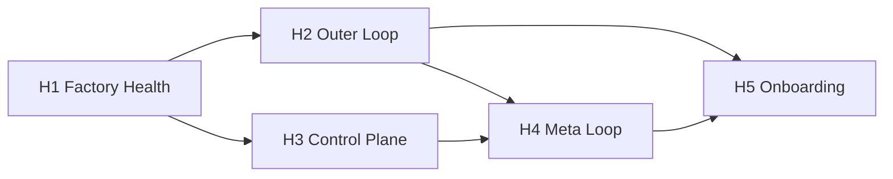

# Harness Engineering UI Plan — Tessl Talk → Mission Control

> **Sources:**  
> - Dru Knox AI Engineer SF talk + interview (“Harness Engineering / Software Factory”)  
> - AI Native Dev podcast — *What is the Tessl agent?* (loop engineering, code review walkthrough, modular factory)  
> - AINDCon / live panel — *What Is a Software Factory?* (Dru Knox + Steve Yegge: Gastown, Beads, work-as-substance, swarm rhythm, workshop maintenance)  
> **Goal:** Extend Mission Control UI so operators can **see and improve the factory**, not just agent activity — matching the inner / outer / meta loop model, Tessl Agent’s “automate yourself away” path, **work-first factory semantics**, and progressive adoption.  
> **Companion:** `docs/plans/2026-07-12-factory-ui-roadmap.md` (exceptions-first, de-slop, analytics). This plan adds the **harness-engineering layer** on top.

---

## 1. Transcript synthesis — what a “software factory” UI must show

### 1.1 North-star (not “ship faster with slop”)

| Pillar | Meaning | UI must answer |
|--------|---------|----------------|
| **Autonomy** | Agent reaches correct answer with few human corrections | “How often do we one-shot / how many nudges per PR?” |
| **Automation** | Trust to accept output without full human review | “What % of PRs merge without manual line review?” |
| **Quality** | Product quality for users (then rising beyond baseline) | “Are evals, tests, and verifiers green — and trending up?” |

**Key insight:** Short-term velocity tradeoff fades; with a factory, **backlog of fixes disappears** because agents can fix everything reviewers find. UI should show **capacity reclaimed** (bugs fixed, refactors shipped), not only throughput.

**Gastown panel addendum:** Factories think in **work as substance** — generate swarms create tickets/issues; fix/review swarms consume them. Ambition scales (100-year backlogs become feasible); the UI should celebrate **capacity unlocked**, not frame automation as replacement anxiety.

### 1.2 Three loops (harness engineering core)

```
┌─────────────────────────────────────────────────────────────┐
│  META LOOP — observes PRs, issues, user feedback          │
│  → proposes updates to inner/outer loop (“correct once”)    │
├─────────────────────────────────────────────────────────────┤
│  OUTER LOOP — at PR boundary (CI): change review,           │
│  verifiers, agent QA, mutation testing, Tessl evals         │
├─────────────────────────────────────────────────────────────┤
│  INNER LOOP — while agent works: skills, plugins,           │
│  lint, tests, fast self-checks                              │
└─────────────────────────────────────────────────────────────┘
```

| Loop | When | Typical components | Drives |
|------|------|-------------------|--------|
| **Inner** | Pre-PR, fast, cheap, repeated | Skills, MCP/plugins, unit tests, skill-lint | Autonomy |
| **Outer** | PR opened, slower, replaces human review | Change review lenses, verifiers, eval scenarios, E2E agent QA | Automation |
| **Meta** | Continuous, background | PR/issue mining, playbook updates, weekly sweeps | Quality + compound improvement |

**Adoption path:** Teams start in the **center (inner loop)**, expand **outer** when code review becomes the bottleneck, then **meta** for 9-hour tasks and exponential gains.

### 1.5 Tessl Agent podcast — additional concepts (AI Native Dev)

#### Core philosophy: “Built to stop using it”

The Tessl Agent is a **factory-building agent**, not a coding agent. It orchestrates other agents and pushes every interaction toward **recurring automation**:

- After interactive setup: “I could set this up as a recurring action” / “create a CI/CD check”
- Goal: **40–50% of PRs never need a human** — achieved incrementally, not via a big initiative
- Interactive sessions are **transitional**; background loops are the end state

**MC UI implication:** Every wizard and chat flow must end with **“Automate this”** CTA (schedule, CI hook, cron, GitHub Action template) — not leave users in perpetual chat.

#### Golden path: “Set up agentic code review” (one command → three review layers)

Podcast walkthrough — this is the **reference onboarding flow** to replicate in UI:

| Step | What happens | MC UI surface |
|------|----------------|---------------|
| 1. **Evidence gathering** | Scan PRs, issue tracker, agent session logs for style guide, common failures, frequent review comments | **Evidence panel** on Factory Agent / Setup wizard |
| 2. **Human confirm findings** | Show what was inferred; user corrects before codifying | Editable findings checklist |
| 3. **Code review skill** | Create **owned** skill (not black-box); team can edit/share | Registry → new skill draft from findings |
| 4. **Automated PR review** | Wire skill to CI: inline GitHub comments, sandbox run, model choice | Launch/Workflows + connector status |
| 5. **Change Risk Verifier** | Org policy: which PRs **require human** vs agent-only merge (permissive ↔ strict) | **Risk policy editor** + per-PR gate badge |
| 6. **Verifiers from skills** | Auto-generate targeted LLM lint rules from existing skills/context | Verifiers catalog (linked to registry skills) |
| 7. **Recurring meta loop** | Daily/weekly: scan PRs, CI, comments, sessions → new verifiers, skill updates, **new eval scenarios** | Meta Loop inbox + scheduled job config |

**Three review types (one setup):**

1. **Agentic review** — general lenses via coding agent + review skill  
2. **Change risk** — policy-based human gate  
3. **Verifiers** — skill-adherence checks (closes skills ↔ code gap)

#### Two traps → loops as the fix (product copy + UI)

| Trap | Behavior | UI should surface |
|------|----------|-------------------|
| **Ship focus** | Never invest in agent improvement → stuck at local max | “Autonomy stalled” warning on Factory Health |
| **Discipline focus** | Pause shipping for months to build harness → velocity cliff | “Loop investment” tracker: small PRs from meta loop, not big initiatives |

**Loops solve both:** legible surfaces (PR/CI, not local logs) + meta loop **opens PRs for you** (“I saw this mistake, here’s the fix — accept?”).

#### Evals without developer toil

- Eval scenarios extracted from **observed failures** in the meta loop (not manual test authoring)
- Review skill improvements validated by **simulated PRs** before human sees them again
- UI: **“Eval auto-created from PR #1234”** lineage on scenario detail

#### Cost optimization (workflow-level only)

- **Do not** UI-optimize per interactive Claude/Codex session (losing game)
- **Do** optimize **carved-off workflows** (code review runs 50–70×/day)
- UI: **Workflow cost panel** — skill + agent model + eval tradeoff (“5% worse, 80% cheaper — accept?”)
- Tessl Launch runs workflows in **model-agnostic sandbox** with full logs for tuning

#### Two entry paths (onboarding fork)

| Path | Starting pain | First MC screens |
|------|---------------|-------------------|
| **Bottoms-up** | Skill sprawl (15k skills week 2); governance | Registry inventory → security → quality review |
| **Factory-first** | “Code review is the bottleneck” | Factory Agent → code review wizard → outer loop |

Both converge on same registry + loops; wizard should **ask which path** upfront.

#### Four-component product model (map to MC)

| Tessl component | Meaning | MC mapping |
|-----------------|---------|------------|
| **Tools** | Capabilities (eval, review, launch) | Convex modules, scripts, packages |
| **Skills** | Embodied expertise (owned artifacts in repo) | Context registry / SKILL.md |
| **Harness** | UX bundling tools + skills | App shell, Chat dock, wizards |
| **Control center** | Collaboration across people/time | Mission Control platform (this UI) |

#### Modular / open factory (UI principles)

- **Platform, not monolith** — every connector/reviewer/runtime is swappable  
- **Own the brain** — skills live in repo; harness is interchangeable  
- **Multiple factory lines** — support per-team or per-repo loop configs  
- UI: **“Replace component”** on connector cards; never hard-lock to one vendor  

#### Additional Tessl Agent use cases → MC features

| Prompt / use case | Delivers | Phase |
|-------------------|----------|-------|
| “What could I delegate to agents?” | Recurring task suggestions from success patterns | H4 |
| “Make agents work in my frontend” | Failure analysis + skill/playbook PR | H4 |
| “Make my repo agent-ready” | Repo maintenance bundle (architecture, test quality, flaky tests) | H4 |
| “What’s broken in our agent sessions?” | Session log mining report | H3 + H4 |
| Loops on loops | Monitor daily architecture review → improve that loop | H4 |

#### UX in the AI era (design constraints)

1. **Outcome-oriented** — user states goal; product runs commands (not “call A then B then C”)  
2. **Knowledge as a service** — UI embeds current best practices (harness/loop concepts stay updated)  
3. **Agent interface for the product itself** — web chat sidebar eventually (MC Chat dock → **Factory Agent mode**)  
4. **CLI first, GUI second** — power users via terminal; operators via Mission Control web  

#### Non-dev skills

Registry must support **sales / marketing / product** skills (same governance, different eval scenarios) — extend category grid and inventory triage.

### 1.3 Three setup layers (before loops work)

| Layer | Transcript content | UI equivalent |
|-------|-------------------|---------------|
| **Control plane** | Issue → headless agent → PR; all feedback legible (Linear, GitHub, registry) | Pipeline view + connector health |
| **Agent IT** | CLI/API access, sandbox, credentials, prod logs governance | Setup checklist + integration status |
| **Improvement loops** | Inner/outer/meta configuration, repo maintenance, playbooks | Loop editor + automation catalog |

### 1.4 Tessl product surfaces (reference UX)

| Tessl surface | Purpose | MC status |
|---------------|---------|-----------|
| **Skills registry** | Discover, install, quality/eval/security scores | ✅ Registry (Tessl-style) — partial |
| **Evaluate skill** | GitHub analyze + local CLI review | ✅ Evaluate tab |
| **Optimize context** | Submit → score → improve → republish | ✅ CTA block; needs run history |
| **Change Review** | Multi-lens agentic PR review (security, readability, platform reuse) | ❌ Missing |
| **Verifiers** | Small invariant checks (glob + LLM), 100% on known rules | ❌ Missing |
| **Launch** | Skill → cloud sandbox workflow | ❌ Missing |
| **Linear + GitHub apps** | Control plane wiring | ❌ Missing (generic connectors) |
| **Tessl Agent** | Meta loop: mine PRs/issues, suggest automations | ❌ Missing |
| **Factory Agent** (MC analog) | Outcome-oriented CLI/chat: set up loops, delegate, push to automation | ⚠️ Chat dock exists; not factory-focused |
| **Change Risk Verifier** | Policy gate: which PRs need human vs auto-merge | ❌ Missing |
| **Session log mining** | Evidence from coding-agent logs (local + communal) | ❌ Missing |
| **Factory metrics** | ↓ manual takeovers, ↓ human PR comments, ↑ agent-initiated PRs, **40–50% PRs no human** | ❌ Missing |
| **Tessl Learn** (education) | Agent patterns, harness concepts | ❌ Missing (link/docs only) |
| **Work ledger** (Beads analog) | Todo → in-progress → finished views; work never lost | ⚠️ Tasks exist; no factory lifecycle |
| **Swarm / fleet view** | Parallel agent runs pushing work through generate→fix→review | ❌ Missing |
| **Mutation testing loop** | PR diff coverage + agent-reviewed mutation report | ❌ Missing |
| **Harness-first PR feedback** | Before comment: fix skill/test/architecture, retry once | ❌ Missing |
| **Rule decay / forgetting** | Re-evaluate lint/verifier rules when models change | ❌ Missing |
| **Intelligence tiers** | Tag work with model tier for routing (plan vs implement) | ❌ Missing |
| **Project brain** | Per-repo knowledge graph (Obsidian/gbrain analog) | ❌ Missing |
| **Token budget / literacy** | Org spend, training status, token-maxing guardrails | ❌ Missing |

### 1.6 Gastown panel — work as substance (Dru Knox + Steve Yegge)

#### What is a software factory?

| Mode | Definition | MC treats as |
|------|------------|--------------|
| **Pair programming** | Human drives agent interactively | Operate / session view |
| **Factory** | Code/system that makes agents do work; humans out of loop | Control Plane + Workflows |
| **Trigger** | Parallel sessions, PR velocity → every human touchpoint becomes bottleneck | Factory Health “bottleneck map” |

**Core shift:** **Work becomes a first-class entity** — tickets, design docs, todos are *substance* the factory manipulates, not side effects of chat.

#### Swarm rhythm (Gastown / factory throughput)

```
  GENERATE          FIX              REVIEW           (repeat)
  ─────────►   ─────────►   ─────────►
  swarm audit   swarm fix     swarm review
  file issues   address bugs  mutation / CR
  code review
  (spend tokens → create work → push work through)
```

- Factory **generates work by spending tokens**, then **consumes** that work in downstream swarms  
- Failure modes UI must surface: **duplicate work** (same task twice, pick winner), **lost work** (tokens spent, artifact gone), **uncountable WIP**  
- **Beads / work ledger:** three views of same work:
  - **Future (todo)** — public, claimable, debatable  
  - **In progress** — exploded into sub-tasks; usually hidden from outsiders  
  - **Finished** — curated digest → PR → “resume” of what shipped  

**MC UI:** Work Order detail must show lifecycle stage + sub-task explosion; Factory Health shows **work throughput** not just agent uptime.

#### Tessl internal factory shape (concrete reference)

| Step | Behavior | MC equivalent |
|------|----------|---------------|
| 1 | Everything starts as **issue** (Linear) | Work Orders / tasks as source of truth |
| 2 | Orchestrator **polls** issue tracker; delegate label triggers agent | Connector: issue tracker → dispatch |
| 3 | Agent runs with **GitHub CLI**; puts up PR when done (not brittle auto-PR harness) | Launch + agent identity on PR |
| 4 | Humans engage at **PR boundary** (not mid-session) | Control Plane stage = Review |
| 5 | Long-term goals: **no human-written code**, **no interactive sessions** | Maturity stepper terminal states |
| 6 | Before PR comment: **fix harness first** — skill/test/architecture change, retry; only then comment | “Harness-first feedback” modal on review |

**Determinism lesson (Tessl):** Custom orchestration plumbing **rots** (~15% of features break patterns). Prefer: agent + GitHub CLI + **deterministic checks at the end** (CI hooks). Task tracker **blocks/blocked-by** = execution DAG; avoid workflow engines between steps.

#### Workshop / maintainer mindset

- Factory requires **ongoing token spend on maintenance** — not set-and-forget  
- Every use slightly **rots** skills/docs vs evolving codebase  
- **Leave it better:** built-in maintainer roles (Gastown “dogs”) — architecture sweep, test quality, doc drift  
- UI: **Maintenance catalog** + “factory hygiene score”; prompt harness-first before human PR nitpicks  

#### Sweeps (outside-the-diff meta work)

| Sweep | Cadence | MC surface |
|-------|---------|------------|
| Architecture / duplication | Daily–weekly | Maintenance catalog item |
| Test quality + **mutation testing** | Per-PR + weekly full repo | Outer loop / CI panel |
| Documentation drift | Weekly | Meta loop suggestion |
| **Rule re-evaluation** | On model release / monthly | “Forgetting” inbox — rules to retire |

**Mutation testing flow (panel):** PR requires high diff coverage → run mutation testing → **agent reads report** (not raw mutator in CI) → comments → weekly whole-repo pass. Catches boundary assumptions (e.g. “list never empty”).

#### Code review + pedantic verifiers

- Philosophy: **never correct the same agent mistake twice** — add targeted verifier/lint  
- Agent-specific rules OK (e.g. “anthropic module must not import harness”) — impractical for human-only linting  
- **Rule decay:** every “don’t do X” rule needs **eval** — re-run when next model drops; else accumulate forever  
- Quality = **token dial**: multiple passes, adversarial review, swarm consensus — not one perfect pass  

#### Gastown factory shape (Steve)

Two recurring poles in every bespoke factory:

| Pole | Role | UI |
|------|------|-----|
| **Design crew** | Deep context, few agents, design review | “Crew” lane on Control Plane |
| **Throwaway fleet** | Well-specified parallelizable sweep work | Swarm / fleet view with fan-out |

Factories are **discovered stochastically** — expect tear-down/rebuild cycles; UI should support **clone factory config** and fast reshape.

#### Intelligence tiers & model routing

- Tag work with **intelligence tier** (Fable plan → DeepSeek implement) for token arbitrage  
- **Interactive sessions:** use best model; don’t UI-optimize per task (hard to predict complexity)  
- **Boxed workflows:** optimize model per workflow type (code review especially — review one class lower than generation)  
- **Local/open models:** factories **keep low-tier models on rails** via extra passes; more orchestration acceptable  

#### Profession & narrative shifts (UI copy / training)

| Shift | Implication for MC |
|-------|-------------------|
| Roles collapsing | Factory operator = generalist; UI less siloed by role |
| Backlog → ambition | Show **capacity unlocked** (100-year backlog now feasible), not headcount fear |
| No stable factory | Maturity is direction, not destination — no “factory complete” state |
| Forgetting required | “Rule retirement” as first-class; living system not static config |
| AI literacy gap | **5-hour immersion** training tracker; token budget guardrails post-maxing |
| Token maxing arc | Let it rip → then reign in; show spend vs autonomy ROI |

#### Stock factory components (even if bespoke)

1. **Issue tracker ↔ Git** connector (delegate → CI kickoff) + correct **agent identity** on PR (not all “Maria”)  
2. **Cloud agent runtime** — long-running, token refresh, logs (Launch analog)  
3. **Code review stack** — general + targeted verifiers  
4. **Avoid plumbing** — six orchestrators later, Tessl ended with agent-complete + CI checks  

#### Bottoms-up factory building (reinforces podcast)

- **Reverse jawbreaker:** automate one weekly task → 4–5 similar automations → shared shape → platform  
- **Not** ingest full SDLC upfront (2-month architecture that fails)  
- **One thing per week** that gets loopy  

---

## 2. Gap analysis — Mission Control today

### 2.1 Already built (keep and extend)

| Area | Location | Notes |
|------|----------|-------|
| Registry catalog | `RegistryView.tsx`, `/v2/skills` | Discover, categories, top cards, eval fields |
| Package detail | `RegistryPackageDetail.tsx` | Overview/Quality/Evals/Security/Files, install CLI |
| Eval comparison | `RegistryEvalComparison.tsx`, `context/evals.ts` | Baseline vs with-context; criterion rows |
| Factory schematic | `FactorySchematicOverview.tsx`, `FactoryArchitectureDiagram.tsx` | Harness diagram + live turns |
| Work orders / tasks | Control + Operate nav | Issue-like objects exist; not wired as control plane story |
| Feature flags | `convex/lib/flags.ts`, `docs/FEATURE_FLAGS.md` | Per-subsystem gates |
| Harness events | `convex/analytics.recentHarnessEvents` | Feed for animation; not operator-facing |

### 2.2 Missing (transcript-aligned)

1. **Factory maturity dashboard** — Autonomy / Automation / Quality with trend, not just KPI wallpaper  
2. **Three-loops operator page** — configurable inner/outer/meta with status per component  
3. **Control plane pipeline** — Ticket → agent run → PR → review → merge, with legible audit trail  
4. **Change Review UI** — Lens-based PR review (security, style, platform conventions)  
5. **Verifiers UI** — Define invariant + globs; pass/fail on PRs; link to skills  
6. **Change Risk Verifier** — Org policy editor: human-required vs agent-only merge (permissive ↔ strict)  
7. **Meta loop inbox** — “Saw this mistake twice → propose skill/playbook update”  
8. **Factory Agent mode** — Outcome-oriented chat/CLI: code review wizard, delegate suggestions, “automate this”  
9. **Session log mining** — Evidence panel from coding-agent logs (local + uploaded)  
10. **Connector hub** — Issue tracker + Git + sandbox runtime status (Tessl Linear/GitHub/Launch analog)  
11. **Progressive factory wizard** — Step-by-step adoption with **path fork** (bottoms-up vs factory-first)  
12. **Registry: verifiers + governance** — Publish controls, security gate, related skills (partial)  
13. **Workflow cost optimizer** — Model/agent tradeoffs on recurring workflows only (not interactive sessions)  
14. **Quality narrative** — Agent-fixes-all vs human capacity; backlog burn-down from factory output  
15. **Eval auto-extraction lineage** — Scenarios created from observed PR failures in meta loop  
16. **Work lifecycle ledger** — Todo / in-progress / finished views; duplicate & lost-work detection  
17. **Swarm / fleet dashboard** — Parallel runs in generate→fix→review rhythm with throughput metrics  
18. **Harness-first PR feedback** — Gate: fix skill/test/architecture + retry before allowing drive-by comments  
19. **Mutation testing UI** — Per-PR + weekly sweeps; agent-reviewed mutation reports  
20. **Rule decay / forgetting inbox** — Stale verifiers/lints flagged for re-eval or retirement on model change  
21. **Intelligence tier routing** — Tag work orders with model tier; workflow-level model picker  
22. **Inner-loop session hooks** — Pre-push test/lint lock; can’t stop until committed + PR up  
23. **Token budget & training** — Org AI spend, literacy cohort status, post-maxing guardrails  
24. **Project brain link** — Per-repo knowledge surface (optional external brain integration)  

## 3. Information architecture proposal

Add a **Factory → Harness** subgroup (or elevate under Control):

```
Control
  ├── Factory Health        ← NEW: maturity + three pillars + work throughput
  ├── Control Plane         ← NEW: issue → PR pipeline + crew vs fleet lanes
  ├── Work Ledger           ← NEW: todo / in-progress / finished + WIP hazards
  ├── Harness Loops         ← NEW: inner / outer / meta config + status
  └── Work Orders / Approvals (existing)

Intelligence
  ├── Registry (existing)
  ├── Verifiers             ← NEW: invariant rules catalog
  ├── Change Review         ← NEW: review lenses + PR results
  ├── Change Risk           ← NEW: human-gate policy + per-PR verdict
  └── Launch / Workflows    ← NEW: skill → scheduled/cloud run

Knowledge
  └── Playbooks / Skills    ← tie meta loop suggestions here

Factory Agent (mode)
  └── Chat dock / CLI       ← NEW: outcome flows → automate CTA
```

**Nav principle (from transcript):** Default path depends on entry path:
- **Bottoms-up:** Registry → Inventory → Security → Evaluate  
- **Factory-first:** Factory Agent → Code review wizard → Factory Health → Control Plane  
Both converge on same registry + loops — wizard asks which path upfront.

---

## 4. Phased UI enhancement plan

### Phase H1 — Factory Health & loop literacy (2 weeks)

**Outcome:** Operator opens app and understands *where they are* on the factory journey.

| Task | UI deliverable | Data source (initial) |
|------|----------------|----------------------|
| H1.1 | **Factory Health page** — three pillar cards (Autonomy, Automation, Quality) with % + 7d trend | Derive from `contextEvalRuns`, PR/approval counts, task one-shot rate (proxy) |
| H1.2 | **Maturity stage stepper** — Interactive → Multi-session → Issue-to-PR → Full factory | Static config + computed signals |
| H1.3 | **Enhance `FactoryArchitectureDiagram`** — click Inner/Outer/Meta regions → navigate to Harness Loops tab with filter | Existing schematic + new routes |
| H1.4 | **Factory metrics strip** (transcript KPIs): manual takeovers, human PR comments, agent-initiated PRs, **humanReviewBypassRate** (target 40–50%) | `activities`, `contextEvalRuns`, approval tables |
| H1.5 | **Two-traps callouts** — “Autonomy stalled” vs “Loop investment” cards with suggested next action | Computed from takeover trend + meta PR merge rate |
| H1.6 | **Registry list** — show `hasEvalData`, impact multiplier, scenario count on every skill row | ✅ mostly done; add verifier count badge when H2 ships |
| H1.7 | **Work throughput strip** — tokens→work generated, work consumed, duplicate/lost alerts | Activities + task state transitions |
| H1.8 | **Factory hygiene score** — maintainer sweeps due / overdue; skills rot indicator | Cron last-run timestamps |

**Acceptance:** Factory Health answers “Are we autonomous enough to automate review?” in one screen.

---

### Phase H2 — Outer loop: Change Review + Verifiers (3 weeks)

**Outcome:** PR boundary trust matches Tessl Change Review + Verifiers story.

| Task | UI deliverable | Backend |
|------|----------------|---------|
| H2.1 | **Verifiers catalog page** — table: invariant, globs, skill link, last run, pass rate | New `contextVerifiers` table or extend eval framework |
| H2.2 | **Verifier editor** — form: label, invariant text, glob patterns, optional skillId | Mutation + skill-lint integration |
| H2.3 | **PR / package detail: Verifiers tab** — parallel pass/fail rows (like eval criteria) | Run on publish or PR sync |
| H2.4 | **Change Review page** — lens toggles (Security, Readability, Platform reuse, Custom skills) | Reuse `RegistryQualityReview` patterns on diff |
| H2.5 | **Change Risk Verifier** — policy editor (permissive ↔ strict) + per-PR gate badge on Control Plane | New `changeRiskPolicies` config; CI hook stub |
| H2.6 | **Review results on Registry detail** — “Outer loop” tab: change review + risk gate + verifier grid | Link package version → last review run |
| H2.7 | **Auto-generate verifiers from skills** — “Create verifiers from this skill” action on package detail | Skill parse → verifier draft mutations |
| H2.8 | **Evals tab merge** — group as “Outer loop evidence”: Evals + Verifiers + Security + Change Review | Single “Evidence” sub-nav |
| H2.9 | **Mutation testing panel** — per-PR diff coverage bar + mutation report + agent comment thread | CI artifact ingest |
| H2.10 | **Harness-first review gate** — before human PR comment: prompt skill/test fix + one retry | UX guard on review UI |
| H2.11 | **Rule decay inbox** — verifiers/lints with “last validated model”; flag stale on model bump | Link to eval re-run |

**Acceptance:** Skill detail shows *inner* (SKILL.md/lint) and *outer* (evals + verifiers + review) separately.

---

### Phase H3 — Control plane (3–4 weeks)

**Outcome:** Legible issue → agent → PR flow (transcript “control plane first”).

| Task | UI deliverable | Backend |
|------|----------------|---------|
| H3.1 | **Control Plane page** — horizontal pipeline: Issue → Dispatch → Run → PR → Review → Merge | `tasks`, `activities`, GitHub webhook stub |
| H3.2 | **Connector cards** — Issue tracker, Git, Sandbox runtime (status, last sync, configure) | Integration config in Convex or env |
| H3.3 | **Feedback ledger** — timeline of human touches on an work order (comments, approvals, eval failures) | `activities` filtered by target |
| H3.4 | **Work Order detail** — embed pipeline stage + link to PR diff and review | Cross-link existing WorkOrdersView |
| H3.5 | **Identity display** — which agent identity posted PR (Maria problem from talk) | `actorId` on runs/activities |
| H3.6 | **Session log upload / mining** — ingest local agent logs; Evidence panel for Factory Agent | Storage + parse job; privacy controls |
| H3.7 | **Work Ledger views** — Todo (public/claimable) / In-progress (sub-tasks) / Finished (digest) | Extend tasks schema or views |
| H3.8 | **Swarm / fleet lane** — fan-out parallel runs; show generate→fix→review stages | Batch dispatch on work orders |
| H3.9 | **Issue tracker poll status** — delegate label → dispatch latency; Linear/GitHub app health | Connector heartbeat |
| H3.10 | **Inner-loop hooks config** — pre-push test lock, stop-session PR check (deterministic end gates) | Hook templates doc + status |

**Acceptance:** No agent feedback trapped “only in chat” — all touchpoints visible on work order; session logs feed evidence gathering.

---

### Phase H4 — Meta loop & continuous improvement (3–4 weeks)

**Outcome:** “Only correct once” — mistakes become skills/playbooks automatically suggested.

| Task | UI deliverable | Backend |
|------|----------------|---------|
| H4.1 | **Meta Loop inbox** — cards: “Flaky test hunt weekly → suggest skill”, “Logger misuse ×3 → add verifier” | Mine `activities` + PR comments + session logs |
| H4.2 | **Suggestion actions** — Accept → creates skill draft / verifier / playbook PR | Mutations to context packages |
| H4.3 | **Eval auto-extraction** — meta loop creates eval scenario from failure; show lineage on scenario detail | Extend `contextEvals` with `sourcePrId` |
| H4.4 | **Maintenance catalog** — one-click install: architecture sweep, duplication scan, test quality, flaky tests | Cron + skill templates |
| H4.5 | **Launch / Workflows UI** — pick skill, pick agent (model-agnostic), schedule or run now; log viewer | `contextEvalRuns` pattern → `contextWorkflowRuns` |
| H4.6 | **Workflow cost optimizer** — compare models on recurring workflow via evals (“5% worse, 80% cheaper”) | Reuse eval harness on workflow runs |
| H4.7 | **Delegation inbox** — “What could I delegate?” suggestions from high-success recurring patterns | Pattern mine on tasks + PR labels |
| H4.8 | **Loops-on-loops monitor** — e.g. daily architecture review effectiveness trend + improve loop | Nested cron status on Harness Loops |
| H4.9 | **Optimize CTA completion** — Registry bottom block links to Evaluate → run → diff score over versions | Version history on package detail |
| H4.10 | **Factory Agent mode** — Chat dock flows: code review setup (7-step golden path), repo agent-ready, automate CTA | Prompt templates + wizard steps in UI |
| H4.11 | **Forgetting / rule retirement** — meta loop proposes removing obsolete verifiers when evals pass without them | Eval + model version matrix |
| H4.12 | **Intelligence tier tags** — plan vs implement tier on work orders; workflow model routing UI | Task metadata + Launch config |
| H4.13 | **Crew vs fleet templates** — Gastown shape presets: deep design crew + throwaway parallel fleet | Factory config presets |

**Acceptance:** Operator accepts one meta suggestion and sees it appear in Registry + inner/outer loop status.

---

### Phase H5 — Progressive onboarding & narrative (2 weeks)

**Outcome:** Transcript adoption story in-product — no analysis paralysis.

| Task | UI deliverable |
|------|----------------|
| H5.1 | **Factory Builder wizard** — path fork: bottoms-up (registry/governance) vs factory-first (code review loop) |
| H5.2 | **Code review golden path wizard** — 7 steps from podcast: evidence → skill → CI → risk gate → verifiers → meta schedule |
| H5.3 | **Empty states** — each loop shows “Start here” with one action (e.g. import skills, run eval, add verifier) |
| H5.4 | **Quality story panel** — “Agent fixed 12 review findings this week” vs human capacity chart |
| H5.5 | **Automate-this CTA pattern** — every interactive flow ends with schedule/CI/cron options (built to stop using it) |
| H5.6 | **Docs/tooltips + Learn links** — harness/loop glossary; link to Tessl Learn-style patterns doc |
| H5.7 | **AI literacy tracker** — cohort training status (5-hour immersion model); manager-blessed hours | HR/integration stub or manual |
| H5.8 | **Token budget panel** — org spend trend; post-maxing guardrails; ROI vs autonomy chart |
| H5.9 | **One-thing-per-week nudge** — Factory Builder suggests single next automation (reverse jawbreaker) |

**Acceptance:** New team completes step 1 (control plane OR registry eval) without seeing 40 nav items.

---

## 5. Registry-specific enhancements (from talk + screenshots)

Already shipped or in progress:

- [x] Discover skills grid + top performers  
- [x] Evaluate skill (GitHub + CLI)  
- [x] Package detail: Quality / Evals / Security / Files  
- [x] Eval criterion rows (baseline vs with context)  
- [x] Eval fields on catalog entries  
- [x] `ensurePackageEval` auto-populate  

Still missing for parity with Tessl registry talk:

| Feature | Priority | Phase |
|---------|----------|-------|
| **Verifiers tab** on package detail | P0 | H2 |
| **Change Review tab** (lens scores on version) | P0 | H2 |
| **Governance panel** — who can publish, quarantine | P1 | H2 |
| **Version diff** — quality/eval delta between versions | P1 | H4 |
| **Related skills** with shared verifiers/evals | P2 | H2 |
| **GitHub analyze** wired to import mutation | P1 | H3 |
| **File tree** from real repo manifest (not mock) | P2 | H3 |
| **Snyk-style security partner label** | P3 | H2 |

---

## 6. Metrics & charts (transcript KPIs)

Track on **Factory Health** and optionally Overview exception strip:

| Metric | Definition | Target direction |
|--------|------------|------------------|
| `autonomy.oneShotRate` | Tasks/PRs completed without human correction | ↑ |
| `automation.humanReviewRate` | PRs with human line-by-line review | ↓ |
| `automation.humanReviewBypassRate` | PRs merged without human review (podcast target: 40–50%) | ↑ |
| `automation.agentInitiatedPrRate` | PRs opened without human starting session | ↑ |
| `quality.evalPassRate` | Eval scenarios passing with context | ↑ |
| `quality.verifierPassRate` | Verifier checks passing on merge | ↑ |
| `meta.suggestionsAccepted` | Meta loop suggestions merged to skills | ↑ |
| `meta.evalsAutoCreated` | Eval scenarios extracted from observed failures | ↑ |
| `factory.manualTakeovers` | Human interrupted agent run | ↓ |
| `factory.workflowCostPerRun` | Token cost on carved-off workflows (review, maintenance) | ↓ (with quality floor) |
| `factory.workGenerated` | Issues/tasks created by generate-swarm (token spend → work) | Track + optimize |
| `factory.workConsumed` | Tasks closed by fix/review swarms | ↑ throughput |
| `factory.duplicateWorkRate` | Same work attempted twice concurrently | ↓ |
| `factory.lostWorkCount` | Runs with no persisted artifact | ↓ |
| `factory.hygieneScore` | Maintainer sweeps current vs overdue | ↑ |
| `factory.rulesRetired` | Verifiers/lints removed after eval proves obsolete | ↑ (healthy forgetting) |
| `factory.mutationCatchRate` | Mutations caught by tests (mutation testing) | ↑ |
| `org.tokenSpend` | Total AI spend; literacy-adjusted burn rate | Monitor then ↓ |
| `org.aiLiteracyRate` | Staff past baseline agent literacy | ↑ |

---

## 7. Dependencies & sequencing



**Recommended start:** **H1.1 + H1.4** (Factory Health page + metrics) — builds on existing eval data and schematic, no new tables required for v1 proxies.

**Parallel with existing roadmap:** Sprint 1 exception-first Overview (factory roadmap) + H1 metrics strip can share `DashboardOverview` real estate.

---

## 8. Non-goals (this plan)

- Replacing Claude Code / Codex interactive sessions (transcript: gradual, not mandated day one)  
- Monolithic “flip factory switch” migration UI  
- Tessl vendor lock-in — all surfaces stay **modular** (swap GitHub/Linear/review provider)  
- Full agent orchestrator build — document integration points only until Control Plane phase  
- **Heavy deterministic orchestration** between agent steps (transcript: ends brittle; prefer agent-complete + CI end-gates)  
- **Custom workflow plumbing** between factory steps (blocks/blocked-by in issue tracker is enough)  
- Presenting factory as all-or-nothing greenfield — UI must support **one automation per week**  

## 9. Success criteria (90 days)

1. Operator can name their **maturity stage** and see which loop to invest in next.  
2. Every skill in Registry shows **eval + verifier + security** evidence on detail.  
3. Work Order shows **full control plane trail** (issue → PR → review).  
4. At least one **meta loop suggestion** flow end-to-end (detect → propose → accept → skill updated).  
5. Factory Health metrics visible without opening Registry or Tasks separately.  
6. **Code review golden path** completable in UI: evidence → skill → CI → risk gate → verifiers → meta schedule.  
7. **humanReviewBypassRate** visible with trend; team can tune Change Risk policy without code changes.  
8. At least one **eval scenario auto-created** from meta loop with visible lineage.  
9. **Work Ledger** shows todo/in-progress/finished for a work order; duplicate/lost work alerts visible.  
10. **Harness-first feedback** flow available on PR review (fix harness → retry → then comment).  
11. **Mutation testing** results visible on at least one PR in Control Plane.  
12. **Rule decay** inbox surfaces at least one stale verifier after model version bump.  

---

## 10. Tessl Agent golden path — UI wireframe reference

Single outcome prompt: *“Set up agentic code review”* or *“I want to spend less time reviewing code”*

```
┌──────────────────────────────────────────────────────────────────┐
│ Factory Agent / Code Review Wizard                               │
├──────────────────────────────────────────────────────────────────┤
│ Step 1: Evidence          [PRs] [Issues] [Session logs]        │
│   → Findings checklist (editable)                                │
│ Step 2: Review skill      [Create draft in Registry]             │
│ Step 3: CI automation     [GitHub Action] [MC Launch] [Custom] │
│ Step 4: Change Risk       [Permissive ○──● Strict] policy editor │
│ Step 5: Verifiers         [Auto from skills] [+ Add manual]      │
│ Step 6: Meta loop         [Daily ○ Weekly ●] scan schedule       │
│ Step 7: Automate          ✓ Done — runs in background            │
└──────────────────────────────────────────────────────────────────┘
         │
         ▼
┌─────────────────┐   ┌─────────────────┐   ┌─────────────────┐
│ PR: Agent review│   │ PR: Risk gate   │   │ PR: Verifiers   │
│ (coding agent)  │   │ Human required? │   │ Skill adherence │
└─────────────────┘   └─────────────────┘   └─────────────────┘
         │                     │                     │
         └─────────────────────┴─────────────────────┘
                               ▼
                    Meta loop (daily/weekly)
                    → new verifiers / skill updates / evals
```

**Post-setup UX:** Operator rarely returns to wizard; Factory Health + Meta inbox show incremental improvements.

---

## 11. Swarm rhythm + work ledger — UI wireframe reference

Factory throughput model from Gastown panel:

```
                    WORK AS SUBSTANCE
┌─────────────────────────────────────────────────────────────┐
│  TODO (public)     IN PROGRESS (exploded)    FINISHED       │
│  claim · debate    sub-tasks · hidden WIP    digest · PR    │
└─────────────────────────────────────────────────────────────┘
         ▲                  ▲                      ▲
         │                  │                      │
    ┌────┴────┐       ┌─────┴─────┐          ┌─────┴─────┐
    │ GENERATE│ ───►  │    FIX    │ ───►     │  REVIEW   │ ──► loop
    │  swarm  │       │   swarm   │          │   swarm   │
    └─────────┘       └───────────┘          └───────────┘
         tokens            agents               mutation + CR
         create work       consume work         gate merge
```

**Control Plane lanes:**

| Lane | Use | Example |
|------|-----|---------|
| **Crew** | Deep design, long context, few agents | Architecture review session |
| **Fleet** | Throwaway parallel sweep | Refactor 40 files, audit imports |

**WIP hazard banners:** duplicate work detected · artifact missing · orchestrator brittleness (prefer agent+CLI)

---

## 12. Immediate next steps (pick one sprint)

| # | Task | Effort | Files (starting points) |
|---|------|--------|-------------------------|
| 1 | Factory Health page (H1.1) | M | New `FactoryHealthView.tsx`, `convex/analytics.factoryHealth` |
| 2 | Harness Loops page shell (H1.3) | S | New `HarnessLoopsView.tsx`, extend `FactoryArchitectureDiagram` |
| 3 | Registry Outer Loop tab (H2.8) | S | `RegistryPackageDetail.tsx` — rename group Evals+Security+Review |
| 4 | Verifiers schema + catalog (H2.1) | L | `convex/schema.ts`, `convex/context/verifiers.ts` |
| 5 | Control Plane pipeline mock (H3.1) | M | `ControlPlaneView.tsx`, wire WorkOrders |
| 6 | Code review wizard shell (H5.2) | M | `CodeReviewSetupWizard.tsx` — 7-step golden path (mock data v1) |
| 7 | Change Risk policy editor (H2.5) | M | `ChangeRiskPolicyView.tsx` |
| 8 | Work Ledger views shell (H3.7) | M | `WorkLedgerView.tsx`, extend task list filters |
| 9 | Harness-first review gate UX (H2.10) | S | PR review component modal |
| 10 | Mutation testing panel stub (H2.9) | M | `MutationTestingPanel.tsx` on package/PR detail |

**Suggested sprint:** #1 + #2 + #8 (factory story + work-as-substance ledger).

---

*Plan authored from Dru Knox talk, AI Native Dev Tessl Agent podcast, and Gastown panel (Dru Knox + Steve Yegge), 2026-07-12. Update `progress.txt` when phases ship; do not merge with factory-ui-roadmap file.*
