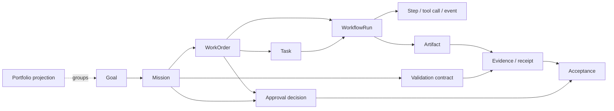

# Software Factory Enhancement Master Plan

## Executive summary

Mission Control already has a substantial software-factory backbone: workspace
scoping, Tasks, governed WorkOrders, WorkflowRuns, approvals, verification
receipts, model routing, graph execution, Loop Engineering, agent lifecycle
controls, live route-maturity metadata, and a first-class Mission schema.

The program should not rebuild those foundations. The immediate problem is that
the browser experience overstates completion:

- Mission records can be created, but the UI only captures title, objective,
  and stop condition.
- Mission cards label `DRAFT` as “In progress.”
- Mission cards and direct `/v2/mission-detail` URLs return to the portfolio,
  making the detail surface unreachable.
- `submitPlan`, `approvePlan`, assertions, handoffs, and acceptance exist in
  Convex, but complete plan authoring, rejection, revision, WorkOrder release,
  pause/resume, and corrective-work flows are not operable through the UI.
- WorkOrders are strong but dense; Tasks has 84 records in the audited
  workspace and presents a horizontally expensive board without an
  attention-first default.
- Memory has real Convex graph tables and an explorer, but the Research Lab is
  empty, the information architecture nests one Memory UI inside another, and
  production ingestion/retrieval governance is incomplete.
- Preview and demo routes are now classified, but the product still has more
  concepts than an operator should need to navigate.

The recommended sequence is therefore:

1. make Mission navigation and draft state truthful;
2. complete the governed Mission plan-to-release vertical slice;
3. make WorkOrders and Tasks exception-first and traceable;
4. connect verification and QC to release gates;
5. establish a provider-neutral memory/graph foundation;
6. add bounded automation only after the control plane is browser-proven.

This is a governed delivery program, not a mandate for a self-modifying “dark
factory.” Continuous learning remains bounded by explicit evidence, budgets,
stop conditions, independent validation, and human approval.

## Evidence basis

- Repository: `jaydubya818/MissionControl`
- Baseline commit: `478cac7c24bca636015bc9ba52d397ce403c2b59`
- Local application: `http://localhost:5199`
- Workspace: Software Factory Research Lab
  (`sn71gskbdemgf4z1trt9zdmm5h8bde69`)
- UI audit: `docs/testing/software-factory-ui-audit.md`
- Capability inventory: `docs/plans/software-factory-capability-map.md`
- Current research: `docs/research/2026-software-factory-landscape.md`
- Focused tests: 54 passed across Mission governance, WorkOrder governance and
  dispatch, route filtering, route synchronization, WorkOrder view models, and
  the Knowledge Graph panel.

## Product thesis

Mission Control is the operator control plane for converting an approved
outcome into governed execution and independently verified value.

It must answer, in order:

1. What outcome are we trying to achieve?
2. What decision or exception needs attention now?
3. What work is authorized and executing?
4. What is blocked, aging, over budget, or unsafe?
5. What evidence proves the outcome?
6. What reusable learning is safe to promote?

Agent activity, chat transcripts, and decorative telemetry are supporting
evidence. They are not the product’s center of gravity.

## Operator personas

| Persona | Primary job | Required confidence |
| --- | --- | --- |
| Product owner | Define outcomes, constraints, budgets, and acceptance | No work starts outside approved intent |
| Factory operator | Triage exceptions, approvals, capacity, and recovery | Highest-priority intervention is obvious |
| Orchestrator | Propose bounded plans and release eligible WorkOrders | Plans cannot approve themselves |
| Worker | Execute one authorized unit and produce a truthful handoff | Completion is not self-certification |
| Independent validator | Verify assertions from clean evidence | Failed, stale, and unknown remain blocking |
| Platform administrator | Govern identity, policy, environments, and cost | Scope and privileges are explicit and audited |

## Canonical domain model

Definitions:

- **Goal:** a strategic outcome or measurable direction. It does not execute.
- **Mission:** a governed, budgeted outcome with an approved plan and frozen
  validation contract.
- **WorkOrder:** the requested unit of deliverable value and repository-changing
  authorization boundary.
- **Task:** a bounded operational unit used to perform or track part of a
  WorkOrder. Legacy Tasks may exist without a WorkOrder during migration.
- **WorkflowRun:** one durable execution attempt.
- **Step/tool call/event:** low-level execution telemetry.
- **Artifact:** immutable or versioned output produced by work.
- **Evidence/receipt:** artifact-backed proof against a criterion or assertion.
- **Approval decision:** identity-bound authorization or waiver with reason and
  timestamp.
- **Acceptance:** explicit decision that governed evidence satisfies the
  requested outcome.
- **Portfolio:** a query/projection over Goals and Missions, not a second
  mutable source of truth.

Evidence, approvals, and acceptance are cross-cutting governed relationships,
not merely descendants at the end of a rigid hierarchy.

## Target operating model

1. Operator creates and edits a complete Mission draft.
2. Orchestrator proposes a versioned plan with WorkOrder blueprints and atomic
   validation assertions.
3. Operator reviews a diff and approves or rejects with a reason.
4. Approved plan materializes WorkOrders idempotently; exactly one mutating
   WorkOrder is eligible at a time in V1.
5. Worker executes in an isolated environment and records a structured handoff.
6. A distinct validator records evidence against assertions.
7. Failures create corrective work or a visible escalation; retry history is
   preserved.
8. Acceptance remains blocked until all assertions pass or have authorized,
   auditable waivers.
9. Outcome, cost, latency, failures, and learnings are measured.
10. A learning candidate may seed one bounded next cycle after approval.

## Current-state assessment

### Keep and strengthen

- WorkOrders as the requested-value object.
- Tasks as bounded operational work and a compatibility layer.
- WorkflowRuns as the execution backbone.
- Convex as the authoritative reactive data plane.
- Existing approvals, verification receipts, events, artifacts, and revision
  lineage.
- Route scope/maturity registry and preview/demo flags.
- Serial repository mutations with bounded read-only concurrency.
- Existing graph workflow contracts and Loop Engineering cycle model.

### Complete

- Mission detail routing and browser persistence.
- Full draft edit, plan authoring, plan rejection/revision, blueprint release,
  pause/resume/cancel, corrective iteration, and acceptance UI.
- Mission-to-WorkOrder-to-Task deep links and URL state.
- WorkOrder and Task attention queues, aging, relationship badges, and review
  ownership.
- Evidence/QC release gate and independent validator identity.
- Memory ingestion, provenance, lifecycle, retrieval explanation, and
  deterministic quality evaluation.

### Consolidate or defer

- Consolidate QC Dashboard/Runs/Findings/Metrics/Environments under one Quality
  surface with tabs.
- Consolidate skill lifecycle/evaluate/inventory/installations/eval runs under
  Context Registry.
- Consolidate Code Pipeline and Content Pipeline into one pipeline domain with
  typed stage definitions.
- Move Recorder, API Import, Gherkin, Flaky Steps, Hybrid Workflows, and CodeGen
  to Developer Tools/Labs until they have live contracts and browser evidence.
- Remove “Seed demo” from live WorkOrders; keep seeding in an explicit demo
  environment or admin-only fixture action.
- Defer Neo4j, agent-to-agent messaging, autonomous merging, unbounded
  self-improvement, and a separate Roadmaps product.

## Navigation recommendation

Keep six operator domains and one secondary area:

- **Overview:** Command Center
- **Strategy:** Goals, Missions
- **Delivery:** WorkOrders, Tasks, Runs & Pipelines
- **Operations:** Agent Registry, Queue, Approvals & Audit, Incidents & Cost
- **Quality:** Requirements & Evidence, Test/Eval Runs, Findings, Environments
- **Knowledge:** Context Registry, Memory, Docs
- **Settings:** Workspaces & Repositories, Identities & Access, Policies,
  Model Routing, Deployments
- **Developer Tools/Labs:** explicitly flagged experimental tools

The detailed mapping and migrations are in
`docs/plans/software-factory-information-architecture.md`.

## Capability gaps

| Gap | Severity | Why it matters |
| --- | --- | --- |
| Mission detail is unreachable | P0 | A route classified live cannot inspect a created record |
| DRAFT shown as “In progress” | P0 | Contradictory state destroys operator trust |
| Mission plan lifecycle not operable in UI | P0 | Governance exists server-side but cannot be demonstrated without direct calls |
| Plan rejection/revision incomplete | P0 | Approval cannot be a real gate without a correction path |
| No UI release from approved blueprint | P0 | Approved Mission cannot produce governed work end to end |
| No authorization/membership enforcement in core project actions | P0 | Real multi-user deployment would permit unsafe actions |
| WorkOrder/Task review and attention overload | P1 | Operators cannot efficiently manage aging work |
| Quality evidence is fragmented | P1 | Acceptance and deployment confidence are costly to inspect |
| Memory has no governed ingestion/retrieval loop | P1 | Graph UI does not yet improve delivery decisions |
| Duplicate preview pages and nested Memory navigation | P1 | Increases cognitive load and source-of-truth ambiguity |

## Prioritization model

Each recommendation receives values from 1–5:

`Score = 2U + 2G + 2R + S + E + Urgency - Complexity - MigrationRisk - OperationalBurden`

Where `U`, `G`, and `R` are user, governance, and reliability value. P0
correctness, authorization, tenant isolation, data-loss, fake-state, or
acceptance-bypass findings override the numeric score.

| Recommendation | U | G | R | S | E | Urg | C | MR | OB | Score | Priority |
| --- | -: | -: | -: | -: | -: | -: | -: | -: | -: | -: | --- |
| Fix Mission routing and state truth | 5 | 5 | 5 | 5 | 5 | 5 | 2 | 1 | 1 | 41 | P0 |
| Complete plan/approval/release vertical slice | 5 | 5 | 5 | 5 | 5 | 5 | 5 | 3 | 3 | 37 | P0 |
| Enforce project membership/role checks | 4 | 5 | 5 | 5 | 4 | 5 | 4 | 4 | 3 | 34 | P0 |
| WorkOrder/Task attention and traceability | 5 | 4 | 4 | 4 | 5 | 4 | 4 | 2 | 2 | 33 | P1 |
| Connect QC evidence to gates | 5 | 5 | 5 | 5 | 4 | 4 | 5 | 3 | 3 | 34 | P1 |
| Provider-neutral memory foundation | 4 | 4 | 4 | 5 | 4 | 3 | 5 | 3 | 4 | 27 | P1 |
| Navigation consolidation | 4 | 3 | 3 | 4 | 5 | 3 | 3 | 2 | 1 | 28 | P1 |
| Autonomous scheduling expansion | 3 | 4 | 3 | 4 | 2 | 2 | 5 | 4 | 5 | 16 | P3 |

## Dependencies

1. Mission routing correctness precedes any Mission lifecycle browser test.
2. Complete draft authoring precedes plan approval.
3. Plan approval and idempotent blueprint release precede Mission execution.
4. Mission/WorkOrder/Task link integrity precedes attention aggregation.
5. Evidence identity and freshness rules precede automated release gates.
6. A stable memory contract and deterministic fixtures precede provider
   selection.
7. Authorization and tenant/workspace enforcement precede external multi-user
   deployment.

## Migration strategy

- Add fields and indexes before requiring them.
- Keep `missionId` optional on legacy WorkOrders and Tasks.
- Backfill relationships only when provenance is deterministic; otherwise label
  records `legacy/unlinked`.
- Introduce canonical route aliases, measure usage, then remove old routes in a
  later release.
- Hide incomplete routes before deleting components.
- Keep graph access behind `GraphStoreAdapter`; migrate data with dual-read
  verification before any provider cutover.
- Feature-flag each vertical slice and retain existing views as rollback paths.
- Never rewrite historical failure, decision, or evidence records.

## Risks and controls

| Risk | Control |
| --- | --- |
| Autonomous work exceeds intent | Approved plan, explicit stop, budget and iteration caps |
| Worker self-certifies completion | Distinct validator run and identity |
| Duplicate UI submission | Server idempotency key plus disabled pending controls |
| Concurrent repository mutation | Mission guard and repository/worktree lock |
| Prompt injection through research/memory | Untrusted-source labels, tool policy, no instruction execution from retrieved content |
| Cross-workspace leakage | Project/tenant indexes plus authorization tests |
| False dashboard confidence | Provenance and evidence-confidence labels; no fixture fallback in live routes |
| Graph cost/complexity | Convex baseline, adapter, bounded indexing, measurable provider decision |
| Endless improvement loop | One next cycle, explicit operator approval, maximum iterations |

## Success metrics

- 100% of critical Mission lifecycle steps executable through the UI.
- 0 live routes with contradictory state or demo fallback.
- 100% of Mission assertions linked to evidence or an explicit unresolved state.
- 100% of approval/waiver decisions retain actor, reason, and timestamp.
- 100% of active WorkOrders show Mission, owner, age, next action, approval, and
  verification state.
- Review p75 age and blocked p75 age visible and trending down.
- 0 cross-workspace query/action findings in automated tests.
- 0 critical accessibility violations in critical journeys.
- 0 direct-database steps in the release demonstration.
- Measured accepted-outcome cost, retry rate, validation failure rate, and
  operator-intervention time.
- Memory retrieval evaluation improves a declared task metric before provider
  expansion.

## Definition of done for the implementation program

- The complete Mission lifecycle is browser-proven with refresh, back/forward,
  failure, retry, rejection, correction, resubmission, approval, validation,
  waiver, and acceptance evidence.
- Every production route has a capability owner, authoritative data source,
  scope, maturity, loading/empty/error/success states, and acceptance test.
- WorkOrder and Task attention workflows meet the UX assertions in the
  dedicated review.
- Quality gates consume real evidence and cannot be bypassed silently.
- Authorization and audit are enforced server-side.
- Memory ingestion/retrieval is scoped, cited, explainable, deterministic under
  test, and operationally measurable.
- Preview/demo features are visibly separated and do not affect production
  metrics.
- Deployment has a rollback plan, traceable release evidence, and no direct
  database manipulation.

## Recommended first three implementation PRs

Exactly three PRs should start the program. Their detailed boundaries are in
the implementation roadmap.

### PR 1 — `fix(missions): make draft navigation and state truthful`

Fix portfolio-to-detail navigation, deep links, back/forward/refresh,
workspace checks, DRAFT health copy, complete draft editing, and route tests.
Do not add planning or WorkOrder release.

### PR 2 — `feat(missions): add governed plan, assertion, approval, and release`

Add plan/blueprint/assertion authoring, comparison, submit, approve/reject with
reason, idempotent WorkOrder materialization, revision lineage, and one serial
release path. Do not automate execution or acceptance.

### PR 3 — `feat(delivery): add attention queues and relationship traceability`

Add active/attention/review saved views, age and owner signals, Mission and
WorkOrder relationship badges, URL-persistent filters, and unified detail-tab
navigation. Do not change state machines or build bulk mutation.

This order differs from the brief’s preferred Memory PR because the browser
evidence shows two P0 Mission correctness defects and an incomplete governed
vertical slice. Memory becomes the next bounded program after the control plane
can reliably authorize and verify work.

## Decisions requiring product-owner approval

1. Approve the canonical definitions and six-domain navigation.
2. Approve the first three PR sequence and defer Memory to the next program.
3. Approve hiding/removing demo seeding from live WorkOrders.
4. Choose the initial authorization model and operator/reviewer roles.
5. Approve serial mutation as the V1 default and a read-only concurrency cap of
   two.
6. Approve whether legacy unlinked Tasks remain visible by default.
7. Approve the evidence retention and waiver-expiration policy.

