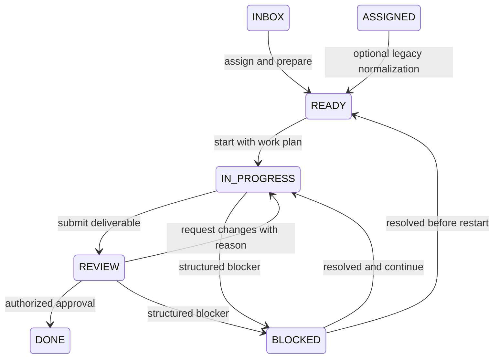

# Truthful Task workflow states

## Problem

Task assignment is currently modeled as the `ASSIGNED` lane even though assignment
is an attribute, not an execution phase. Review and blocker context is partly stored
as loose strings, so operators cannot reliably answer who owns the next action, why
work was rejected or blocked, or when the state began.

## Decision

Ship one additive compatibility slice:

- add canonical `READY` everywhere Task status is typed or validated;
- keep persisted `ASSIGNED` readable and map it into the Ready lane without rewriting
  existing records;
- make new UI assignment flow enter `READY`;
- dual-write structured review and blocker context alongside `reviewerId` and
  `blockedReason`;
- require reasons for review rejection, blocking, and unblocking;
- expose a read-only compatibility report before considering a bounded backfill;
- do not change Work Order or Mission acceptance semantics.



## Compatibility contract

- `ASSIGNED` remains in validators and state machines until a separately approved
  migration proves every record is safe to translate.
- Readers treat `ASSIGNED` as Ready for lane/count presentation but retain the raw
  status in audit history.
- Schedulers and executors accept both `READY` and `ASSIGNED` during compatibility.
- New transitions prefer `READY`; no new operator UI action emits `ASSIGNED`.
- Schema, writers, projections, generated types, and tests change atomically to avoid
  the schema drift documented in
  `docs/solutions/build-errors/missing-convex-schema-contracts-ci-20260730.md`.

## Structured state data

`tasks.review` records owner, entry/completion timestamps, result, reason, finding
count, resubmission count, and decision actor. `tasks.blocker` records type, reason,
owner, required action, blocked timestamp, optional dependency/escalation, and
resolution details. Legacy `reviewerId` and `blockedReason` remain mirrored.

## User flows and failure behavior

| Flow | Success | Failure behavior |
| --- | --- | --- |
| Inbox → Ready | assigned governed Task appears in Ready | missing assignee or Work Order fails closed |
| Legacy Assigned | appears in Ready with no mutation | raw status remains visible in audit data |
| Submit review | entered time, owner, and resubmission count persist | existing deliverable/checklist gates remain |
| Request changes | returns to In Progress with retained reason | empty/short reason is rejected |
| Block | reason, type, owner/action, and age persist | missing structured blocker is rejected |
| Unblock | returns to Ready or In Progress with resolution audit | missing resolution reason is rejected |
| Refresh | lane and structured context persist | no local-only state is authoritative |
| Dry run | reports counts and eligible legacy records | cannot mutate any Task |

## Scope and implementation checklist

- [x] Add `READY`, structured fields, and indexes to the shared and Convex contracts.
- [x] Keep Ready and legacy-compatibility paths aligned across both state machines.
- [x] Add pure structured-context validation and compatibility-report helpers.
- [x] Dual-write review/blocker state in the audited transition mutation.
- [x] Update scheduler/executor compatibility reads to accept Ready and Assigned.
- [x] Replace the Assigned lane with a Ready lane that includes legacy Assigned Tasks.
- [x] Add accessible reasoned review/block/unblock controls to Task detail.
- [x] Add focused unit, transition, projection, and browser acceptance coverage.
- [x] Publish architecture, Mission Control Docs, evidence, and rollback notes.
- [x] Run bounded typecheck, build, focused tests, and deterministic browser evidence.

## Acceptance criteria

- [x] New governed assignments enter `READY` through the UI.
- [x] Existing `ASSIGNED` records render in Ready without data mutation.
- [x] Invalid Ready transitions are prevented server-side and explained in the UI.
- [x] Review rejection requires a meaningful reason and preserves the decision.
- [x] Blocking and unblocking require structured context and preserve history.
- [x] Status counts update immediately and survive refresh.
- [x] Compatibility report is read-only, workspace-scoped, and deterministic.
- [x] Task acceptance cannot bypass the existing human/policy approval gate.
- [x] No Work Order or Mission completion behavior changes.
- [x] Browser evidence has no critical Axe violations, console errors, or relevant
  failed requests.

## Data-integrity and rollback plan

- No backfill, delete, or enum conversion runs in this PR.
- All new fields are optional; old documents remain valid.
- Existing legacy fields remain readable and are populated by new structured writes.
- Rollback removes Ready writers/UI and structured controls while leaving additive
  fields readable; no data restoration is required.
- A future migration requires a separately approved report with exact workspace
  counts, excluded records, idempotency, and post-migration verification.

## Verification commands

```bash
pnpm exec vitest run packages/state-machine/src/__tests__ convex/__tests__
pnpm run ci:typecheck
pnpm run build
git diff --check
```

Browser: create or reuse a governed Task, move Inbox → Ready → In Progress, submit
for Review, reject with reason, block with context, unblock, refresh, and confirm the
timeline and lane counts remain truthful.

## Post-deploy monitoring and validation

- Monitor `TASK_TRANSITION` failures mentioning `READY`, `review`, or `blocker`.
- Compare compatibility-report counts for raw `ASSIGNED`, canonical `READY`, missing
  structured review context, and missing structured blocker context.
- Healthy: no increase in failed transitions, legacy counts remain stable unless
  changed explicitly, and new writes populate structured plus legacy fields.
- Rollback trigger: schema rejection, unexplained lane-count change, or a review/
  approval bypass. Owner: Mission Control operator. Validation window: 24 hours.

## References

- `docs/plans/task-kanban-workorder-enhancement-plan.md`
- `docs/plans/task-workorder-target-model.md`
- `docs/architecture/task-attempt-scheduler-pr2.md`
- `docs/solutions/build-errors/missing-convex-schema-contracts-ci-20260730.md`
