# Govern Staging Release and Verification

## Overview

Extend the V1 factory golden path from a verified, human-approved pull request
through an exact GitHub merge, human-approved staging deployment, independent
provenance/smoke/health verification, and evidence-backed rollback. Keep code
release state distinct from WorkOrder, Attempt, PR, and agent-template
deployment state.

## Problem Statement

The Factory can produce and independently verify a candidate, pause for human
review, and publish a review-ready pull request. It does not yet own an
authoritative post-merge lifecycle. The existing deployment model is for agent
template versions and its release gates are shadow-only, so it cannot safely
represent a code release or prove which merged commit is running in staging.

Without this slice, `DONE`, merged, deployed, and verified can still be
conflated, and an operator must reconstruct deployment confidence outside the
WorkOrder evidence chain.

## Proposed Solution

Create a separate `factoryReleases` aggregate and immutable
`factoryReleaseEvidence` ledger. GitHub App ingestion creates `MERGED` only from
provider-reported merge evidence with exact lineage. A server-derived human
approval binds the exact staging environment and merge SHA. Delivery evidence
moves the release to `DEPLOYED`; an authorized server action independently
fetches provenance, smoke, and health endpoints and moves it to `VERIFIED` only
when every required check passes. Explicit rollback evidence moves a deployed
or verified release to `ROLLED_BACK`.

## Authoritative State Model

```mermaid
stateDiagram-v2
    [*] --> MERGED: GitHub reports merged PR and exact merge SHA
    MERGED --> MERGED: Human approves exact SHA for staging
    MERGED --> DEPLOYED: Delivery receipt matches approval and SHA
    DEPLOYED --> VERIFIED: Provenance + smoke + health pass
    DEPLOYED --> DEPLOYED: Verification fails; evidence remains visible
    DEPLOYED --> ROLLED_BACK: Approved rollback receipt
    VERIFIED --> ROLLED_BACK: Approved rollback receipt
```

Approval and evidence are records, not extra optimistic lifecycle states.

## Local Research Findings

- `convex/schema.ts` defines agent-template `deployments` with required
  `templateId` and `targetVersionId`; it is the wrong aggregate for code
  releases.
- `convex/governance/deployments.ts` explicitly makes its current release gate
  shadow-only and non-blocking.
- `convex/factory/prChecks.ts` already correlates PR evidence to WorkOrder and
  Attempt lineage and has delivery-approval authorization.
- `convex/lib/githubCiIngest.ts` reads the GitHub PR but currently drops
  `merge_commit_sha`, `merged_at`, and `merged_by`.
- `factoryDefinitionVersions.environmentId` already binds an execution
  configuration to an environment and can be required to resolve to `staging`.
- The existing permission model separates `factory.approve` from delivery write
  and verification capabilities.
- Institutional learning
  `docs/solutions/build-errors/missing-convex-schema-contracts-ci-20260730.md`
  requires new Convex consumers, tables, fields, and indexes to land atomically
  and be checked with type generation/typecheck.

External research is unnecessary for this slice because it deliberately avoids
a provider API and uses standard same-origin HTTP verification. Provider API
research belongs with the later provider adapter.

## SpecFlow Analysis

### Happy path

1. GitHub webhook refreshes a correlated PR as merged.
2. Mission Control records the GitHub merge actor/time/commit and creates one
   idempotent `MERGED` factory release.
3. An authorized human reviews the exact SHA and approves staging deployment.
4. A delivery operator records the actual provider deployment receipt and URLs.
5. Mission Control independently checks provenance, smoke, and health.
6. Exact provenance plus passing checks transitions the release to `VERIFIED`
   and restores the WorkOrder to `DONE`.

### Required unhappy paths

- Open/closed-unmerged, uncorrelated, or missing-SHA PR evidence creates no
  release.
- Non-staging or cross-workspace environment selection is rejected.
- Approval for a stale or different SHA is rejected.
- Deployment before approval, duplicate provider IDs with conflicting data, or
  deployment evidence for another SHA is rejected.
- Cross-origin endpoints, credentials in URLs, non-HTTP(S) schemes, oversized
  responses, timeout, network failure, mismatched provenance, and non-2xx
  smoke/health responses record failing evidence and do not verify.
- Refresh and webhook replay return the same release and evidence.
- Rollback before deployment or without a different restored SHA and provider
  evidence is rejected.
- A rolled-back release cannot be redeployed or re-verified; a new merge must
  create a new release.

## Implementation Phases

### Phase 1 — Persist the release aggregate and invariants

- [x] Add `factoryReleases` and `factoryReleaseEvidence` schema contracts and
      indexes atomically in `convex/schema.ts`.
- [x] Add pure transition, URL-safety, provenance, and verification helpers in
      `convex/lib/factoryRelease.ts` with focused tests.
- [x] Add authorized queries/mutations/internal mutations in
      `convex/factory/releases.ts` for merge creation, staging approval,
      deployment receipt, verification result, and rollback.

### Phase 2 — Bind trusted GitHub merge evidence

- [x] Extend `convex/lib/githubCiIngest.ts` to read GitHub merge commit, actor,
      and timestamp.
- [x] Persist merge evidence through `convex/factory/githubCi.ts` and
      idempotently ensure a release only for exact correlated lineage.
- [x] Add tests for webhook replay, missing lineage, stale head, wrong
      environment, and exact merged SHA preservation.

### Phase 3 — Independently verify staging

- [x] Add an authorized action that validates same-origin safe URLs, fetches
      provenance/smoke/health with bounded time and response size, hashes the
      evidence, and reports through an internal mutation.
- [x] Require provenance JSON to match the release merge SHA, provider
      deployment ID, and `staging` environment.
- [x] Keep failed verification in `DEPLOYED`, publish actionable failure, and
      support explicit evidence-backed rollback to `ROLLED_BACK`.

### Phase 4 — Make the golden path browser-operable

- [x] Add a factory-release operator panel to the existing Deployments route,
      above the legacy agent-template deployment board.
- [x] Show merge identity, approval authority, environment, deployment receipt,
      required evidence, blockers, exact next action, and immutable history.
- [x] Implement loading, empty, configuration-missing, approval-pending,
      deployed, verification-failed, verified, rollback, and permission/error
      states.
- [x] Keep production controls unavailable and explicitly label this surface
      staging-only.

### Phase 5 — Validate and ship

- [x] Pass focused helper, Convex, GitHub ingest, and React tests.
- [x] Pass repository typecheck, lint, unit tests, build, runtime contract, and
      applicable E2E/smoke gates.
- [x] Browser-validate refresh-safe `MERGED → DEPLOYED → VERIFIED` and
      `DEPLOYED/VERIFIED → ROLLED_BACK` journeys with deterministic evidence.
- [x] Capture screenshots and a browser evidence README.
- [x] Update the factory contracts and operational documentation.

## Acceptance Criteria

### Functional requirements

- [x] One GitHub-reported merged PR creates one release bound to the exact
      WorkOrder, Attempt, repository, PR head, and merge commit.
- [x] `MERGED`, `DEPLOYED`, `VERIFIED`, and `ROLLED_BACK` are durable, distinct,
      auditable states; none implies another.
- [x] Only an authorized human can approve the exact merge SHA for a staging
      environment.
- [x] Deployment evidence cannot be recorded before approval or for a different
      SHA/environment.
- [x] Provenance, smoke, and health checks are independently executed and
      immutable; response bodies and credentials are never stored.
- [x] Verification fails closed on missing, stale, conflicting, unsafe, timed
      out, non-2xx, or mismatched evidence.
- [x] Rollback records the restored commit and provider evidence and updates the
      WorkOrder to an actionable blocked/recovery state.
- [x] The entire path is operable from the browser and survives refresh.

### Non-functional requirements

- [x] Every read/write is workspace-authorized and every material write records
      server-derived actor identity.
- [x] Merge, approval, deployment, check, and rollback writes are idempotent and
      replay-safe.
- [x] Production environments and automatic provider deployment are rejected in
      this V1 slice.
- [x] No secrets, response bodies, or browser-authored authority labels are
      persisted.

## Risks and Mitigations

- **Human-entered deployment receipt:** independent provenance must bind the
  deployed endpoint to the exact SHA and provider deployment ID before green.
- **SSRF:** only credential-free HTTP(S), same-origin endpoints are accepted;
  localhost/private-address policy is restricted to explicit demo mode.
- **Webhook replay/races:** merge-to-release creation and evidence ingestion use
  stable idempotency identities.
- **Schema drift:** add tables, fields, indexes, generated types, and tests in
  one change and run the full type gate.
- **Scope creep:** no provider deployment API, production, canary, flag,
  trust-score, learning-ledger, or analytics work is included.

## Post-Deploy Monitoring and Validation

- Search for `factory release`, `staging verification`, `provenance mismatch`,
  `unsafe verification URL`, and denied factory actions.
- Watch counts and age of `MERGED` releases awaiting approval, `DEPLOYED`
  releases awaiting verification, verification failures, and rollbacks.
- Healthy: every verified release has exact merge, approval, deployment,
  provenance, smoke, and health evidence with one SHA.
- Rollback trigger: any verified endpoint reports a different SHA, required
  check regresses, or authorization/replay invariants fail.
- Validation window: first 24 hours and the first three staging releases.
- Owner: workspace release approver; Mission Control surfaces required action.

## References

- `docs/brainstorms/2026-08-11-governed-staging-release-verification.md`
- `docs/product/mission-control-north-star.md`
- `docs/product/mission-control-v1-product-strategy.md`
- `docs/software-factory/verification-first-workorder-contract.md`
- `docs/software-factory/durable-codex-github-pr.md`
- `convex/factory/prChecks.ts`
- `convex/governance/deployments.ts`
- PR #72 — durable human-review publication resume
