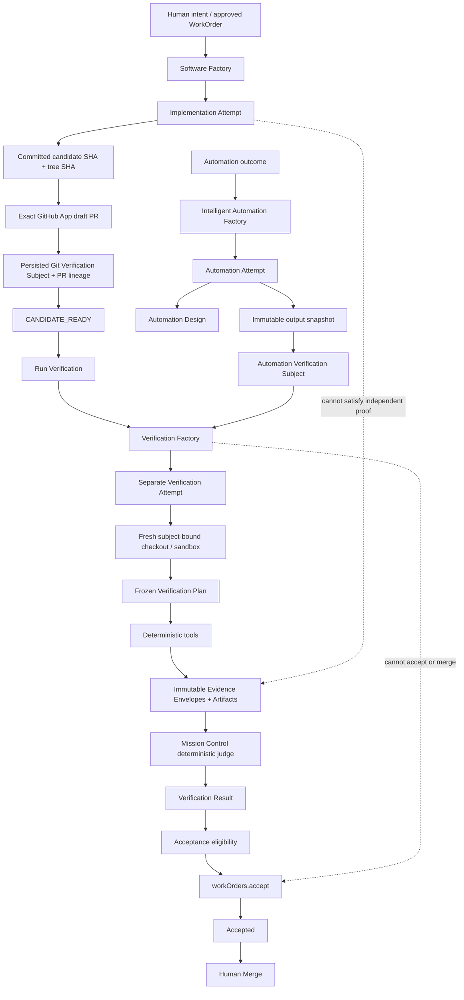

# Verification and Intelligent Automation Factory V1

## Executive decision

Extend the existing Software Factory vertically. Do not create a QA product, a
second acceptance API, a new evidence store, a verification WorkOrder
hierarchy, or another top-level navigation area.

Mission Control already has most of the required substrate:

- executable WorkOrder `verificationContract` documents;
- deterministic verifier semantics in `packages/workflow-engine`;
- `verificationRuns`, `evidenceEnvelopes`, WorkOrder-level
  `verificationReceipts`, events, and artifacts;
- candidate SHA binding and attempt-specific worktrees;
- verification content in Work Order detail and Run Inspector; and
- `workOrders.accept` as the acceptance authority.

The production gap is the trust boundary. Implementation and verification
currently run in the same `workflowRun` and builder worktree, while evidence
independence is a producer-supplied boolean. The automation verification route
also records receipts and calls `workOrders.accept`.

V1 enforces this invariant:

> An implementation Attempt may produce an immutable candidate and report that
> the candidate is ready. A separately dispatched Verification Factory Attempt
> must independently inspect that exact candidate in an isolated execution
> context, create a frozen Verification Plan, execute deterministic checks,
> persist independently attributable evidence, and produce a server-derived
> verification decision. Only then may a verification-required WorkOrder become
> eligible for explicit acceptance through `workOrders.accept`.

The builder does not grade its own homework.

## Locked lifecycle boundaries

```text
Implementation Attempt
        ↓
CANDIDATE_READY
        ↓
Verification Attempt
        ↓
VERIFIED / NOT_VERIFIED / BLOCKED / REQUIRES_HUMAN_REVIEW
        ↓
ACCEPTANCE_ELIGIBLE
        ↓
workOrders.accept
        ↓
ACCEPTED
        ↓
Human Merge
```

These facts are not synonyms:

```text
Candidate Ready != Verified
Verified != Accepted
Accepted != Merged
```

`CANDIDATE_READY` and `ACCEPTANCE_ELIGIBLE` are durable events and derived
operator-facing lifecycle facts, not new WorkOrder states. `ACCEPTED` maps to
the existing `DONE` transition performed only by `workOrders.accept`. Merged
remains GitHub state, and humans remain the merge authority.

## Repository audit

### Existing authorities to preserve

| Concern | Existing authority | Current behavior | V1 action |
| --- | --- | --- | --- |
| Human intent | Mission, approved Plan, WorkOrder | WorkOrders own outcome, requirements, criteria, constraints, risk, and approvals | Preserve one human-owned WorkOrder with multiple Attempts |
| Factory configuration | `factoryDefinitions` and immutable `factoryDefinitionVersions` in `convex/schema.ts:933` | One implicit software Factory is selected per repository; readiness hardcodes `codex/v1` | Add purpose-aware definitions, versions, defaults, selection, and readiness |
| Attempt | `workflowRuns` in `convex/schema.ts:3742` | Runs provide durable status, leases, worktrees, retry, events, artifacts, and recovery | Keep as the Attempt record; add purpose, candidate-ready, subject, and source lineage |
| Verification contract | WorkOrder `verificationContract` in `convex/schema.ts:1524` | Versioned executable checks and human-review reservation already exist | Add policy-v2 independence, required-risk, and digest semantics |
| Verification execution | `packages/workflow-engine/src/verification.ts` and `apps/orchestration-server/src/factoryVerification.ts` | Deterministic checks and safe no-shell command execution exist | Reuse them in a dedicated Verification Factory worker |
| Verification persistence | `verificationRuns`, `evidenceEnvelopes`, `verificationReceipts` in `convex/schema.ts:1751` | Completed candidate-bound results exist, but plan, source Attempt, subject, and contract identity do not | Extend these aggregates; do not add a second evidence table |
| Server recomputation | `convex/lib/verificationPersistence.ts` | Convex normalizes packets and recomputes verdict/criterion coverage | Make it the judge over frozen plan plus accepted evidence |
| Acceptance | `convex/lib/workOrderGovernance.ts:167` and `convex/workOrders.ts:3756` | A non-passing WorkOrder receipt blocks only when present; currentness is not exact | Require an exact current policy-v2 result inside `workOrders.accept` |
| Events | `runEvents` and `workOrderEvents` | Verification/check/evidence/receipt events already exist | Normalize and extend the same streams |
| Isolation | `factoryGitRuntime.ts` and `factoryPathScope.ts` | Software gets an attempt worktree, but inline verification reuses that builder worktree | Create a fresh subject-bound verification worktree/sandbox |
| Evidence inspection | `ExecutionRunInspector.tsx` and `WorkOrdersView.tsx` | Check results and receipt summaries are visible | Add subject, plan, provenance, risk, coverage, currentness, and lifecycle clarity |
| Automation | Existing `automationDefinitions`, `automationArtifacts`, evaluations, WorkOrders, executions, approvals, and UI | A bounded control plane exists; result metadata is mutable and verification auto-accepts | Add design/output artifacts and route automation through the common Verification Factory |
| Retry | WorkOrder dispatch creates a new `workflowRun` | Historical Attempts are retained | Verification retry creates a new Attempt, Verification Run, plan, and evidence set |
| GitHub | GitHub App, PR artifacts, and `workflowRuns` PR lineage | `createOrReusePullRequest` validates exact head SHA but currently opens a non-draft PR only after inline verification | Open/validate the exact draft PR before candidate readiness; verifier gets no publish/merge authority |

### Requested terminology mapped to existing primitives

| Requested term | Mission Control mapping | Decision |
| --- | --- | --- |
| Verification Policy | Versioned WorkOrder `verificationContract` | Extend the existing contract; do not add `verificationPolicy` |
| Verification Attempt | Purpose-classified `workflowRuns` row | Always separate from the source implementation/automation Attempt |
| Verification Subject | Versioned document embedded on source Attempt, Verification binding, and `verificationRuns` | Generalize Git candidate SHA and automation output snapshot without a new table |
| Verification Plan | Structured, digest-bound field on `verificationRuns` | First-class within the existing verification aggregate |
| Verification Evidence | Extended `evidenceEnvelopes` plus linked `runArtifacts` | Envelopes own proof semantics; artifacts own files, snapshots, URLs, and outputs |
| Verification Result | Completed `verificationRuns` decision | Authoritative evaluation detail |
| Acceptance projection | WorkOrder-level `verificationReceipt` | Exact current-result index used by acceptance |
| Attempt artifact | `runArtifacts` | Add Automation Design and output-snapshot types |
| `pass` / `fail` / `blocked` / `needs-human-review` | `VERIFIED` / `NOT_VERIFIED` / `BLOCKED` / `REQUIRES_HUMAN_REVIEW` | Keep established persisted verdict values |

### Confirmed current gaps

1. `FactoryAttemptWorker` commits the candidate, runs
   `executeIndependentVerification`, records the result, and publishes from the
   same Attempt.
2. Inline verification receives `repositoryRoot: claim.worktree`, so a
   different function or run label does not prove workspace isolation.
3. `evidenceEnvelopes.producer.independent` is supplied by the producer and is
   used in coverage.
4. `verificationRuns.status` is only `COMPLETED`; lifecycle failure and subject
   verdict cannot be represented independently.
5. `verificationRuns` has candidate/source revisions but no source Attempt,
   subject, contract digest, plan, plan digest, or currentness tuple.
6. Criterion coverage exists, but required requirement/risk/evidence coverage
   and separate discovered-risk reporting do not.
7. `workOrders.accept` examines the latest arbitrary execution run and latest
   WorkOrder receipt rather than resolving the exact current subject identity.
8. Factory configuration assumes one active Factory per repository and
   purpose-neutral readiness.
9. The automation verification HTTP route trusts caller-authored observed text,
   records criterion receipts, then calls `workOrders.accept`.
10. Automation execution records normalized results in evaluation/decision
    metadata but lacks an immutable output-snapshot artifact for common
    verification.
11. No Loom-specific adapter is present in this repository. Purpose/capability
    routing must preserve an external `loom/v1` Software executor without
    vendor-name exclusion.
12. Current `origin/main` is `4c5e2e3` with runtime contract v18. The browser-
    governed Factory path now requires explicit project/repository/
    FactoryVersion scope, and generic workflow execution now has durable lease,
    checkpoint, cancellation, quarantine, and stale-recovery controls.
13. Existing `factoryContinuation` is coupled to inline verification and
    post-verification publication. It cannot represent the policy-v2 sequence
    without separating candidate publication from Verification Attempt state.

### Current-main reconciliation

This plan was reconciled against `origin/main` at `4c5e2e3` on 2026-08-15.
Changes that landed during the prior review do not invalidate the architecture,
but they tighten its implementation mapping:

- Reuse the browser-governed Factory preflight and explicit
  project/repository/FactoryVersion report scope. Do not add a weaker
  verification-only dispatch or reporter path.
- Reuse `workflowRuns` lease, checkpoint, cancellation, quarantine, and stale-
  recovery semantics for Verification Attempts. A separate verifier worker is
  not exempt from the current workflow execution fence.
- Increment the then-current runtime contract version when the public Convex
  schema/functions and UI contract land atomically. The current baseline is v18;
  do not hardcode v19 if another public-contract PR lands first.
- Treat current `factoryContinuation` rows as policy-v1 history. Policy-v2
  candidate publication and Verification Attempt lifecycle need separate
  additive fields rather than overloading the legacy continuation.
- `a8fb878` only aligns the governed-context integration
  fixture with explicit Factory scope; it creates no competing verification or
  acceptance authority.
- `4c5e2e3` adds a hardened local Docker lifecycle canary, but its own contract
  prohibits repository mounts and governed Factory selection. Reuse its tested
  lifecycle/inspection/redaction/teardown patterns where useful, but do not
  count the canary as Verification Attempt independence or broaden it into a
  repository executor in this V1.

## Scope

### In scope

- Software, Verification, and Intelligent Automation Factory purposes.
- Purpose frozen on FactoryVersion and Attempt.
- WorkOrder kind for software change, verification-only outcome, and automation.
- Immutable Git and automation Verification Subjects.
- `CANDIDATE_READY` production from source Attempts.
- Separate Verification Attempt and fresh subject-bound execution context.
- Frozen Verification Plan with contract-preserving validation and digest.
- Server-derived independence and complete evidence lineage.
- Separate Verification Run lifecycle and verification verdict.
- Required requirements, required risks, required evidence, and discovered-risk
  reporting.
- Exact current-result and stale-result semantics.
- Policy-v2 guard inside `workOrders.accept`.
- Removal of automation auto-accept.
- Factory configuration, Work Order detail, Run Inspector, and existing
  Automation Run UI changes.
- First deterministic Verification Factory worker.
- Optional adversarial plan phase whose output counts only when executable
  evidence or explicit human review exists.
- Automation Design and immutable Automation Output Snapshot artifacts.
- Deterministic software and automation golden paths without live AI or GitHub.

### Out of scope

- Automatic WorkOrder acceptance or merge.
- Arbitrary production business-process execution.
- New automation autonomy levels.
- New QA/Verification application or top-level navigation.
- New evidence or acceptance table/API.
- Graph database or cross-WorkOrder evidence reuse.
- Model-opinion confidence scores.
- Full Observability/Evals or Langfuse integration.
- Novel Playwright/API test generation.
- Production-runtime verification beyond existing release surfaces.
- Security/performance-specific provider adapters.
- Learning-policy promotion from verifier output.
- Different model vendors as an independence requirement.

## Resolved architectural decision

### Candidate publication timing — draft PR first

The separate Attempt boundary requires the software candidate to survive after
the Software Attempt ends.

Decision: the Software Factory commits and pushes the candidate, opens or reuses
an exact draft PR through the GitHub App, validates the provider repository,
base/head refs, provider PR ID, draft state, commit SHA, and tree SHA, persists
that Git Verification Subject, emits `CANDIDATE_READY`, and completes. Only then
may Mission Control dispatch the Verification Factory. The verifier checks out
the persisted commit SHA in a new detached worktree or sandbox.

The required order is:

```text
commit candidate
  -> authorize publication
  -> push server-owned branch
  -> create/reuse exact open draft PR
  -> validate PR head SHA and persist PR lineage + subject atomically
  -> CANDIDATE_READY
  -> independent Verification Attempt
```

If GitHub creates the PR but the Mission Control report fails, retry must reuse
only that same open draft PR with the same provider repository, base/head refs,
provider PR ID, and exact head SHA. A mismatched, non-draft, closed, or moved PR
fails closed and cannot emit `CANDIDATE_READY`.

A passing result may establish acceptance eligibility, but does not mark the PR
ready, accept, merge, or deploy. Humans retain both explicit acceptance where
policy requires it and merge authority.

Why:

- GitHub remains the durable PR/candidate system of record.
- The Software Attempt can be terminal before verification.
- A fresh verifier can reproduce the exact SHA.
- PR-head drift is observable and invalidates eligibility.
- Operators can inspect the diff while the UI says
  `Candidate ready — verification pending`.

Tradeoff: unverified draft PRs exist. This is acceptable because draft state and
Mission Control copy explicitly say `Candidate ready — verification pending`.

Rejected alternative: retain a durable local candidate, verify it, then publish
through a separate continuation. This avoids unverified PRs but requires host
recovery, candidate retention, and publication continuation. It is not
recommended for V1.

This decision removes the final implementation blocker.

## Target architecture



### Persisted trust lineage

```text
WorkOrder revision
       ↓
Verification Contract digest
       ↓
Source implementation/automation Attempt
       ↓
Verification Subject digest
       ↓
Verification Attempt
       ↓
Verification Plan digest
       ↓
Evidence Envelopes
       ↓
Server-derived Verification Result
       ↓
WorkOrder Verification Receipt
       ↓
Acceptance Eligibility
       ↓
workOrders.accept
```

Every edge is inspectable from persisted IDs/digests in existing aggregates.
No graph database is required.

## Domain contracts

### Factory purpose

Use repository-style uppercase persisted values and human-readable UI labels:

```ts
type FactoryPurpose =
  | "SOFTWARE"
  | "VERIFICATION"
  | "INTELLIGENT_AUTOMATION";
```

- Add optional `purpose` to legacy-compatible `factoryDefinitions` for
  repository selection.
- Make immutable `factoryDefinitionVersions.purpose` authoritative.
- Include purpose in the Factory configuration digest, execution manifest, and
  `workflowRun`.
- Reject claim/report when Attempt purpose does not match FactoryVersion.
- Normalize missing historical purpose to `SOFTWARE` without rewriting history.
- Permit one active Factory per repository/purpose and resolve separate defaults
  for all three purposes.
- Readiness is purpose/capability based. Verification requires exact-subject
  read access, fresh isolation, allowed verifiers, bounded runtime, and recovery,
  but no GitHub publication or acceptance capability.
- Do not branch shared behavior on `executor === "codex"`. Codex and Loom remain
  valid Software executors when their adapters satisfy the capability contract.

### WorkOrder kind

```ts
type WorkOrderKind =
  | "SOFTWARE_CHANGE"
  | "VERIFICATION"
  | "AUTOMATION";
```

- Add optional `kind`; normalize missing historical values to
  `SOFTWARE_CHANGE`.
- Set `AUTOMATION` in existing automation WorkOrder producers.
- Reserve `VERIFICATION` for a human-requested verification-only outcome.
- The golden path does not create a child Verification WorkOrder.
- Kind is immutable across revisions; changing the outcome class requires a
  new WorkOrder.

The WorkOrder remains the human-owned requested outcome:

```text
WorkOrder
   ├── Implementation Attempt
   ├── Verification Attempt
   ├── Verification retry Attempt
   └── Acceptance
```

### Attempt lineage and candidate readiness

```ts
type AttemptPurpose = "IMPLEMENTATION" | "VERIFICATION" | "AUTOMATION";

type VerificationAttemptBinding = {
  sourceAttemptId: Id<"workflowRuns">;
  workOrderRevisionNumber: number;
  verificationContractDigest: string;
  verificationSubject: VerificationSubject;
};
```

Add to `workflowRuns`:

- `factoryPurpose`;
- `attemptPurpose`;
- optional `verificationSubject`;
- optional `candidateReadyAt`; and
- optional `verificationAttemptBinding`.

Missing historical Attempt purpose renders as legacy implementation but never
qualifies as a policy-v2 verifier. Add purpose-aware indexes so callers never
substitute the latest arbitrary run.

The source Attempt must persist its immutable subject and publication
attestation before emitting `CANDIDATE_READY`. For Git, the report transaction
also persists `workflowRuns.headSha`, provider PR ID/number/URL, and draft-at-
publication state from the GitHub App response. Candidate readiness states only
that the execution produced a reviewable immutable subject.

### Immutable Verification Subject

```ts
type VerificationSubject =
  | {
      version: 1;
      subjectId: string;
      kind: "GIT_CANDIDATE";
      workOrderId: Id<"workOrders">;
      workOrderRevisionNumber: number;
      verificationContractDigest: string;
      sourceAttemptId: Id<"workflowRuns">;
      digest: string;
      repositoryId: Id<"workspaceRepositories">;
      provider: "GITHUB";
      providerRepositoryId: string;
      candidateSha: string;
      treeSha: string;
      pullRequest: {
        providerPullRequestId: string;
        number: number;
        url: string;
        baseRef: string;
        headRef: string;
        headSha: string;
        draftAtPublication: true;
      };
    }
  | {
      version: 1;
      subjectId: string;
      kind: "AUTOMATION_RUN";
      workOrderId: Id<"workOrders">;
      workOrderRevisionNumber: number;
      verificationContractDigest: string;
      sourceAttemptId: Id<"workflowRuns">;
      digest: string;
      automationWorkflowRunId: Id<"workflowRuns">;
      automationDefinitionId: Id<"automationDefinitions">;
      automationDefinitionVersion: number;
      adapterIdentity: {
        adapterType: string;
        runtime?: string;
        executionBindingDigest: string;
        outputContractDigest: string;
      };
      outputSnapshotArtifactId: Id<"runArtifacts">;
      outputSnapshotContentHash: string;
      outputArtifactIds: Id<"runArtifacts">[];
    };
```

- Persist the union on the source Attempt, Verification Attempt binding, and
  `verificationRuns`.
- Persist stable subject ID, kind, and digest projections on evidence, receipts,
  and events.
- For Git, resolve and persist both commit SHA and tree SHA after the draft PR
  exists. Derive `digest` deterministically from subject version, WorkOrder/
  revision/contract identity, source Attempt, internal and provider repository
  identity, provider PR ID, commit SHA, and tree SHA. PR URL, refs, and draft
  attestation remain inspectable lineage; mutable PR presentation state is not
  silently substituted for commit identity.
- `createOrReusePullRequest` must accept `draft: true`, return provider PR ID and
  draft state, and reject reuse unless repository, base/head refs, open draft
  state, and exact head SHA match.
- For automation, derive `digest` from WorkOrder/revision/contract identity,
  source Attempt, Automation Definition/version, adapter/runtime execution
  binding, output-contract digest, canonical output-snapshot hash, and ordered
  output artifact hashes.
- `automationWorkflowRunId` equals `sourceAttemptId`; `workflowRuns` already is
  the Automation Attempt record, so do not add `automationRuns`.
- `subjectId` is content-addressed from kind/digest and needs no table.
- Subject creation is server-validated. Once `CANDIDATE_READY` exists, subject
  fields are immutable. A later PR-head or automation-output change creates a
  new source Attempt/subject; it never patches the old subject.
- Mutable builder files, local generated output, process state, or caches are not
  subject input unless captured as a content-addressed artifact before
  candidate readiness.

### Verification contract version 2

Do not add a competing `verificationPolicy` field:

```ts
type VerificationContractV2 = {
  schemaVersion: 2;
  enforcementMode: "OBSERVE_ONLY" | "ENFORCED";
  checks: VerificationCheckSpec[];
  requiredRisks: Array<{
    id: string;
    description: string;
    severity: "LOW" | "MEDIUM" | "HIGH" | "CRITICAL";
    source: "WORK_ORDER" | "POLICY" | "HUMAN_APPROVED";
    requiredEvidenceIds: string[];
  }>;
  requireHumanReview: boolean;
  independence: {
    required: boolean;
    minimumBoundary: "SEPARATE_ATTEMPT";
  };
};
```

- Canonicalize and hash the validated contract server-side.
- Persist `verificationContractDigest` on WorkOrder/revision, source Attempt,
  Verification Attempt, plan, evidence, result, events, and receipt.
- Required risks come only from WorkOrder intent, frozen policy, or a
  human-approved risk declaration.
- `ENFORCED` requires an exact current WorkOrder-level result.
- Hard required items are all-or-nothing; a ratio cannot average away failure.
- Contract-v1 and absent contracts retain current behavior.

### Frozen Verification Plan

```ts
type VerificationPlan = {
  planVersion: 1;
  planId: string;
  planDigest: string;
  workOrderId: string;
  workOrderRevisionNumber: number;
  verificationContractDigest: string;
  sourceAttemptId: string;
  verificationAttemptId: string;
  verificationSubject: VerificationSubject;
  generatedBy: {
    factoryDefinitionId: string;
    factoryDefinitionVersionId: string;
    attemptId: string;
    executorInvocationId: string;
  };
  requirements: VerificationRequirement[];
  requiredRisks: RequiredVerificationRisk[];
  discoveredRisks: DiscoveredVerificationRisk[];
  requiredEvidence: RequiredEvidence[];
  adversarial?: {
    enabled: boolean;
    scenarios: Array<{
      id: string;
      description: string;
      requirementIds: string[];
      riskIds: string[];
      requiredEvidenceIds: string[];
    }>;
  };
  createdAt: number;
};

type VerificationRequirement = {
  id: string;
  description: string;
  source: "WORK_ORDER" | "ACCEPTANCE_CRITERION" | "POLICY" | "MANUAL";
  sourceReference?: string;
  criticality: "REQUIRED" | "IMPORTANT" | "INFORMATIONAL";
};

type RequiredVerificationRisk = {
  id: string;
  description: string;
  severity: "LOW" | "MEDIUM" | "HIGH" | "CRITICAL";
  source: "WORK_ORDER" | "POLICY" | "HUMAN_APPROVED";
  affectedAreas: string[];
};

type DiscoveredVerificationRisk = {
  id: string;
  description: string;
  severity: "LOW" | "MEDIUM" | "HIGH" | "CRITICAL";
  affectedAreas: string[];
  discoveredBy: string;
};

type RequiredEvidence = {
  id: string;
  requirementIds: string[];
  requiredRiskIds: string[];
  description: string;
  evidenceType: "UNIT_TEST" | "INTEGRATION_TEST" | "E2E_TEST" | "API_CHECK"
    | "RUNTIME_OBSERVATION" | "SECURITY_CHECK" | "PERFORMANCE_CHECK"
    | "ARTIFACT_INSPECTION" | "MANUAL_REVIEW" | "CUSTOM";
  required: boolean;
};
```

Plan rules:

- Requirements exactly project WorkOrder requirements and acceptance criteria.
- Required risks exactly project contract risks.
- Plan validation rejects missing requirements, weakened criteria, rewritten
  intent, and criticality/risk downgrade.
- Discovered risks are separate, informational or escalation-driving in V1.
  They cannot define their own acceptance denominator.
- A discovered high/critical risk yields `REQUIRES_HUMAN_REVIEW` unless a
  governed WorkOrder revision promotes it into the contract.
- Repository-native command discovery is advisory. Execute only exact commands
  frozen in the contract and allowed by Factory policy.
- Optional adversarial scenarios may cover malformed input, authorization,
  integration failure, regression, or suspicious untested changes. Model
  statements never count as evidence.
- Mission Control computes `planDigest` from versioned canonical JSON.
- `freezeVerificationPlan` persists plan/digest while status is `PLANNED`.
- The plan is immutable once status leaves `PLANNED`; any change requires a new
  Verification Attempt and plan.

```text
WorkOrder intent
      ↓
Verification Contract
      ↓
Verification Plan
      ↓
Required Evidence
```

### Verification Run lifecycle

Use the repository's existing single-L cancellation spelling:

```ts
type VerificationRunStatus =
  | "PLANNED"
  | "RUNNING"
  | "COMPLETED"
  | "FAILED"
  | "CANCELED";
```

Create `verificationRuns` in `PLANNED` with immutable
source/subject/contract binding. Plan fields may be absent while planning.
`freezeVerificationPlan` is the only precondition for `PLANNED -> RUNNING`.

Allowed transitions:

```text
PLANNED -> RUNNING -> COMPLETED | FAILED | CANCELED
PLANNED -> FAILED | CANCELED
```

Lifecycle and verdict are distinct:

| Scenario | Run status | Verdict |
| --- | --- | --- |
| Planner/worker/infrastructure crash | `FAILED` | none |
| Operator cancellation | `CANCELED` | none |
| Evaluation completes but required environment/tool is unavailable | `COMPLETED` | `BLOCKED` |
| Required behavior is disproven | `COMPLETED` | `NOT_VERIFIED` |
| Evidence conflicts or policy reserves judgment | `COMPLETED` | `REQUIRES_HUMAN_REVIEW` |
| Required proof succeeds | `COMPLETED` | `VERIFIED` |

`FAILED` and `CANCELED` cannot create a passing WorkOrder receipt. A
Verification Attempt may complete successfully as execution while its exact
subject is `NOT_VERIFIED`.

### Server-derived independence

Producer-declared `evidenceEnvelopes.producer.independent` remains readable for
legacy diagnostics but is ignored for policy-v2 coverage and acceptance.

Required acceptance evidence is usable only when the server proves:

1. Verification Attempt ID differs from source Attempt ID.
2. Verification Attempt purpose is `VERIFICATION`.
3. Its immutable FactoryVersion purpose is `VERIFICATION`.
4. Its binding `sourceAttemptId` equals the source Attempt ID.
5. `verificationRun.workflowRunId` equals the Verification Attempt ID.
6. `verificationRun.sourceAttemptId` equals the source Attempt ID.
7. The verifier invocation and lease differ from the source invocation.
8. WorkOrder ID/revision, contract digest, subject ID/digest, Verification
   Attempt/Run, and plan ID/digest match across all stored records.
9. For Git, internal/provider repository identity, provider PR ID, candidate and
   tree SHA, checked-out `HEAD`/tree, and current persisted GitHub App PR head
   attestation match.
10. For automation, snapshot and declared artifact hashes match.
11. Evidence arrived through a Verification Factory report capability rather
    than implementation, automation-result, or learning metadata.

Convex loads authoritative rows and treats worker IDs as assertions to verify.
Same-Attempt, cross-WorkOrder, cross-subject, stale-contract, wrong-plan, and
wrong-capability packets are rejected before evidence or receipt insertion.

The same model/CLI vendor may execute both Attempts. Separate execution lineage,
not vendor diversity, is the boundary.

### Execution/workspace isolation

A separate run ID is necessary but insufficient.

For local software verification:

- extend `factoryGitRuntime.ts` with an attempt-specific verification path;
- use `git worktree add --detach <verification-path> <candidateSha>`;
- reject reuse of the builder worktree or branch worktree;
- assert repository identity, exact `HEAD`, clean initial status, and subject
  digest before plan/check/evidence execution;
- allow writes only in the isolated checkout and attempt-local temp/output
  locations;
- do not copy builder-uncommitted files, generated output, process state, or
  environment mutations;
- permit shared caches only when content-addressed and correctness-neutral;
  otherwise disable or clear them; and
- reassert subject/HEAD and clean candidate boundary after checks.

The Phase 0 local Docker canary in
`scripts/lib/local-docker-sandbox.mjs` is not a governed repository sandbox: it
intentionally permits no repository mount, model credential, or Factory
selection. It may inform lifecycle, inspection, redaction, timeout, and exact-
teardown tests, but it cannot execute this Verification Factory or satisfy the
independence policy. Do not weaken that canary to fit V1.

Remote runtimes must provide an equivalent fresh-clone/sandbox attestation.

Automation verification materializes only the immutable output snapshot and
declared artifacts in a separate process/sandbox. It never consumes live adapter
memory or mutable evaluation metadata as proof.

Record isolation mode, checkout/sandbox ID, root binding digest, subject digest,
and candidate `HEAD` where applicable in events and evidence provenance. A
boundary mismatch ends the Verification Run `FAILED` without a verdict.

### Evidence provenance and immutability

Extend `evidenceEnvelopes` rather than adding a table:

```ts
type VerificationEvidenceProvenance = {
  workOrderId: string;
  workOrderRevisionNumber: number;
  sourceAttemptId: string;
  verificationAttemptId: string;
  verificationRunId: string;
  verificationSubjectId: string;
  verificationSubjectDigest: string;
  verificationContractDigest: string;
  verificationPlanId: string;
  verificationPlanDigest: string;
  requirementIds: string[];
  requiredRiskIds: string[];
  discoveredRiskIds: string[];
  requiredEvidenceIds: string[];
  producer: {
    factoryPurpose: FactoryPurpose;
    factoryDefinitionId: string;
    factoryDefinitionVersionId: string;
    attemptId: string;
    executorInvocationId: string;
    executorAdapter?: string;
    role: string;
  };
  tool?: {
    name: string;
    version?: string;
    command?: string[];
    exitCode?: number;
    durationMs?: number;
  };
  independence: {
    policyVersion: "verification-independence/v1";
    sourceAttemptId: string;
    verificationAttemptId: string;
    passed: boolean;
    reasons: string[];
  };
};
```

- Evidence envelopes are insert-only.
- Artifact refs resolve to the Verification Attempt or immutable source artifact
  named in the plan.
- Existing legacy rows retain producer-reported independence for display but do
  not satisfy policy-v2 without authoritative lineage.
- Retry never rewrites prior evidence.
- Existing redaction, sensitivity, output-cap, and content-hash controls remain
  mandatory.

### Required and discovered coverage

```ts
type VerificationCoverage = {
  requiredRequirementCoverage: number;
  requiredEvidenceCoverage: number;
  requiredRiskCoverage: number;
  totalRequiredRequirements: number;
  coveredRequiredRequirements: number;
  totalRequiredRisks: number;
  coveredRequiredRisks: number;
  requiredEvidenceCount: number;
  passedRequiredEvidenceCount: number;
  discoveredRiskCount: number;
  discoveredRiskEvidenceCoverage: number | null;
};
```

- A required requirement is covered only when all mapped required evidence has
  passing usable evidence.
- A required risk is covered only when every contract-required mitigation/check
  has passing usable evidence and no required critical evidence failed.
- Required evidence is covered by at least one passing envelope with valid
  lineage, subject, and independence.
- Discovered-risk evidence is reported separately and never changes the
  acceptance denominator unless a later governed revision promotes the risk.
- Store counts with ratios. Zero denominators display `N/A`, not 100%.
- Do not create an AI confidence score.

### Deterministic decision

- `VERIFIED`: all required requirements, risks, evidence, and checks pass;
  Verification Run is `COMPLETED`; immutable subject binding and independence
  pass.
- `NOT_VERIFIED`: required behavior is disproven, a mandatory check fails, or a
  required critical risk materializes.
- `BLOCKED`: required tool, environment, command, data, or evidence is
  unavailable; required `SKIPPED`, `NOT_CONFIGURED`, or `ERROR` is blocking.
- `REQUIRES_HUMAN_REVIEW`: evidence is inconclusive, requirements conflict, a
  material discovered risk needs judgment, or policy reserves judgment.

The judge is a pure function of frozen plan, accepted evidence, immutable
subject binding, Attempt outcome, policy, and injected evaluation timestamp.
The server persists coverage, `independenceValid`, evidence IDs, reasons, and a
`decisionInputDigest`. Worker verdicts are never authoritative.

Verdict and acceptance currentness are separate. Result A may remain
`VERIFIED` for immutable Subject A after Subject B becomes current; only
acceptance eligibility becomes stale.

### Current result identity and concurrency

Never select “latest passing verification.”

A result is current only when this tuple exactly matches:

```text
workOrderId
+ workOrderRevisionNumber
+ verificationContractDigest
+ sourceAttemptId
+ verificationSubjectDigest
```

Plan ID/digest must also validate result/evidence lineage.

- Resolve the current source Attempt by purpose, `candidateReadyAt`, and current
  WorkOrder revision.
- When source Attempt B emits `CANDIDATE_READY`, B becomes current
  transactionally.
- Result A remains historical truth for Subject A, including when Verification A
  finishes after B is ready, but A never qualifies B.
- WorkOrder revision, contract digest, source Attempt, subject, candidate/PR
  head, expiry, or explicit invalidation stales eligibility.
- For Git, currentness uses the latest trusted GitHub App/webhook PR projection,
  not a branch name or builder report. Reuse/extend `harnessPrChecks` as the
  provider-head projection and require an exact, unexpired head attestation. A
  head-change webhook stales eligibility. If the attestation is missing or old,
  a provider-sync action refreshes evidence before the existing accept mutation;
  it cannot accept the WorkOrder itself.
- The most recently dispatched non-superseded Verification Attempt for an exact
  tuple owns currentness. If it is running, failed, or canceled, do not fall
  back to an older pass.
- Dispatch idempotency is keyed by the full tuple. Duplicate requests return the
  same active Attempt.
- Retry creates a new `workflowRun`, `verificationRun`, plan, events, and
  evidence set. Prior records remain append-only.

### Acceptance eligibility guard

For contract-v2 enforced WorkOrders, `workOrders.accept` calls one shared helper:

```ts
const verification = await getCurrentVerificationResult({
  workOrderId,
  workOrderRevisionNumber,
  verificationContractDigest,
  sourceAttemptId: currentSourceAttempt.id,
  verificationSubjectDigest: currentSourceAttempt.verificationSubject.digest,
});

assert(verification);
assert(verification.runStatus === "COMPLETED");
assert(verification.verdict === "VERIFIED");
assert(verification.independenceValid);
```

The helper rejects missing, active, failed, canceled, blocked, inconclusive,
stale, expired, invalidated, mismatched, or superseded verification. For
policy-v2 it replaces the current latest-arbitrary-run completion check with
purpose-aware source and verification checks. Policy-v1 keeps the legacy path.

For Git subjects, the helper also requires the current trusted GitHub PR
projection to name the same provider PR ID and head SHA. It never performs a
network request inside the Convex mutation. Missing/stale provider projection
is ineligible until the separate read-only GitHub App sync refreshes it; that
sync has no acceptance capability.

After this guard, preserve existing authorization, approval, active-run, parent
Task synchronization, idempotency, audit, and terminal-state checks.

The same helper derives `ACCEPTANCE_ELIGIBLE`; UI/receipt state cannot grant
authority. Verification never invokes acceptance.

For `REQUIRES_HUMAN_REVIEW`, preserve the original result. An authorized
existing `approvalDecision` may create a superseding server-derived receipt for
the exact same current tuple only when deterministic requirements passed. The
helper validates original result plus approval-bound receipt. It does not mutate
plan, evidence, or original verdict, and still does not call acceptance.

### Intelligent Automation artifacts

Add `AUTOMATION_DESIGN` and `AUTOMATION_OUTPUT_SNAPSHOT` to `runArtifactType`:

```ts
type AutomationDesign = {
  version: 1;
  objective: string;
  steps: Array<{
    id: string;
    description: string;
    classification: "DETERMINISTIC" | "AI_ASSISTED" | "AGENTIC" | "HUMAN";
    reason: string;
    tool?: string;
    approvalRequired?: boolean;
  }>;
};

type AutomationOutputSnapshot = {
  version: 1;
  sourceAttemptId: string;
  automationDefinitionId: string;
  automationDefinitionVersion: number;
  adapterType: string;
  runtime?: string;
  executionBindingDigest: string;
  outputContractDigest: string;
  normalizedStatus:
    | "PASSED"
    | "FAILED"
    | "TIMED_OUT"
    | "CANCELED"
    | "INFRASTRUCTURE_ERROR";
  outputContractVersion?: string;
  normalizedResult: unknown;
  artifactRefs: string[];
  artifactContentHashes: string[];
  startedAt: number;
  completedAt: number;
};
```

- Automation Design is inspectable implementation output, never proof.
- The bounded Automation Attempt persists a canonical, redacted, size-limited
  output snapshot and content hash.
- Snapshot identity freezes the existing Automation Definition/version,
  adapter/runtime, `workflowRuns.executionBindingDigest`, and canonical output-
  contract digest needed to reproduce interpretation of the result.
- Every snapshot artifact/ref/hash must belong to the source Attempt.
- The snapshot becomes the immutable automation Verification Subject.
- Mutable `automationEvaluations.checks`, live process state, and caller-authored
  observed text are not evidence.
- Existing bounded/read-only adapters prove the V1 lifecycle; no arbitrary
  production execution is added.

## Events and future trace contract

Reuse existing `runEvents` and `workOrderEvents`.

| Semantic event | Persisted event decision |
| --- | --- |
| Candidate publication | Reuse `PULL_REQUEST_CREATED`, then add `CANDIDATE_READY` only after subject persistence |
| Verification queued/dispatched | Add `VERIFICATION_ATTEMPT_DISPATCHED` |
| Plan frozen | Add `VERIFICATION_PLAN_CREATED` |
| Verification started | Reuse `VERIFICATION_STARTED` |
| Subject checkout/sandbox attested | Add `VERIFICATION_SUBJECT_ATTESTED` |
| Requirement passed/failed | Add `VERIFICATION_REQUIREMENT_PASSED` / `VERIFICATION_REQUIREMENT_FAILED` |
| Verification evidence created | Reuse `EVIDENCE_CREATED` with `verificationRunId` and verification metadata |
| Completed evaluation | Add `VERIFICATION_COMPLETED` |
| Lifecycle failed without verdict | Add `VERIFICATION_EXECUTION_FAILED` |
| Completed blocked decision | Add `VERIFICATION_BLOCKED` |
| Human-review decision | Add `VERIFICATION_REQUIRES_HUMAN_REVIEW` |
| WorkOrder became eligible | Add `WORK_ORDER_ACCEPTANCE_ELIGIBLE` |
| WorkOrder is or became ineligible | Add `WORK_ORDER_ACCEPTANCE_INELIGIBLE`; reuse `VERIFICATION_STALE` when currentness was lost |
| WorkOrder accepted | Reuse `WORK_ORDER_ACCEPTED` |
| Authorized acceptance rejected by verification policy | Add `WORK_ORDER_ACCEPTANCE_REJECTED` |

`VERIFICATION_EXECUTION_FAILED` means lifecycle `FAILED` with no verdict and
avoids overloading the existing WorkOrder `VERIFICATION_FAILED` receipt event.
`VERIFICATION_COMPLETED` carries the completed verdict. `VERIFICATION_BLOCKED`
and `VERIFICATION_REQUIRES_HUMAN_REVIEW` are operator-facing completed-decision
events, not lifecycle failures.

Every relevant event carries or resolves:

```text
workOrderId
workOrderRevisionNumber
sourceAttemptId
verificationAttemptId
verificationRunId
factoryDefinitionVersionId
verificationSubjectId
verificationSubjectDigest
candidateSha when applicable
verificationContractDigest
verificationPlanId
verificationPlanDigest
```

`WORK_ORDER_ACCEPTANCE_REJECTED` is recorded only after delivery authorization
succeeds and the exact-current policy-v2 helper returns an ineligible result.
Unauthorized calls still fail without writing audit detail. Because a throwing
Convex mutation rolls back writes, the policy-v2 accept path returns a
structured denial after recording this event; legacy policy-v1 failure behavior
remains unchanged. This is not a second acceptance API.

Add optional provider-neutral trace context to the existing event envelope:

```ts
type TraceContext = {
  traceId?: string;
  spanId?: string;
  parentSpanId?: string;
};
```

These are opaque correlation identifiers only. Mission Control does not assign
Langfuse, OpenTelemetry vendor, or model semantics in V1.

Remove duplicate literals encountered in touched event unions.

Stable IDs prepare future trace projection for:

```text
verification.plan.created
verification.check.started
verification.check.completed
verification.evidence.created
verification.decision.computed
```

Do not add Langfuse-specific coupling.

## User flows

### Software happy path

1. Operator opens a policy-v2 software WorkOrder.
2. Software Attempt commits, publishes an exact draft PR through the GitHub App,
   persists commit/tree/PR lineage as the immutable Git subject, and emits
   `CANDIDATE_READY`.
3. UI says `Candidate ready` and `Verification required`; acceptance is blocked.
4. Operator selects Run Verification.
5. Mission Control creates a purpose-bound Verification Attempt for the exact
   source Attempt/subject/contract.
6. Verification worker creates a fresh checkout at the exact SHA.
7. Plan is persisted and frozen before checks.
8. Deterministic checks produce evidence.
9. Convex derives independence, coverage, and `VERIFIED`.
10. UI says `Acceptance eligible`; WorkOrder remains unaccepted.
11. Authorized operator separately calls `workOrders.accept`.
12. WorkOrder becomes `DONE`; human merge remains separate.

### Automation happy path

```text
Automation WorkOrder
  -> Intelligent Automation Factory Attempt
  -> Automation Design
  -> Automation Output Snapshot
  -> Immutable Automation Verification Subject
  -> Verification Factory Attempt
  -> Frozen Plan
  -> Evidence
  -> VERIFIED
  -> Acceptance Eligible
  -> explicit workOrders.accept
```

### Failure, recovery, and concurrency

| Scenario | Required behavior |
| --- | --- |
| Required behavior fails | `COMPLETED + NOT_VERIFIED`; show failure above logs; primary next action is corrective source Attempt/new subject |
| Required environment/tool unavailable | `COMPLETED + BLOCKED`; show exact remediation; retry creates new Attempt/plan |
| Evidence conflicts or critical discovered risk appears | `COMPLETED + REQUIRES_HUMAN_REVIEW`; exact approval path only |
| Planner/worker crashes | `FAILED`, no verdict, no passing receipt; retry creates new Attempt |
| Operator cancels | `CANCELED`, no verdict; retain historical evidence |
| Candidate/PR head changes | Prior result remains historical but loses eligibility |
| WorkOrder revision or contract changes | Prior plan/result/receipt becomes stale |
| Candidate B appears while Verification A runs | A may finish for A; A cannot establish B eligibility |
| Duplicate Run Verification click | Return active Attempt for exact tuple |
| Same-Attempt evidence submission | Reject before evidence insertion |
| Wrong subject/plan packet | Reject atomically before evidence or receipt |
| Builder has uncommitted local fixture | Fresh verifier cannot see it |
| Verification Factory unready | Disable action and show readiness remediation |
| Refresh/restart | Reconstruct Attempt/plan/evidence/result from persisted state |
| Automation Design without output proof | Show design; verification remains pending |
| Automation output changes | Create new snapshot/subject; prior eligibility becomes stale |
| Legacy contract-v1 WorkOrder | Preserve current behavior |

### Authorization

- Starting verification uses existing WorkOrder dispatch authority.
- Verification service may claim/report only Verification Attempts in its
  workspace/repository scope.
- Verification capability cannot call `workOrders.accept`, publish/merge GitHub
  changes, deploy, or mark WorkOrder accepted.
- Software executor adapters, including Codex and an external Loom adapter,
  cannot call `workOrders.accept`; Loom may report completion only.
- Acceptance retains existing delivery-approval authorization.
- Evidence queries remain workspace-authorized and redact sensitive output.

## Implementation phases

### Phase 0 — Freeze decisions and contracts

Primary docs:

- `docs/decisions/verification-first-architecture-decisions.md`
- `docs/software-factory/verification-first-workorder-contract.md`

Tasks:

- [x] Adopt draft PR + exact persisted commit/tree SHA before
  `CANDIDATE_READY` and independent verification.
- [ ] Update VF-007 to require separate Attempt plus isolated subject-bound
  execution.
- [ ] Record that verifier may produce a result/eligibility but cannot accept,
  merge, deploy, or mark accepted.
- [ ] Freeze Factory purpose, WorkOrder kind, Attempt purpose, Verification
  Subject, currentness tuple, contract, plan, lifecycle, required/discovered
  risks, provenance, coverage, verdict, and event contracts.
- [ ] Freeze one canonical JSON/digest helper for contract, subject, plan, and
  decision-input identity.
- [ ] Freeze policy-v1 compatibility and policy-v2 opt-in.

Exit: no authority, identity, or publication-order decision remains for
implementation.

### Phase 1 — Additive schema and pure domain logic

Primary files:

- `convex/schema.ts`
- `convex/lib/workOrderSpecificationValidators.ts`
- `convex/lib/factoryConfiguration.ts`
- `convex/lib/workOrderGovernance.ts`
- `convex/lib/runtimeContract.ts`
- `convex/runtimeCompatibility.ts`
- `packages/workflow-engine/src/verification.ts`
- new focused subject/digest, plan, currentness, independence, and decision
  modules under `packages/workflow-engine/src/`

Tasks:

- [ ] Add optional Factory purpose, WorkOrder kind, Attempt purpose, subject,
  candidate-ready, and verification binding fields with purpose-aware indexes.
- [ ] Add policy-v2 required risks and contract digest to WorkOrder/revision
  validators.
- [ ] Extend `verificationRuns` with source Attempt, subject, contract, optional
  frozen plan, lifecycle, optional verdict, required/discovered coverage,
  independence, decision digest, and timestamps.
- [ ] Extend `evidenceEnvelopes` with the full lineage/provenance fields.
- [ ] Extend WorkOrder `verificationReceipts` with exact currentness and
  plan/result references.
- [ ] Add `AUTOMATION_DESIGN` and `AUTOMATION_OUTPUT_SNAPSHOT`.
- [ ] Normalize/add lifecycle events in existing unions and remove duplicate
  touched literals.
- [ ] Add optional provider-neutral trace context to existing events.
- [ ] Increment the then-current public runtime contract and update client/
  backend compatibility atomically; v18 is only the reconciliation baseline.
- [ ] Add shared legacy normalization without destructive backfill.
- [ ] Add pure subject/digest, plan validation, lifecycle, currentness,
  independence, coverage, and verdict tests.

Exit: schema, generated types, validators, pure tests, and compatibility tests
land atomically.

### Phase 2 — Purpose-aware Factory configuration

Primary files:

- `convex/factory/configuration.ts`
- `convex/lib/factoryConfiguration.ts`
- `convex/lib/factoryDispatch.ts`
- `apps/mission-control-ui/src/workspace/FactoryConfigurationPanel.tsx`
- `apps/mission-control-ui/src/workspace/FactoryConfigurationPanel.test.tsx`

Tasks:

- [ ] Configure purpose on definition creation and freeze it on every version.
- [ ] Enforce one non-archived definition per repository/purpose.
- [ ] Include purpose in configuration digest.
- [ ] Resolve active Factory by requested purpose.
- [ ] Make readiness purpose/capability based.
- [ ] Verification readiness proves fresh isolation, exact-subject access,
  verifiers, tools, timeout, recovery, and no write authority.
- [ ] Freeze FactoryVersion purpose on Attempt and reject mismatches.
- [ ] Render compact per-purpose Factory cards and purpose selector.
- [ ] Test Codex and a non-Codex software executor configuration.

UI states: loading, empty, purpose configured, draft, blocked with remediation,
active, archived, permission denied, save error.

Exit: separate Software, Verification, and optional Intelligent Automation
Factory versions coexist predictably.

### Phase 3 — Candidate readiness and separate Verification Attempt

Primary files:

- `convex/workOrders.ts`
- new `convex/factory/verificationAttempts.ts`
- `convex/workflowRuns.ts`
- `convex/serviceCommands.ts`
- `apps/orchestration-server/src/convexCalls.ts`
- `apps/orchestration-server/src/factoryAttemptWorker.ts`
- `apps/orchestration-server/src/factoryGitRuntime.ts`
- `apps/orchestration-server/src/factoryPathScope.ts`
- `apps/orchestration-server/src/githubAppRuntime.ts`
- `apps/orchestration-server/src/factoryHostReporter.ts`
- `convex/lib/factoryAttempt.ts`
- `convex/lib/workflowExecutionControl.ts`
- new `apps/orchestration-server/src/verificationFactoryWorker.ts`

Tasks:

- [ ] Software worker commits, receives a publication permit, pushes, and uses
  the GitHub App to create/reuse an exact open draft PR before candidate
  readiness. Validate provider repository/PR ID, refs, draft state, commit SHA,
  and tree SHA.
- [ ] Replace current `Review-ready` / `independently verified candidate` PR
  copy with `Candidate ready — verification pending`; the draft PR initially
  carries no verification receipt or pass claim.
- [ ] Persist immutable subject plus PR/snapshot lineage and emit
  `CANDIDATE_READY` atomically; source workers cannot emit required independent
  evidence.
- [ ] Make post-GitHub/pre-report retry idempotently reuse only the exact draft
  PR. Mismatch fails without candidate readiness.
- [ ] Add authorized idempotent `startVerification` validating current source
  Attempt, subject, revision, contract digest, PR head where applicable, and
  ready Verification Factory.
- [ ] Create separate Verification `workflowRun` plus linked `verificationRun`
  in `PLANNED`.
- [ ] Add separate signed claim/report capabilities for Verification Attempts.
- [ ] Require the browser-governed project/repository/FactoryVersion scope on
  every verification dispatch, claim, heartbeat, and report.
- [ ] Split inline required verification out of `FactoryAttemptWorker`.
- [ ] Implement Verification worker polling only purpose-matched Attempts.
- [ ] Create local detached worktree at exact candidate SHA or equivalent remote
  fresh sandbox; reject builder-root reuse and dirty/wrong subject.
- [ ] Materialize only immutable snapshot/artifacts for automation.
- [ ] Persist/freeze plan, enter `RUNNING`, then execute checks.
- [ ] Preserve cancellation, lease recovery, restart, and retry patterns.
- [ ] Reuse current `workflowRuns` checkpoints, execution fencing, quarantine,
  stale-recovery limits, and heartbeat directives rather than a bespoke worker
  recovery protocol.
- [ ] Keep the Phase 0 local Docker canary development-only; it cannot satisfy
  Verification Factory readiness or independence.
- [ ] Keep lifecycle outcome distinct from verdict.

Exit: source and verification have different IDs, Factory purposes, invocations,
leases, workspaces, event streams, and immutable subject bindings.

### Phase 4 — Planner, deterministic executor, evidence, and judge

Primary files:

- `packages/workflow-engine/src/verification.ts`
- new `packages/workflow-engine/src/verificationSubject.ts`
- new `packages/workflow-engine/src/verificationPlan.ts`
- new `packages/workflow-engine/src/verificationDecision.ts`
- `apps/orchestration-server/src/factoryVerification.ts`
- `convex/lib/verificationPersistence.ts`
- `convex/factory/verificationAttempts.ts`

Tasks:

- [ ] Compile plan from frozen WorkOrder requirements, criteria, required risks,
  constraints, subject, diff/output snapshot, and contract checks.
- [ ] Keep discovered risks separate.
- [ ] Inspect project scripts but execute only frozen allowed commands.
- [ ] Reuse no-shell execution, sanitized environment, timeout, output cap,
  redaction, change-budget, and negative-constraint verifiers.
- [ ] Add tool version/argv/exit code/duration provenance.
- [ ] Add optional adversarial scenarios; only executable evidence or human
  review counts.
- [ ] Validate full lineage and server-derived independence before inserts.
- [ ] Compute required coverage and discovered-risk reporting.
- [ ] Recompute verdict in Convex from normalized stored inputs.
- [ ] Persist events with full identity.
- [ ] Make packet replay idempotent and substitution fail before writes.

Exit: identical frozen plan/subject/evidence yields identical result; builder
metadata cannot satisfy independent proof.

### Phase 5 — Acceptance and automation trust boundary

Primary files:

- `convex/lib/workOrderGovernance.ts`
- `convex/workOrders.ts`
- `apps/orchestration-server/src/index.ts`
- `convex/automationExecutions.ts`
- `convex/automations.ts`
- `convex/skillAutomations.ts`
- `convex/factory/automationDispatch.ts`

Tasks:

- [ ] Implement exact `getCurrentVerificationResult`.
- [ ] Resolve Git currentness from the latest trusted, unexpired GitHub App/
  webhook PR-head projection for the exact provider PR ID; add read-only sync
  when the projection is missing/stale.
- [ ] Require current `COMPLETED + VERIFIED + independent` result inside
  `workOrders.accept` for enforced contract-v2.
- [ ] Replace latest-arbitrary-run checks with purpose-aware source/verification
  checks for v2; keep legacy behavior for v1.
- [ ] Derive/emit eligibility only; never auto-accept.
- [ ] Reuse `WORK_ORDER_ACCEPTED` and record authorized policy-v2 denial as
  `WORK_ORDER_ACCEPTANCE_REJECTED` without creating another acceptance API.
- [ ] Preserve existing approvals, authorization, active-run checks, parent
  synchronization, idempotency, and audit.
- [ ] Remove automation route call to `workOrders.accept` completely.
- [ ] Remove caller-authored observed result/independence authority.
- [ ] Route automation through common Verification Attempt or leave a narrow
  compatibility endpoint that starts one.
- [ ] Mark automation-produced WorkOrders `AUTOMATION`.
- [ ] Persist Automation Design and Output Snapshot and create common subject.
- [ ] Stale eligibility on identity/head/expiry/invalidation changes without
  rewriting history.
- [ ] Keep legacy inline-verification `factoryContinuation` readable for v1;
  policy-v2 publication and verification must not overload it.
- [ ] Add capability regression tests proving verifier cannot accept, merge, or
  mark accepted.

Exit: `VERIFIED` permits only the existing explicit acceptance path. Every
noncurrent/nonpassing state fails closed.

### Phase 6 — Work Order, Run Inspector, and Automation UI

Design reference: `docs/design.md` and `.claude/skills/design/`.

Primary files:

- `apps/mission-control-ui/src/controlPlane/WorkOrdersView.tsx`
- `apps/mission-control-ui/src/controlPlane/ExecutionRunInspector.tsx`
- `apps/mission-control-ui/src/controlPlane/runInspectorModel.ts`
- focused components under `apps/mission-control-ui/src/controlPlane/`
- `apps/mission-control-ui/src/automations/AutomationRuns.tsx`

Tasks:

- [ ] Add derived Implementation / Verification / Acceptance lifecycle strip.
- [ ] Use explicit labels: Candidate Ready, Verification Required, Verification
  Running, Verified, Verification Failed, Verification Blocked, Human Review
  Required, Acceptance Eligible, Accepted, and Merged.
- [ ] Never render a green implementation Attempt as verified/accepted.
- [ ] Tag Attempts by purpose and link verifier to exact source Attempt.
- [ ] Show Run Verification only when safe; disabled states name readiness,
  staleness, permission, active Attempt, or subject blockers.
- [ ] Show subject kind/digest, candidate SHA, contract digest, plan
  ID/version/digest, and isolation binding.
- [ ] Show requirements, required risks, discovered risks, required evidence,
  adversarial scenarios, and objective coverage.
- [ ] Show evidence claim/status/producer/tool/command/artifacts/mappings/time.
- [ ] Show result, reasons, and current/stale status above generic logs.
- [ ] Show Automation Design and output snapshot with copy that neither is a
  verdict.
- [ ] Handle loading, empty, error, success, stale, retry, and refresh states.
- [ ] Preserve keyboard/focus, dark/light contrast, text-plus-color status, and
  minimum dense target sizing.

Exit: an operator understands every authority boundary and can inspect every
lineage edge without leaving existing surfaces.

### Phase 7 — Deterministic golden paths and release proof

Primary files:

- new `scripts/verification-factory-golden-path.ts`
- new fixtures under `packages/workflow-engine/src/fixtures/`
- focused Convex/orchestration/UI tests
- new `docs/testing/evidence/verification-intelligent-automation-factory-v1/`

#### Software fixture

1. Create enforced WorkOrder: `Add authenticated /api/widgets endpoint`.
2. Dispatch Software Attempt.
3. Create a real deterministic local fixture commit and capture its full commit
   SHA and tree SHA as Candidate A.
4. Use a deterministic GitHub App stub to prove call order: push -> open draft
   PR -> validate exact provider PR/head -> persist subject ->
   `CANDIDATE_READY`. No live GitHub call is allowed.
5. Assert acceptance is blocked.
6. Dispatch separate Verification Attempt.
7. Create fresh detached checkout at Candidate A's full SHA; prove builder-only
   mutation is absent.
8. Freeze four-requirement plan before evidence.
9. Produce deterministic authenticated 200, unauthenticated 401, response
   contract, and regression evidence.
10. Server derives `VERIFIED` and eligibility.
11. Assert WorkOrder is not accepted and no merge occurred.
12. Explicitly call `workOrders.accept`; assert accepted, still unmerged.

#### Negative/currentness fixture

1. Keep Candidate A's full commit/tree SHA and Verification A `VERIFIED`.
2. Produce a second real fixture commit as Candidate B and move the stubbed PR
   head to B.
3. Assert A remains historical but stale for B.
4. Verify B with unauthorized request returning 200.
5. Assert `NOT_VERIFIED` and acceptance rejection.
6. Evaluate required environment unavailable; assert `COMPLETED + BLOCKED`.
7. Crash verifier worker; assert `FAILED` with no verdict.
8. Submit same-Attempt evidence with `independent=true`; assert rejection.
9. Attempt candidate readiness with a non-draft or mismatched PR; assert no
   subject/event is persisted.

#### Intelligent Automation fixture

WorkOrder:

```text
Process source CSV records, validate fields, and create normalized output.
```

Design:

```text
Parse CSV            deterministic
Validate schema      deterministic
Resolve ambiguity    AI-assisted
Final approval       human
```

Run bounded automation, persist immutable output snapshot/subject, verify through
the common Verification Factory, derive `VERIFIED`/eligibility, and require
explicit acceptance.

The script prints:

```text
OK: candidate completion did not imply verification.
OK: draft PR lineage existed before CANDIDATE_READY.
OK: implementation Attempt could not self-verify.
OK: verification executed in a separate Attempt.
OK: verifier was bound to the exact candidate.
OK: verification used an isolated subject-bound workspace.
OK: Verification Plan was frozen before evidence execution.
OK: evidence provenance was server-validatable.
OK: VERIFIED established acceptance eligibility only.
OK: workOrders.accept remained the sole acceptance authority.
OK: acceptance did not merge the pull request.
OK: Candidate A verification is stale for Candidate B.
OK: stale verification cannot satisfy acceptance.
OK: failed verification prevents acceptance.
OK: completed evaluation produced BLOCKED.
OK: BLOCKED did not become VERIFIED.
OK: BLOCKED did not permit acceptance.
OK: verification run failed without fabricating a verdict.
OK: Automation Design did not itself satisfy verification.
OK: automation output had an immutable Verification Subject.
OK: automation verification reused the common Verification Factory.
OK: automation verification did not auto-accept.
OK: explicit acceptance remained required.
OK: legacy WorkOrder acceptance behavior remains unchanged.
```

Browser-verify success, fail, blocked, human review, stale, loading, empty, and
refresh states on `http://localhost:5180` with EOS flags. Capture focused
dark/light screenshots, Axe A/AA including target size, keyboard behavior,
console/page errors, and failed requests.

Exit: automated suites, fixtures, browser evidence, and docs prove the invariant
without live Codex, Loom, LLM, or GitHub.

## Test plan

### Schema/domain

- Factory purpose defaults, per-purpose coexistence, immutable
  FactoryVersion/Attempt binding, digests, and readiness.
- WorkOrder kind and automation producers.
- Contract-v2 required risks/digest and contract-v1 compatibility.
- Git/automation subjects, canonical digest, source binding, and immutability.
- Plan validation/digest/immutability.
- Evidence lineage, tool provenance, and artifact validation.
- Automation Design and Output Snapshot validation.

### Lifecycle and plan

- Valid `PLANNED -> RUNNING -> COMPLETED|FAILED|CANCELED`.
- Crash/cancel has no verdict.
- Completed unavailable environment yields `BLOCKED`.
- Plan exists/frozen before `RUNNING` or evidence.
- Omission/weakening/mutation rejected.
- Retry creates new Attempt/Run/plan without mutation.

### Evaluator

- Complete evidence -> `VERIFIED`.
- Missing/skipped/unconfigured/error required evidence -> `BLOCKED`.
- Failed required evidence -> `NOT_VERIFIED`.
- Required critical risk materialized -> `NOT_VERIFIED`.
- Conflict/critical discovered risk -> `REQUIRES_HUMAN_REVIEW`.
- Discovered risk excluded from required denominator.
- Zero denominator -> counts plus UI `N/A`.
- Identical inputs/timestamp -> byte-identical result.

### Independence

- Same Attempt rejected.
- Non-Verification purpose rejected.
- Separate Verification Attempt deterministic evidence accepted.
- Same vendor, separate invocation accepted.
- Producer `independent=true` cannot bypass lineage.
- Cross-WorkOrder/revision/subject/plan/capability rejected.

### Workspace isolation

- Verifier root differs from builder root.
- Exact subject/HEAD/repository binding required.
- Builder-local mutation/generated output unavailable.
- Wrong SHA and dirty initial checkout rejected.
- Subject mutation after checks fails without verdict.
- Automation verifier sees only snapshot/artifacts.
- Phase 0 local Docker canary output is rejected as governed verification
  evidence and cannot satisfy Factory readiness.

### Candidate publication and GitHub lineage

- GitHub App request uses `draft: true` and exact server-owned head/base refs.
- Provider repository ID, PR ID, commit SHA, and tree SHA are persisted before
  `CANDIDATE_READY`.
- Non-draft, closed, wrong-base, wrong-head, or wrong-repository reuse is
  rejected.
- GitHub success followed by report failure safely reuses the exact draft PR.
- PR-head webhook/sync drift makes prior verification ineligible.

### Currentness/concurrency

- A result cannot qualify B.
- A finishing after B remains historical only.
- WorkOrder revision/contract/source/subject/PR head/expiry invalidates.
- Newer retry prevents fallback to older pass.
- Duplicate exact dispatch is idempotent.

### Acceptance

- No v2 verification -> blocked.
- Current `VERIFIED` -> eligible.
- `NOT_VERIFIED`, `BLOCKED`, human-review pending, missing, stale, failed,
  canceled, self-produced -> ineligible.
- `VERIFIED` does not auto-accept.
- Authorized ineligible policy-v2 acceptance records
  `WORK_ORDER_ACCEPTANCE_REJECTED`; accepted flow reuses
  `WORK_ORDER_ACCEPTED`.
- Verification capability cannot accept/merge/mark accepted.
- Exact human review approval may resolve current receipt without rewriting
  original result; stale approval cannot.
- Policy-v1/no-contract behavior unchanged.

### Automation

- Design alone never satisfies verification.
- Output snapshot creates generalized subject.
- Common Verification Factory evaluates automation.
- Automation verifier no longer auto-accepts.
- Existing runs remain readable.
- Definition/version, adapter/runtime, execution binding, and output-contract
  identity participate in the immutable subject digest.

### Runtime and recovery compatibility

- Verification dispatch/report requires explicit project, repository, and
  FactoryVersion scope.
- Claim/heartbeat/report obey existing workflow execution fencing.
- Checkpoint recovery resumes only the exact Verification Attempt/subject;
  missing checkpoint or stale-recovery exhaustion quarantines the run.
- Public schema/function changes require an intentional increment from the
  then-current runtime contract and preserve the stable compatibility query.

### UI

- Purpose selector/cards.
- Run Verification eligibility/disabled reasons.
- Candidate/verification/eligibility/accepted/merged distinction.
- Subject, plan, risks, evidence, coverage, decision, currentness.
- Automation Design/output snapshot.
- Loading, empty, error, stale, success, recovery.
- Keyboard/focus/contrast/target size.

### Planned commands

```bash
pnpm exec vitest run packages/workflow-engine/src/__tests__/verification.test.ts packages/workflow-engine/src/__tests__/verificationSubject.test.ts packages/workflow-engine/src/__tests__/verificationDecision.test.ts
pnpm exec vitest run convex/__tests__/verificationPersistence.test.ts convex/__tests__/verificationAttempts.test.ts convex/__tests__/workOrderGovernance.test.ts convex/__tests__/factoryConfiguration.test.ts
pnpm exec vitest run apps/orchestration-server/src/__tests__/factoryVerification.test.ts apps/orchestration-server/src/__tests__/factoryAttemptWorker.test.ts apps/orchestration-server/src/__tests__/githubAppRuntime.test.ts apps/orchestration-server/src/__tests__/factoryHostReporter.test.ts apps/orchestration-server/src/__tests__/verificationFactoryWorker.test.ts apps/orchestration-server/src/__tests__/verificationWorkspaceIsolation.test.ts apps/orchestration-server/src/__tests__/automationVerification.test.ts
pnpm --filter mission-control-ui exec vitest run src/workspace/FactoryConfigurationPanel.test.tsx src/controlPlane/ExecutionRunInspector.test.tsx src/controlPlane/WorkOrdersView.test.tsx
pnpm exec tsx scripts/verification-factory-golden-path.ts
pnpm run ci:typecheck
pnpm run lint
pnpm run test
pnpm run build
pnpm run ci:runtime-contract
pnpm run smoke:orchestration-start
pnpm run test:e2e:critical
```

Do not claim any command passed until it runs during implementation.

## Migration and backward compatibility

- Land schema, indexes, producers, consumers, generated types, and fixtures
  atomically.
- Missing Factory definition/version purpose reads as `SOFTWARE`; persist
  explicit purpose only on new version or controlled migration.
- Existing `workflowRuns` remain readable; do not invent purpose/subject lineage
  that cannot be proven.
- Missing Attempt purpose displays as legacy implementation and cannot verify
  policy-v2.
- Existing inline-verification `factoryContinuation` rows remain policy-v1
  history. Do not infer policy-v2 candidate publication, separate Attempt, or
  isolation from them.
- Existing `verificationRuns` without lifecycle/plan fields display as legacy
  completed records and cannot satisfy v2 unless every authoritative edge can be
  proven.
- Historical evidence retains producer `independent=true` for display only.
- Contract-v1/absent-contract WorkOrders retain acceptance semantics.
- Opting into v2 is a governed revision and stales incompatible receipts.
- Existing automation definitions/runs/evaluations remain readable. Stop new
  route-driven auto-accept without rewriting historical acceptance.
- Existing mutable automation evaluation metadata never becomes a v2 subject;
  only a new immutable output snapshot with definition/adapter/execution
  identity can opt in.
- Existing `harnessPrChecks` remain readable. Add provider/draft/currentness
  projections compatibly and never infer an exact provider PR ID where absent.
- Ship the public Convex contract, generated API types, runtime compatibility
  version, and UI consumer atomically. The baseline at reconciliation is v18.
- Codex remains valid for Software Factory Attempts.
- Preserve generic executor contract for Loom/external software executors.
- Add compatibility fixtures for Factory, workflow run, verification
  run/evidence, WorkOrder, and automation records.

Institutional learning:
`docs/solutions/build-errors/missing-convex-schema-contracts-ci-20260730.md`
requires every new Convex field/index and all readers/writers to land together,
then generated-type/typecheck, focused tests, and build.

## Risks and mitigations

| Risk | Consequence | Mitigation |
| --- | --- | --- |
| Parallel verification model | Conflicting truth | Extend existing runs/evidence/receipts/events only |
| Producer-controlled independence | False eligibility | Server derives lineage before insert/evaluation |
| Separate run reuses builder workspace | Mutable state masquerades as proof | Fresh subject-bound checkout/sandbox plus isolation tests |
| Latest passing selection | Candidate A qualifies B | Exact tuple plus newest-dispatched currentness |
| GitHub PR created before report persists | Orphan or duplicate candidate publication | Idempotently reuse only the exact open draft PR and persist subject/event atomically |
| Delayed PR-head projection | Moved head appears current | Require exact unexpired GitHub App/webhook attestation; missing/stale projection is ineligible |
| Git-only subject model | Automation cannot reuse trust boundary | Two-kind Verification Subject |
| Verifier defines risk denominator | Self-awarded 100% | Required risks frozen in contract; discovered risks separate |
| Plan mutates after evidence | Evidence proves another plan | Server digest/lock before `RUNNING`; retry for changes |
| Lifecycle and verdict conflated | Crash appears as product failure | Separate status and optional verdict |
| Missing evidence appears as failure | Misleading diagnosis | Missing infrastructure/proof -> `BLOCKED` |
| Automation route auto-accepts | Authority violation | Remove accept call and test capability denial |
| Legacy becomes silently stricter | Existing workflows break | Contract-v2 opt-in and normalization |
| Unapproved commands execute | Verifier expands authority | Discover for display; execute frozen allowlisted commands |
| Sensitive output stored | Credential/data leak | Existing redaction, caps, sensitivity, hashes |
| Coverage looks like confidence | Operator over-trust | Counts, `N/A`, failures, reasons; no AI score |
| Scope becomes automation platform | V1 stalls | Limit to existing bounded adapters/design/output/verification |

## Intentionally deferred

- Richer learned/LLM-assisted risk analysis.
- Production-runtime verification expansion.
- Security-specific adapters.
- Performance/soak adapters.
- Automatic novel Playwright/API test generation.
- Shadow-mode business automation.
- Arbitrary mutating automation execution.
- Cross-WorkOrder evidence reuse.
- Learning from verification failures.
- Flaky-test quarantine and mutation testing.
- Multi-repository plans.
- Verification analytics navigation.
- Full Traces/Evals subsystem.

## Acceptance criteria

### Architecture

- [ ] Factory purpose is immutable on FactoryVersion and Attempt.
- [ ] Repository supports separate per-purpose Factory defaults.
- [ ] WorkOrder remains the human-owned outcome.
- [ ] Verification uses separate Attempt and isolated subject-bound workspace.
- [ ] No QA app, evidence table, acceptance API, WorkOrder hierarchy, graph DB,
  or top-level nav is introduced.
- [ ] Codex remains compatible and external Loom is not excluded.

### Verification/evidence

- [ ] Source Attempt produces immutable Verification Subject and
  `CANDIDATE_READY`.
- [ ] Git subject includes exact draft PR lineage plus full commit/tree SHA and
  is persisted before `CANDIDATE_READY`.
- [ ] Plan is contract-preserving, digest-bound, and frozen before evidence.
- [ ] Evidence is append-only, attributable, and full-lineage inspectable.
- [ ] Independence is server-derived.
- [ ] Lifecycle and verdict are distinct.
- [ ] Required coverage is separate from discovered-risk reporting.
- [ ] Judge is deterministic from stored plan/subject/evidence.
- [ ] Retry creates new Attempt/Run/plan/evidence.

### Acceptance/automation

- [ ] Exact current v2 `VERIFIED` result is required.
- [ ] A stale result cannot qualify a newer candidate.
- [ ] Passing verification establishes eligibility only.
- [ ] Verifier cannot accept, merge, deploy, or mark accepted.
- [ ] `workOrders.accept` remains sole acceptance authority.
- [ ] Automation auto-accept is removed.
- [ ] Automation Design and Output Snapshot participate in common verification.
- [ ] Legacy behavior remains compatible.

### Operator experience

- [ ] Candidate Ready, Verification states, Acceptance Eligible, Accepted, and
  Merged are visually distinct.
- [ ] Run Inspector shows source Attempt, subject, contract/plan digests,
  isolation, requirements, required/discovered risks, evidence, coverage,
  decision, and currentness.
- [ ] Failures/blockers appear outside generic logs.
- [ ] Loading, empty, error, success, stale, and recovery states are complete and
  accessible.

### Proof

- [ ] Domain/schema/evaluator/independence/isolation/currentness/acceptance/
  automation/UI/compatibility tests pass.
- [ ] Golden script prints every required assertion.
- [ ] Browser evidence proves success and required unhappy paths after refresh.
- [ ] No fixture requires live external AI or GitHub.

## Definition of done

Mission Control proves from durable records that:

1. builder completion is not verification;
2. verification is not acceptance;
3. acceptance is not merge;
4. a source Attempt produced an immutable candidate-specific subject and
   `CANDIDATE_READY` only after exact draft PR publication without implying
   correctness;
5. a separately dispatched Verification Factory Attempt ran in an isolated
   subject-bound context with server-derived independence;
6. the plan preserved the contract and was frozen before evidence;
7. evidence was immutable, attributable, and linked through the full chain;
8. lifecycle and verdict remained distinct;
9. the server deterministically derived coverage and decision;
10. failed, blocked, incomplete, canceled, stale, mismatched, or self-produced
    proof could not qualify acceptance;
11. Candidate A verification could not qualify Candidate B;
12. passing verification established acceptance eligibility only;
13. a verifier could not call `workOrders.accept`, merge, or mark accepted;
14. humans remained merge authority;
15. Intelligent Automation used the same subject/evidence/verification boundary;
    and
16. legacy WorkOrders, Factories, runs, evidence, and automation history remained
    compatible.

```text
Builder
   ↓ produces
Immutable Verification Subject
   ↓ independently inspected by
Verification Factory
   ↓ produces
Immutable Evidence
   ↓ deterministically evaluated by
Mission Control
   ↓ establishes
Acceptance Eligibility
   ↓ explicitly exercised through
workOrders.accept
```

## Research decision

External research is intentionally skipped. This is an internal authority,
lineage, schema, isolation, and UI integration problem with a strong implemented
baseline. Repository source, product doctrine, the recent governed-staging
verification brainstorm, prior plans, and institutional Convex learning are
more authoritative than an external framework. Revisit external research only
when selecting a new sandbox, security, performance, automation, or tracing
provider.
