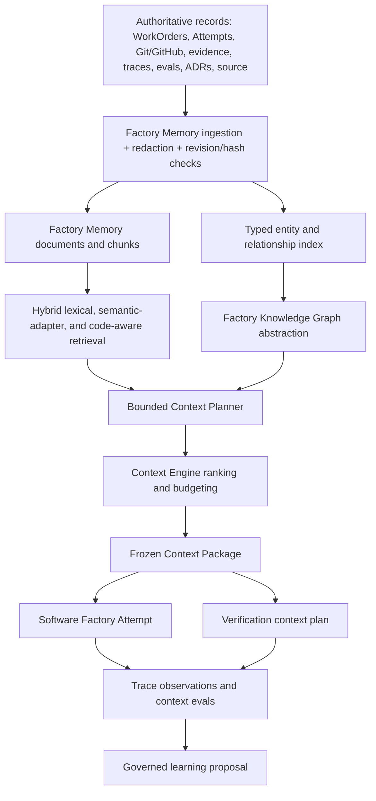
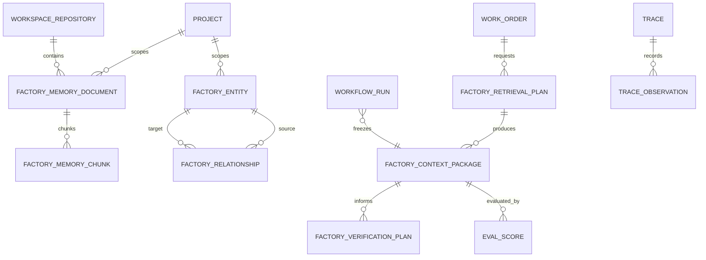

# Factory Memory and Context Intelligence

## Overview

Build one governed Factory Knowledge System that gives Software,
Verification, and Intelligent Automation Attempts the smallest authoritative,
historically useful context package needed for the current WorkOrder. The
system spans hybrid retrieval, typed relationships, bounded agentic retrieval,
a provider-neutral knowledge graph, and frozen per-Attempt context.

This is an intelligence projection over Mission Control, Git/GitHub, traces,
evals, evidence, incidents, architecture documents, and repository source. It
does not replace those systems and it does not authorize execution,
verification, acceptance, merge, deployment, or FactoryVersion promotion.

## Problem

Mission Control already stores operational lineage, Registry context packages,
traces/evals schemas, a legacy semantic chunk table, and an imported Agentic-KB
graph. Those capabilities are fragmented and cannot currently answer, with
reproducible provenance, why an executor received a particular code fragment,
ADR, incident, test, historical WorkOrder, or graph path.

The missing product invariant is:

> Give each autonomous workflow the smallest, highest-quality, authorized,
> provenance-backed context that materially improves execution and independent
> verification.

## Chosen Approach

Extend the existing Convex domain additively and put retrieval/graph/context
algorithms in a provider-neutral TypeScript package with an in-memory adapter
for deterministic tests. Convex remains the durable operational/index store.
The existing `knowledgeGraph*` tables remain the imported Agentic-KB/Obsidian
overlay; new typed Factory graph records carry entity type, derivation,
authority, revision, and source provenance required by execution workflows.

### Why this approach

- It preserves Mission Control as the governance system of record.
- It reuses WorkOrders, `workflowRuns` as Attempts, FactoryDefinitionVersions,
  traces/evals, verification records, Registry packages, repositories, and the
  existing Memory route.
- It allows all five phases to be proven offline without live model calls.
- It keeps vector and graph vendors replaceable without making them runtime
  dependencies for V1.
- It gives security filtering, budgeting, ranking, and traversal deterministic
  enforcement points before context reaches a model or executor.

### Alternatives rejected

1. **External vector and graph services now.** Better specialized query
   capabilities, but adds credentials, tenancy, backup, failure, cost, and
   dual-consistency problems before Mission Control has a measured baseline.
2. **Extend the imported Agentic-KB graph in place.** Smaller schema change, but
   its free-form edge and document-oriented node model cannot safely represent
   authoritative operational lineage or repository authorization.
3. **Generic chat over the existing `knowledgeChunks`.** Fastest demo, but does
   not produce frozen Attempt context, typed relationships, verification risk
   context, observable retrieval plans, or measurable context effectiveness.

## Architecture

### Component boundaries

| Component            | Responsibility                                                          | Does not own                    |
| -------------------- | ----------------------------------------------------------------------- | ------------------------------- |
| Factory Memory       | Source references, chunks, revisions, hashes, freshness, provenance     | Source truth or authorization   |
| Hybrid retriever     | Lexical, deterministic semantic, code-aware candidates, filters, dedupe | Unbounded prompt assembly       |
| Relationship index   | Validated directional edges with derivation and provenance              | Transactional truth             |
| Knowledge Graph      | Bounded neighbors, traversal, path and subgraph operations              | Acceptance or policy decisions  |
| Context Planner      | Deterministic retrieval strategy selection and bounded refinement       | Tool or execution authority     |
| Context Engine       | Ranking, diversity, budget, snapshots and diffs                         | WorkOrder acceptance            |
| Verification context | Evidence-backed recommended checks and historical risks                 | Objective verification evidence |
| Learning integration | Creates reviewable improvement candidates                               | Automatic production mutation   |

## Domain Model

### Additive persistence

- `factoryMemoryDocuments`: one revision-aware indexed projection per source.
- `factoryMemoryChunks`: bounded chunks with path/range/revision provenance and
  search text.
- `factoryEntities`: stable typed identities and deterministic aliases.
- `factoryRelationships`: validated directional edges with derivation,
  confidence, and source provenance.
- `factoryRetrievalPlans`: selected strategies, reasons, budget, iteration cap,
  and sufficiency requirements.
- `factoryContextPackages`: immutable selected items, revisions, paths, token
  estimate, package digest, profile, and effectiveness metadata.
- `factoryVerificationPlans`: advisory check plans whose influences link to the
  frozen Context Package; they never count as verification evidence.
- `workflowRuns.factoryContextPackageId`: frozen Attempt snapshot reference.

## Retrieval Design

### Candidate generation

- **Lexical:** Convex full-text search over normalized chunk search text, with
  workspace as the mandatory filter and repository/source filters applied
  before ranking.
- **Semantic:** `SemanticIndex` adapter. The deterministic V1 implementation
  uses normalized concepts and stable hashed features so CI and the golden path
  require no external model. A future embedding implementation runs in a
  Convex action because vector search is action-only.
- **Code-aware:** path, language, symbol, import/reference, exact-text and regex
  features produced during ingestion for dominant TypeScript/JavaScript files.
- **Relationship/graph:** typed bounded traversal with a default maximum depth
  of three and fan-out cap per node.

### Ranking and budget

Candidates are scored by authority, task relevance, retrieval score,
relationship proximity, historical usefulness, recency where meaningful,
source diversity, and estimated token cost. Exact duplicate source revisions
and overlapping chunks are removed before budgeting. Required items are placed
first; optional items are admitted only while `maxItems` and
`maxEstimatedTokens` remain satisfied.

### Explanation contract

Every selected item carries source type/id, path, revision, derivation,
retrieval method, selection reason, and relationship path when applicable.
Rejected candidates are summarized in the retrieval trace with redacted reason
and score, allowing the operator to answer “why did this Attempt receive this?”

## Five-Phase Vertical Slice

### Phase 1 — Hybrid Factory RAG

- Ingest authoritative source projections with content hashes, revision-aware
  upsert/invalidation, redaction, chunk provenance, repository scope, and
  WorkOrder/Attempt lineage.
- Search lexically, semantically through the adapter, and with code features.
- Expose Memory search with repository/source/WorkOrder/FactoryVersion/Attempt
  and time filters, provenance, empty/error/loading states, and source links.

### Phase 2 — Typed Factory Relationships

- Define closed entity and relation vocabularies.
- Extract deterministic repository/file/symbol/import and WorkOrder/Attempt/
  Trace/Eval/Evidence relationships where structured data is available.
- Require confidence and provenance on inferred edges.
- Support incoming/outgoing neighbors, bounded traversal, and path lookup.

### Phase 3 — Agentic Retrieval

- Deterministically select no-retrieval, code, hybrid, relationship/graph,
  Git-history, trace-history, verification-history, incident-history, or
  architecture strategies from WorkOrder intent and requirements.
- Run at most three retrieval iterations with deterministic sufficiency checks.
- Record `context.plan`, search/traversal, rejection, rank, sufficiency and
  assembly observations in the existing trace model.

### Phase 4 — Factory Knowledge Graph

- Implement `FactoryKnowledgeGraph` and `FactoryMemoryStore` interfaces with an
  in-memory reference implementation and Convex-backed API boundary.
- Resolve canonical entities with deterministic keys plus supplemental aliases.
- Expose a relationship-centric Graph explorer with entity lookup, relation and
  derivation filters, one-level expansion, path inspection, provenance, and
  related WorkOrders/incidents/tests/traces/evals.

### Phase 5 — Autonomous Context Engineering

- Assemble purpose-specific Software, Verification, and Automation profiles.
- Freeze packages on Attempts; persist source revisions, plan, graph paths,
  budget, digest and selected items.
- Diff retry/FactoryVersion packages for additions, removals, revision changes,
  and path changes.
- Generate advisory Verification plans from acceptance criteria, changed
  components, applicable ADRs/tests, incidents, past failures, and regression
  cases while preserving objective evidence requirements.
- Compute deterministic relevance, efficiency, relationship accuracy,
  retrieval success, verification-context quality, and budget-compliance evals.
- Feed improvements to the existing meta-loop suggestion inbox only as
  proposals.

## User and System Flows

### Operator search and inspection

1. Operator opens Intelligence → Memory.
2. Workspace authorization is resolved server-side.
3. Search/filters execute only within that scope.
4. Results show authority, source, revision, path/range, method, and reason.
5. Operator opens the source entity or related graph neighborhood.

### Attempt preparation

1. A governed WorkOrder and FactoryVersion are selected.
2. Context Planner produces a bounded plan.
3. Retrieval candidates are authorization-filtered before ranking.
4. Sufficiency is evaluated and the query may refine within the iteration cap.
5. Context Engine freezes the package and links it to the Attempt.
6. Executor receives the frozen package; later index changes cannot alter it.

### Verification preparation

1. Verification receives WorkOrder criteria plus the frozen or independently
   retrieved risk context.
2. Graph/history identify dependencies, ADRs, incidents, tests, past failures,
   and regression cases.
3. A Verification plan records which context influenced each check.
4. Verification still produces independent evidence envelopes and the existing
   acceptance authority remains unchanged.

### Failure and recovery

- Disabled phase: fall back to the previous execution/verification behavior.
- No relevant context: produce an empty, sufficient-or-degraded package with an
  explicit reason; never pad with unrelated content.
- Budget exhausted: keep required items, reject lower-ranked items, record the
  budget decision, and block only when a required source class is absent.
- Stale/revised source: invalidate only affected documents/chunks/edges; frozen
  historical packages remain reproducible.
- Unauthorized source or repository: exclude before candidate generation and
  emit an authorization-safe observation without revealing hidden metadata.
- Ingestion failure: preserve the last validated index and expose a degraded
  freshness state with recovery guidance.

## Security and Isolation

- Require `factory.read` for all Memory/Graph/Context reads and
  `factory.improve` for ingestion, relationship, package, eval, and learning
  writes.
- Scope every stored and queried record by workspace; repository is an
  additional restriction, never a replacement.
- Redact credential-shaped strings and secret-bearing keys before persistence,
  again before observations, and before executor delivery.
- Treat indexed source content as untrusted data, clearly separated from system
  instructions. It cannot authorize tools, actions, acceptance, or policy.
- Enforce bounded content length, chunks, search results, traversal depth,
  fan-out, iterations, and context tokens.
- Never reveal that a hidden source exists through counts, filters, graph
  neighbors, errors, or timing-oriented explanation fields.

## Product UI

Keep Memory in the existing Knowledge navigation domain. The EOS Memory surface
becomes a calm operator console with internal tabs:

- **Overview:** index freshness, coverage, retrieval quality, context budget,
  exceptions and required action.
- **Memory:** hybrid search, source filters, result provenance and source links.
- **Graph:** relationship inspector, typed expansion, paths and evidence.
- **Context:** recent frozen packages, purpose, selected-source summary, budget,
  retrieval strategies and diffs.

The Execution Run Inspector adds a Context section for the exact Attempt. All
surfaces include loading, empty, degraded, error, permission, success and
recovery states and use existing semantic tokens/components.

## Deterministic Golden Path

Seed `shop-service` with `auth-middleware`, `orders-api`, `billing-client`,
ADR-004, INC-12, two tests, failed WO-42, and the
`unauthorized-orders-access` regression case. Build a WorkOrder to add token
refresh support, then assert:

- hybrid retrieval returns code, ADR, incident, tests and prior WorkOrder;
- typed authoritative/deterministic relationships are valid and directional;
- planner chooses code, architecture, graph, incident and verification history;
- bounded graph traversal resolves dependency/risk/test paths;
- Context Engine creates a budget-compliant frozen package;
- Verification plan adds token refresh, expiry, unauthenticated access,
  downstream smoke, and incident reproduction checks with influences;
- retrieval observations and context evals persist;
- inferred relationships are never presented as authoritative.

A second fixture compares a small relevant package with a large noisy package
and measures cost, unused context and budget compliance without hardcoding that
smaller always wins.

## Implementation Tasks

- [ ] Add provider-neutral Factory Memory domain package, adapters, algorithms,
      and unit tests.
- [ ] Add additive Convex schema, feature flags, scoped APIs, ingestion,
      retrieval, graph, planner/context, verification and observability writes.
- [ ] Freeze Context Package references on Attempts without changing acceptance.
- [ ] Add EOS Factory Memory Overview, Memory, Graph and Context operator views.
- [ ] Add Run Inspector Context Package integration and context diff display.
- [ ] Add deterministic five-phase and noisy-context fixtures.
- [ ] Add security, isolation, compatibility, observability and eval tests.
- [ ] Update architecture/operator documentation and expose it in Docs.
- [ ] Run focused tests, typecheck, lint, browser verification and golden path.

## Quality Gates

- [ ] All five phases have a working deterministic vertical slice.
- [ ] Phase flags can independently disable later capabilities.
- [ ] Search and graph queries enforce workspace/repository scope before model
      or executor exposure.
- [ ] No secret fixture value survives ingestion or observation sanitization.
- [ ] Bounded retrieval/traversal/iteration/token limits are tested.
- [ ] Context Package digest and revisions are stable and immutable after freeze.
- [ ] Verification context cannot satisfy acceptance or replace evidence.
- [ ] Legacy Codex/Loom/WorkOrder flows behave unchanged when flags are disabled.
- [ ] Browser verification passes in dark/light themes with console/network and
      keyboard checks at `http://localhost:5199`.
- [ ] No commit or push is created.

## Risks and Mitigations

- **Schema blast radius:** additive optional fields/tables; generated contracts
  and typecheck run immediately after schema changes.
- **Search scalability:** use project-filtered full-text/index queries and hard
  candidate caps; do not scan unbounded workspace history.
- **Graph explosion:** depth, fan-out and node-count caps with cycle detection.
- **False authority:** derivation is mandatory and UI labels inferred edges.
- **Context bloat:** dedupe, diversity constraints, token budgets and unused
  context evals.
- **Secret leakage:** redaction at ingestion, tracing and delivery boundaries
  plus adversarial fixtures.
- **Observability coupling:** retrieval observations are explanatory only and
  never acceptance evidence.
- **Concurrent branch work:** preserve existing uncommitted model-routing,
  observability and sandbox changes; integrate additively.

## Post-Deploy Monitoring and Validation

- Logs/search terms: `FACTORY_MEMORY_*`, `context.plan`, `memory.search`,
  `graph.traversal`, `context.assemble`, `context.sufficiency`, redaction and
  authorization failures.
- Metrics: ingestion failures/staleness, p50/p95 search and two-hop traversal,
  selected/rejected items, budget violations, zero-result rate, cross-scope
  denial count, context tokens, unused context ratio, verification pass/retry/
  intervention correlations with sample size.
- Healthy: zero cross-workspace results, 100% selected-item provenance,
  deterministic golden path passes, search/traversal within declared caps.
- Rollback trigger: any isolation leak, secret persistence, acceptance coupling,
  or material retrieval latency regression. Disable phase flags and keep the
  previous execution path while preserving indexed records for audit.
- Validation window/owner: first seven days after enablement; Factory operator
  and product owner review daily exceptions and the first 25 real packages.

## Internal References

- `docs/plans/memory-graphrag-architecture.md`
- `docs/product/mission-control-north-star.md`
- `docs/product/mission-control-v1-product-strategy.md`
- `docs/design.md`
- `convex/schema.ts`
- `convex/knowledgeGraph.ts`
- `convex/lib/observability.ts`
- `convex/context/packages.ts`
- `convex/workflowRuns.ts`
- `apps/mission-control-ui/src/eos/views/MemoryPillarsView.tsx`
- `apps/mission-control-ui/src/controlPlane/ExecutionRunInspector.tsx`

## External References

- Convex full-text search: https://docs.convex.dev/search/text-search
- Convex vector search/actions: https://docs.convex.dev/search/vector-search
- Convex index/query guidance: https://docs.convex.dev/database/reading-data/indexes/
- OWASP prompt injection: https://genai.owasp.org/llmrisk/llm01-prompt-injection/
- OWASP secrets management: https://cheatsheetseries.owasp.org/cheatsheets/Secrets_Management_Cheat_Sheet.html
