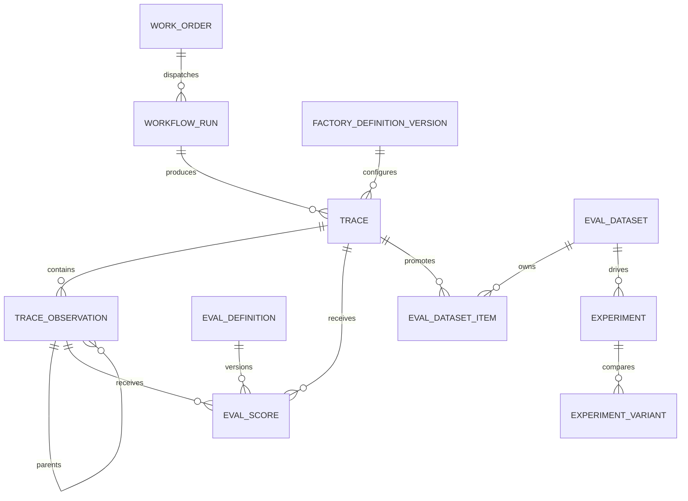

# Observability, Traces & Evals V1

> Status reconciled on 2026-08-25. The diagnostic system is implemented and
> browser-qualified. The planning checklist below is retained as historical
> implementation context; current maturity is tracked in the
> [capability ledger](../product/software-factory-capability-maturity.md).

## Problem

Mission Control currently records governed run events and verification
evidence, but it cannot explain nested agent/model/tool execution, attach
versioned quality evals to steps, or compare execution quality and economics
across Attempts. The existing EOS Trace Inspector is a typed demo projection,
not a workspace-scoped system of record.

## Architecture

## Implementation Phases

### 1. Canonical data and contracts

- Add trace, observation, eval definition, eval score, dataset, dataset item,
  experiment, and variant tables with workspace and lineage indexes.
- Add shared validators and pure redaction, evaluator, analytics, and
  experiment helpers.
- Add authorized workspace queries/mutations and internal executor mutations.

### 2. Attempt instrumentation

- Create the primary trace at governed WorkOrder dispatch.
- Ensure older/live Attempts can lazily acquire one trace idempotently.
- Map governed Codex Factory report events into observations.
- Record independent verification as a child observation while preserving the
  authoritative `verificationRuns` and `evidenceEnvelopes` records.
- Close trace status and aggregate token/cost/duration on terminal reports.

### 3. Operator experience

- Replace demo-only trace content in Execution Inspector with live scoped data.
- Add summary KPIs, trace filtering, trace selection, tree/timeline views,
  observation inspection, eval analytics, and dataset promotion.
- Provide loading, empty, error, and success states.

### 4. Golden path and validation

- Add a deterministic Codex/Loom fixture covering nested observations,
  verification, deterministic evals, fixture LLM judge, datasets, experiments,
  and multi-trace analytics.
- Add focused domain, authorization, redaction, and UI model tests.
- Run generated Convex contracts, typecheck, focused tests, and browser
  verification at `http://localhost:5199`.

## Acceptance Criteria

- [ ] Every newly governed Factory Attempt has a primary trace.
- [ ] Trace observations preserve arbitrary parent/child hierarchy.
- [ ] Codex reporting captures agent/model/tool/test/verification boundaries.
- [ ] The instrumentation API accepts Loom observations and the fixture proves
      that path while no live Loom adapter exists.
- [ ] Inputs, outputs, metadata, tool arguments, and errors are safely redacted.
- [ ] Trace Inspector uses real workspace data and supports status, purpose,
      executor, model, and text filtering.
- [ ] Operators can inspect tree, timeline, usage, errors, evidence links, and
      eval scores for an observation.
- [ ] Eval definitions and scores are separately versioned and immutable.
- [ ] A deterministic evaluator and offline fixture judge create scores.
- [ ] Trace analytics include attempts, success rate, duration, cost, tokens,
      human intervention, and eval aggregates with sample counts.
- [ ] An operator can promote a sanitized trace into a versioned dataset.
- [ ] A deterministic experiment compares at least two variants.
- [ ] Verification evidence never reads eval scores as acceptance proof.
- [ ] Focused tests and browser verification pass.

## Risks and Mitigations

- **Write amplification:** cap report packet sizes and observation payload depth,
  length, and collection cardinality.
- **Secret exposure:** recursively redact keys and credential-shaped strings at
  the persistence boundary; do not store raw process environment data.
- **Schema drift:** land schema, queries, indexes, and generated types together,
  then run repository typecheck.
- **Navigation sprawl:** keep V1 in the existing Execution Inspector.
- **False quality confidence:** show evaluator type/version, score reason, and
  sample size; never promote evals into verification evidence.

## Deferred Work

External exporters, trace sessions, natural-language analysis, semantic
clustering, trace comparison, online sampling, evaluator calibration, and
automatic promotion remain separate follow-up work.
