# Software Factory Production Convergence

## Executive decision

Mission Control should adopt the supplied thesis, but it should **not** start a
new broad architecture program. The repository already implements most of the
hard control-plane foundations described in the proposal: governed intent,
versioned Factory configuration, a generic harness contract, model and execution
routing, durable Attempts and recovery, independent verification, traces/evals,
proposal-only learning, policy, approvals, exact publication lineage, and a
qualified human-governed pilot.

The next step is convergence and production proof. The material gaps are:

1. one current capability/maturity source of truth across documentation;
2. a real product-repository pilot with complete outcome and cost telemetry;
3. a canonical incident lifecycle and executable agentic-security drills;
4. a first-class governed Tools/MCP authority boundary;
5. role-aware builder intent without separate product silos; and
6. outcome, adoption, and routing feedback tied to accepted software rather
   than agent activity.

Until those gaps close, Mission Control should describe itself as a strong,
human-governed production-pilot architecture—not a fleet-scale autonomous
factory.

## The factory in one line

Use two complementary lines instead of forcing configuration concepts into the
authoritative delivery lifecycle.

**Plain-language factory loop**

`Intent → Plan → Configure agents, harnesses, skills, and tools → Execute → Verify and evaluate → Deliver → Observe → Improve`

**Authoritative governed lifecycle**

`Mission → approved Plan → WorkOrder → Task → Attempt → candidate → independent evidence → pull request → human decision → release → observed outcome → governed learning`

“Define Agent” and “Apply Skills” are important configuration and execution
inputs, but they are not lifecycle states. Treating them as states would create
a second hierarchy and weaken lineage.

## Problem this solves

Mission Control has moved faster than parts of its documentation and operating
model. That creates three risks:

- operators cannot tell whether a capability is Live, qualified, Preview,
  experimental, or only planned;
- broad new feature work can duplicate systems that already exist; and
- impressive deterministic qualification can be mistaken for production proof
  on real repositories, real provider economics, and real organizational use.

This plan turns the existing architecture into a trustworthy, measurable,
adoptable production system while preserving the narrow V1 product promise.

## Current capability assessment

Status vocabulary:

- **Qualified:** implemented and backed by deterministic system/browser evidence.
- **Implemented, gated:** real implementation exists but production autonomy is
  deliberately disabled or the operating sample is insufficient.
- **Partial:** useful implementation exists but a material authority, lifecycle,
  telemetry, or production proof gap remains.
- **Missing:** the proposed capability has no canonical production contract.

| Proposed capability | Mission Control status | Repository evidence | Recommendation |
| --- | --- | --- | --- |
| Builder intent as the interface | **Qualified for developer/operator; partial for other builders** | Mission Spec, Plan, WorkOrder, and Quality Contract path in `README.md` and `convex/schema.ts` | Keep one Mission intent model; add role-aware contributions after the production pilot |
| Agent definitions | **Qualified** | Agent Template → Version → Instance → Identity records and Factory agent bindings | Reuse; do not create a second `AgentRun` or agent lifecycle |
| Skills and context | **Qualified, advisory** | Context Registry, Agent Configuration Registry, Context Packages, Factory Memory | Keep provenance and Attempt binding; retrieved content never gains authority |
| Harness-owned reliability | **Qualified architecture** | Generic Harness Contract, `codex/v1`, worker admission, leases, fencing, cleanup, recovery | Keep one execution-only adapter lifecycle; qualify each new harness independently |
| Model/harness/backend independence | **Implemented, gated** | Exact Factory Version tuple routing with Advisory, Pinned, and Guarded Auto modes | Keep Guarded Auto off until production evidence and cost coverage meet policy |
| Capability/quality/cost/latency/security routing | **Implemented, gated** | Deterministic eligibility and score snapshots in execution-routing V1 | Add actual cost/outcome inputs; never let scoring bypass hard eligibility |
| Durable state, retries, checkpointing, and idempotency | **Qualified** | WorkflowRuns, leases, fenced writes, recovery evidence, replay-aware commands | Continue failure injection and real restart proof |
| Permission boundaries, budgets, stop controls, and kill switches | **Qualified with remaining migration work** | Policy envelopes, readiness, routing kill switch, Attempt budgets, operator controls | Close remaining human/service and cross-company proof before wider tenancy |
| Independent verification | **Qualified** | Immutable candidate, frozen Verification Subject/Plan, separate verifier Attempt, fail-closed Quality Gate | Preserve strict separation from evals, harness completion, and human acceptance |
| Observability, traces, and evals | **Qualified diagnostic system** | Traces, observations, eval definitions/scores, datasets, experiments, Trace Inspector | Update stale plan status; add versioned OpenTelemetry export adapter only when needed |
| Feedback and governed learning | **Qualified advisory V1** | Signals → clusters → candidates → experiments → submitted Plan | Add real production/incident outcome signals; keep promotion human-governed |
| Sandboxed execution | **Implemented, gated** | Qualified immutable image and 3/3 live exe.dev cohort; production-pilot eligible profile | Keep sensitive production work blocked until the egress residual risk is explicitly accepted or removed |
| Supply-chain provenance | **Strong partial** | Pinned image, SBOM, vulnerability gates, BuildKit SLSA provenance, exact candidate/PR lineage | Normalize attestations into release evidence and verify at consumption boundaries |
| Release and production feedback | **Partial** | Release/deployment records and gates exist; V1 authority stops at human merge | Prove one real deployment observation/rollback loop before expanding release autonomy |
| Incident response | **Missing canonical lifecycle** | Alerts, op events, traces, runbooks, and threat models are fragmented | Add one thin Factory Incident aggregate and incident command workflow |
| Tools/MCP governance | **Missing canonical runtime** | Native tool allowlists exist; both admitted harness manifests report MCP unsupported | Add a governed tool registry and runtime broker, beginning with one read-only MCP proof |
| Product outcome economics | **Partial** | Tokens and latency are observed; V3 model/provider cost remained `null` | Instrument full cost per accepted WorkOrder and validated outcome |
| Adoption and customer discovery | **Documented, not operationalized in product** | North Star, economics, and maturity material exist | Run a design-partner operating cadence; do not build an FDE suite yet |
| Multi-tenant enterprise operation | **Partial** | Company/workspace/repository scope and server-side authorization exist | Complete real cross-company denial and service-identity qualification before public tenancy |

## Key conclusions from the review

### What Mission Control already does well

1. The harness, not the model, owns production reliability.
2. Execution, verification, publication, acceptance, and learning are separate
   authorities.
3. Missing or unknown telemetry stays unknown rather than becoming zero.
4. Routing evaluates exact executable Factory tuples, not arbitrary model names.
5. Learning produces proposals and experiments, not self-authorized mutations.
6. Operator views prioritize exceptions, decisions, risk, and evidence.
7. The V3 qualification proved 15/15 accepted deterministic workloads and a
   3/3 live Remote Sandbox cohort while retaining human acceptance.

### What is not ready to claim

1. Fleet-scale operation across thousands of engineers.
2. General production certification for Remote Sandbox; provider-enforced
   egress is not proven.
3. Guarded automatic routing; the remote tuple has only three verified samples.
4. Complete cost per accepted outcome; model/provider cost is still unknown.
5. First-class MCP/tool supply-chain governance.
6. A canonical, browser-operable incident response lifecycle.
7. Sustained adoption, onboarding, satisfaction, and organizational outcome
   evidence from real product teams.

## Source-material documentation coverage

The supplied notes should be normalized into canonical topics, not pasted into
multiple READMEs. This table is the completeness contract for Phase 0.

| Source-material topic | Canonical Mission Control home | Canonical Mastery home |
| --- | --- | --- |
| Factory definition, thesis, and one-line lifecycle | `README.md`; North Star | Root README; Vision |
| Builder intent and developer/PM/QA/design personas | V1 Product Strategy; shared-intent contract | Human-Agent Operating Model; Enterprise Adoption |
| Agent definitions, harness, execution loop, and autonomy | Generic Harness Contract; worker operations | Reference Architecture; Runtime Orchestration |
| Model independence and recommendation/routing inputs | Execution Routing architecture; Model Routing Operations | Model Routing, Evaluations, and Capability Selection |
| Context, memory, retrieval, and “right context” | Factory Memory architecture; Context Registry docs | Agent Architecture, MCP, Tools, Context, and Memory |
| Tools, MCP, skills, and authorization | New governed Tool/MCP boundary; Agent Configuration Registry | Agent Architecture/MCP chapter; Security architecture |
| Evaluation, independent verification, and trajectory evidence | Verification-first docs; Observability/Evals | Quality and Evidence Architecture; Quality Contracts |
| Feedback, learning, experiments, baselines, promotion, rollback | Factory Learning architecture and governance ADR | Governed Continuous Learning and Recursive Improvement |
| Reliability controls and incident framework | Worker operations; new Factory Incident Response | Release, Production Feedback, and Factory SRE |
| Threats, least privilege, multi-tenancy, and supply chain | Security contracts, threat models, new control matrix | Security/Identity and Supply Chain chapters |
| Production controls, deployment, and rollback | Release and verification docs | Release, Production Feedback, and Factory SRE |
| Metrics, token economics, outcome quality, and adoption | New Outcome Measurement Contract | Factory Economics and Operating Metrics |
| Customer discovery, product-line partners, FDE, champions, migration, and deprecation | Pilot operating model and rollout runbook | Enterprise Adoption and Factory Maturity Model |
| Engineering leadership, build/adopt/partner, and company-wide leverage | Product strategy and decision records | Executive and Interview Mastery; Capstone |
| Exact implementation maturity and limitations | New capability maturity ledger | Pinned Mission Control case study only |

Phase 0 is incomplete until every row is current, linked from the appropriate
index, and free of contradictory maturity claims.

## Product and architecture principles

These are non-negotiable for every phase:

- One authoritative hierarchy; no parallel Factory, AgentRun, evidence, or
  acceptance system.
- Builder intent is shared; PM, QA, design, and engineering contribute to the
  same versioned Mission/Spec/Plan/Quality Contract.
- Agent parity applies to inspect, propose, execute, and annotate outcomes.
  Parity does not give agents authority to approve, verify their own work,
  publish, accept, merge, release, or promote policy.
- Hard eligibility precedes ranking. Cost or latency can never compensate for
  missing security, scope, capability, or evidence.
- All external text, repository content, memory, tool output, and model output
  is untrusted data.
- Every consequential action receives the minimum context, tools, permissions,
  time, budget, and credentials required and emits attributable evidence.
- Autonomous observation and proposal are allowed; promotion remains governed.
- Production promotion requires real scoped data, authorization, audit,
  refresh/restart durability, failure recovery, and deterministic browser proof.

## Target architecture

```mermaid
flowchart LR
    B["Builder intent surfaces"] --> C["Mission / Spec / Plan control plane"]
    C --> F["Immutable Factory Version"]
    F --> R["Eligibility + execution router"]
    R --> H["Generic Harness + worker lease"]
    H --> S["Local or remote sandbox"]
    S --> T["Governed Tool / MCP broker"]
    S --> K["Immutable candidate"]
    K --> V["Independent verification plane"]
    V --> P["Exact-current PR / release evidence"]
    P --> D["Human acceptance and release decision"]
    D --> O["Production outcome observations"]
    O --> L["Signals, clusters, experiments, proposals"]
    L -. "new submitted Plan" .-> C

    H -. "traces and events" .-> X["Observability / Evals"]
    V -. "diagnostics" .-> X
    X -. "no acceptance authority" .-> L

    I["Factory Incident Command"] --> R
    I --> H
    I --> T
    I --> P
    X --> I
```

## Implementation sequence

Only Phase 0 and Phase 1 should start immediately. Later phases require their
preceding exit gate and a Product Owner decision where noted.

### Phase 0 — Documentation truth and maturity ledger (P0)

**Problem:** the README is current in many places, but older capability maps,
assessments, runbooks, and plans still describe pre-implementation gaps. The
AI Software Factory Mastery case studies are also pinned to much older Mission
Control commits and describe now-merged work as staged or missing.

**Deliverables:**

- Add `docs/product/software-factory-capability-maturity.md` as the canonical
  ledger with owner, status, exact baseline, evidence link, limitation, last
  verified date, and next promotion gate for every major capability.
- Update the Mission Control `README.md` with the two lifecycle lines above, a
  short maturity summary, and links to the ledger. Keep implementation detail in
  canonical architecture/operations docs rather than duplicating it.
- Reconcile stale plan frontmatter, especially Observability/Evals, and mark
  historical plans/assessments as completed, superseded, or baseline-specific.
- Replace or archive legacy runbooks that still assume non-existent REST
  endpoints; retain historical truth without presenting invalid commands as
  current operations.
- Add a documentation consistency check that fails when a Live/Qualified README
  claim points to a plan still marked active/proposed without an explicit reason.
- In `ai-software-factory-mastery`, update the root README, curriculum index,
  Mission Control maturity map, reference architecture, and case studies to a
  clean current Mission Control baseline and V3 evidence. Keep that repository
  principle-focused; link to Mission Control for mutable implementation status.

**Acceptance criteria:**

- [ ] Every current capability has one maturity owner and one exact evidence link.
- [ ] No current runbook references an Express REST API or unsupported command.
- [ ] Preview, qualification-only, production-pilot eligible, and Live are not
      used interchangeably.
- [ ] Historical evidence and failed/blocked plans remain immutable and clearly
      labeled rather than rewritten.
- [ ] Both READMEs use consistent factory and authority language without copying
      an entire architecture specification into the landing page.

### Phase 1 — Real production pilot and measurement closure (P0)

**Problem:** V3 proves the architecture on deterministic disposable workloads,
not sustained delivery on a real product repository with priced provider usage
and real reviewer decisions.

**Scope:**

- Select one controlled product repository and one internal design-partner team.
- Before the first dispatch, name the pilot incident commander and run one
  preflight security/reliability drill with existing pause, cancel, credential
  revocation, quarantine, evidence-preservation, and rollback controls. Use the
  Phase 2 incident framework in a short pilot runbook; do not build the full
  incident aggregate before the pilot.
- Run at least ten accepted WorkOrders across bug fix, feature, refactor, and
  security/policy classes. Preserve failed Attempts and corrective work.
- Use the full browser path: intent, Spec, Plan, approval, release, dispatch,
  execution, independent verification, Review Package, human acceptance, and PR.
- Capture actual model, compute, sandbox, human-attention, retry, and review cost.
  Unknown values remain `null` and block cost-efficiency claims.
- Exercise process restart, provider outage/rate limit, late event, cancellation,
  stale evidence, PR-head drift, credential revocation, and cleanup failure.
- Complete live cross-company denial and scoped service-identity checks before
  any second organization enters the pilot.
- Keep human merge, human acceptance, Guarded Auto, autonomous deployment, and
  learning promotion unchanged.

**Exit gate:**

- [ ] Zero authority-boundary, cross-company, secret, or repository-scope escape.
- [ ] The preflight incident drill proves a named owner, bounded containment,
      preserved evidence, safe restoration, corrective work, and follow-up measure.
- [ ] Every accepted WorkOrder has exact intent-to-PR evidence and a human decision.
- [ ] All injected failures fail closed and either recover within policy or
      produce an actionable human decision packet.
- [ ] Cost per accepted WorkOrder, time to review-ready PR, human attention,
      first-pass verification, correction, and recovery have measured coverage
      and sample counts.
- [ ] The operator can complete the path after refresh and process restart with
      no direct database or hidden-script repair.
- [ ] A go/no-go decision records the Remote Sandbox egress residual risk.

### Phase 2 — Factory Incident Command (P0 after pilot evidence)

**Problem:** incidents are represented by alerts, Tasks, run failures, traces,
and reports, but there is no canonical incident owner, lifecycle, containment
state, or recovery proof.

**Operating framework:**

`Clarify → Contain → Observe → Isolate → Restore → Correct → Prevent → Measure`

**Data and authority design:**

- Add one thin `factoryIncidents` aggregate that references existing Mission,
  WorkOrder, Task, Attempt, trace, tool call, model route, Factory Version,
  sandbox, PR, release, alert, evidence, and audit records.
- Store immutable incident transitions, actor, reason, severity, affected scope,
  business impact, current containment, recovery objective, evidence snapshot,
  and required approvals. Reuse existing artifacts/events; do not create a
  second trace or evidence store.
- Support bounded containment actions: pause repository/workspace dispatch,
  cancel or kill an Attempt, revoke Attempt credentials, quarantine a worker,
  harness, model route, tool, or Factory Version, disable Guarded Auto, and hold
  publication/release.
- Make restoration a separate authorized decision. Closing an alert must never
  restore authority or resolve an incident implicitly.
- Add the incident workspace under the existing Factory Ops/Incidents route,
  with loading, empty, degraded, permission-denied, contained, recovery,
  monitoring, and resolved states.

**Required security drills:**

- prompt/goal injection and malicious repository content;
- secret exfiltration and unauthorized network access;
- tool misuse, MCP/tool poisoning, and unexpected code execution;
- identity/privilege abuse and human-approval bypass;
- sandbox escape or containment-policy mutation;
- candidate, evidence, verifier, or publication substitution;
- agent/tool/model/supply-chain compromise;
- cross-company data or authority leakage;
- rogue agents, insecure inter-agent messages, and cascading failures;
- runaway loops, token/cost explosion, and provider outage;
- failed deployment, production regression, and evaluation regression.

Map the drills to the OWASP Top 10 for Agentic Applications 2026, the NIST AI
RMF Govern/Map/Measure/Manage functions, and the existing verification/sandbox
threat models.

**Agent-native authority:**

- Agents may detect, file, enrich, correlate, propose containment, and create a
  governed corrective-work draft.
- Agents may execute pre-authorized reversible containment within the exact
  incident policy envelope.
- Agents may not erase evidence, restore quarantined authority, waive controls,
  close a consequential incident, or approve their own corrective work.

**Acceptance criteria:**

- [ ] Every drill produces a canonical incident, preserved evidence, containment
      decision, recovery proof, regression check, owner, and measured follow-up.
- [ ] Containment is idempotent and safe under duplicate, late, or reordered events.
- [ ] The operator can stop unsafe execution without losing diagnostic evidence.
- [ ] Restoration fails closed on stale policy, missing proof, or insufficient role.
- [ ] Browser proof covers active, contained, recovering, monitoring, resolved,
      and permission-denied states.

### Phase 3 — Governed Tools and MCP authority (P1)

**Problem:** native tool allowlists exist, but admitted harness manifests report
MCP as unsupported. Tool identity, supply-chain provenance, session credentials,
capability discovery, and output trust need one production boundary.

**Scope:**

- Add a versioned tool registry for native tools and MCP servers. Each version
  records immutable identity/digest, transport, operations, risk tier, data
  classification, network destinations, secret needs, publisher provenance,
  security scan/attestation, eval suite, and lifecycle state.
- Bind exact tool versions and permitted operations into the Factory Version and
  Attempt execution manifest. A display name or server URL is never sufficient.
- Add a host-owned runtime broker that performs capability discovery, policy
  evaluation, schema/size validation, rate and spend limits, short-lived
  Attempt credentials, redaction, revocation, and attributable call receipts.
- Treat tool descriptions and outputs as untrusted data; they cannot modify the
  system prompt, policy, acceptance criteria, verification plan, or tool scope.
- Start with one internal read-only MCP server in Remote Sandbox. No write-capable
  external connector enters the first proof.
- Expose the same inspect/propose operations to agents and the UI. Installation,
  authorization, revocation, and risk promotion remain human-governed.

**Acceptance criteria:**

- [ ] An unregistered, stale, substituted, over-scoped, or unqualified tool fails
      closed before invocation.
- [ ] Prompt injection in tool metadata/output cannot widen intent or authority.
- [ ] Attempt credentials cannot be reused by another Attempt or after revocation.
- [ ] Tool calls retain exact server/version/operation identity and redacted
      request/response evidence without persisting secrets.
- [ ] Tool poisoning, exfiltration, confused-deputy, replay, timeout, partial
      response, and provider-unavailable tests pass.
- [ ] MCP remains disabled for a harness until exact conformance and security
      qualification is attached to its capability manifest.

### Phase 4 — Shared builder intent and paved paths (P1)

**Problem:** the proposal correctly prioritizes developers first, then PM, QA,
design, and other builders. Creating a dashboard or lifecycle per persona would
fragment intent and delay launch.

**Scope:**

- Keep one Mission/Spec/Plan/Quality Contract. Add attributable role-aware
  contributions:
  - product: business outcome, user impact, priority, constraints, non-goals;
  - QA: acceptance criteria, negative cases, environment and evidence needs;
  - design: interaction intent, accessibility, visual evidence, UX risks;
  - engineering: architecture, scope, dependencies, rollout, recovery;
  - security/operations: threat, policy, SLO, containment, rollback.
- Add guided progressive forms and recipes, not role-specific primary navigation.
- Preserve revision/diff/review semantics and separation of duties.
- Make every non-consequential UI outcome available through the same typed agent
  operations. Agents can draft and revise; human approval rules remain risk-based.
- Add product-line design-partner onboarding, one paved path, migration support,
  release notes, and an explicit deprecation policy before inviting more teams.

**Acceptance criteria:**

- [ ] Every acceptance criterion and material constraint has an attributable
      contributor, source revision, decision state, and evidence expectation.
- [ ] A first-time developer can reach a successful governed workflow without
      understanding agent/harness internals.
- [ ] PM/QA/design contributions update the same Mission lineage and do not
      create parallel Tasks or hidden execution.
- [ ] Loading, empty, error, permission, conflict, stale, success, and resumption
      states are browser-proven for each contribution flow.

### Phase 5 — Outcome economics and routing calibration (P1)

**Problem:** Mission Control can explain and score execution, but state-of-the-art
routing requires complete observed outcomes and economics, not tokens or
estimated provider prices alone.

**Scope:**

- Define one versioned measurement dictionary and one outcome projection across:
  intent, Attempt, verification, PR, human acceptance, merge, deployment,
  production verification, incident, rollback, adoption, and customer outcome.
- Ingest actual provider charges or versioned price facts when available and
  reconcile model, compute, sandbox, platform, and human-attention cost.
- Keep raw observations immutable. Derived metrics retain formula version,
  numerator, denominator, sample, coverage, freshness, confidence/limitation,
  and drill-down lineage.
- Feed only accepted, current, scope-compatible outcomes into routing evidence.
- Compare baseline and candidate Factory Version tuples in frozen experiments.
  No result changes routing policy without a separate promotion decision.
- Keep Guarded Auto disabled for RED work and below configured coverage/sample/
  score-margin thresholds. A cheaper route that misses a quality or security
  floor remains ineligible.

**Primary measures:**

- time to first successful governed workflow;
- approved-plan-to-review-ready-PR time;
- task and criterion success with first-pass and eventual results separated;
- PR acceptance, review correction, manual takeover, and rework rates;
- routing eligibility, recommendation quality, fallback, and regret;
- token, compute, sandbox, human, and total cost per accepted outcome;
- reliability, recovery, incident, defect-escape, and rollback rates;
- repeat use, time to onboard a team, paved-path adoption, and bespoke paths retired;
- builder satisfaction, perceived control, and adoption by product organization.

**Acceptance criteria:**

- [ ] No metric treats Task completion, harness completion, PR creation, merge,
      deployment, or production verification as interchangeable.
- [ ] Unknown cost or outcome fields cannot improve a score or qualify a route.
- [ ] Every routing decision can be reproduced from frozen inputs and compared
      with its later observed outcome.
- [ ] Dashboards lead with accepted outcomes, reliability, human attention, and
      confidence—not agent count, generated lines, or raw token volume.

### Phase 6 — Production feedback and governed improvement (P2)

**Problem:** Factory Learning V1 is implemented, but production incidents,
review corrections, adoption friction, and customer outcomes are not yet a
complete governed feedback system.

**Scope:**

- Project canonical incident, review-correction, production-verification,
  rollback, routing, cost, and adoption facts into immutable Learning Signals.
- Keep external ingestion internal/service-authenticated and idempotent. Shared
  agent/operator operations may inspect signals, draft candidates, create a
  frozen experiment proposal, and submit an improvement Mission; none may write
  policy, routing, verification, acceptance, or release state.
- Keep deterministic clustering as the default. Evaluate semantic clustering
  only on redacted frozen datasets with bounded cost and no promotion authority.
- Process per repository with bounded cursors, time windows, row/byte budgets,
  rate limits, backpressure, and tenant isolation. Duplicate or late facts must
  converge without duplicating signals or candidates.
- Version failure clusters, datasets, evaluator definitions, baselines,
  candidates, and experiment results.
- Support optional export/import contracts for reward modeling or preference
  learning specialists; their output is a proposal input, never policy or
  acceptance truth.
- Require every promoted recommendation to create or revise a Mission and pass
  the ordinary Plan/WorkOrder/verification/acceptance path.
- Preserve rollback, supersession, and the full audit history for every promoted
  Factory, skill, tool, route, policy, prompt, or verifier change.

**Acceptance criteria:**

- [ ] Learning cannot edit a repository, Factory Version, policy, route, tool,
      skill, verifier, evidence, or acceptance decision directly.
- [ ] Baseline-versus-candidate experiments use fixed datasets and evaluator versions.
- [ ] Low sample size, missing counterfactuals, and evaluator disagreement remain visible.
- [ ] A promoted improvement can be rolled back without erasing the evidence that
      justified its promotion.

## Spec-flow analysis

### End-to-end user flows

1. **First-time builder:** chooses a paved path, defines intent, receives guided
   clarification, approves a versioned Plan, and sees why execution is ready or blocked.
2. **Returning operator:** triages an exception queue, supplies one required
   decision, and sees exactly what resumes.
3. **Worker:** receives a frozen Attempt with exact repository, Factory Version,
   model, harness, tools, context, budget, policy, and stop conditions.
4. **Verifier:** receives a frozen candidate and Verification Plan without
   inheriting the worker's acceptance authority.
5. **Reviewer:** inspects criterion evidence, deviations, risk, cost, rollback,
   PR currentness, and uncertainty before human acceptance.
6. **Incident commander:** contains unsafe execution, preserves evidence,
   restores a known-safe configuration, creates corrective work, and measures recovery.
7. **Factory owner:** compares baseline and candidate routes/configurations and
   promotes only through a separate governed decision.
8. **Design partner lead:** reviews weekly outcomes, toil, reliability, trust,
   adoption friction, and migration/deprecation needs.

### Flow permutations

| Dimension | Required variants |
| --- | --- |
| Builder role | developer, product, QA, design, security/operations |
| User state | first use, returning, permission denied, stale session, cross-company ID |
| Risk | GREEN, YELLOW, RED; reversible versus irreversible action |
| Route | Advisory, eligible pin, ineligible pin, Guarded Auto withheld, provider fallback |
| Execution | local worker, remote sandbox, unavailable provider, lost lease, canceled Attempt |
| Tool | native, read-only MCP, unauthorized operation, poisoned output, timeout/partial response |
| Evidence | pass, fail, stale, missing, unknown, conflicting, waived, not applicable |
| Incident | detected, contained, isolated, restored, corrective work, monitoring, resolved |
| Learning | no signal, duplicate signal, cluster, candidate, rejected, experiment, promoted Plan |
| Client | desktop, narrow, keyboard-only, refresh/restart, slow or interrupted network |

### Critical gaps resolved by this plan

- Incident closure and authority restoration are separate decisions.
- Tool discovery does not imply tool authorization.
- A provider fallback never changes risk, scope, or quality requirements.
- A human correction remains outcome evidence and does not become an agent failure
  automatically; required governance and avoidable toil are measured separately.
- Offline or interrupted writes are not silently queued unless an idempotent
  replay contract exists.
- Newer policy, prompt, model, tool, context, or evaluator versions never mutate
  historical Attempt or decision snapshots.
- A production incident can supersede or revoke confidence in earlier evidence
  without rewriting the original evidence.
- Concurrent role edits, Plan revisions, incident decisions, and tool-policy
  changes use optimistic concurrency or create a new revision; last-write-wins
  cannot silently replace governed intent or authority.
- Tool/Factory/model versions used by historical Attempts are revoked or
  archived, not deleted out from under retained evidence.

## Documentation plan

### Mission Control repository

- `README.md`: concise factory thesis, two lifecycle lines, truthful maturity summary.
- `docs/product/software-factory-capability-maturity.md`: canonical status ledger.
- `docs/product/mission-control-north-star.md`: add explicit tool/MCP and incident
  requirements only after Product Owner approval.
- `docs/operations/factory-incident-response.md`: canonical incident framework and runbooks.
- `docs/security/agentic-threat-control-matrix.md`: OWASP/NIST threat-to-control/
  drill/evidence mapping.
- `docs/architecture/governed-tool-mcp-boundary.md`: registry, broker, identity,
  credentials, policy, receipts, and authority.
- `docs/software-factory/outcome-measurement-contract.md`: definitions, coverage,
  confidence, and routing feedback.
- Existing plan/assessment/runbook frontmatter: status and supersession cleanup.

### AI Software Factory Mastery repository

- Update `README.md` with the plain-language factory loop and links to the
  relevant chapters; do not duplicate Mission Control's mutable status table.
- Update `guide/README.md` and the Mission Control case-study maturity map to a
  current pinned commit and current evidence.
- Add an agentic incident-response chapter or expand Factory SRE with the exact
  incident framework and OWASP Agentic Top 10 2026 mapping.
- Refresh security, reference architecture, model routing, economics, learning,
  adoption, and interview chapters with the proposal's builder/persona,
  threat, operating-model, and metric coverage.
- Preserve the repository's stated boundary: enduring principles and labs live
  there; authoritative implementation status remains in Mission Control.

## Rollout and operating model

Use one product-line design partner before wider adoption:

1. interview the developer/operator, reviewer, QA partner, and engineering lead;
2. baseline the current workflow before enabling the Factory;
3. run the paved path in shadow/advisory mode;
4. hold a weekly usage, reliability, incident, cost, and trust review;
5. ship bounded release experiments with explicit rollback;
6. assign an internal champion and a forward-deployed engineer for the pilot;
7. provide migration support and document bespoke paths that can be retired;
8. promote autonomy only from sustained evidence; demote immediately on a
   qualifying security, reliability, or trust incident.

Do not build a general FDE/customer-engagement product surface during this
program. Use documented operating practices until repeated demand proves a
coherent product need.

### Operating ownership

- **Developer Platform:** paved paths, builder experience, harness/runtime,
  context, tools, and operational adoption.
- **Principal ML/AI Engineering:** eval design, model catalog, route calibration,
  experiment methodology, and uncertainty/coverage standards.
- **Quality Engineering:** executable criteria, verifier independence,
  deterministic gates, failure injection, and regression evidence.
- **Security and SRE:** identity, least privilege, sandbox/tool boundaries,
  incident command, resilience, and production promotion gates.
- **Forward-deployed engineering:** design-partner onboarding, observation of
  real workflow friction, migration support, and feedback synthesis.
- **Product leadership:** customer discovery, prioritization, adoption,
  deprecation, success measures, and consequential product decisions.

## Build, adopt, and partner boundary

- **Build:** Mission/Plan/WorkOrder authority, exact Factory configuration,
  routing eligibility, evidence/currentness, incident lifecycle, Tool/MCP policy
  broker, outcome lineage, learning governance, and operator decision surfaces.
- **Adopt:** model and harness runtimes, sandbox provider primitives, GitHub/CI,
  OpenTelemetry transport, SLSA/in-toto provenance formats, NIST/OWASP control
  frameworks, and standard security scanners. Adapters remain replaceable and
  cannot become product authority.
- **Partner:** one model/sandbox provider for bounded qualification, one internal
  product-line design partner, and later evaluation/reward-model specialists
  through proposal-only import/export contracts.

Do not buy or partner away Mission Control's core authority, lineage,
verification, incident, or promotion decisions. Do not build commodity model,
sandbox, tracing, CI, or supply-chain standards from scratch.

## Dependencies and prerequisites

- A controlled real repository and named internal design-partner team.
- Authenticated cross-company test identities and service identity configuration.
- One approved production outcome source and access to relevant GitHub/CI facts.
- Actual provider usage/cost data or a documented reason it cannot be obtained.
- Product Owner decision on the Remote Sandbox egress residual risk.
- Product Owner selection of the first read-only MCP/tool proof.
- Existing `pnpm run qualify:factory`, browser evidence, runtime-contract, and
  security qualification gates remain mandatory.

## Risks and mitigations

| Risk | Mitigation |
| --- | --- |
| The plan becomes another broad platform rewrite | Start only Phases 0–1; later phases require exit gates |
| Documentation becomes a second source of truth | One maturity ledger with exact evidence; README links to it |
| Incident response creates another evidence store | Thin incident aggregate referencing immutable existing records |
| MCP expands the trust boundary too quickly | One read-only proof, exact versions, brokered credentials, default deny |
| Agent parity is mistaken for equal authority | Capability map explicitly distinguishes propose/execute from approve/accept |
| Routing optimizes sparse or missing data | Unknown stays null; hard eligibility and conservative fallback precede scoring |
| Metrics create surveillance or Goodhart behavior | Measure workflows/outcomes, separate governance from avoidable toil, retain confidence |
| Learning becomes self-modification | Promotion always returns through a new Mission and human Plan approval |
| Provider-specific code fragments the harness | Provider-neutral contracts and exact Factory Version tuples |
| Role-specific UX creates product sprawl | Shared Mission lineage with guided contribution modes, no new primary domains |
| Demo qualification is mistaken for customer readiness | Real-repository pilot, exact limitations, and no fleet-scale claim |

## Quality gates

Every implementation PR must include, proportional to scope:

- authorization and cross-company negative tests;
- idempotency, duplicate, late, reordered, timeout, cancellation, and restart tests;
- immutable lineage/currentness and stale-evidence tests;
- prompt injection, secret redaction, privilege, and supply-chain tests;
- browser coverage for loading, empty, error, degraded, permission, success,
  recovery, and refresh states;
- keyboard, narrow-screen, zoom, non-color, and axe WCAG A/AA evidence;
- runtime-contract and generated Convex type synchronization;
- `pnpm run qualify:factory` and focused failure-injection evidence;
- a rollout, observation window, rollback trigger, and named owner;
- documentation maturity updates in the same PR.

## Alternatives considered

### Build all listed capabilities as new subsystems

Rejected. Most already exist, and duplicate control planes would reduce trust.

### Enable Guarded Auto now because routing is implemented

Rejected. The router is sound, but remote evidence and cost coverage are below
the current promotion threshold.

### Put every proposal bullet in the README

Rejected. The README should explain the product and current maturity; canonical
architecture, operations, security, and learning details belong in linked docs.

### Add PM, QA, and design dashboards first

Rejected. Shared role-aware intent contributes directly to the golden path and
avoids new navigation and state models.

### Add many MCP connectors to demonstrate breadth

Rejected. One governed read-only tool proves the authority boundary. Connector
breadth before that proof multiplies security and operational risk.

### Fully autonomous merge, deployment, or learning promotion

Rejected for this program. Those actions add consequential authority without
being required to prove a state-of-the-art human-governed factory.

## Product Owner decisions

1. **Remote Sandbox egress:** require provider-enforced egress for sensitive
   repositories (recommended), or accept guest-enforced egress for a bounded
   low-risk pilot with explicit residual-risk approval.
2. **Pilot target:** use one real internal product repository and one design
   partner (recommended), or continue only with disposable fixtures.
3. **First MCP proof:** use one internal read-only documentation/repository
   service with no write credentials (recommended), or defer MCP entirely.
4. **Builder sequence:** developer + QA first (recommended), then product and
   design after the shared contribution model is proven.
5. **Guarded Auto:** retain the existing evidence thresholds and keep it off
   through the production pilot (recommended), or define a separate shadow-only
   calibration experiment.

## Recommended first pull-request sequence

1. `docs(factory): establish current capability maturity ledger`
2. `test(factory): qualify one real-repository human-governed pilot`
3. `feat(ops): add canonical Factory Incident lifecycle and containment`
4. `feat(security): add agentic threat-control drills and evidence`
5. `feat(tools): add versioned read-only Tool/MCP registry and broker proof`
6. `feat(metrics): connect accepted outcomes and actual cost to routing evidence`
7. `feat(intent): add shared QA/product/design contribution modes`

Do not authorize PR 3 or later until the real-repository pilot produces a
recorded go/no-go decision and the Product Owner resolves the relevant decision
above.

## Success criteria for the program

- Mission Control can truthfully identify each major capability as Qualified,
  Implemented/Gated, Partial, or Missing from one evidence-backed ledger.
- One real repository completes the full human-governed path repeatedly without
  direct database repair or hidden scripts.
- Unsafe execution can be contained and restored through a canonical,
  browser-operable incident lifecycle with preserved evidence.
- One MCP/tool integration proves least privilege, exact identity, poisoning and
  exfiltration resistance, revocation, and audit.
- Every accepted WorkOrder has measured flow, reliability, attention, and cost
  coverage or an explicit Unknown limitation.
- Routing decisions are reproducible and calibrated against later accepted
  outcomes while Guarded Auto remains policy-gated.
- Production feedback can propose improvements but cannot promote itself.
- Developers can operate the factory without understanding harness internals;
  QA, product, and design contribute to the same governed intent lineage.
- The AI Software Factory Mastery repository teaches the enduring architecture
  from a current pinned Mission Control case study without becoming a second
  mutable product-status source.

## References and research

### Internal

- `README.md`
- `docs/product/mission-control-north-star.md`
- `docs/product/mission-control-v1-product-strategy.md`
- `docs/mission-control-existing-system-assessment.md`
- `docs/architecture/generic-harness-contract-v1.md`
- `docs/architecture/factory-learning-continuous-improvement.md`
- `docs/security/verification-plane-threat-model.md`
- `docs/security/remote-sandbox-threat-model.md`
- `docs/plans/2026-08-17-feat-autonomous-execution-routing-v1-plan.md`
- `docs/testing/evidence/production-factory-pilot-v3/README.md`
- `packages/workflow-engine/src/harnessManifests.ts`
- `convex/schema.ts`

### External primary and authoritative references

- [AI Software Factory Mastery](https://github.com/jaydubya818/ai-software-factory-mastery)
- [NIST AI Risk Management Framework](https://www.nist.gov/itl/ai-risk-management-framework)
- [NIST SP 800-218A](https://csrc.nist.gov/pubs/sp/800/218/a/final)
- [OWASP Top 10 for Agentic Applications 2026](https://genai.owasp.org/resource/owasp-top-10-for-agentic-applications-for-2026/)
- [OpenTelemetry Semantic Conventions 1.44.0](https://opentelemetry.io/docs/specs/semconv/)
- [DORA State of AI-assisted Software Development 2025](https://dora.dev/research/2025/dora-report/)

## Immediate next step

Review the local PR 1 documentation slice that accompanies this plan. Before
Phase 1, approve or revise only Product Owner decisions 1 and 2: Remote Sandbox
egress posture and the real pilot target. Decisions 3–5 should wait for their
respective phases. Do not start another architecture subsystem in parallel.
