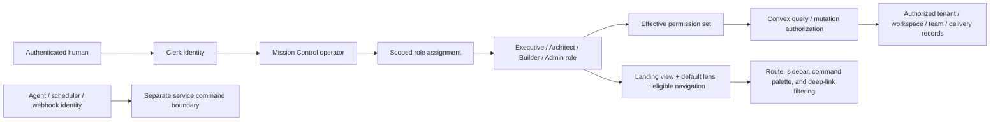
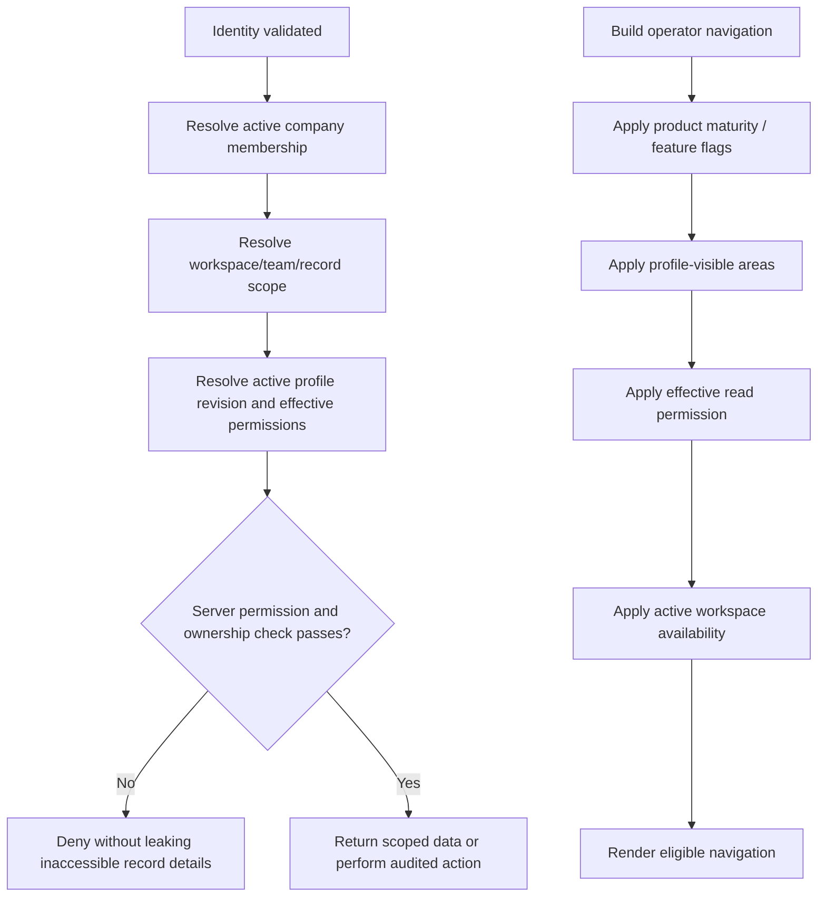
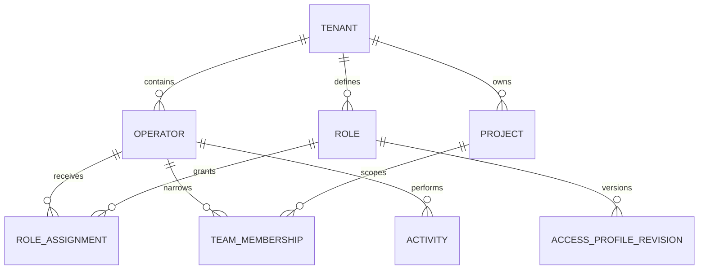

# Persona-Based RBAC Control Plane Plan

## Overview

Add a production-grade role-based access control (RBAC) control plane for four
human personas in the Agentic Platform and Software Factory:

- **Executive** — sees value, risk, governance, accountable autonomy, and
  outcome evidence.
- **Architect** — sees the complete authorized system and can defend technical
  boundaries, contracts, policies, and execution configuration.
- **Builder** — sees the scoped path from assigned work through failure,
  recovery, validation, and handoff.
- **Admin** — can access and administer every production-ready capability that
  the other personas can access, plus membership and access-profile settings.

The product language should use **RBAC**, not “RABC.” The four personas are
human access profiles. They are separate from agent roles such as `LEAD` or
`SPECIALIST`, team membership roles such as `PM` or `DEVELOPER`, and service
identities used by schedulers, webhooks, and executors.

This is an extension of the existing Clerk + Convex authorization foundation,
not a new identity system. Clerk continues to authenticate humans. Mission
Control's `tenants`, `operators`, `roles`, `roleAssignments`, team memberships,
and server-side permission checks remain authoritative.

## Problem This Solves

The current Software Factory exposes one broad operator shell. Its navigation
can be filtered by route maturity, but it is not yet filtered by the signed-in
human's job or effective permissions. The existing role model also relies on a
mixture of explicit permission strings, legacy aliases, role-name inference,
and partially enforced delivery domains.

That creates four product and security problems:

1. Builders face controls and system detail that do not help them complete
   assigned work.
2. Executives must reconstruct business value and risk from engineering-heavy
   surfaces.
3. Architects lack one coherent view of the boundaries and contracts they are
   accountable for.
4. Hiding controls in the browser could be mistaken for authorization even
   where a direct Convex call remains insufficiently guarded.

The result would be noisy UX at best and cosmetic security at worst.

## Recommended V1 Decisions

These are the proposed product decisions for Product Owner review before
implementation begins.

1. **One Access Profiles page, not four new primary destinations.** Add
   `Settings → Access Profiles` with Executive, Architect, Builder, and Admin
   tabs. This meets the settings requirement without adding navigation sprawl.
2. **Profiles are permission bundles plus experience defaults.** Permissions
   authorize data and actions. Experience defaults select the landing view,
   default scope lens, and visible navigation. A hidden route never substitutes
   for server authorization.
3. **One primary persona per person per company in V1.** Project/team
   memberships continue to narrow the records that person can reach. Do not add
   personal view overrides in V1; administrators own consistent defaults.
4. **Executive is read-oriented by default.** Approval authority is not implied
   by executive status. It must be granted through a separate permission or
   responsibility assignment so “visibility” does not silently become
   “decision authority.”
5. **Architect can configure, but not self-approve sensitive changes.** The
   default profile may manage workspace, repository, routing, policy-draft, and
   quality-contract configuration. Production activation, acceptance, and
   member administration remain separate permissions.
6. **Builder can execute and recover only within assigned scope.** Builders may
   update delivery work, dispatch allowed WorkOrders, attach evidence, and run
   bounded recovery. They cannot change company policy, membership, production
   deployment authority, or accept their own work.
7. **Admin capabilities are safety-locked.** Admin may change Executive,
   Architect, and Builder defaults. Admin may change its landing page and
   navigation preferences, but V1 does not allow removing the capabilities
   needed to manage access or the final active admin. This prevents tenant
   lockout.
8. **Admin does not bypass product maturity.** Admin has authority to every
   registered capability, but hidden, demo-only, and disabled Preview features
   stay hidden until their normal maturity or feature flags allow them.
9. **Admin does not bypass separation of duties.** An admin who authored or
   executed a material change cannot use the Admin profile to evade independent
   review, evidence, or approval rules.
10. **Mission Control remains the authorization source of truth.** Do not move
    these profiles into Clerk Organizations. That would duplicate the existing
    company, operator, role, and assignment model.

## Persona Outcome and Scope Contract

| Persona | Primary job | Default data scope | Default landing view | Default posture |
| --- | --- | --- | --- | --- |
| Executive | Decide whether the factory is producing value within acceptable risk and governance | Company aggregate with authorized workspace drill-down | Command Center | Read-oriented; decision authority assigned separately |
| Architect | Understand and defend system boundaries, contracts, policy, quality, and execution architecture | Authorized workspace; optional company-wide read assignment | Command Center or Observability & Evals | Broad system read; controlled configuration write; no self-approval |
| Builder | Move assigned work from intent through implementation, failure, recovery, evidence, and handoff | My Work / team / assigned workspace | Work Orders | Scoped delivery write; no membership, policy, or acceptance authority |
| Admin | Operate the company control plane and access model | Company | Command Center | All registered production capabilities plus access administration |

Scope is always the intersection of the persona's permissions and the person's
tenant, workspace, repository, team, Mission, or WorkOrder assignment. A role
must never widen access to records outside an authorized company or workspace.

## Proposed Default Area Matrix

This is the initial navigation and capability recommendation. It is a default,
not a hard-coded role-name conditional. An admin can customize eligible areas
after the corresponding backend domain is fully enforced.

| Area | Executive | Architect | Builder | Admin |
| --- | --- | --- | --- | --- |
| Command Center | Read company outcomes, risk, exceptions, autonomy | Read system health and boundary exceptions | Read scoped attention and assigned delivery | Full |
| Missions | Read | Read and contribute to technical constraints | Read assigned | Full |
| Work Orders | Read outcome, risk, status, evidence | Read full contract; configure technical constraints when permitted | Read/update/dispatch/recover assigned work | Full |
| Tasks / Factory Board | Summary or drill-down only | Read | Read/update assigned work | Full |
| Observability & Evals | Outcome/evidence summary | Full authorized technical inspection | Scoped run, failure, and recovery inspection | Full |
| Approvals & Audit | Read; decide only with separate approval permission | Read; cannot approve own changes | Read own evidence and decisions | Full subject to separation of duties |
| Incidents | Business-impact view | Full authorized diagnosis | Scoped failure/recovery view | Full |
| Cost / Analytics | Read | Read | Hidden by default | Full |
| Deployments | Read state and risk | Read; configure only if separately granted | Read relevant state | Full |
| Policies / QC rules | Read governance posture | Read and manage drafts/configuration | Read applicable rules | Full |
| Agent Registry / Queue | Aggregate health | Read system capability and routing | Read assigned/team capacity | Full |
| Automations | Read accountable-autonomy summary | Read/configure authorized automation | Read relevant runs | Full |
| Context / Memory / Docs | Read curated outcome context and docs | Full authorized technical context | Scoped implementation and recovery context | Full |
| Workspaces / Repositories / Routing | Hidden | Read/manage authorized architecture | Hidden except read-only assigned repository context | Full |
| Identities / Access Profiles / Members | Hidden | Read identities only when needed to defend boundaries | Hidden | Full |
| Gateway / Database / Developer Tools | Hidden | Hidden by default; grant only when operationally required | Hidden | Full if live/eligible |

### Action Separation Matrix

| Sensitive action | Executive default | Architect default | Builder default | Admin default | Additional invariant |
| --- | --- | --- | --- | --- | --- |
| Change membership or persona | Deny | Deny | Deny | Allow | Cannot remove/deactivate final active admin |
| Change profile defaults | Deny | Deny | Deny | Allow | Expected-version check, reason, diff, audit |
| Dispatch scoped delivery | Deny | Optional, off by default | Allow | Allow | WorkOrder, repository, environment, and team scope must match |
| Recover failed attempt | Deny | Advise/configure | Allow within recovery budget | Allow | Cannot weaken evidence or policy requirements |
| Change architecture/policy config | Deny | Allow authorized drafts/config | Deny | Allow | Activation/approval remains distinct |
| Approve/accept work | Separate grant | Separate grant; never own change | Deny own work | Allow only when separation rules pass | Worker/author cannot be sole validator or approver |
| Activate deployment | Deny | Deny by default | Deny | Allow | Approved release evidence and environment policy required |
| Roll back production | Optional emergency responsibility | Optional emergency responsibility | Deny | Allow | Reason, incident linkage, and immutable audit required |

## Architecture

The UI consumes a server-derived access context. It does not calculate
authority from a role name, browser flag, selected company ID, or selected
workspace ID.

### Request and Navigation Decision Order

## Data Model

Reuse `roles` as the active authorization record. Do not add a competing
persona-membership table.

### Additive `roles` fields

- `systemKey?: "EXECUTIVE" | "ARCHITECT" | "BUILDER" | "ADMIN"`
- `kind?: "SYSTEM_PROFILE" | "CUSTOM"`
- `profileVersion?: number`
- `defaultLandingView?: string`
- `defaultScopeLens?: "MY_WORK" | "TEAM" | "WORKSPACE" | "COMPANY"`
- `visibleViews?: string[]`
- `updatedAt?: number`
- `updatedBy?: Id<"operators">`

`roles.permissions` remains the active permission set used by server guards.
`systemKey` gives each persona a stable identity that survives label changes.
Do not infer persona behavior from editable names such as “Developer” or
“Owner.”

### New immutable `accessProfileRevisions` table

- `tenantId`
- `roleId`
- `systemKey`
- `version`
- `permissions`
- `defaultLandingView`
- `defaultScopeLens`
- `visibleViews`
- `reason`
- `createdBy`
- `createdAt`
- `restoredFromRevisionId?`
- `digest`

Indexes:

- `by_tenant_system_key_version`
- `by_role_version`
- `by_tenant_created_at`

Every profile update must insert an immutable revision and atomically project
that revision into the active `roles` row. Restoring a previous revision creates
a new revision; history is never rewritten.

### Tenant rollout state

Add an explicit tenant authorization mode:

- `LEGACY` — existing behavior; profiles can be seeded and reviewed but do not
  change enforcement.
- `SHADOW` — existing behavior remains authoritative while the new evaluator
  records allow/deny differences without exposing cross-tenant data.
- `ENFORCED` — persona permissions and experience defaults are authoritative.

Store the mode and active access-control version as typed tenant fields or in a
dedicated tenant-scoped rollout record. Do not bury the enforcement switch in
untyped metadata or a browser environment variable.

### Entity Relationship

## Permission and Capability Model

### Canonical registry

Create one typed, code-reviewed registry in
`packages/shared/src/accessControl.ts` containing:

- stable persona keys;
- stable permission keys and descriptions;
- profile defaults;
- supported view IDs and their required read permission;
- allowed landing views and scope lenses;
- safety-critical permissions that the Admin profile cannot lose;
- mutually exclusive or separation-of-duty constraints.

Export it through `packages/shared/src/index.ts`. The Convex server uses it to
validate profile writes. The React shell uses it to map product areas to
required read capability. Labels and icons remain in the UI navigation config.

The permission registry table may continue to support human-readable
descriptions, but it must not be the only validator and must not be publicly
writable. Convert `governance/permissions.createPermission` to an internal-only
seed/migration path or protect it with platform administration. Scope
`listPermissions` to an authorized company admin or replace it with the safe
compiled catalog.

### Permission migration

Preserve current permission strings while introducing missing granular
capabilities. Remove behavior based on role-name inference only after parity is
proven. The migration should explicitly map and test legacy aliases such as
`tasks.write`, `workorders.dispatch`, `approvals.decide`, and
`settings.manage`.

At minimum, add stable permissions for:

- reading and managing access profiles;
- reading governance posture separately from managing policy;
- reading architecture/execution configuration separately from changing it;
- reading analytics/cost separately from delivery telemetry;
- recovering scoped delivery separately from approving it;
- reading administrative settings separately from changing them.

Do not create one broad `factory.manage` permission and use it everywhere. The
four profiles only remain meaningful if sensitive actions are independently
grantable and reviewable.

### Effective access

Effective authorization is:

`authenticated membership ∩ active tenant/workspace scope ∩ assigned role permissions ∩ record ownership/policy constraints`

Multiple supplemental scoped roles may add action permissions, but the primary
persona controls the default experience. Conflict rules are explicit:

1. explicit policy denial wins;
2. inactive membership or invalid scope denies;
3. separation-of-duty denial wins even for Admin;
4. permissions otherwise combine as a union;
5. navigation requires both profile visibility and effective read permission;
6. product maturity and feature flags can still hide a permitted route.

## Server API Plan

### Read APIs

Add `convex/accessProfiles.ts` with:

- `getMyAccessContext({ tenantId, projectId? })` — returns the server-derived
  persona, active profile version, effective permissions, available scope
  lenses, visible views, landing view, and safe denial reason.
- `listForAdministration({ tenantId })` — Admin-only profile summaries,
  assignments count, active revision, and last editor.
- `getProfile({ tenantId, systemKey })` — Admin-only full profile and grouped
  capability catalog.
- `previewUpdate({ tenantId, systemKey, proposed })` — validates capability
  combinations and returns gained/lost permissions, added/removed views,
  affected-member count, invalid landing-view warnings, and lockout/separation
  conflicts without writing.
- `listRevisions({ tenantId, systemKey })` — Admin-only immutable history.
- `getAuthorizationCoverage({ tenantId })` — returns only routes/domains that
  are eligible for profile configuration because their server calls are fully
  enforced.

### Write APIs

- `ensureSystemProfiles({ tenantId })` — idempotently creates the four canonical
  profile roles and initial revisions. Requires member/access administration.
- `updateProfile({ tenantId, systemKey, expectedVersion, proposed, reason })` —
  revalidates the complete proposed profile, writes a revision and active role
  projection atomically, and audits the before/after diff.
- `restoreRevision({ tenantId, systemKey, revisionId, expectedVersion,
  reason })` — creates a new active revision from a prior snapshot.
- `assignPrimaryPersona({ tenantId, operatorId, systemKey, scope })` — replaces
  only the primary persona assignment, preserves permitted supplemental scoped
  roles, validates same-tenant scope, and audits the change.
- `setAccessControlMode({ tenantId, expectedMode, nextMode, reason })` — supports
  `LEGACY → SHADOW → ENFORCED` and controlled rollback.

All APIs derive the actor from `ctx.auth.getUserIdentity()`. Browser-provided
actor labels are ignored. Update operations require an expected version so two
admins cannot silently overwrite each other.

### Central guards

Extend `convex/lib/companyAccess.ts` or add a focused
`convex/lib/accessControl.ts` with:

- `resolveHumanAccessContext`
- `requireCompanyPermission`
- `requireWorkspacePermission`
- `requireRecordPermission`
- `canViewRouteCapability`
- explicit separation-of-duty checks

Do not spread persona-name checks across Convex functions. Public human queries
and mutations call the central guard with a named permission and authoritative
record scope. Service/agent/scheduler callers continue through internal
functions or signed service command boundaries.

For denied mutation/action audit, follow the existing separate authorization
evaluation + internal denial-recording pattern used by
`requireFactoryActionWithAudit`; a write followed by a thrown error in one
Convex transaction will roll back the audit write. Query denials should emit
structured, non-sensitive security telemetry without trying to mutate from a
query.

## Authorization Coverage Gate

Before an area can appear in the Access Profile editor, inventory every public
query, mutation, action, search result, command-palette action, and deep-link
entry used by that area.

Each area receives one status:

- `UNINVENTORIED`
- `INVENTORIED`
- `SHADOW_ENFORCED`
- `ENFORCED`
- `BROWSER_PROVEN`

Only `ENFORCED` or `BROWSER_PROVEN` areas can be enabled for a persona. The
editor shows why an ineligible area is unavailable. This is a launch gate, not
an informational badge.

The first enforcement wave should cover the actual V1 routes in the proposed
persona matrix. It must close the known gaps documented in
`docs/security/human-service-authorization-matrix.md`, especially Mission,
WorkOrder, Task, approval, evidence, release, and remaining service/human
splits. Do not claim persona RBAC is shipped while those public functions can
still bypass the new evaluator.

Add the new guarded functions to the existing Convex authorization ratchet so
the unauthenticated baseline can only shrink.

## Settings UX

Add `Settings → Access Profiles` to the EOS shell. It is reachable only by
members with `accessProfiles.manage`.

### Page structure

1. **Header** — “Access Profiles,” a concise explanation, enforcement-mode
   badge, and current security status.
2. **Persona tabs/cards** — Executive, Architect, Builder, Admin. Each shows
   purpose, assigned-member count, active version, last update, and readiness.
3. **Profile summary strip** — landing view, default scope, visible areas,
   capability count, and any safety constraints.
4. **Visible areas panel** — navigation groups and views with read capability,
   maturity, authorization-coverage status, and enable/disable controls.
5. **Capabilities panel** — grouped Read, Build/Operate, Govern/Approve, and
   Admin permissions. Explain each capability in plain language.
6. **Impact panel** — members affected, capabilities gained/lost, routes removed,
   current users who may be displaced from a route, and separation conflicts.
7. **History panel** — immutable revisions, actor, reason, diff, and Restore
   action.
8. **Save flow** — Preview changes, require a reason, show a final diff, then
   activate atomically with visible success confirmation.

The Admin tab remains visible so the complete model is understandable. Safety-
critical Admin permissions are displayed as locked with a plain-English reason.

### Member assignment UX

Extend the existing Company Access member dialog to require one primary
persona and an allowed scope:

- Admin: tenant scope only.
- Executive: tenant scope by default.
- Architect: workspace scope by default; tenant-wide assignment requires an
  explicit warning and confirmation.
- Builder: team or workspace scope; tenant-wide assignment is not offered in
  V1.

The dialog previews the resulting access before save. Role changes that revoke
the user's current route take effect reactively. The affected user receives a
calm “Your access changed” state with the new persona, reason if available, and
a button to open their new landing view.

### Shell behavior

Extend `routeCapabilities.ts` so every live route declares a required read
permission in addition to scope and maturity. Update `navFilter.ts` to apply
the server-derived access context after maturity filtering.

The same access predicate must cover:

- left navigation;
- direct URLs and browser history;
- command palette;
- global search result actions;
- cross-links and breadcrumbs;
- empty-state calls to action;
- keyboard shortcuts;
- mobile/compact navigation.

If a signed-in user opens a disallowed URL, show a permission-denied state with
the requested area, the active persona, a safe explanation, and a return-to-
landing action. Do not expose whether an inaccessible cross-tenant entity
exists. Do not use a blank screen or silent redirect.

### Required UI states

- loading access context;
- profiles not initialized;
- empty assignment list;
- insufficient permission;
- invalid or unavailable landing view;
- area ineligible because backend coverage is incomplete;
- profile changed concurrently;
- successful activation;
- failed activation with no partial write;
- restore confirmation and success;
- access revoked while current route is open;
- demo mode with a persistent non-production label;
- degraded auth/session refresh without fallback to legacy access.

Follow `docs/design.md`: calm operator-console density, semantic tokens, visible
focus, keyboard operation, non-color status cues, and verified dark/light
contrast.

## Implementation Phases

### Phase 0 — Contract and enforcement inventory

- [ ] Confirm the ten Recommended V1 Decisions with the Product Owner.
- [ ] Create a route-to-query/mutation/action inventory for every area in the
  proposed default matrix.
- [ ] Mark human, agent, scheduler, webhook, and internal callers separately.
- [ ] Define the canonical permission keys, legacy aliases, scope rules, and
  separation-of-duty constraints.
- [ ] Classify each route/domain with the authorization coverage statuses.
- [ ] Add an architecture decision record for primary persona, supplemental
  scoped roles, and Clerk/Mission Control source-of-truth boundaries.

Deliverable: approved permission and route coverage matrix. No UI work starts
before this exists.

### Phase 1 — Shared contract and additive schema

- [ ] Add `packages/shared/src/accessControl.ts` and export the typed registry.
- [ ] Add typed profile fields to `roles`.
- [ ] Add `accessProfileRevisions` and required indexes.
- [ ] Add tenant authorization rollout mode/version.
- [ ] Make the permission catalog non-publicly writable.
- [ ] Add schema and catalog tests for stable keys, unique system profiles,
  valid landing views, permission references, and locked Admin capabilities.
- [ ] Run Convex code generation and typecheck.

Deliverable: additive, backward-compatible data foundation with no behavior
change in `LEGACY` mode.

### Phase 2 — Server resolution and profile administration

- [ ] Implement idempotent system-profile initialization.
- [ ] Implement `getMyAccessContext` and central company/workspace/record guards.
- [ ] Implement admin list, detail, preview, update, restore, and rollout APIs.
- [ ] Add optimistic concurrency through `expectedVersion`.
- [ ] Add immutable successful-change audit and durable denied-action records.
- [ ] Add last-admin, Admin-capability, same-tenant, valid-scope, valid-view, and
  separation-of-duty invariants.
- [ ] Verify service identities and internal functions remain separate.

Deliverable: the complete server-side access profile lifecycle, still disabled
for production enforcement.

### Phase 3 — Existing member and role migration

- [ ] Add a dry-run migration that reports proposed mappings and ambiguities.
- [ ] Auto-map only exact, safe legacy roles:
  - `Company Owner`, `Owner`, `Company Admin`, `Admin` → Admin
  - `Developer`, `Software Engineer` → Builder
  - `Read-only Auditor`, `Observer` → Executive
  - exact `Architect` or `Platform Architect` → Architect
- [ ] Do not guess mappings for `Product Manager`, `Workspace Lead`, `Team
  Lead`, QA, or custom roles; require explicit review.
- [ ] Preserve supplemental scoped assignments that do not conflict with the
  chosen primary persona.
- [ ] Require at least one active Admin before enforcement.
- [ ] Apply in bounded, idempotent batches and audit every applied batch.
- [ ] Produce a post-migration report for missing persona, multiple primary
  personas, invalid scope, and orphaned role assignment.

Deliverable: every active human has one reviewed primary persona and valid
scope without deleting legacy history.

### Phase 4 — Domain enforcement and shadow comparison

- [ ] Migrate each in-scope domain from role-name/legacy inference to named
  permissions and record-level scope guards.
- [ ] Split remaining mixed human/service public functions into guarded public
  human functions and internal/signed service commands.
- [ ] Add cross-tenant, cross-workspace, cross-team, direct-call, and ownership
  denial tests for every domain.
- [ ] Run the existing authorization ratchet and reduce its baseline.
- [ ] Enable `SHADOW` mode for the demo tenant; compare new decisions with
  existing behavior and resolve every unexplained difference.
- [ ] Promote only fully enforced domains to profile-editor eligibility.

Deliverable: server authorization coverage for every area that V1 profiles may
expose.

### Phase 5 — Role-aware shell

- [ ] Add permission requirements to the route capability registry.
- [ ] Fetch and retain the server-derived access context at the company/
  workspace shell boundary.
- [ ] Filter EOS navigation without mutating its canonical config.
- [ ] Guard direct routes and all alternate navigation entry points.
- [ ] Resolve the landing route deterministically when company, workspace,
  persona, or profile revision changes.
- [ ] Add permission-denied and access-changed recovery states.
- [ ] Add unit tests for route maturity + profile visibility + permission +
  scope combinations.

Deliverable: each persona sees a calm, job-specific shell, while direct server
authorization remains authoritative.

### Phase 6 — Access Profiles settings and assignments

- [ ] Add the `access-profiles` view type, route capability, Settings nav item,
  app renderer, and stable URL.
- [ ] Build the four-tab Access Profiles page with summary, views,
  capabilities, impact preview, history, and restore.
- [ ] Extend Company Access member management with primary persona and scope.
- [ ] Lock unsafe Admin changes and explain why.
- [ ] Implement loading, empty, error, denied, stale-version, success, and
  recovery states.
- [ ] Publish the behavior in Mission Control Docs so access changes are not
  tribal knowledge.

Deliverable: an Admin can safely manage profile defaults and assignments
without the Convex dashboard.

### Phase 7 — Verification and rollout

- [ ] Seed deterministic Executive, Architect, Builder, and Admin identities in
  the Software Factory demo.
- [ ] Verify each persona's landing page, navigation, direct URLs, queries,
  mutations, and scope isolation in browser automation.
- [ ] Verify two real Clerk identities in different companies before a
  production claim.
- [ ] Verify profile edits update active sessions without stale data leakage.
- [ ] Verify last-admin, concurrent-update, self-approval, and restore paths.
- [ ] Run typecheck, unit/integration tests, Convex authorization scan, build,
  critical E2E, and factory qualification.
- [ ] Capture focused dark/light screenshots, Axe WCAG A/AA results, keyboard
  proof, console errors, page errors, and failed requests under `docs/testing/`.
- [ ] Run `LEGACY → SHADOW → ENFORCED` for one internal tenant, observe, then
  expand tenant by tenant.

Deliverable: deterministic proof that the UI and server enforce the same
persona contract.

## Expected File Changes

### Shared contract

- `packages/shared/src/accessControl.ts` — persona, permission, route, and
  safety-constraint registry.
- `packages/shared/src/index.ts` — exports.
- `packages/shared/src/__tests__/accessControl.test.ts` — registry invariants.

### Convex

- `convex/schema.ts` — additive profile fields, revision table, rollout state.
- `convex/accessProfiles.ts` — profile queries, preview, update, restore,
  assignment, and rollout.
- `convex/lib/accessControl.ts` — pure resolution and validation helpers.
- `convex/lib/companyAccess.ts` — integration with existing company/workspace
  guards and removal of persona behavior based on role names.
- `convex/companyMembers.ts` — primary persona assignment and final-admin
  invariants.
- `convex/governance/permissions.ts` — remove unguarded public permission writes.
- `convex/migrations/backfillAccessProfiles.ts` — dry-run/apply migration and
  health report.
- `convex/__tests__/accessProfiles.test.ts` — lifecycle, concurrency, revision,
  and lockout tests.
- Domain tests for Mission, WorkOrder, Task, approval, evidence, release, and
  service/human separation.

### React UI

- `apps/mission-control-ui/src/access/AccessProfilesView.tsx`
- `apps/mission-control-ui/src/access/accessProfileModel.ts`
- `apps/mission-control-ui/src/access/accessProfileModel.test.ts`
- `apps/mission-control-ui/src/workspace/CompanyAccessPanel.tsx`
- `apps/mission-control-ui/src/shellV2/eosNavConfig.ts`
- `apps/mission-control-ui/src/shellV2/routeCapabilities.ts`
- `apps/mission-control-ui/src/shellV2/navFilter.ts`
- `apps/mission-control-ui/src/shellV2/navFilter.test.ts`
- `apps/mission-control-ui/src/TopNav.tsx`
- `apps/mission-control-ui/src/App.tsx`

### Verification and documentation

- `tests/e2e/persona-rbac.e2e.spec.ts`
- `docs/architecture/persona-rbac-control-plane.md`
- `docs/security/persona-rbac.md`
- `docs/operations/persona-rbac-rollout.md`
- `docs/testing/YYYY-MM-DD-persona-rbac-browser-proof.md`
- Mission Control Docs site navigation and page content.

The blast radius is intentionally broad because access must be consistent
across the data boundary, shell, alternate navigation paths, settings,
migration, and verification. Shipping only the settings screen and sidebar
filter would not be a safe partial implementation.

## SpecFlow Coverage

### Primary flows

1. Admin initializes the four profiles for an existing company.
2. Admin previews and activates a default change for one persona.
3. Admin restores a previous version after an incorrect change.
4. Admin provisions a new member with one primary persona and valid scope.
5. Existing member signs in, selects a company/workspace, and lands on the
   correct default view.
6. Member navigates only through eligible areas and receives scoped records.
7. Member follows a direct link to a hidden or unauthorized area and recovers.
8. Member attempts a forbidden direct Convex action and the server denies it.
9. Admin changes a profile while affected users are active; their shell and
   subscriptions update without leaking stale records.
10. Service execution continues through its separate authority boundary.

### Required edge cases

- user belongs to multiple companies with different personas;
- user has no primary persona, inactive membership, or inaccessible workspace;
- profile landing view becomes Preview, Demo, hidden, or disabled;
- profile loses the read permission needed by an enabled view;
- route is visible but one action on the page is not permitted;
- profile update conflicts with another admin's update;
- admin tries to remove the final Admin or locked Admin permissions;
- architect or admin attempts to approve their own authored change;
- builder is reassigned while a mutation, modal, or run is active;
- back/forward history references a newly revoked route;
- command palette or global search contains a revoked destination;
- cross-tenant/project/team IDs are supplied manually;
- network interruption occurs during save or restore;
- session refresh occurs without falling back to legacy/demo access;
- demo data is enabled but production auth is misconfigured;
- migration encounters custom, duplicate, orphaned, or ambiguously named roles.

## Acceptance Criteria

### Functional

- [ ] Settings contains one Access Profiles destination with Executive,
  Architect, Builder, and Admin controls.
- [ ] Admin can configure eligible default views, landing view, scope lens, and
  granular capabilities for Executive, Architect, and Builder.
- [ ] Admin can inspect its complete profile and configure presentation defaults
  without removing access-management safety capabilities.
- [ ] Admin can preview impact, provide a reason, activate one atomic version,
  inspect history, and restore a prior version.
- [ ] Every active human has exactly one primary persona per company.
- [ ] Navigation, direct URLs, command palette, search, breadcrumbs, shortcuts,
  and calls to action use the same access predicate.
- [ ] Builder, Architect, Executive, and Admin receive the persona-specific
  default experience and scope described in this plan.
- [ ] Access changes are reflected during active sessions with a clear recovery
  state.

### Security and data integrity

- [ ] Clerk identity plus exact Mission Control membership establishes the
  human actor; email and client labels never establish authority.
- [ ] Every exposed query, mutation, and action rechecks named permission and
  authoritative tenant/workspace/record scope on the server.
- [ ] Hidden navigation alone never grants or revokes server access.
- [ ] Admin cannot bypass independent validation, approval, or environment
  policy.
- [ ] No profile change can remove/deactivate the final active Admin.
- [ ] Permission catalog writes are not available to an unauthenticated caller.
- [ ] Profile changes, assignment changes, rollout changes, restores, and
  denied sensitive actions are attributable and auditable.
- [ ] Profile changes and revisions are atomic, immutable, versioned, and
  recoverable.
- [ ] Human profile enforcement does not grant authority to or break agents,
  schedulers, webhooks, or executors.
- [ ] Cross-company, cross-workspace, cross-team, and inaccessible-record tests
  fail closed without leaking record existence.

### UX and quality

- [ ] Every affected surface has loading, empty, degraded, error, denied,
  success, stale-version, and recovery behavior where applicable.
- [ ] All controls are keyboard operable with visible focus and non-color state
  indicators.
- [ ] Dark and light themes meet WCAG AA contrast and target-size requirements.
- [ ] Browser proof covers each persona at desktop, narrow width, keyboard, and
  200% zoom.
- [ ] Console, page-error, and failed-request captures are clean for every
  successful persona flow.
- [ ] Typecheck, tests, authorization ratchet, build, critical E2E, and factory
  qualification pass.

## Success Metrics

- 100% of live persona-exposed routes declare a read permission and have fully
  enforced backend coverage.
- 0 unexplained shadow-versus-current authorization differences before tenant
  enforcement.
- 0 unauthorized cross-scope records or successful direct-call bypasses in the
  test matrix.
- 100% of access-profile and assignment changes have actor, reason, before,
  after, version, and timestamp.
- Median time for an Admin to understand and safely change a persona default is
  under five minutes in usability testing.
- Builders reach assigned Work Orders without passing through irrelevant
  settings/governance areas.
- Executives can identify outcome, top risk, pending decision, autonomy posture,
  and supporting evidence without opening raw execution logs.

## Risks and Mitigations

| Risk | Impact | Mitigation |
| --- | --- | --- |
| UI-only filtering creates false confidence | Critical authorization bypass | Server coverage gate; direct-call negative tests; authorization ratchet |
| Existing role-name and alias logic conflicts with profiles | Incorrect allow/deny decisions | Typed system keys, legacy parity tests, shadow mode, staged removal |
| Admin accidentally locks out the company | Loss of control plane | Locked Admin permissions, final-admin invariant, version restore |
| Broad Architect profile becomes a covert Admin | Excess authority | Separate configure/activate/approve/manage-members permissions; scope and SoD tests |
| Executive status implies approval authority | Governance ambiguity | Read-only default; grant decision authority separately |
| Builder sees other teams or workspaces | Confidentiality breach | Record-level ownership/team checks and negative scope tests |
| Mixed human/service endpoints break overnight execution | Reliability failure | Inventory callers; split public human and internal/signed service functions |
| Profile changes disrupt active sessions | Confusing or stale access | Reactive access context, revoked-route recovery, server recheck on every action |
| Custom legacy roles are mapped incorrectly | Privilege escalation or loss | Dry-run, exact mapping only, ambiguity queue, bounded apply |
| Admin “all access” exposes unfinished Labs routes | Product confusion/risk | Maturity and feature flags run before profile visibility |

## Rollout and Rollback

1. Deploy additive schema and profile APIs in `LEGACY` mode.
2. Initialize profiles and run the migration in dry-run mode.
3. Resolve all ambiguous assignments and confirm at least two active Admins for
   production tenants where practical.
4. Enable `SHADOW` and observe authorization decisions for at least one complete
   Mission golden path per persona.
5. Enable the role-aware UI only for the internal tenant.
6. Promote the internal tenant to `ENFORCED`; verify browser and direct-call
   evidence.
7. Expand tenant by tenant after the observation window.

Rollback changes the tenant from `ENFORCED` to `SHADOW` or `LEGACY` and disables
the role-aware shell. It does not delete profiles, revisions, assignments, or
audit history. A rollback must never enable anonymous company context in
production.

## Dependencies and Owner Inputs

- Product Owner confirmation of the Recommended V1 Decisions, especially
  Executive approval defaults, Architect write authority, and one primary
  persona per company.
- A complete route-to-server-function inventory.
- Two or more real Clerk test identities across at least two companies for
  final isolation proof.
- Named owners for access-administration operations and security monitoring.
- Agreement on the initial production tenant and observation window.

## External Guidance Applied

- OWASP recommends least privilege, deny by default, validating permissions on
  every request, and testing authorization logic. The server coverage gate and
  direct-call tests implement those principles.
- NIST RBAC separates user-role assignment, permission-role assignment, role
  hierarchy, and separation-of-duty constraints. This plan uses stable persona
  roles, granular permissions, scoped assignments, and explicit SoD rules.
- Convex exposes validated identity through `ctx.auth.getUserIdentity()` inside
  server functions. Identity establishes the actor; Mission Control still
  authorizes the requested company, workspace, record, and action.

## References

### Internal

- `docs/product/mission-control-north-star.md`
- `docs/product/mission-control-v1-product-strategy.md`
- `docs/security/clerk-company-authorization.md`
- `docs/security/human-service-authorization-matrix.md`
- `docs/architecture/company-workspace-repository-control-plane.md`
- `docs/plans/2026-07-31-feat-clerk-company-authorization-plan.md`
- `docs/design.md`
- `convex/lib/companyAccess.ts`
- `convex/companyMembers.ts`
- `convex/governance/roles.ts`
- `convex/governance/permissions.ts`
- `convex/governance/roleAssignments.ts`
- `apps/mission-control-ui/src/shellV2/eosNavConfig.ts`
- `apps/mission-control-ui/src/shellV2/routeCapabilities.ts`
- `apps/mission-control-ui/src/shellV2/navFilter.ts`
- `apps/mission-control-ui/src/workspace/CompanyAccessPanel.tsx`

### External

- [OWASP Authorization Cheat Sheet](https://cheatsheetseries.owasp.org/cheatsheets/Authorization_Cheat_Sheet.html)
- [NIST Role-Based Access Control](https://csrc.nist.gov/projects/role-based-access-control)
- [Convex Auth in Functions](https://docs.convex.dev/auth/functions-auth)
- [Convex and Clerk integration](https://docs.convex.dev/auth/clerk)

## Definition of Done

Persona RBAC is done only when an Admin can manage the four versioned defaults
through the product, each persona receives the intended job-specific shell,
every exposed server operation enforces the same named permissions and scope,
service execution remains intact, access changes are auditable and recoverable,
and deterministic browser plus direct-call evidence proves the contract.
