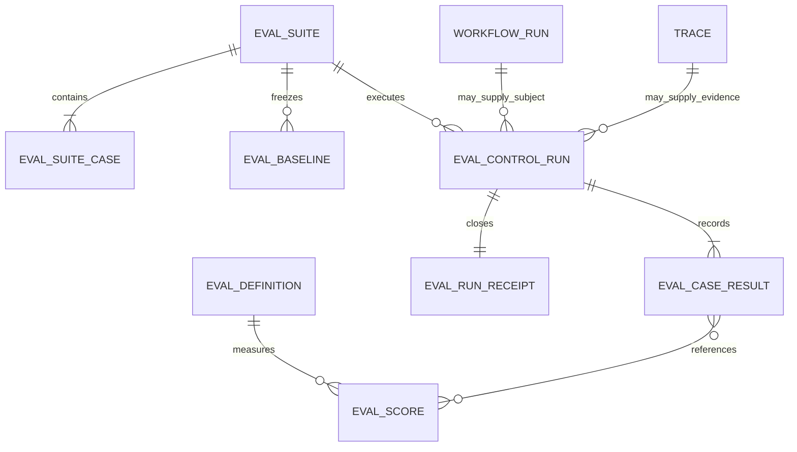

# Eval Control Plane V1

## Overview

Build one canonical, receipt-first evaluation control plane over Mission
Control's existing evaluator, trace, dataset, and experiment primitives. The
first production-shaped suite evaluates Mission Control's own governed Mission
golden path using deterministic, keyless evidence already emitted by System
Qualification V2.

This work improves evaluation integrity and operator confidence. It does not
grant evals acceptance authority, replace independent verification, or create a
new primary navigation domain.

## Problem Statement

Mission Control has several capable but disconnected eval systems:

- observation-level `evalDefinitions` and immutable `evalScores`;
- context-package proxy evals;
- operator-persona evals;
- a 16-case Support Triage Agent harness;
- datasets and two-variant experiments;
- deterministic system qualification evidence and release gates.

There is no canonical suite or run receipt binding them to exact case,
baseline, adapter, source, configuration, and failure provenance. CI does not
have a dedicated eval-integrity gate. Aggregate scores can be displayed without
case-level regression or benchmark-integrity evidence.

## Proposed Solution

### Canonical hierarchy

`evalDefinitions` and `evalScores` remain the canonical granular measures.
The new entities bind those measures into reproducible suite executions.

### Run semantics

- Run status: `QUEUED | RUNNING | COMPLETED | FAILED | CANCELED`.
- Receipt verdict: `PASS | WARN | FAIL | INVALID`.
- Case verdict: `PASS | FAIL | INVALID | SKIPPED`.
- Failure origin: `SYSTEM_UNDER_TEST | HARNESS | JUDGE | DATA | INFRASTRUCTURE`.
- Skipped cases never count as passing.
- More than 10% invalid cases invalidates the run.
- A blocking case regression fails the receipt.
- Advisory failures produce a visible warning without masking blocking health.
- Receipt publication requires complete case accounting and exact provenance.

### Mission Control golden suite

The suite consumes `scenario-evidence.json` from System Qualification V2 through
an adapter that never receives the sealed assertion definitions. Six blocking
cases cover intent lineage, authority, evidence currentness, recovery, harness
isolation, and no self-promotion. One advisory case exposes cost and token
attribution coverage.

Every case includes a deliberately degraded negative control. CI verifies that
the control fails, preventing structurally unfailable evals.

## User and System Flows

### Operator inspection

1. Operator opens Observability & Evals.
2. Eval Health shows the latest publishable receipt and baseline comparison.
3. Exceptions appear first: blocking regressions, invalid runs, advisory gaps.
4. Operator inspects case, slice, provenance, and failure-origin details.
5. Existing evaluator analytics remain available below the control-plane view.

### First-time workspace

1. No suite exists; the UI explains what is missing.
2. An authorized operator installs the versioned Mission Control golden suite.
3. The suite exposes public cases and baseline identity, but no fabricated run.
4. External/CI runners can submit actual outcomes through the governed API.

### Runner execution

1. Runner loads a published suite's public cases.
2. Adapter executes against an exact source revision and resolved configuration.
3. Trusted evaluator scores candidate outputs against sealed assertions.
4. Control plane validates accounting, computes slice regressions, and writes
   results plus one immutable receipt transactionally.
5. Invalid or partial input fails closed and remains inspectable.

### Baseline promotion

1. An authorized operator selects a completed, publishable run.
2. A reason is required.
3. The new baseline binds the exact receipt and case verdicts.
4. Prior baseline contents remain immutable; only active selection changes.

## Flow Gaps Resolved

- **Authorization:** view and improve permissions follow existing Factory
  permission boundaries; writes are audited.
- **Refresh/restart:** all suite, run, result, receipt, and baseline state is
  persisted in Convex.
- **Duplicate submission:** suite versions and runs use idempotency keys.
- **Concurrent baseline changes:** comparisons bind the baseline id and digest
  captured when the run starts.
- **Partial results:** missing or duplicate cases invalidate the receipt.
- **Harness failure:** typed origins remain separate from product failures.
- **Gold leakage:** public suite queries omit sealed assertions and controls.
- **Judge drift:** model and rubric provenance are required for judged runs;
  incomparable provenance suppresses regression claims.
- **Small samples:** V1 makes no statistical-significance claim.
- **Authority:** evals remain diagnostic/advisory and cannot approve, dispatch,
  merge, release, waive, or accept work.

## Implementation Phases

### 1. Shared contracts and hermetic dogfood suite

- [x] Add shared suite, assertion, outcome, result, baseline, provenance, and
      receipt types plus deterministic scoring and regression helpers.
- [x] Define the seven-case Mission Control golden suite with sealed assertions,
      slices, severity, and negative controls.
- [x] Add a CLI runner over committed System Qualification V2 evidence.
- [x] Add portable receipt JSON Schema and a committed baseline.
- [x] Add data-integrity, sealed-view, negative-control, invalid-accounting,
      provenance, and slice-regression tests.
- [x] Add a dedicated keyless CI eval job and package scripts.

### 2. Governed persistence and APIs

- [x] Add `evalSuites`, `evalSuiteCases`, `evalBaselines`, `evalControlRuns`,
      `evalCaseResults`, and `evalRunReceipts` with workspace and lineage indexes.
- [x] Add authorized queries for control-plane dashboard and public suite input.
- [x] Add idempotent suite installation and transactionally scored run recording.
- [x] Add explicit baseline promotion with reason and audit activity.
- [x] Add schema and authorization contract coverage.

### 3. Operator experience

- [x] Add receipt-first Eval Health to the existing Eval library tab.
- [x] Show latest verdict, publication eligibility, baseline drift, blocking and
      advisory health, invalid count, case slices, failure origins, and pins.
- [x] Preserve the existing evaluator library below the new control-plane view.
- [x] Provide loading, empty, error, success, disabled, and retry states.
- [x] Seed honest demo records, including one advisory attribution gap and one
      historical invalid harness run.

### 4. Qualification and documentation

- [x] Integrate receipt generation with System Qualification V2.
- [x] Update operator and architecture documentation.
- [x] Run code generation, focused suites, typecheck, lint, build, and eval CI.
- [x] Verify the live V2 UI against an isolated seeded backend in dark and light
      themes, including keyboard operation, console errors, and failed requests.
- [x] Capture deterministic evidence under `docs/testing/evidence/`.

## Acceptance Criteria

- [x] Candidate adapters cannot receive sealed assertions through public APIs.
- [x] Every V1 case has a negative control that produces a worse result.
- [x] Missing, duplicate, skipped, or malformed case accounting cannot pass.
- [x] Harness, judge, data, and infrastructure failures never become product
      successes and invalidate a run above the configured threshold.
- [x] Every receipt binds suite, baseline, repository revision, adapter,
      resolved configuration, dataset, rubric/prompt when applicable, timestamps,
      sample accounting, costs, and artifact hashes.
- [x] Blocking regressions fail per case and per slice even when the aggregate
      score improves.
- [x] The deterministic suite runs in a fresh checkout without API secrets.
- [x] Current System Qualification V2 produces six blocking passes and one
      honest advisory economics warning.
- [x] Eval records remain distinct from verification and have no acceptance or
      execution authority.
- [x] Operators can understand the latest verdict and required next action
      without reconstructing logs.
- [x] The UI is keyboard operable, responsive, accessible in both themes, and
      survives refresh.

## Success Metrics

- 100% V1 cases have verified negative controls.
- 100% run receipts have complete case accounting and exact provenance.
- 0 skipped or invalid runs reported as passing.
- 0 blocking slice regressions hidden by aggregate improvement.
- Deterministic eval CI completes without secrets.
- Operator can identify verdict, regression, failure origin, and known gap from
  the Eval Health surface in under one minute.

## Risks and Mitigations

- **Schema blast radius:** land tables, indexes, queries, generated types, and
  authorization baseline atomically; run schema-contract tests.
- **Second source of truth:** the control plane references existing Attempts,
  traces, eval scores, and evidence rather than replacing them.
- **False confidence:** show advisory gaps, sample counts, failure origin, and
  provenance; never infer acceptance from eval status.
- **Gold contamination:** separate public probes from sealed assertions at the
  API and adapter boundary.
- **Baseline gaming:** require explicit promotion reason and preserve prior
  baseline contents and receipt lineage.
- **Judge non-determinism:** model judging is not a V1 merge gate and requires
  provenance plus future human calibration.
- **Expensive qualification:** the PR gate replays committed deterministic
  evidence; full system qualification remains the deeper composed job.

## Post-Deploy Monitoring & Validation

- Search activities for `EVAL_SUITE_INSTALLED`, `EVAL_RUN_RECORDED`, and
  `EVAL_BASELINE_PROMOTED`.
- Watch invalid-run rate, publication-eligible rate, blocking regressions,
  advisory gaps, run duration, and incomplete provenance.
- Healthy: deterministic CI reproduces the baseline; blocking pass rate remains
  100%; advisory economics remains visible until attribution is implemented.
- Failure/rollback trigger: any skipped/invalid run shown as pass, gold returned
  by a public query, cross-workspace data exposure, or baseline mismatch without
  a suite version change. Disable control-plane writes and keep legacy eval views
  available while correcting the additive tables/API.
- Validation window: every PR plus 24 hours after deployment. Owner: ML/AI +
  Platform.

## References

### Internal

- `docs/brainstorms/2026-08-15-observability-evals-v1-brainstorm.md`
- `docs/product/mission-control-north-star.md`
- `docs/product/mission-control-v1-product-strategy.md`
- `convex/schema.ts`
- `convex/observability.ts`
- `scripts/system-factory-e2e-qualification.mjs`
- `docs/solutions/build-errors/missing-convex-schema-contracts-ci-20260730.md`

### External

- [gbrain-evals](https://github.com/garrytan/gbrain-evals)
- [gbrain eval audit](https://github.com/garrytan/gbrain-evals/blob/main/docs/audit/2026-08-31-eval-audit.md)
- [gbrain receipt schemas](https://github.com/garrytan/gbrain-evals/tree/main/eval/schemas)
- [gbrain hermetic CI](https://github.com/garrytan/gbrain-evals/blob/main/.github/workflows/ci.yml)
