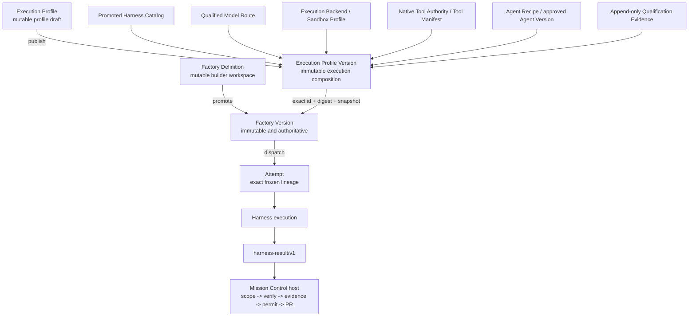

# Composable Factory Execution Profiles

## Executive decision

Finish the provider-neutral architecture already present in Mission Control.
Do not introduce another Factory, execution lifecycle, router, Attempt type, or
authority plane.

`FactoryDefinitionVersion` remains the only unit that can be assessed,
activated, pinned, routed, dispatched, retried, or rolled back. A subordinate
`ExecutionProfileVersion` may package a reusable and independently qualified
execution composition, but a profile can never execute work on its own.

The implementation order is deliberate:

1. remove implicit Codex process composition;
2. separate model-route identity from harness/runtime identity;
3. replace compile-time harness discovery with an operator-promoted catalog;
4. introduce subordinate qualified Execution Profile versions;
5. update the builder experience around compatible profiles;
6. prove the boundary with `deepagents/v1` on a persistent worker;
7. add `open-swe-coder/v1` as a recipe, not a competing control plane; and
8. run the same governed conformance suite across admitted harnesses.

Only the first boundary-hardening pull request is the immediate implementation
unit. Deep Agents, MCP, additional remote providers, multi-model recipes, and
autonomous routing remain separately gated.

## Problem statement

Mission Control already owns the authoritative lifecycle:

`Mission -> Plan -> WorkOrder -> Task -> Attempt -> candidate -> independent evidence -> pull request -> human decision -> release`

The current code also has a provider-neutral harness lifecycle, exact adapter
identity, frozen manifests, worker admission, model routing, sandbox profiles,
and independent verification. The remaining product and implementation leaks
make that architecture appear more Codex-specific than it is:

- orchestration startup constructs Codex when no harness was explicitly
  enabled;
- `FactoryAttemptWorker` has a concrete Codex default constructor argument;
- Factory configuration discovers only compile-time Codex and DeepSeek
  manifests;
- `factory-model-route/v1` embeds both harness capability identity and a
  literal `CODEX_CLI` runtime artifact;
- Remote Sandbox profiles and credentials currently encode exe.dev,
  OpenRouter, and Codex-specific assumptions;
- the Factory UI begins with `codex/v1` and can select the first available
  item rather than an explicitly qualified recommendation; and
- current capability requirements are mostly static and the first workflow
  step is treated as the primary model binding.

These are boundary-completion problems. They do not justify replacing the
existing Factory domain model.

## Current-state corrections

### Execution already fails closed

An Attempt whose exact adapter is missing does not execute through Codex:

- worker polling skips unsupported exact identities;
- exact registry lookup rejects a missing adapter after claim; and
- the generic harness ADR prohibits fallback.

The actual defect is narrower: the process composition root invents a Codex
adapter when no adapter was explicitly configured. This must be removed without
claiming that the canonical Attempt path currently substitutes one harness for
another.

### Factory Version is already the exact executable tuple

The current immutable Factory Version freezes workflow, harness manifest and
configuration digests, model route and qualification, execution backend,
Sandbox Profile, agent bindings, code scopes, policy, environment, budget,
verifiers, risk, and recovery. Execution Routing deliberately selects complete
Factory Versions rather than constructing a Cartesian product at dispatch.

Execution Profiles therefore exist to make a reusable execution subset
legible and independently qualifiable. They must not duplicate Factory-owned
workflow, repository, governance, verification, budget, or delivery state.

## Goals

- A builder can create a new Factory Version using an exact, compatible, and
  currently qualified harness/model/environment/tool composition.
- A platform operator can install harness code independently from promoting
  its manifest for use in a workspace.
- Every new Factory Version and Attempt freezes the exact profile and component
  identities used for execution.
- Unknown, stale, revoked, incompatible, or uninstalled components fail closed
  with stable remediation.
- No model, recipe, harness, sandbox, tool, or skill can acquire Mission Control
  authority.
- Adding `deepagents/v1` requires no change to WorkOrders, Attempts, leases,
  verification, publication, acceptance, Factory Memory, observability, or
  learning authority.
- Existing Factory Versions and historical Attempts remain readable and
  reproducible throughout migration.

## Non-goals

- A dynamic plugin marketplace or arbitrary npm/pip installation from the
  builder UI.
- A second active-version pointer, execution router, worker lease, or Attempt
  lifecycle for Execution Profiles.
- Importing Open SWE's dashboard, ingress, scheduler, sandbox lifecycle,
  publisher, approval model, or GitHub control plane.
- Enabling Deep Agents MCP support before the governed read-only MCP boundary
  is independently qualified.
- Adding E2B, Daytona, Modal, or another remote provider in the same change as
  the new harness.
- Multi-repository atomic delivery, autonomous merge, autonomous acceptance,
  or autonomous policy promotion.
- Treating “model agnostic” as proof that every model behaves equivalently.

## Architectural invariants

1. **One routed unit:** only an immutable Factory Version is eligible for
   readiness, activation, routing, dispatch, retry selection, or rollback.
2. **One harness lifecycle:** every runtime implements the existing
   `prepare -> execute -> collectResult -> cancel -> cleanup` contract.
3. **No subordinate authority:** recipes, harnesses, models, sandboxes, tools,
   skills, and context have no verification, publication, acceptance, memory,
   observability, learning, or worker-lease authority.
4. **No component fallback:** before dispatch, guarded routing may choose a
   different complete Factory Version. After dispatch, substitution requires a
   new audited Attempt and routing decision.
5. **Deny wins:** effective capability and authority are the intersection of
   the frozen profile, adapter, worker, Factory policy, WorkOrder, repository
   classification, and code scope.
6. **Exact evidence:** qualification binds exact component digests, declared
   workload/risk/data-classification scope, approver, expiry, and evidence.
7. **Installation is not promotion:** a worker advertisement proves only that
   code is present. It does not make the adapter eligible for Factory use.
8. **Historical immutability:** component changes create new Profile and
   Factory versions; historical records are never rewritten to current truth.
9. **Context stays task-specific:** Factory Versions bind context/skill policy;
   each Attempt freezes its exact immutable Context Package digest.
10. **Completion is not trust:** `harness-result/v1` status `COMPLETED` never
    counts as independent verification, publication permission, or acceptance.

## Target domain model



### Authority ownership

| Concern | Owner |
| --- | --- |
| Mission, Plan, WorkOrder, Task, Attempt, lease | Mission Control |
| Repository scope, policy, risk, budget | Factory Version / Mission Control |
| Harness execution mechanics | Harness adapter |
| Model inference | Qualified model route |
| Process/filesystem/network containment | Worker and sandbox boundary |
| Tool authorization and credentials | Mission Control tool boundary |
| Candidate identity and changed-file reconciliation | Mission Control host |
| Verification and Quality Gate | Independent verification plane |
| Publication permit and source-control delivery | Mission Control |
| Acceptance, merge, release | Human/policy authority outside harness |
| Memory promotion and learning proposals | Mission Control governance |

### Execution Profile boundary

An Execution Profile contains execution mechanics only:

- immutable recipe/agent configuration identity and digest;
- exact harness adapter/runtime identity, capability manifest, and effective
  configuration digest;
- exact qualified model route;
- execution backend and optional Sandbox Profile identity/digest;
- exact native tool manifest or future governed Tool Authority reference;
- required generic capabilities;
- request, event, and result schema versions;
- cancellation, retry, cleanup, isolation, network, credential, telemetry, and
  recovery behavior; and
- deterministic composition digest.

It does not contain or own:

- repository or workflow identity;
- code scopes;
- WorkOrder policy or approvals;
- Factory budget or risk boundary;
- verifier selection or Quality Gate policy;
- publication, merge, or acceptance authority; or
- worker leases and Attempt state.

### Minimal V1 profile model

Use the smallest model that creates reuse without creating a second Factory:

- `factoryExecutionProfiles`: stable workspace-scoped name, description,
  mutable draft, optimistic revision, and latest version number. It has no
  `activeVersionId` and cannot be dispatched.
- `factoryExecutionProfileVersions`: append-only immutable canonical manifest,
  exact component snapshots, version, and SHA-256 digest.
- `factoryExecutionProfileDecisions`: append-only qualification, promotion,
  deprecation, and revocation decisions with actor, reason, scope, evidence,
  expiry, and component invalidation inputs.

`factoryDefinitionVersions` gains optional migration-safe fields:

- `executionProfileVersionId`;
- `executionProfileDigest`; and
- `executionProfileSnapshot`.

Existing component fields remain as derived compatibility projections during
migration. Creation, readiness, dispatch, and claim reject disagreement between
the profile snapshot and those projections. The frozen Factory Version remains
the Attempt authority even if the reusable profile is later deprecated.

### V1 model-role constraint

Execution Profile V1 binds one exact primary model route. Every executable
workflow role must either use that same route or be rejected during Factory
Version creation. Named multi-model role bindings are deferred until a real
qualified recipe requires them.

This replaces the current “first workflow step decides the route” shortcut
without introducing a multi-model orchestration system in the first release.

### Skills, tools, and context

- Approved Agent Versions continue to provide exact prompt and tool manifest
  hashes during migration.
- An Execution Profile freezes the effective approved native tool manifest.
- `tools.mcp` remains `UNSUPPORTED` for `deepagents/v1` until todo `061` proves
  one read-only MCP server through a Mission Control-owned broker.
- Skill bundle identity is frozen when the current Agent Configuration Registry
  can provide an exact digest.
- The Factory Version freezes context policy and allowed sources; the Attempt
  freezes the exact task-specific Context Package.
- Repository instructions, skill contents, tool metadata, MCP descriptions,
  tool output, and model output remain untrusted data.

## User and system flows

### 1. Discover and promote a harness

1. A worker reports an exact adapter identity, full capability manifest,
   effective configuration digest, runtime artifact identity, supported
   backends, and lifecycle behavior.
2. Mission Control records or projects an untrusted catalog candidate.
3. Static validation and conformance evidence bind the exact candidate digest.
4. An authorized workspace approver promotes the exact catalog entry for a
   declared scope and expiry.
5. Promotion does not load code and does not activate a Factory Version.

### 2. Build and qualify an Execution Profile

1. A builder creates or clones a profile draft.
2. The builder selects a promoted harness, one qualified model route, an
   admitted backend/Sandbox Profile, and an approved native tool manifest.
3. The server filters and validates compatibility; the client never determines
   eligibility alone.
4. Publishing resolves every reference, rejects floating identities, computes
   the canonical manifest, deduplicates identical content, and creates an
   immutable version.
5. Qualification runs against the exact digest and produces append-only
   evidence.
6. An authorized approver promotes the exact version. Failed qualification is
   corrected through a new version, not by mutating the old one.

### 3. Bind a Factory Version

1. The operator selects a current qualified profile while creating a new
   Factory Version.
2. Repository, workflow, code scope, policy, verification, budget, risk, and
   recovery remain Factory-level inputs.
3. The server freezes the profile ID, digest, snapshot, and derived compatibility
   projections into the new Factory Version.
4. Existing Factory Versions are never rebound.

### 4. Readiness, activation, dispatch, and claim

1. Readiness validates static profile qualification and live operational facts:
   worker advertisement, repository access, credentials, model availability,
   provider health, sandbox currentness, egress, tool availability, verifier
   health, capacity, and exact digests.
2. Activation remains a Factory Version decision.
3. Routing selects one complete eligible Factory Version.
4. Dispatch freezes Factory and profile lineage onto the Attempt before claim.
5. Worker admission and claim independently revalidate all exact identities.
6. Missing, stale, revoked, or mismatched inputs fail closed before execution.

### 5. Execute, verify, and publish

1. The selected adapter emits normalized events and `harness-result/v1`.
2. Mission Control recomputes candidate and changed-file state from the
   repository boundary.
3. Scope violations, undeclared tools/network activity, malformed results, or
   cleanup uncertainty block progress.
4. A separate Verification Attempt evaluates the immutable candidate.
5. Current evidence and publication policy determine whether Mission Control
   may create a branch or pull request.
6. The harness never publishes, merges, accepts, or promotes itself.

### 6. Retry, switch, revoke, and roll back

- A transient retry creates a new Attempt with the same frozen Factory/Profile
  version.
- Switching any component requires selecting another eligible Factory Version
  and creating a new audited Attempt.
- Non-security deprecation blocks new Factory bindings and dispatch but may let
  a running Attempt finish under its frozen contract.
- Security, credential, isolation, or supply-chain revocation blocks dispatch
  and claim immediately and requests cancel/quarantine for running Attempts.
- Rollback activates a previously qualified Factory Version. No pointer rewrites
  historical Attempts.

## Failure and edge-case contract

| Situation | Required behavior |
| --- | --- |
| Zero adapters and Factory worker disabled | Server may start; no Factory execution capability is advertised |
| Zero adapters and Factory worker enabled | Startup fails with explicit configuration remediation |
| Exact adapter not installed | No claim, no substitution, stable blocker |
| Worker advertises unknown manifest | Candidate only; never selectable until explicit promotion |
| Duplicate adapter identity with different digest | Registry/catalog rejects ambiguity |
| Invalid component combination | Block profile publication with component-specific remediation |
| Qualification fails or expires | Preserve evidence; block new binding/readiness/dispatch |
| Component digest changes | Invalidate exact qualification; require a new profile version |
| Profile revoked between dispatch and claim | Claim fails; security revocation requests cancel/quarantine |
| Model/tool/sandbox unavailable | Readiness blocks; retry cannot silently substitute |
| Sandbox partially provisions | Idempotent cleanup, quarantine uncertain resources, evidence retained |
| Malformed/truncated harness result | Attempt fails before verification/publication |
| Undeclared file/tool/network access | Fail closed and block publication |
| Adapter lacks pause/resume | Expose only qualified cancel/retry behavior |
| Concurrent publish or promotion | Canonical digest dedupe, idempotency key, compare-and-set decision |
| Stale builder draft | Reject optimistic revision and preserve both users' work |
| Legacy Factory Version | Continue its frozen legacy path; never mutate it into a profile-bound version |

## Additive migration strategy

1. Preserve all historical Factory Versions, model routes, Attempts, and
   execution manifests unchanged.
2. Remove implicit runtime defaults without changing persisted schemas.
3. Add `factory-model-route/v2`, containing provider, provider route, model ID,
   protocol/capabilities, and reasoning controls only. Harness/runtime artifact
   provenance remains in the harness/profile composition.
4. Retain `factory-model-route/v1` as a read-only compatibility schema for
   existing Factory Versions. New route registration and new profile-bound
   Factory Versions require V2 after feature enablement.
5. Introduce promoted harness-catalog records from existing worker-advertised
   full manifests. Static known manifests remain only for explicit legacy reads
   and migration fixtures.
6. Add optional Execution Profile fields and append-only profile records.
7. Derive one `LEGACY_IMPORTED` profile candidate per unique exact execution
   subset. Do not merge semantically similar tuples and do not automatically
   grant new qualification.
8. Dual-read the UI as “Legacy exact tuple” or exact Profile version/digest.
9. Behind a feature flag, require a qualified profile for newly created Factory
   Versions while existing active versions continue their frozen legacy path.
10. After production qualification, stop writing direct component selections
    except as derived compatibility projections.

Every Convex table, field, index, validator, generated type, mutation, query,
and consumer must land atomically. A partial schema shim is explicitly
prohibited by the repository's documented CI learning.

## Implementation sequence

### Phase 0 — Explicit worker composition (immediate first PR)

**Commit/PR theme:** `fix(factory): require explicit harness worker composition`

Deliverables:

- Remove the default `CodexV1ExecutorAdapter` constructor argument from
  `FactoryAttemptWorker`.
- Replace orchestration startup's “no configured adapters means Codex” behavior
  with explicit adapter loading.
- Permit zero adapters only when every Factory execution worker mode is
  disabled.
- Fail startup when Factory execution is enabled and zero adapters were
  explicitly configured.
- Preserve the existing exact-identity polling and claim behavior.
- Add tests for disabled/no-adapter startup, enabled/no-adapter failure,
  explicitly enabled Codex, explicitly enabled DeepSeek, and unsupported exact
  Attempt identity.
- Update the generic harness ADR to distinguish prohibited execution fallback
  from static legacy-manifest resolution.

Exit gate:

- No runtime path invents an adapter that was not explicitly configured.
- Existing Codex and DeepSeek contract tests remain green.
- No schema, public API, UI, remote sandbox, or dependency change is included.

### Phase 1 — Separate model route from runtime artifact

**Commit/PR theme:** `refactor(factory): separate model and harness runtime identity`

Deliverables:

- Define and test `factory-model-route/v2` without adapter, executable, image,
  or `CODEX_CLI` fields.
- Define a provider-neutral runtime artifact identity owned by the harness
  manifest/profile composition.
- Update model catalog registration and qualification to V2.
- Make compatibility checks consume explicit model-route and harness/runtime
  inputs rather than a contaminated route snapshot.
- Validate all executable workflow roles against the one V1 profile route;
  remove the first-step-only shortcut.
- Keep V1 route records readable and executable only through frozen legacy
  Factory Versions.
- Add migration fixtures and negative tests for cross-wired route/runtime
  identities.

Exit gate:

- A model route can represent a non-Codex, tool-calling model without naming a
  harness.
- A harness/runtime artifact can change without mutating model identity.
- Historical V1 records remain readable and exact.

### Phase 2 — Promoted harness catalog

**Commit/PR theme:** `feat(factory): add qualified harness catalog`

Deliverables:

- Persist exact worker-advertised harness candidates with immutable manifest
  and effective-configuration digests.
- Add workspace-scoped append-only promote/deprecate/revoke decisions.
- Require explicit operator promotion before a manifest appears in new Factory
  configuration.
- Derive Factory configuration options from the promoted catalog and current
  worker advertisements rather than `KNOWN_HARNESS_MANIFESTS`.
- Retain the static list only for legacy stored-version resolution and test
  fixtures.
- Do not dynamically import or install adapter code from catalog metadata.

Exit gate:

- A conforming third harness can be advertised and promoted without editing
  Convex Factory configuration logic.
- An advertised but unpromoted manifest remains unusable.
- Missing installed code still fails worker admission.

### Phase 3 — Qualified Execution Profile versions

**Commit/PR theme:** `feat(factory): add qualified execution profile versions`

Deliverables:

- Add the subordinate profile tables and authorization described above.
- Canonicalize and hash exact profile manifests.
- Implement publish, assess, promote, deprecate, revoke, list, and inspect flows.
- Bind optional exact profile ID/digest/snapshot to new Factory Versions.
- Reject cross-workspace, stale, expired, revoked, incompatible, or mismatched
  profile bindings.
- Extend readiness, dispatch, worker binding, claim, execution manifest, and
  Attempt lineage with the exact profile digest.
- Keep Factory Version as the only routed/activated entity.
- Add legacy imported candidates without automatic promotion.

Exit gate:

- Identical canonical manifests deduplicate.
- Published version content cannot be patched or deleted while referenced.
- Qualification and revocation are attributable and append-only.
- A component change requires a new Profile and Factory version.

### Phase 4 — Builder execution-profile experience

**Commit/PR theme:** `feat(factory-ui): configure qualified execution profiles`

Deliverables:

- Remove `codex/v1` and first-item selection as implicit client defaults.
- Basic mode selects only a server-recommended, currently qualified profile and
  clearly identifies that recommendation.
- Intermediate mode shows harness, model, environment, tools, risk posture, and
  recovery behavior.
- Advanced mode shows exact identities/digests, limitations, network and
  credential classes, evidence, expiry, and revocation history.
- Blocked states identify whether the operator must requalify, restore a live
  dependency, choose another Factory Version, or request approval.
- Persist drafts and protect them with optimistic revision checks.
- Keep every new surface reachable from the existing Factory configuration
  path; add no top-level navigation domain.

Exit gate:

- No provider-specific default is hidden from the operator.
- Every loading, empty, error, conflict, success, expired, revoked, and blocked
  state is present and browser-verified at `http://localhost:5180`.

### Phase 5 — `deepagents/v1` persistent-worker proof

**Commit/PR theme:** `feat(harness): add deepagents v1 adapter`

Prerequisite gates:

- Phases 0–3 complete and independently reviewed.
- Product Owner confirms sequencing against the active real-product pilot.
- Deep Agents JS package/source pin, license inventory, SBOM, and integrity
  evidence are approved.

Deliverables:

- Implement a dedicated Node runner using Deep Agents JS behind a process or
  Agent Protocol boundary; do not import it into the trusted orchestration
  process as an unbounded in-process loop.
- Implement the existing generic harness lifecycle and all-`NONE` authority
  profile.
- Pass one explicit Mission Control-selected model route and one persistent
  worker backend.
- Pass only approved native tools and approved skill/configuration inputs.
- Freeze model, profile, middleware, backend, tools, skills, and runner digests.
- Normalize LangGraph streams into bounded ordered `ExecutorEvent`s and
  `harness-result/v1`.
- Independently compute baseline/head, changed files, diff, and scope from the
  host boundary.
- Record subordinate thread/run/checkpoint identifiers without making LangGraph
  state canonical Factory state.
- Use a fresh thread per Attempt; advertise pause/resume and MCP as unsupported
  until separately qualified.
- Implement process-tree cancellation, timeout, credential scrubbing,
  idempotent cleanup, malformed-output handling, and redaction.
- Keep the adapter default-off and persistent-worker-only.

Exit gate:

- One controlled WorkOrder reaches an immutable candidate, independent
  verification, exact evidence, and human-governed publication without any
  change to Factory authority.
- Success, failure, timeout, cancellation, malformed result, model failure,
  tool failure, scope deviation, cleanup failure, and duplicate retry are
  proven fail-closed.

### Phase 6 — `open-swe-coder/v1` recipe

**Commit/PR theme:** `feat(recipe): add governed open-swe coder recipe`

Deliverables:

- Represent the useful Open SWE coding behavior as an immutable recipe:
  prompts, role graph, middleware ordering, planning behavior, tool requests,
  skill requirements, context strategy, and result mapping.
- Bind the recipe to compatible `deepagents/v1` and schema versions.
- Exclude Open SWE ingress, dashboard/auth, scheduler, worker leasing, sandbox
  provisioning, CI babysitting, PR publisher, approvals, and merge behavior.
- Require the recipe to return a candidate and structured evidence only.
- Treat repository instructions and model/tool output as untrusted.
- Keep focused validation and reviewer behavior subordinate to Mission
  Control's independent verification plane.

Exit gate:

- Open SWE behavior can be replaced without changing the harness adapter.
- The recipe cannot publish, verify, accept, merge, or mutate Factory policy.

### Phase 7 — Cross-harness conformance and product proof

**Commit/PR theme:** `test(factory): prove cross-harness control-plane parity`

Run the same governed workload classes against exact admitted Factory Versions
using:

- `codex/v1`;
- `deepseek-harness/0.2.0`; and
- `deepagents/v1`.

Prove unchanged ownership of:

- Attempt lifecycle and leases;
- repository and code scope;
- candidate identity;
- independent verification;
- evidence and currentness;
- publication permits;
- human acceptance;
- Factory Memory; and
- advisory learning.

The proof succeeds only when adding Deep Agents required no provider-specific
branch in those canonical systems.

### Phase 8 — Future environment and tool composition

This phase is explicitly deferred until the harness proof and existing pilot
gates pass.

- Extract registry-backed `SandboxProviderAdapter` and bounded
  `CredentialBroker` implementations from the existing exe.dev/OpenRouter
  path.
- Require remote adapters to emit canonical result files; keep Codex JSONL
  reconstruction inside the Codex compatibility decoder.
- Qualify additional providers one at a time.
- Integrate the existing governed read-only MCP plan before reporting MCP as
  supported for any new profile.
- Do not combine a new harness, remote provider, MCP server, and multi-model
  recipe in one qualification.

## Acceptance criteria

### Functional

- [ ] Factory execution never constructs or selects an unconfigured harness.
- [ ] Model route V2 is independent of harness and runtime artifacts.
- [ ] Harness manifests enter new configuration only after exact,
      workspace-scoped promotion.
- [ ] Factory Versions remain the only activated and routed executable units.
- [ ] Profile-bound Factory Versions freeze profile ID, digest, snapshot, and
      derived component projections.
- [ ] Attempt manifests freeze exact Factory, profile, harness, model, backend,
      sandbox, tools, skills/context policy, and repository authority.
- [ ] Retry preserves the frozen tuple; component switching creates a new
      Attempt and routing decision.
- [ ] Revoked, expired, stale, cross-workspace, or mismatched profiles fail
      readiness, dispatch, and claim.
- [ ] Legacy Factory Versions remain readable and do not gain a fabricated
      qualification claim.
- [ ] `deepagents/v1` executes through the unchanged generic contract.
- [ ] `open-swe-coder/v1` is replaceable recipe configuration, not a lifecycle
      or publication service.

### Authority and security

- [ ] Harness and profile code cannot invoke WorkOrder state, leases,
      verification decisions, publication permits, source-control publication,
      merge, acceptance, memory promotion, or learning promotion.
- [ ] Policy, filesystem, network, credential, and tool enforcement occurs
      outside prompts and model self-policing.
- [ ] Worker advertisement and catalog discovery do not imply promotion.
- [ ] Credentials are referenced by class/binding and never stored in immutable
      profile manifests.
- [ ] A malicious recipe, repository instruction, tool description, or tool
      result cannot expand authority.
- [ ] Security revocation between dispatch and claim fails closed.
- [ ] Dynamic adapter installation and arbitrary MCP configuration remain
      unavailable.

### Reliability and evidence

- [ ] Every canonical manifest and decision has a deterministic SHA-256 digest.
- [ ] Unknown telemetry remains `null`, never fabricated as zero.
- [ ] Cleanup is idempotent and uncertain resources are quarantined.
- [ ] Harness completion cannot satisfy verification or publication gates.
- [ ] Readiness distinguishes static qualification from live dependency
      failures with stable blocker codes and remediation.
- [ ] Qualification evidence is exact, scoped, expiring, attributable, and
      append-only.
- [ ] Full Factory qualification and the real-product pilot gates do not
      regress.

### UX

- [ ] Basic mode presents a transparent qualified recommendation rather than a
      hidden provider default.
- [ ] Intermediate and Advanced modes progressively disclose exact composition
      and evidence.
- [ ] Loading, empty, error, success, conflict, expired, revoked, unavailable,
      and blocked states are implemented.
- [ ] Factory configuration survives refresh without silent draft overwrite.
- [ ] Browser evidence proves the complete profile-to-Factory-version path.

## Validation strategy

### Focused automated coverage

- `packages/workflow-engine/src/__tests__/executorAdapter.test.ts`
- `packages/workflow-engine/src/__tests__/harnessContract.test.ts`
- `apps/orchestration-server/src/__tests__/harnessAdapterRegistry.test.ts`
- `apps/orchestration-server/src/__tests__/factoryAttemptWorker.test.ts`
- orchestration composition-root startup tests added in Phase 0
- `convex/__tests__/modelRouteAdmission.test.ts`
- `convex/__tests__/factoryConfiguration.test.ts`
- `convex/__tests__/factoryWorkerRuntime.test.ts`
- `convex/__tests__/executionManifest.test.ts`
- `convex/__tests__/factoryDispatch.test.ts`
- new harness-catalog/profile schema, authorization, lifecycle, and revocation
  contract tests
- `apps/mission-control-ui/src/workspace/FactoryConfigurationPanel.test.tsx`
- new Deep Agents adapter and runner conformance tests

### Repository gates

Run after every phase in proportion to blast radius:

```bash
pnpm run typecheck
pnpm run test
pnpm run build
pnpm run qualify:factory
```

Schema phases must also run the public Convex runtime-contract guard and either
prove no public-contract change or deliberately advance the contract with all
generated validators and callers updated in the same change.

UI phases require browser verification on the latest main-repository UI at
`http://localhost:5180`, including refresh, stale draft, empty, blocked,
expired, revoked, and success states.

### Conformance failure matrix

Every admitted harness must prove:

- success and bounded event ordering;
- invalid configuration;
- unsupported model/capability/backend;
- missing worker and stale worker generation;
- timeout and process-tree cancellation;
- malformed/truncated/oversized output;
- model and tool failure;
- scope deviation and undeclared network/tool use;
- credential redaction and revocation;
- cleanup failure and orphan reconciliation;
- retry idempotency and stale lease fencing; and
- inability to bypass verification/publication authority.

## Success metrics

- A third independently designed harness is added without changing canonical
  WorkOrder, Attempt, verification, publication, acceptance, memory, or
  learning authority code.
- Zero silent adapter, model, sandbox, tool, or recipe substitutions.
- One exact conformance suite runs across all admitted harnesses.
- Every profile-bound Attempt has complete exact component lineage.
- Builders can identify why a profile is eligible or blocked without reading
  harness implementation code.
- The first Deep Agents workload reaches a verified candidate with the same
  or stronger evidence completeness as the Codex baseline.
- No production claim is expanded beyond evidence recorded in the capability
  maturity ledger.

## Risks and mitigations

| Risk | Mitigation |
| --- | --- |
| Execution Profile becomes a duplicate Factory | Keep it subordinate; no repository/workflow/governance fields, active pointer, router, dispatch, or lease |
| Worker advertisements become trusted configuration | Record candidates only; require explicit scoped promotion and exact evidence |
| Schema migration corrupts historical lineage | Additive fields, version-aware readers, no historical rewrites, exact legacy fixtures |
| V1 model route remains coupled through compatibility code | New registrations require V2; quarantine V1 logic behind explicit legacy readers |
| UI removes the paved path and becomes unusable | Replace hard-coded default with a server-explained qualified recommendation |
| Deep Agents runs inside the trusted control plane | Dedicated process/Agent Protocol boundary, scoped inputs, bounded outputs, process-tree cleanup |
| Model portability is mistaken for behavioral parity | Qualify each exact harness/model/profile tuple on representative workloads |
| Deep Agents MCP bypasses tool governance | Advertise MCP unsupported until todo 061's broker proof passes |
| Too many dimensions change at once | Prove persistent-worker harness first; add remote providers, MCP, resume, and multi-model roles independently |
| New program distracts from the real-product pilot | Phase 0 only is immediate; later phases require explicit sequencing against todo 059 and its go/no-go evidence |

## Alternatives considered

### Import Open SWE as the Factory

Rejected. It would duplicate task/thread state, sandbox lifecycle, review,
publication, CI follow-up, ingress, and approval behavior already owned by
Mission Control.

### Make Deep Agents the Mission Control runtime abstraction

Rejected. Deep Agents is a useful harness-construction SDK, but its LangGraph
state, backend, middleware, and model profiles must remain behind Mission
Control's stable provider-neutral contract.

### Keep every execution field only on Factory Version

Viable for the first boundary-hardening phases and simpler than a new model.
Rejected as the final state because it prevents reusable, independently
qualified execution compositions. The subordinate profile model is acceptable
only if it demonstrably avoids a second authority aggregate.

### Route arbitrary component combinations at dispatch

Rejected. Hard eligibility must precede ranking, and only previously frozen,
qualified complete Factory Versions may be routed.

### Dynamically load adapters from catalog metadata

Rejected for V1. Catalog metadata describes and qualifies installed code; it
does not authorize supply-chain mutation inside a worker.

## Documentation plan

Implementation must update, not duplicate:

- `docs/architecture/generic-harness-contract-v1.md` for explicit composition,
  catalog, and profile boundaries;
- `docs/architecture/execution-routing-v1.md` to reaffirm Factory Version as
  the sole routed unit;
- a new focused ADR for model-route/runtime separation and subordinate
  Execution Profiles;
- `docs/product/software-factory-capability-maturity.md` after each evidence
  gate, without prematurely promoting capability status;
- worker and Remote Sandbox operations only when their runtime behavior changes;
- the current production-convergence plan and overlapping older active harness
  plan, marking exact supersession rather than creating contradictory truth;
  and
- Deep Agents/Open SWE source pins, license/SBOM inventory, limitations, and
  conformance evidence when those phases begin.

## Expected file areas

Phase 0 is intentionally limited to:

- `apps/orchestration-server/src/index.ts`
- `apps/orchestration-server/src/factoryAttemptWorker.ts`
- focused orchestration startup/worker tests
- `docs/architecture/generic-harness-contract-v1.md`

Later phases will likely touch:

- `packages/workflow-engine/src/executorAdapter.ts`
- `packages/workflow-engine/src/harnessManifests.ts`
- `convex/schema.ts`
- `convex/lib/modelRouteAdmission.ts`
- `convex/modelCatalog.ts`
- `convex/lib/factoryConfiguration.ts`
- `convex/lib/harnessCapabilities.ts`
- `convex/lib/executionManifest.ts`
- `convex/lib/factoryWorkerRuntime.ts`
- `convex/factory/configuration.ts`
- `convex/factory/attempts.ts`
- `convex/workspaceHostBindings.ts`
- `apps/orchestration-server/src/harnessAdapterRegistry.ts`
- `apps/orchestration-server/src/factoryHostReporter.ts`
- `apps/mission-control-ui/src/workspace/FactoryConfigurationPanel.tsx`
- corresponding focused unit, contract, integration, and browser tests

Exact files for Deep Agents and recipe runners must be chosen only after the
boundary phases land; do not create provider-specific branches throughout the
existing canonical modules.

## Sequencing and approval gates

- Phase 0 is the next recommended implementation unit.
- Phases 1–4 should be implemented as separately reviewable changes and must
  preserve the active real-product pilot's exact baseline or explicitly defer
  until the pilot records its go/no-go decision.
- Phase 5 requires a separate dependency, supply-chain, security, and
  conformance approval.
- Phase 6 requires an explicit decision to port the recipe rather than deploy
  Open SWE's full service.
- Phase 8 remains governed by the existing incident, MCP, and remote-sandbox
  program gates.

## References and research

### Mission Control

- `docs/product/mission-control-north-star.md`
- `docs/product/software-factory-capability-maturity.md`
- `docs/architecture/generic-harness-contract-v1.md`
- `docs/architecture/execution-routing-v1.md`
- `docs/plans/2026-08-16-feat-generic-harness-contract-v1-plan.md`
- `docs/plans/2026-08-17-feat-autonomous-execution-routing-v1-plan.md`
- `docs/plans/2026-08-25-feat-software-factory-production-convergence-plan.md`
- `docs/solutions/build-errors/missing-convex-schema-contracts-ci-20260730.md`
- `todos/059-in-progress-p1-real-product-repository-pilot.md`
- `todos/061-ready-p1-governed-read-only-mcp.md`

### Deep Agents and Open SWE

- Deep Agents Python inspected at commit
  [`d91ec7d0`](https://github.com/langchain-ai/deepagents/commit/d91ec7d0a7b8d0a703fa16b5ee4237c84d10526c)
- Deep Agents JS inspected at commit
  [`58f6c326`](https://github.com/langchain-ai/deepagentsjs/commit/58f6c326ae045641162c2812316a295c946f2173)
- Open SWE inspected at commit
  [`9ff59545`](https://github.com/langchain-ai/open-swe/commit/9ff59545ea531bcf83fb55f79151d2466ce6fe9a)
- [Deep Agents SDK construction](https://github.com/langchain-ai/deepagents/blob/d91ec7d0a7b8d0a703fa16b5ee4237c84d10526c/libs/deepagents/deepagents/graph.py)
- [Deep Agents architecture](https://github.com/langchain-ai/deepagents/blob/d91ec7d0a7b8d0a703fa16b5ee4237c84d10526c/libs/ARCHITECTURE.md)
- [Open SWE architecture and components](https://github.com/langchain-ai/open-swe/blob/9ff59545ea531bcf83fb55f79151d2466ce6fe9a/README.md)
