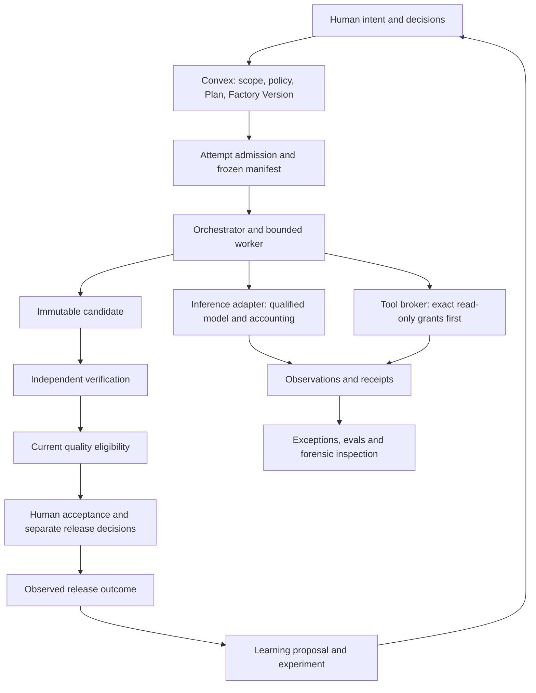

# Complete FDLC and Essential AI Capability Coverage

## Decision summary

**Mission Control has much of this already, but it does not yet demonstrate all eight concepts as a complete production system.** Keep the existing delivery kernel. Complete its tool authority, economics, security/incident controls, production evidence, and configuration improvement path rather than building another factory.

The attached infographic is a useful coverage checklist, not a sufficient implementation specification. An endless agent loop, a connector list, a gateway settings screen, and an LLM judge would not meet this product's trust requirements.

This document is a proposed implementation plan, not authorization to dispatch work, change policy, publish, deploy, or spend money. Website instructions, examples, and quickstart commands were treated as reference material. No application code, running service, production data, external website, or existing todo status was changed during this assessment.

### What was examined

- All six requested pages: [FDLC home](https://fdlc.ai/), [Framework](https://fdlc.ai/framework), [Architecture](https://fdlc.ai/architecture), [Mission Control](https://fdlc.ai/mission-control), [Guide home](https://ai-software-factory-mastery.vercel.app/), and [Guide contents](https://ai-software-factory-mastery.vercel.app/guide).
- Ten additional FDLC pages, all 44 guide chapter pages, eight stage pages, and linked front matter/reference pages were retrieved. Chapter headings and implementation sections were reviewed, with deeper examination of the tool, collaboration, loop, evaluation, observability, and resilience build contracts. This is a capability audit, not a line-by-line editorial audit of the entire guide.
- Local implementation, existing plans/todos, the canonical maturity ledger, and retained qualification evidence.
- Newer `origin/main` source and evidence, including the Eval Control Plane and governed planning work. GitHub's public API confirmed that `1d27266d5d6892a37f897c7d0fe325fe811e63fe` was public main during the audit; the local checkout is older. No branch was switched or merged.
- [Source manifest](../research/2026-09-04-fdlc-capability-audit/source-manifest.json): 81 public-page retrieval records with content hashes and review-depth notes.

**Evidence limits:** Code presence establishes implementation, not configured availability. Retained browser/test evidence establishes the cited historical scope, not a fresh successful run. No current deployed Mission Control instance was exercised. Public pages are reference claims, never proof that a capability is enabled in the user's running factory.

## 1. The eight concepts: current assessment

| Concept from image | Assessment | Concrete evidence | Remaining work |
| --- | --- | --- | --- |
| Agentic loops | **Implemented; real-work completion still needs proof** | `convex/executionWorker.ts` enforces claims/lease expiry and recovery; `packages/workflow-engine/src/implementationPolicy.ts`; `convex/loopEngineering.ts`; frozen Attempts and recovery evidence | Qualify changed-hypothesis retries, progress/oscillation detection, budget exhaustion, and restart on the chosen real workflow. Keep model/session resume distinct from durable workflow recovery. |
| MCP | **Missing admitted governed runtime** | Both manifests in `packages/workflow-engine/src/harnessManifests.ts:81` and `:133` still declare `mcp: UNSUPPORTED` on reviewed main | One versioned read-only server, operation grants, broker, revocation, call receipts, and hostile-output tests before connector breadth. |
| Subagents / multi-agent systems | **DAG orchestration implemented; broader collaboration partial** | `packages/workflow-engine/src/graph.ts` provides AGENT/REDUCE/ROUTER/VERIFY/GATE nodes and bounded concurrency; Loop Engineering materializes dependency-ready Tasks | Prove child authority, isolated context, aggregate reservations, failed-child joins, cancellation propagation, conflict handling, and measured benefit over a single worker. Do not infer support for arbitrary native subagent nesting. |
| AI gateway | **Partial** | `packages/model-router/`, `convex/executionRouting.ts`, exact Factory tuple eligibility and frozen routing decisions; `apps/orchestration-server/src/gateway-proxy.ts` is a WebSocket integration proxy | A consistent inference request boundary with scoped identity, call accounting, per-provider limits, approved fallbacks, cancellation and request receipts. Existing proxy naming is not evidence of all these controls. |
| Inference economics | **Partial; complete accepted-outcome cost unproven** | `convex/costEvents.ts`, `packages/model-router/src/cost-estimator.ts`, trace token fields; V3 retained actual priced cost as `null` | Provider-aware cache/reasoning accounting, price versions, authenticated idempotent ingestion, reservation settlement, failed-attempt attribution, complete-or-explicitly-incomplete totals. |
| Evals | **Implemented, including newer Eval Control Plane V1** | Main's `convex/evalControlPlane.ts`, `convex/lib/evalControlPlaneSchema.ts`, `evals/mission-control-golden-v1/`; existing `convex/observability.ts` | Expand beyond deterministic evidence replay into representative production datasets, calibrated judges where appropriate, repeated comparisons, fixture reconstruction, and drift detection. Reuse existing suites/baselines/receipts. |
| Guardrails | **Substantial controls; incomplete full boundary coverage** | Policy envelopes, service identity, exact admission, independent verification, redaction in `convex/lib/observability.ts`, remote execution policy | Govern tools and egress, enforce selected data-loss controls before external calls, rehearse prompt/tool poisoning, unify containment and safe restoration. A text filter cannot guarantee jailbreak prevention. |
| Observability | **Implemented diagnostic system; production correlation partial** | `convex/observability.ts`, `convex/lib/observabilityPersistence.ts`, Trace Inspector, retained browser evidence | Correlate model/tool calls through PR/release/outcome, close cost gaps, define SLOs and retention, export redacted forensic bundles; add an OTel adapter only for a selected consumer. |

The website itself labels governed MCP and the incident lifecycle as planned. It also separates available, experimental, and planned capabilities. Preserve those distinctions in the product. [Source: FDLC Mission Control](https://fdlc.ai/mission-control).

### Findings that change the implementation plan

1. **Do not rebuild evals.** Public main includes a seven-case golden suite, sealed assertions, negative controls, immutable baseline promotion, complete-case accounting, and `PASS/WARN/FAIL/INVALID` receipts. Its schema fixes `releaseBlocking` and `acceptanceAuthority` to `false`. Existing observations/datasets/experiments remain the granular layer.
2. **Do not equate the V3 pilot with a real product rollout.** Retained V3 evidence reports 15/15 accepted disposable workloads and three live remote samples, with priced model/provider costs unknown. It is strong qualification evidence with explicit limits.
3. **A later real planning-to-PR path still has a NO-GO.** The superseding 2026-08-30 record reports an authorized Attempt that failed because its worktree lacked usable dependencies. A preparation fix was committed for future runs; no new successful candidate, independent verification, or publication follows merely from that fix. Earlier paragraphs in the record describe earlier attempts and must not override the superseding entry.
4. **Cache cost is not universally 10%.** `CostEstimator.calculateCost` currently uses generic 0.1 cache-read and 1.25 cache-write multipliers. Replace these assumptions with versioned provider semantics before describing calculated cost as actual. Check whether cached tokens are included in each provider's input total to prevent double counting. This is a targeted accounting issue, not evidence that every current total is wrong.
5. **Cost writes need authority and duplication scrutiny.** The inspected `costEvents.record` accepts caller identifiers and amounts and inserts after an agent lookup; no permission or idempotency check appears in that function. Add explicit authenticated ingestion and cross-scope checks before using these records for billing-grade metrics or routing. A focused boundary audit is required; this inspection did not test exploitability.
6. **Guide case studies are pinned history.** Some chapters describe older states that newer code has surpassed. Treat their engineering requirements as design input, and their implementation claims as revision-specific evidence.

Pinned main references: [Eval architecture](https://github.com/jaydubya818/MissionControl/blob/1d27266d5d6892a37f897c7d0fe325fe811e63fe/docs/architecture/eval-control-plane-v1.md), [Eval browser evidence](https://github.com/jaydubya818/MissionControl/blob/1d27266d5d6892a37f897c7d0fe325fe811e63fe/docs/testing/evidence/eval-control-plane-v1/README.md), [live planning go/no-go](https://github.com/jaydubya818/MissionControl/blob/1d27266d5d6892a37f897c7d0fe325fe811e63fe/docs/testing/evidence/governed-planning-agent-v1/go-no-go.md).

## 2. Reconcile the websites into one product model

The FDLC framework distinguishes the factory's lifecycle from the software lifecycle running inside it. The guide's eight stages are a teaching view. Neither should create a competing Task or Attempt state machine. [Framework](https://fdlc.ai/framework), [Guide home](https://ai-software-factory-mastery.vercel.app/).

### Outer lifecycle: engineering the factory

| FDLC stage | Reuse in Mission Control | Completion needed |
| --- | --- | --- |
| Discover | Missions, recipes, retained metrics, research | Persist a measured candidate workflow and baseline: cost, elapsed time, human effort, defects, owner, exclusions. |
| Design | Mission Spec, Plan, Quality Contract, Factory Definition | Make one reviewable factory-line contract including scope, risk, delegation, outcome measure, failure policy, and rollback. |
| Assemble | Factory Versions, agent/context/skill records, manifests, model routes, sandbox profiles | Add exact tool grants and compatibility/revocation checks; produce a complete resolved configuration digest. |
| Validate | Readiness, qualification suites, eval receipts, independent verification | Bind reproducible qualification and negative controls to that exact Factory Version. |
| Deploy factory | Controlled Factory activation | Add explicit baseline comparison, environment-specific promotion evidence and rollback lineage where absent. This is not software deployment. |
| Operate | WorkOrders, Attempts, queues, decisions, trace inspector | Close real-work proof, incident lifecycle, limits, SLOs, and overnight recovery. |
| Improve | Factory Learning, experiments, proposed WorkOrders | Feed accepted real outcomes; evaluate and human-approve a replacement version; retain rollback. |

### Inner lifecycle and artifact mapping

| FDLC artifact | Existing authoritative home | Disposition |
| --- | --- | --- |
| Intent | Mission | Reuse |
| Specification | Mission Spec revision | Reuse; expose readiness and flag state honestly |
| Plan | Versioned Mission Plan | Reuse; approval binds exact revision |
| Work Order | WorkOrder and revision | Reuse |
| Attempt | WorkflowRun linked to canonical Task | Reuse; no parallel AgentRun table |
| Evidence | Evidence envelope, run artifacts, verification receipts | Reuse; retain integrity/currentness |
| Verification | Verification Subject, Plan, separate Attempt, result | Reuse; producer does not certify itself |
| Approval | Existing scoped decisions and human acceptance | Reuse; plan, acceptance, merge and deployment are distinct |
| Release | Existing release/deployment records and gates | Extend observed-release proof |
| Outcome | Existing metrics/observations and release linkage | Define accepted, verified, released, and observed value separately; complete missing observation contract |
| Learning Signal | Factory Learning signal/candidate | Reuse; no automatic production promotion |

Task, candidate, PR, environment, identity and lease are supporting implementation records, not additional FDLC lifecycle stages. The [FDLC specification page](https://fdlc.ai/spec) explicitly says a stable schema is not released: add an experimental mapping/export later, not a claim of standards certification.

### Six architecture areas

| Area | Current center of implementation | Gap work |
| --- | --- | --- |
| Intent | Mission Spec/Plan/WorkOrder | Real planning-to-delivery proof, readiness correctness, measurable outcome baselines, shared QA/product/design contributions |
| Harness | Worker runtime and workflow engine | Capability-specific conformance, child reconciliation, restart/cancel/cleanup proof |
| Capability | Agent registry, Context Registry, Factory Memory | Governed tools; exact skill/tool revocation; compatibility and complete locks |
| Model | Model router and Factory tuple admission | Common inference accounting boundary, qualified fallback, complete costs and calibration |
| Trust | Policy, identity, quality, verification, approvals | Data/tool boundary tests, incident restoration, security and release evidence |
| Learning | Signals, clusters, experiments and candidates | Production signals, regression-resistant promotion, outcome measurement |

These are responsibilities, not six new services or navigation groups. [Architecture source](https://fdlc.ai/architecture).

## 3. Relationship to existing work

This is a coverage extension of [Production Convergence](2026-08-25-feat-software-factory-production-convergence-plan.md), not a replacement program. Keep the [canonical maturity ledger](../product/software-factory-capability-maturity.md) authoritative. Update it only when evidence warrants a status change.

| Existing work | How this plan uses it |
| --- | --- |
| Todo 059, real product-repository pilot | Phase 1; retain named-owner, local-execution and ten-accepted-WorkOrder gates |
| Todo 060, incident command | Phase 2; thin aggregate and explicit restoration |
| Todo 061, read-only MCP | Phase 3; implement exactly one proof before connectors |
| Todo 062, shared builder intent | Phase 6; same Mission records, no persona silos |
| Todo 063, economics/routing | Phase 4; extend provider accounting and reservations; keep recorded dependency on 062 unless owner explicitly approves resequencing |
| Existing observability and learning plans | Extend production coverage rather than duplicate stores |
| Main's 2026-09-02 Eval Control Plane | Phase 0 baseline adoption, Phase 5 expansion only |

Phase numbers describe proposed delivery slices. They do not silently alter existing todo dependencies or the earlier requirement to obtain a recorded pilot go/no-go before authorizing downstream implementation. Accounting discovery and fixture design can support the pilot; moving implementation ahead of its existing dependency requires a recorded sequencing decision.

## 4. Implementation design

### Authoritative boundary

Convex keeps domain authority. The existing Hono/orchestration service owns long-running coordination and external adapters. Use its authenticated service-command boundary; do not add a second general REST domain backend. Models and tools never receive publication, acceptance or governance authority merely because they execute inside an authorized Attempt.

### Contract additions and extensions

Proposed names below are design labels, not claims that tables already exist. Final schema review must reuse equivalent existing records before introducing a new table.

| Contract | Required fields and invariants | Placement |
| --- | --- | --- |
| ToolVersion / ToolGrant | Tenant/workspace, owner, server/operation identity, implementation and schema digests, protocol/transport, side-effect class, destinations, data class, timeout, lifecycle, revoke reason | New narrow schema fragment plus `convex/factory/tools.ts`; grant IDs frozen into Factory Version and Attempt |
| ToolCallReceipt | Attempt, lease generation, exact grant/version, request ID, sanitized input/output digests, decision/reason, start/end, result status, bytes/cost, revocation/timeout facts | Existing observation/artifact lineage; persist authoritative authorization receipt before consequential effects |
| InferenceRequestReceipt | Attempt/parent, provider request ID, exact model/profile/policy, route reason, limits, retry/fallback, usage basis, price version, actual/estimated/unknown status | Extend model adapter and canonical observation/cost contracts |
| BudgetReservation | Workspace/Mission/WorkOrder/Attempt, parent-child allocation, dimensions, reserved/settled/unknown liability, idempotency and generation | Convex transactional authority; adapters cannot reserve locally and assume global capacity |
| FactoryIncident | Scope, owner, severity, state, affected Attempt/version/releases, existing evidence refs, containment commands and observed acknowledgements, restoration decision | New thin `convex/factory/incidents.ts`; append transitions; no duplicate evidence warehouse |
| OutcomeObservation | WorkOrder/release/exact commit, metric definition/version, baseline, measurement window, observed value, source, coverage, confidence, corrections | Extend existing outcome/release projections; raw facts immutable, derived values versioned |
| Factory qualification/promotion | Exact version/configuration, baseline, suite receipt refs, hard gates, authorized decision, environment, rollback target | Extend Factory configuration and existing eval baseline/experiment records |

Every externally submitted fact needs authenticated principal, verified scope, bounded payload, duplicate/replay handling, audit attribution, and rejection semantics. Raw provider content and tool descriptions remain untrusted input.

### Economics rules

1. Record uncached input, cached read, cache write, output and reasoning tokens according to provider-reported semantics. Store which counts overlap; never sum overlapping categories.
2. Maintain provider/model price versions and effective dates. Record currency, billing unit and source. Separate actual billed amount from an estimate derived from tokens.
3. Reconcile duplicate, late and corrected usage by provider request ID and Attempt. Unknown telemetry remains unknown; do not release a reservation as free spend solely because the provider disconnected.
4. Roll up all implementation, validation, retry and failed-work costs once. Include tool/compute/sandbox/CI components when measured. Report human effort in minutes separately; optional monetary allocation requires an explicit rate assumption.
5. Show partial totals with coverage and missing components. A complete-looking dollar total must never omit unmeasured components silently.
6. Cost per accepted WorkOrder = attributable cohort cost, including failures and retries, divided by accepted WorkOrders in the defined cohort. Zero accepted outcomes yields undefined, not zero. Report cost per independently verified outcome and cost per observed production outcome as distinct metrics.
7. A parent allocates bounded child reservations; children cannot each spend the full parent limit. Concurrent admission and settlement must be transactional and idempotent.
8. For subscription/CLI routes without per-request pricing, retain approved caps and explicitly unavailable actual cost; do not invent metered prices. Do not weaken current hard-budget admission to get a pilot to run.

### Delegation and loop rules

Each child receives only its scope, context references, exact tool/model grants, parent identity, output contract, acceptance expectations, deadline, cost/tool/token limits, and cancellation policy. A child cannot widen scope or transfer its whole parent grant to another child.

Define join semantics explicitly: required branches must succeed; optional branches may produce a visibly partial result only if the approved contract permits it. Conflicting outputs become an exception, never a silent reducer choice. Read-only parallelism can proceed where authorized; preserve existing repository mutation serialization until independently isolated branches and integration are proven.

Record a compact progress signature, evidence delta, failure class and next hypothesis. Stop on repeated identical failure, oscillation, exhausted limits, missing authority or unsafe tool output. Do not collect private chain-of-thought: decisions, action summaries and evidence are sufficient for operation and diagnosis.

## 5. Phased delivery plan

Effort ranges are planning estimates in engineer-days, not commitments. They assume one experienced implementer, existing infrastructure, and timely reviewer access. Provider limitations and pilot observation time can dominate elapsed time. Do not total these into a promised launch date.

### Phase 0 — Establish the correct baseline and coverage contract

**Outcome:** A reviewer can tell what is present, enabled, proven, or still missing.

- [ ] Start implementation from an explicitly verified current main; retain this audit's two source revisions.
- [ ] Reconcile the existing maturity ledger with main's eval control plane and superseding planning NO-GO. Do not overwrite historical evidence or downgrade already-proven mechanisms because an older guide chapter says they were absent.
- [ ] Add a requirement-to-evidence projection to the existing Factory Overview/Docs surface: source, capability, status, exact revision, environment, latest evidence, limitation, owner and next gate.
- [ ] Confirm configured feature flags and active Factory tuples in the target environment read-only. Show unavailable and unqualified paths explicitly.
- [ ] Map all eight concepts and the chapter inventory below to an existing WorkOrder or a proposed bounded slice.

**Touchpoints:** maturity ledger, Factory Overview, existing Docs registration; main's eval architecture and planning evidence.

**Exit:** No “available” claim relies solely on a screenshot, filename, old plan, or unsupported manifest. Every displayed status links to evidence or states that evidence is missing.

**Estimate:** 2–3 days. **Owner:** Product + Platform.

### Phase 1 — Complete one real governed delivery line

**Outcome:** Prove the already-built system before expanding its authority.

- [ ] Complete todo 059's pilot identity requirements: exact repository, team, champion, FDE and incident commander. Use the recorded local execution default for sensitive work.
- [ ] Select bounded, repetitive work with explicit criteria and a baseline. Dependency modernization or documentation maintenance are candidates, not selected targets.
- [ ] Recheck that the newer worktree dependency preparation fix is in the execution baseline; independently prepare verifier dependencies too.
- [ ] Walk Mission → Spec → researched Plan → exact human approval → released WorkOrder → readiness → Task/Attempt → candidate → separate verification → review package → authorized PR → human acceptance.
- [ ] Verify WorkOrder-specific risk, model/workload, cost and host readiness before the UI promises dispatch readiness. A repository-wide “Ready” card must not imply an individual WorkOrder can run.
- [ ] Preserve a real failure and a separately authorized corrective Attempt; no historical failure relabeling.
- [ ] Record the ten accepted WorkOrders and workload classes required by todo 059, with explicit metric coverage and a go/no-go decision.
- [ ] Exercise restart, provider outage, cancellation, stale evidence, PR-head drift, revocation and cleanup failure. Use existing controls and the required named preflight incident drill until Phase 2 is admitted.

**Touchpoints:** `apps/orchestration-server/src/factoryAttemptWorker.ts`, main's `factoryGitRuntime.ts` and planning worker, `convex/workOrders.ts`, Factory readiness, existing pilot scripts and review UI.

**Exit:** One complete real lineage through acceptance, followed by the existing ten-outcome pilot gate; no hidden database repairs or weakening of risk/cost/verification requirements. Record the new run's own evidence rather than borrowing V3's result.

**Estimate:** 4–7 days setup/closure plus the ten-workload observation period. **Owner:** Platform + QA + named pilot team.

### Phase 2 — Close guardrail and incident control gaps

**Outcome:** Unsafe work can be contained, explained and restored through the product.

- [ ] Implement todo 060's incident aggregate over existing evidence and controls.
- [ ] Preserve the approved response lifecycle: Clarify → Contain → Observe → Isolate → Restore → Correct → Prevent → Measure. Map UI states to these actions; command acknowledgement is not proof of containment.
- [ ] Add affected-layer classification: intent, context, model, tool, workflow state, policy, evaluator, provider or environment.
- [ ] Separate pause/drain/cancel/revoke/quarantine actions; show scope, pending acknowledgement, observed effect, deadline and remaining external liabilities.
- [ ] Apply selected data-class rules before outbound model/tool requests and before logging. Distinguish secret redaction from general PII/DLP coverage. Keep content capture off by default.
- [ ] Run injected repository-instruction, tool-description, tool-output, secret-exfiltration, cross-workspace, stale-grant, forged-receipt and verifier-contamination cases.
- [ ] Require independent recovery evidence and explicit authorized restoration. Incident closure does not reactivate a grant or routing policy.

**Touchpoints:** `convex/factory/incidents.ts` (new), schema fragment, service commands, policy engine, observability sanitization, existing operator controls and Ops/Incidents navigation.

**Exit:** Each drill has an attributed incident, bounded containment, retained forensic facts, restoration evidence and follow-up. Sensitive remote work remains blocked without required provider-enforced egress proof.

**Estimate:** 6–9 days. **Owner:** Security/SRE + Platform.

### Phase 3 — Prove one governed MCP integration

**Outcome:** One tool can be used safely from an admitted Attempt, with complete lineage.

- [ ] Implement todo 061 using one approved internal read-only documentation/repository service; no write credentials.
- [ ] Register exact server implementation and tool schema identities, transport/protocol version, allowed destinations, operation schemas, ownership, lifecycle and revocation.
- [ ] Resolve grants at Factory qualification and freeze them per Attempt. Revalidate revocation and scope at call time.
- [ ] Add a host-owned broker with short-lived scoped authorization, schema validation, timeout/size limits, redirect/destination controls, sanitized results, and call receipts.
- [ ] Enable MCP only in the exact qualified harness/backend path. Keep unsupported combinations unsupported; discovery does not create grants.
- [ ] Test server/schema substitution, poisoned output, replay, credential expiry/revocation, partial response, timeout, cancellation, payload limits and cross-workspace denial.
- [ ] Show connection health, version, allowed operations, last denial and call evidence under existing Factory Configuration/Registry and Attempt inspector surfaces.

**Touchpoints:** new `convex/factory/tools.ts`, broker module under orchestration server, harness contract/manifests, Factory configuration, existing trace ingestion.

**Exit:** A real authorized call and every negative case are demonstrated in the browser-operable golden path. The service cannot write, leak another workspace's context or turn returned instructions into authority.

**Estimate:** 6–10 days after service selection. **Owner:** Platform + Security.

### Phase 4 — Finish inference gateway and outcome economics

**Outcome:** Every supported call has an explainable route, bounded spend and honest usage.

- [ ] Extend the current router/adapters through a shared request contract; keep the WebSocket integration proxy separate in purpose and naming.
- [ ] Require authorized Attempt identity, exact route/model, data policy and reservation before call admission.
- [ ] Implement per-provider concurrency/rate limits, bounded backoff, timeout and cancellation. A fallback rechecks all eligibility and obtains a new recorded decision; never silently route to a cheaper but disallowed model.
- [ ] Normalize usage and provider price versions; replace universal cache multipliers; document overlapping token categories and incomplete CLI telemetry.
- [ ] Harden `costEvents.record` or route canonical ingestion through an authenticated internal command with verified tenant/WorkOrder/Attempt joins and idempotency.
- [ ] Implement transactional parent/child reservations and settlement, including uncertain provider outcomes and late receipts.
- [ ] Integrate todo 063's versioned outcomes, coverage and cost formulas; preserve its existing dependencies unless explicitly resequenced.
- [ ] Compare one supported route against an approved alternative using actual accepted outcomes. Keep Guarded Auto off until all current promotion criteria and complete hard eligibility are satisfied.

**Touchpoints:** model-router providers/types/cost estimator, `convex/costEvents.ts`, `convex/lib/executionRouting.ts`, quota/reservation authority, model routing and cost UI.

**Exit:** One measured provider route reconciles usage to its documented billing semantics; duplicates count once; a concurrent fan-out cannot overspend its parent; unknown costs cannot improve routing rank. Unsupported routes are visibly unavailable rather than fabricated.

**Estimate:** 7–12 days. **Owner:** Platform + ML/AI + Product.

### Phase 5 — Expand evals and prove bounded multi-agent operation

**Outcome:** More agents or a changed model must earn their place with comparable evidence.

- [ ] Extend main's existing EvalSuite/Run/Receipt/Baseline model and granular datasets/experiments; do not introduce another acceptance system.
- [ ] Add representative real-work fixtures with pinned repository, configuration, environment and context identities; separate development, regression and restricted holdout access.
- [ ] Preserve complete-case accounting, invalid/skip semantics and negative controls. Add workload/risk slices so aggregate improvement cannot hide a critical regression.
- [ ] Where model judges are justified, version model/prompt/rubric and calibrate against labeled examples; show agreement and false-positive/negative rates. Deterministic verification remains responsible for hard delivery criteria.
- [ ] Predeclare repeated baseline/candidate trials, success/non-regression thresholds, observation window, sample rationale and rollback. Report uncertainty; do not adopt a universal sample count from the infographic.
- [ ] Qualify one authorized fan-out/join workflow against a single-worker baseline, including failed child, timeout, cancellation, conflicting outputs, duplicate events and lease recovery.
- [ ] Keep trace inspection, mocked-tool replay and new live execution as separately labeled modes. A replay receipt cannot masquerade as a new provider run.

**Touchpoints:** main's `convex/evalControlPlane.ts`, `packages/shared/src/evalControlPlane.ts`, `evals/`, observability experiments, workflow-engine graph, coordinator and worker contracts, Eval library.

**Exit:** Complete configuration provenance, negative controls, child budget conservation and reproducible comparisons; no eval verdict grants dispatch, acceptance, merge or release authority.

**Estimate:** 7–11 days plus trial time. **Owner:** ML/AI + QA + Platform.

### Phase 6 — Connect production outcomes and the FDLC improvement loop

**Outcome:** Operate and improve one factory line from real results.

- [ ] Extend existing Factory Definition/Version UI with baseline, qualification receipt, environment activation and rollback references for the outer lifecycle.
- [ ] Complete todo 062's shared contributions: QA contributes assertions, product defines outcomes, design supplies acceptance references to the same Mission/Spec/Plan.
- [ ] Observe one authorized real release using its exact repository/commit/artifact/environment; distinguish accepted, merged, deployed, activated and production-verified.
- [ ] Record production defect/reopen/rollback/outcome observations from the approved source, with measurement window and ownership. Unknown observation remains unknown.
- [ ] Correlate Attempt/model/tool/CI/PR/release events in the existing inspector. Add finite retention and redacted forensic export; OTel transport is optional until a destination is chosen.
- [ ] Feed a real observed failure or correction into Factory Learning → candidate → frozen experiment → human-reviewed Plan → replacement Factory Version. Demonstrate rollback and no self-promotion.
- [ ] Populate outcome/attention metrics and an evidence-backed morning briefing from persisted decisions and events. Notification destinations and overnight schedules require their own configured authority.

**Touchpoints:** Factory configuration, release projection and panels, Factory Learning, context/memory provenance, existing overview/health/trace surfaces.

**Exit:** One real software outcome leads to one evaluated, reviewed factory improvement. No page equates deployment success with user value. Any automated rollback is limited to separately approved conditions; otherwise use an explicit human decision.

**Estimate:** 8–12 days plus production observation. **Owner:** Product + SRE + Platform + QA.

### Phase 7 — Scale only from repeated operating proof

Track these as separate later WorkOrders, not prerequisites for the initial line:

- [ ] Two-repository coordination with compatibility gates, ordered PRs, partial-release handling and coordinated rollback; registration alone is insufficient.
- [ ] Fair scheduling and capacity policies for many Missions with starvation/priority inversion tests and tenant cost isolation.
- [ ] Enterprise identity provisioning, retention, residency, disaster recovery and service-level commitments only after explicit customer requirements.
- [ ] Semantic/ontology governance when real retrieval failures require it: versioned meanings/units, contradiction handling, correction propagation and domain-owned tests.
- [ ] Uniform transitive capability locks, revocation propagation and certification across skills, agents, tools and evaluators.
- [ ] Experimental FDLC artifact export/import mapping once semantics are stable; import never transfers approval authority.

The [Enterprise page](https://fdlc.ai/enterprise) marks its offering as proposed. The [Deploy page](https://fdlc.ai/deploy) advocates proving one bounded line before scale. These are future scope and adoption guidance, not evidence that the open-source application already supports enterprise operation.

## 6. Operator experience and failure behavior

Use `docs/design.md` and `.claude/skills/design/` for implementation. Reuse current v2 pages and semantic tokens. New capabilities must be reachable from left navigation, but normally as tabs/details under existing domains.

| Existing surface | What to add or verify | Failure/empty behavior |
| --- | --- | --- |
| Command Center | Decisions, budget risk, incident owner, stale evidence, next safe action | No worker/provider configured shows setup action; unavailable data is not a green status |
| Mission / Plan | Baseline, measurable outcome, scope/version diff, WorkOrder readiness | Drift requires revision/reapproval; never silently refresh approved inputs |
| Factory Configuration / Registry | Exact tool grants, route capability, qualification, version rollback | Unsupported/revoked combinations cannot activate or dispatch |
| Attempt inspector | Parent/child joins, progress, tool decisions, reservation/usage, trace lineage | Partial, timed out, canceled, stale lease and unknown provider effect are distinct |
| Observability & Evals | Existing eval receipts plus coverage, slice regressions, calibration | Invalid run is an evaluator/accounting problem; missing case cannot pass |
| Ops / Incidents | Containment, observed effect, restoration authority, forensic bundle | Retry does not clear an incident; closed alert does not restore authority |
| Release / Learning | Observation window, outcome confidence, proposed improvement | Not-yet-observed does not become verified; unapproved candidate stays inactive |

Every changed flow needs loading, empty, degraded, error, denied, success and recovery states; refresh/restart persistence; keyboard operation; 390px and desktop layouts; light/dark and non-color status cues. Apply shared shell/layout fixes consistently across v2 pages.

## 7. Acceptance and verification matrix

| Scenario | Required observable result |
| --- | --- |
| Exact approved Plan dispatched twice | One logical dispatch; one immutable Attempt per authorized try; explicit duplicate result |
| Plan, policy, tool grant or PR head changes | Old authority/evidence becomes ineligible where applicable; explanation links to changed version |
| Worker dies, old worker later reports success | New fenced owner recovers; stale completion cannot publish or certify |
| Parent canceled during fan-out | Child cancellation acknowledged and observed; unresolved external effects remain visible; unused reservations settle safely |
| Two children request remaining budget simultaneously | Transactional allocation admits only permitted aggregate liability |
| Provider returns 429, disconnects, or emits late usage | Bounded retry/fallback under policy; cost remains unsettled/unknown until reconciled |
| Tool result asks for secrets or wider authority | No new permission; outbound protection and incident evidence show the denied action |
| Grant revoked during an active Attempt | New calls denied; in-flight effects reconciled; credentials revoked where possible |
| Dataset case missing, duplicated or invalid | Eval receipt cannot publish a false pass; retained invalid run points to failure origin |
| Good judge score with failed independent criterion | WorkOrder stays blocked; eval does not satisfy acceptance |
| Verifier receives wrong candidate/context | Exact-subject gate rejects it and preserves mismatch evidence |
| Production measurement not yet available | Outcome remains unobserved/partial with deadline and owner |
| Learning candidate appears successful | Requires existing experiment and human promotion path; no mutation of active policy |
| User changes workspace or opens copied entity URL | Server-side scope checks deny unauthorized reads/writes; no cost/tool/evidence leakage |
| Browser refresh, expired login or duplicate click | Durable state remains true; recovery/re-authentication is explicit; no duplicate effect |

### Required checks during implementation

- Focused contract, authorization, accounting, worker and failure-injection tests for each slice.
- Main's `pnpm run eval:mission-control` for deterministic eval integrity; it is not present on the older checkout until baseline convergence.
- `pnpm run ci:typecheck`, `pnpm run ci:runtime-contract`, `pnpm run release:security`, and applicable Factory qualification gates.
- `pnpm run qualify:factory` plus real pilot evidence; fixture qualification is necessary but insufficient for production promotion.
- Browser evidence with real scoped records and the full state matrix. Preserve the user's existing 5199 Research Lab; use a disposable backend/alternate port for destructive fixtures. Never run a force seed against a shared database merely because a website quickstart suggests it.
- Atomic Convex table/validator/index/generated-type updates. Apply the existing [schema-drift lesson](../solutions/build-errors/missing-convex-schema-contracts-ci-20260730.md); no compatibility shim posing as the full contract.

### Program ship gate

All eight concepts have a scoped implemented path or an explicitly disabled unsupported path; the selected real line exercises the required ones. The ten-outcome pilot has current evidence, complete-or-explained-unknown economics, a working incident process, one governed MCP proof, comparable evals, and a release-outcome-to-reviewed-improvement loop. Broader claims require their own evidence; no product-wide maturity level is assigned from an average.

## 8. Metrics and rollout

Use a versioned dictionary for the twelve FDLC benchmark families: verified completion, cost per verified outcome, human review minutes, cycle time, first-pass verification, reopen, rollback, escaped defects, policy violations, recovery success, cost by work type, and verifier disagreement. Record denominator, cohort, window, sample, missingness and evidence links. [Benchmark source](https://fdlc.ai/benchmarks).

Initial targets are proof requirements rather than fabricated performance promises:

- 100% of admitted pilot Attempts link to exact authority and configuration; 100% of accepted outcomes link to independent current evidence and human decision.
- Zero successful unauthorized operations in the negative-test suite; every injected critical containment event has an observed result and accountable owner.
- Zero duplicate accounting for replayed provider receipts; every displayed monetary total exposes coverage.
- At least ten accepted WorkOrders under the existing pilot protocol; this is a pilot threshold, not statistical proof of reliability or a replacement for routing-specific promotion gates.
- Baseline-relative quality, time, cost and review effort are measured before claiming improvement. Agree thresholds before each experiment.

Roll out behind existing capability flags and exact Factory Versions. Start in qualification/advisory mode, then the named local pilot, then one bounded production line. Roll back by disabling the new path and restoring an eligible prior version; preserve Attempts, receipts, decisions and incidents. Keep merge, release, routing automation and learning promotion at their existing authority ceilings.

## 9. Decisions to resolve before dependent implementation

No answer is needed to review this plan. These choices should be made at the relevant phase, not inferred from the websites:

| Decision | Recommendation | Alternative / tradeoff |
| --- | --- | --- |
| Pilot repository and named operating team | One real controlled repository, local worker, explicit owners | Disposable fixtures are easier but cannot close the real-work gap |
| First MCP service | Read-only internal documentation/repository service | Broader SaaS/write connectors add credentials, side effects and test scope |
| Metered inference route for economics | One already-approved provider with attributable usage | Subscription route preserves convenience but may leave actual per-call cost unknown |
| Todo 063 ordering | Preserve current dependency graph by default; explicitly consider a narrow accounting prerequisite if pilot needs it | Reordering may improve measurement sooner but changes the accepted work sequence |
| Data classes and outbound policy | Minimal approved data; sensitive remote work remains blocked under existing egress policy | Broader context can help generation but requires stronger containment and evidence |
| Production outcome/rollback source | One exact release plus an approved defect/health source and observation window | A generic integration platform postpones the first complete feedback proof |
| OTel destination and retention | Defer external exporter until an operational consumer is selected | Adopting one now adds transport, retention, credentials and vendor operations |

Do not reopen already-recorded decisions: preserve human-owned merge, no learning self-promotion, exact verification, current sensitive-repository egress requirements, and gated routing. Recommendations here do not authorize spending or production actions.

## 10. Recommended first reviewable change

**Baseline and truthful readiness.** Use current main, reconcile the maturity ledger and eval status, and make WorkOrder-specific readiness explain risk/model/cost/host blockers consistently. Then complete the already-authorized pilot prerequisites and request the exact missing pilot identities when execution is ready to begin.

Follow with incident controls, one governed MCP proof, inference accounting, eval/collaboration qualification and observed production learning in the dependency order above. Keep changes as small independently reviewable PRs, each with its own acceptance evidence and rollback. No new primary product domain is required.

## Appendix A — Guide chapter coverage and disposition

This map covers all 44 chapters from the [Guide contents](https://ai-software-factory-mastery.vercel.app/guide). It maps engineering themes, not every educational example, vendor mention, prediction or proposed enterprise feature. A chapter is not an automatic requirement to build a new subsystem. Specific source URLs are retained in the source manifest.

| Ch. | Theme | Mission Control disposition | Phase |
| --- | --- | --- | --- |
| 1 | Why engineering is changing | Existing North Star; prove outcomes rather than generation volume | 1, 6 |
| 2 | Factory in one view | Preserve teaching/architecture/lifecycle mapping without competing states | 0 |
| 3 | Trust, evidence, authority | Existing gates; do not invent calibrated trust/autonomy scores without evidence | 2, 5, 7 |
| 4 | Human-agent operating model | Existing roles; complete actionable escalation and overnight operating proof | 1, 2, 6 |
| 5 | Authoritative records | Reuse domain spine and exact lineage; fill outcome linkage | 0, 6 |
| 6 | Intent/specification | Reuse newer planning agent; close live execution gap and specific ambiguity/NFR handling | 1, 6 |
| 7 | Governance and risk | Existing policy/approval; test revocation and consequence-specific ceilings | 2 |
| 8 | Metrics and human attention | Existing projections; measure outcome cohorts and reviewer effort | 4, 6 |
| 9 | Tokenomics | Partial accounting; provider usage semantics, prices, complete cost and reservations | 4 |
| 10 | Multi-repository delivery | Registration exists; coordinated compatibility/PR/release proof deferred | 7 |
| 11 | Agent Factory | Versioned substrate exists; unify exact capability locks and revocation incrementally | 3, 7 |
| 12 | Skills as packages | Reuse registry/version/eval lifecycle; qualify exact skill binding | 5, 7 |
| 13 | Control/orchestration/execution planes | Preserve Convex authority and bounded Hono coordination | All |
| 14 | Durable execution | Existing Attempts/leases; real recovery and dependency-ready worktree proof | 1, 5 |
| 15 | Harnesses and protocols | Generic contract exists; MCP first, other protocol bridges demand-driven | 3, 7 |
| 16 | Harness engineering | Adapter-specific conformance, event mapping and honest resume capability | 1, 5 |
| 17 | Environments/sandboxes | Existing admission; keep egress restriction, prove prep/cleanup and recovery | 1, 2 |
| 18 | Agent architecture/tools/context | Loop/registry/context exist; governed MCP and complete tool contract missing | 3, 5 |
| 19 | Data/knowledge/semantics | Factory Memory exists; enterprise ontology/semantic validation remains selective | 6, 7 |
| 20 | Context engineering | Reuse frozen packages; test permissions, freshness, correction and revocation | 2, 5, 7 |
| 21 | Model selection | Existing profiles; qualify exact full configurations rather than model labels | 4, 5 |
| 22 | Routing/escalation | Existing tuple router; complete costs and approved fallback evidence | 4 |
| 23 | Agent/loop engineering | Existing graph; explicit child/join contracts and measured advantage | 5 |
| 24 | Loop defaults | Bound dimensions, prove no-progress/oscillation handling and escalation | 1, 5 |
| 25 | Twelve-layer stack | Responsibility/contract crosswalk, not twelve new services | 0, 7 |
| 26 | Autonomous workflow catalog | One issue-to-PR line first; additional workflow classes separately admitted | 1, 7 |
| 27 | Evidence architecture | Reuse exact independent evidence; extend release boundary | 1, 6 |
| 28 | Testing strategy | Existing tests/gates; risk-based fixture selection, negative controls, escapes → regressions | 5, 6 |
| 29 | Evaluation engineering | Reuse newer control plane; add production fixtures, calibration and comparisons | 5 |
| 30 | Evals as assets | Suites/baselines already exist; add production correlation, expiry and drift | 5, 6 |
| 31 | Quality contracts/proof/certificates | Reuse Quality Contract/receipts; portable certificates deferred pending semantics | 1, 7 |
| 32 | CI/CD and production verification | Existing states/gates; one observed release with rollback proof | 6 |
| 33 | Security | Existing identity/scoping; close tool/DLP/incident and supply-chain drills | 2, 3 |
| 34 | Factory as platform | Existing surfaces; shared builder intent, fair scheduling later | 6, 7 |
| 35 | Observability/forensics | Existing traces; lifecycle correlation, accounting and redacted export | 2, 4, 6 |
| 36 | Resilience/control tower | Canonical incidents missing; disaster recovery/enterprise SLO expansion later | 2, 7 |
| 37 | Surfaces/events/storage | Extend existing UI and durable contracts; check API/UI authority parity | All |
| 38 | Enterprise adoption | Design-partner pilot now; SSO/SCIM/residency/scale requires explicit scope | 1, 7 |
| 39 | Feedback/review/merge queue | Existing review/currentness; real feedback reproduction and bounded correction later | 6, 7 |
| 40 | Governed learning | Existing advisory candidates; connect production signals | 6 |
| 41 | Meta-loops | Existing proposal loop; exact version experiment/promotion/rollback proof | 6 |
| 42 | Mission Control case study | Keep revision-pinned claims and update links to new evidence | 0, all exits |
| 43 | Mastery/leadership | Operating practice and training, not a new feature domain | Pilot cadence |
| 44 | Future directions | Predictions remain research; no automatic V1 requirements | Deferred |

## Appendix B — Local evidence index

- [North Star](../product/mission-control-north-star.md) and [V1 strategy](../product/mission-control-v1-product-strategy.md).
- [Capability maturity](../product/software-factory-capability-maturity.md) and [Production Convergence](2026-08-25-feat-software-factory-production-convergence-plan.md).
- [V3 qualification evidence](../testing/evidence/production-factory-pilot-v3/README.md).
- [Execution routing architecture](../architecture/execution-routing-v1.md).
- [Generic harness contract](../architecture/generic-harness-contract-v1.md).
- [Factory Memory](../architecture/factory-memory-context-intelligence.md).
- [Factory Learning](../architecture/factory-learning-continuous-improvement.md).
- [Loop Engineering](../software-factory/LOOP_ENGINEERING.md).
- [Pilot todo 059](../../todos/059-in-progress-p1-real-product-repository-pilot.md), [incident todo 060](../../todos/060-ready-p1-factory-incident-command.md), [MCP todo 061](../../todos/061-ready-p1-governed-read-only-mcp.md), [shared intent todo 062](../../todos/062-ready-p1-shared-builder-intent.md), [economics todo 063](../../todos/063-ready-p1-outcome-economics-routing.md).

The pinned-main URLs earlier in this plan intentionally reference files absent from this older checkout. Reassess them on the implementation baseline rather than creating similarly named replacements here.

## Audit validation record

- New plan: all relative file links resolve; no trailing whitespace.
- Source manifest: valid JSON, 81 unique retrieved URLs; public main SHA verified against the GitHub API.
- `node scripts/check-factory-docs.mjs`: reports four existing README consistency findings (runtime version, builder loop, delivery lifecycle, Remote Sandbox qualification wording). README is unchanged from HEAD; these are baseline documentation issues, not a passing repository-wide documentation check.
- No application tests or live browser qualification were run for this documentation-only change. All runtime/test outcomes cited above are retained historical evidence, with their scope explicitly identified.
