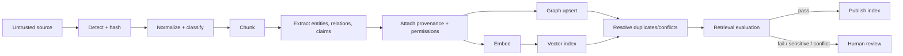

# Production Memory and Graph-Assisted RAG Architecture

## Decision

Use Convex as the initial authoritative operational and graph store behind a
provider-neutral `GraphStoreAdapter`. Build an in-memory implementation for
deterministic tests. Do not add Neo4j until a measured Convex baseline fails a
declared query, scale, latency, or operability threshold.

Obsidian is an import/export and human knowledge-vault format, not the runtime
database.

## Current implementation

Mission Control already has:

- `knowledgeChunks` with a 1536-dimension vector index;
- `knowledgeGraphNodes`, `knowledgeGraphEdges`, and hyperedges scoped by
  `projectId` and source;
- snapshot/neighborhood/import functions in `convex/knowledgeGraph.ts`;
- a Knowledge Graph panel and canvas;
- memory/session/journal/pattern/agent/knowledge-base UI;
- `packages/memory` with session/global/manager tests;
- Context packages and skill lifecycle records;
- WorkflowRuns, events, artifacts, receipts, Tasks, WorkOrders, Missions, and
  Loop Engineering cycles that can provide episodic source material.

The live Research Lab audit showed:

- zero semantic, episodic, and procedural counts;
- an empty “No knowledge graph imported yet” state;
- a nested navigation path: Memory → Knowledge graph → another Memory view →
  Graph;
- import capability but no complete governed source→claim→retrieval lifecycle.

## Gap analysis

1. No canonical memory record that unifies scope, type, provenance, confidence,
   effective time, staleness, conflicts, and supersession.
2. Operational records and imported knowledge graph nodes are not one
   explainable retrieval model.
3. No durable ingestion job/checkpoint lifecycle with dedupe and reindex state.
4. No claim-level evidence or contradiction contract.
5. No permission-aware hybrid retrieval and “why retrieved” explanation.
6. No deterministic evaluation set proving that memory improves a workflow.
7. No correction/merge/supersede lifecycle through the UI.
8. No provider abstraction or operational threshold for external graph adoption.
9. Two overlapping Memory information architectures.

## Memory model

### Shared envelope

Every memory item has:

- stable ID, tenant, workspace/project, repository, type, and schema version;
- source IDs, canonical location, content hash, retrieval timestamp, publisher,
  publication/effective/valid-until dates;
- confidence, verification state, sensitivity, access policy, and owner;
- created/updated/last-used times;
- lifecycle: `CANDIDATE | ACTIVE | CONFLICTED | STALE | SUPERSEDED | RETIRED`;
- superseded-by, conflicts-with, duplicates, and derived-from relationships;
- extractor/model/prompt/tool versions and ingestion run ID;
- human decisions and immutable audit events.

### Semantic memory

Durable facts, claims, concepts, entities, relationships, decisions,
constraints, preferences, architecture facts, and domain definitions.

Claims are not stored as unquestioned facts. A claim has supporting and
contradictory evidence, confidence, scope, effective time, and conflict state.

### Episodic memory

Mission, WorkOrder, Task, run, tool-call, failure, retry, intervention,
decision, validation, deployment, cost, duration, and outcome history.

Operational Convex records remain authoritative. Episodic graph nodes are
references/projections with source record IDs and versions, not copied mutable
state.

### Procedural memory

Skills, workflows, runbooks, prompts, tool guides, policies, architecture
patterns, evaluation guides, versions, promotion state, owners, and test
results.

Promotion states:

`DRAFT → EVALUATING → APPROVED → ACTIVE → DEPRECATED → RETIRED`

An agent can use only versions allowed by workspace policy and compatible with
its identity/capabilities.

## Graph model

Core node types:

`Workspace, Repository, Goal, Mission, WorkOrder, Task, Run, Agent, Identity,
Skill, Workflow, Document, Source, Claim, Decision, Approval, Artifact, Test,
Defect, Incident, Environment, Deployment, Commit, PullRequest, Service,
Component`

Core edge families:

- hierarchy: `OWNS`, `CONTAINS`, `IMPLEMENTS`, `PART_OF`;
- execution: `EXECUTES`, `ATTEMPT_OF`, `DEPENDS_ON`, `PRODUCED`;
- evidence: `SUPPORTS`, `CONTRADICTS`, `VERIFIES`, `CITES`;
- governance: `APPROVED`, `REJECTED`, `WAIVED`, `AUTHORIZED_BY`;
- lineage: `DERIVED_FROM`, `SUPERSEDES`, `DUPLICATES`;
- delivery: `CHANGED`, `BUILT_FROM`, `DEPLOYED_TO`, `ROLLED_BACK`;
- knowledge: `RELATED_TO`, typed domain relationships with provenance.

Every edge has source, confidence, effective time, lifecycle, and extractor
version. No edge exists only because an LLM asserted it.

## Provider abstraction

```ts
interface GraphStoreAdapter {
  upsertNode(input: GraphNodeInput): Promise<GraphNodeRef>;
  upsertEdge(input: GraphEdgeInput): Promise<GraphEdgeRef>;
  deleteNode(input: ScopedNodeKey): Promise<void>;
  deleteEdge(input: ScopedEdgeKey): Promise<void>;
  neighbors(input: NeighborQuery): Promise<GraphSlice>;
  shortestPath(input: PathQuery): Promise<GraphPath | null>;
  subgraph(input: SubgraphQuery): Promise<GraphSlice>;
  searchEntities(input: EntitySearchQuery): Promise<EntityHit[]>;
  traverse(input: TraversalQuery): Promise<GraphSlice>;
  healthCheck(scope: GraphScope): Promise<GraphHealth>;
  rebuildIndex(scope: GraphScope): Promise<IndexJobRef>;
}
```

Implementations:

- `InMemoryGraphStore`: tests and deterministic fixtures.
- `ConvexGraphStore`: default; tenant/workspace enforcement at every operation.
- `Neo4jGraphStore`: optional experiment behind a feature flag and dual-read
  verifier.

Provider APIs return normalized IDs, provenance, explanation metadata, and
timing. Provider-specific queries never leak into UI components or Mission
governance.

## Ingestion architecture



Each stage is an idempotent, checkpointed job with input/output hashes, status,
attempt, cost, duration, model/tool versions, error, and next action. Publishing
is atomic: readers use the last validated index until a new version passes.

Source content is untrusted data. Extracted text cannot change system
instructions, request tools, or authorize actions.

## Retrieval architecture

1. Classify query and resolve tenant/workspace/repository/agent policy.
2. Run bounded lexical, vector, and graph candidates in parallel.
3. Filter by permission, effective time, lifecycle, freshness, and sensitivity.
4. Rerank using deterministic metadata plus an optional measured model.
5. Build a citation bundle with source excerpts, graph path, claim conflicts,
   confidence, and retrieval reasons.
6. Return answer context and explanation separately.
7. Log query, selected IDs, reasons, latency, cost, and user feedback without
   storing secrets or unnecessary content.

“Why this result?” includes:

- matching terms/vector score;
- graph path from query entity;
- scope and time filters;
- source and claim confidence;
- conflicts/staleness;
- reranker position.

Unknown, conflicted, stale, or permission-redacted results are labeled, never
silently normalized into facts.

## Provider comparison

| Option | Strengths | Weaknesses | Recommendation |
| --- | --- | --- | --- |
| Convex native | Existing stack, reactive UI, workspace indexes, transactions, simple local/demo operation | Traversal/shortest-path and graph analytics need application logic; vector/graph joins are manual | Default V1 and benchmark baseline |
| Neo4j | Mature property graph, Cypher, traversal, first-party GraphRAG library | New service, credentials, backups, tenancy, dual consistency, Python surface, cost; filtering behavior depends on server version | Prototype only after threshold failure |
| Dedicated vector DB | Strong ANN and filtering at scale | Does not solve lineage/relationships; another operational system | Defer; evaluate only for measured vector-scale need |
| Hybrid graph/vector external stack | Powerful retrieval patterns | Highest consistency and operational burden | P3, evidence-driven |
| Obsidian/Markdown vault | Human readable, portable, diffable, good interoperability | Weak concurrency, permissions, transactions, graph/query guarantees | Import/export and curated review surface |

Microsoft GraphRAG supports local, global, DRIFT, and basic vector search but
warns that indexing is expensive and the repository is a methodology/demo, not
a supported Microsoft product. Neo4j’s current first-party package continues a
renamed/deprecated predecessor and has version-dependent filtering behavior.
These facts support the adapter-and-benchmark decision.

## Multi-tenancy and access

- Tenant/workspace are required in every key and query; repository is an
  additional filter, never a substitute.
- Authorization is checked server-side before retrieval and mutation.
- Agent access derives from an identity and policy snapshot recorded on the
  query/run.
- Global procedural/catalog knowledge is explicitly labeled and read-only to
  workspace users unless promoted through governance.
- Cross-workspace edges are forbidden by default; approved references store a
  redacted external pointer, not unrestricted traversal.
- Deletion and export operate by tenant/workspace and produce an audit receipt.

## Security

- Treat documents, web pages, transcripts, comments, and memory as untrusted.
- Separate retrieved data from system/developer instructions.
- Apply content-size, entity, edge, traversal-depth, fan-out, and query-cost
  limits.
- Secret and sensitive-data scanning occurs before persistence and before
  screenshots/logs.
- Record tool arguments/results only under an explicit redaction policy;
  OpenTelemetry warns these fields may contain sensitive content.
- Require approval for source promotion, merges, destructive deletion, and
  cross-scope export.
- Threat-test prompt injection, goal hijack, tool misuse, identity escalation,
  memory poisoning, denial-of-wallet, and supply-chain provenance.

## Retention and conflict handling

Suggested defaults:

- raw transient agent context: 30 days unless linked evidence requires longer;
- run/tool telemetry: 90 days hot, then archived per workspace policy;
- approvals, receipts, accepted outcomes, and security audit: seven years or
  product-owner policy;
- rejected source content: hash/decision retained, full content minimized;
- superseded facts: retained for lineage, excluded from default retrieval;
- embeddings/derived index: rebuildable and deletable with source.

Conflict flow:

1. normalized identity match;
2. mark candidates `CONFLICTED`;
3. retain both claims and evidence;
4. compute scope/time/source differences;
5. request human review when material;
6. resolve by scope, supersession, or explicit unresolved decision;
7. invalidate dependent retrieval evaluations where necessary.

## Obsidian interoperability

Export versioned Markdown with YAML frontmatter:

- stable ID, type, workspace, source, confidence, lifecycle, dates, tags;
- wiki links for relationships;
- evidence/citation section;
- generated-content warning and last-sync hash.

Import is a normal untrusted ingestion source. Mission Control never treats
Obsidian file edits as approved facts without classification, conflict
resolution, and policy.

## Migration

1. Freeze schema vocabulary and add adapter contract.
2. Wrap existing graph query/import functions with `ConvexGraphStore`.
3. Create deterministic graph/retrieval fixtures.
4. Introduce canonical memory envelope and version fields additively.
5. Backfill only deterministic provenance; classify unknown legacy records.
6. Add ingestion job/version tables and build a shadow index.
7. Compare old/new reads and publish only after evaluation.
8. Consolidate UI navigation.
9. If Neo4j is later approved, dual-write a bounded corpus, verify counts,
   relationships, retrieval metrics and deletion, then switch reads behind a
   flag. Convex remains the operational-entity source of truth.

## Testing and quality gates

- Adapter contract tests run against InMemory and Convex implementations.
- Property tests cover idempotent upsert, scope isolation, deletion, and
  supersession.
- Deterministic fixture covers duplicates, conflicts, time, permissions,
  shortest path, cycles, and disconnected nodes.
- Retrieval evaluation measures citation precision, evidence coverage, conflict
  disclosure, permission leakage, latency, and cost.
- Prompt-injection corpus verifies retrieved instructions never become policy.
- Browser tests cover ingest status, search, filter, graph expand, details,
  why-result, mark incorrect, merge, supersede, export, reindex, and refresh.
- Disaster test rebuilds derived indexes from authoritative sources.

Provider promotion thresholds must be set before benchmark. Example starting
thresholds:

- p95 scoped entity search under 500 ms at expected V1 volume;
- p95 two-hop neighborhood under 750 ms;
- zero cross-workspace results;
- 100% citations for material claims;
- ingestion cost and time within approved per-source budget;
- recovery/rebuild within the declared RTO.

## Cost considerations

Track per ingestion and query:

- model/provider, input/output/cache tokens;
- embeddings count and dimensions;
- documents/chunks/nodes/edges;
- retries and rejected outputs;
- storage and index size;
- p50/p95 latency;
- accepted result/citation rate;
- cost per useful retrieved result and per improved accepted outcome.

Use deterministic extractors for normalization, hashing, date parsing, exact
links, and known operational relationships. Use models only for bounded
entity/claim extraction and reranking where evaluation shows benefit.

## Architecture Decision Records

Create these ADRs before implementation:

1. `ADR-memory-authority-and-projections` — Convex operational authority.
2. `ADR-graph-store-adapter` — normalized provider boundary.
3. `ADR-memory-provenance-conflict-lifecycle` — truth and supersession.
4. `ADR-hybrid-retrieval-and-explanation` — ranking and citations.
5. `ADR-memory-security-and-retention` — untrusted content, access, deletion.
6. `ADR-graph-provider-promotion-thresholds` — objective Neo4j decision.
7. `ADR-obsidian-interoperability` — export/import contract.

## Deliberate non-scope

- No provider migration in the foundation PR.
- No unbounded whole-repository indexing.
- No automatic promotion of extracted claims.
- No self-editing system instructions from memory.
- No cross-workspace global graph traversal.
- No claim that graph retrieval is better until an independent evaluation
  demonstrates it.

