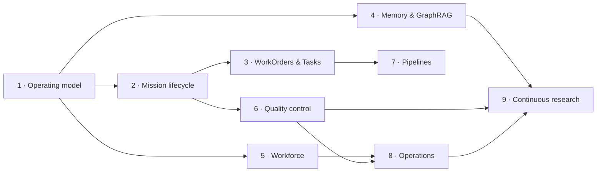

# Software Factory Mission Portfolio

## Creation evidence and governance boundary

Nine Mission records were created through the browser UI at
`http://localhost:5199/v2/missions` on 2026-07-28. All are `DRAFT`, have zero
WorkOrders, no validation contract, and were not dispatched.

The current UI persists only title, objective, and stop condition. The context,
constraints, sources, budget, concurrency, iterations, blueprints, dependencies,
assertions, waiver rules, and risks below are therefore **proposed plan data**,
not fields already persisted on those records. They must be reviewed and added
through the future draft/plan UI; no direct Convex write should backfill them.

| # | Mission | UI-created Mission ID | State |
| ---: | --- | --- | --- |
| 1 | Software Factory Operating Model and Information Architecture | `gs7h9xj72fd5msr6b9r4bqdqz18bcyv9` | DRAFT |
| 2 | Governed Mission Lifecycle Completion | `gs7qr791rj4rq91xedfa7xbwdx8bd8ha` | DRAFT |
| 3 | WorkOrders and Tasks Operator Experience | `gs7g4215qyeka9njttxdcsd48n8bc9yn` | DRAFT |
| 4 | Production Memory and Graph-Assisted RAG | `gs7tnxvr0xnd9r0ggerzq162898bdr4w` | DRAFT |
| 5 | Agent Workforce, Identity, Skills, and Capacity | `gs7s292kk2s1q7g9rzmch64msh8bcqjs` | DRAFT |
| 6 | Quality, Verification, and Evaluation Control Plane | `gs7sjdjw9083akes0zq00s20hx8bdrbg` | DRAFT |
| 7 | Code, Content, and Delivery Pipelines | `gs7wra7jtmsvg0trsqzcpc63fn8bdrhq` | DRAFT |
| 8 | Autonomous Operations, Governance, and Observability | `gs7sxd9snqya0v0yggp0c9ns298bdrd9` | DRAFT |
| 9 | Continuous Software-Factory Research and Improvement | `gs7jkmzhhhfhp2gj4pc1gggych8bd0x9` | DRAFT |

## Shared portfolio policy

- Owner: Product Owner, with one named technical Mission owner before approval.
- Execution policy: `SERIAL_MUTATIONS`.
- Read-only concurrency: two unless a Mission explicitly lowers it.
- Corrective iterations: two by default.
- Waivers: forbidden for security, tenant isolation, data integrity, audit
  identity, or acceptance-bypass assertions. Other waivers require an authorized
  operator, reason, expiration, compensating control, and timestamp.
- Required evidence: exact commit, environment, browser or command, timestamps,
  created entity IDs, console/page/network failures, artifact location, and
  validator identity.
- Source-of-truth references: the master plan, capability map, UI audit,
  repository contracts under `docs/software-factory/`, and linked source files.
- No Mission may dispatch until its complete draft, plan, assertions, budget,
  stop condition, and approval are visible in the UI.

## Proposed sequence

Missions are outcome programs, not a promise to execute all work concurrently.
The next approved implementation work should come from Missions 2 and 3.

## Mission 1 — Software Factory Operating Model and Information Architecture

- **ID:** `gs7h9xj72fd5msr6b9r4bqdqz18bcyv9`
- **Objective:** Define and validate the canonical domain hierarchy,
  information architecture, navigation, terminology, and entity relationships.
- **Context:** The live shell has a route maturity registry but still exposes
  overlapping concepts and inconsistent source-of-truth boundaries.
- **Constraints:** No broad shell rewrite; preserve deep links; no new mutable
  Portfolio entity; hide before deleting.
- **Owner:** Product Architecture.
- **Budget:** $150 research/validation ceiling; 8–12 engineer-days after plan
  approval.
- **Stop:** Approved domain glossary, route map, migrations, ownership, and
  independent UX review.
- **Concurrency / iterations:** 2 read-only / 1 corrective.
- **Dependencies:** None.
- **Expected value:** Lower cognitive load and eliminate conflicting state.
- **Risks:** Navigation churn and broken bookmarks.

WorkOrder blueprints:

1. Inventory route, data source, scope, maturity, and owner (read-only).
2. Ratify domain definitions and canonical URL rules (read-only).
3. Implement route aliases, grouping, and feature-flagged consolidation
   (mutating, later).
4. Validate desktop/mobile navigation, back/forward, and accessibility
   (validator).

Assertions:

- **IA-1:** Every production route maps to an owned capability or deprecation.
- **IA-2:** Goal→Mission→WorkOrder→Task→Run→Evidence is UI-traceable.
- **IA-3:** No two production views claim authority for the same entity.
- **IA-4:** Navigation changes have backward-compatible aliases and rollback.

Evidence: route registry, capability map, before/after screenshots, link-crawl,
browser traces, accessibility scan, and owner approval. All assertions require
independent validation; no waivers for IA-2 or IA-3.

## Mission 2 — Governed Mission Lifecycle Completion

- **ID:** `gs7qr791rj4rq91xedfa7xbwdx8bd8ha`
- **Objective:** Make draft→plan→approval→release→execution→validation→corrective
  work→acceptance operable through the browser.
- **Context:** Schema and server commands exist, but the detail route is
  unreachable and most authoring/actions are absent.
- **Constraints:** Reuse WorkOrders and WorkflowRuns; no second execution
  engine; no auto-approval; serial mutations.
- **Owner:** Delivery Control Plane.
- **Budget:** $400 engineering/evaluation ceiling; 20–30 engineer-days.
- **Stop:** One real Mission completes with a failed assertion, corrective work,
  resubmission, independent pass, and acceptance without direct database work.
- **Concurrency / iterations:** 2 read-only / 2 corrective.
- **Dependencies:** Mission 1 terminology and URL decisions.
- **Expected value:** A trustworthy primary product journey.
- **Risks:** Scope explosion, race conditions, and authorization gaps.

WorkOrder blueprints:

1. Fix detail routing, draft state projection, edit/autosave, and scope checks.
2. Add plan, blueprint, and assertion builder with revision diff.
3. Add approve/reject/resubmit and idempotent blueprint materialization.
4. Add serial eligibility, handoff, pause/resume/cancel, and corrective work.
5. Add assertion evidence, waiver, and final acceptance UI.
6. Validate full lifecycle with refresh, duplicate clicks, and role separation.

Assertions:

- **MISSION-1:** Complete draft is create/editable through UI.
- **MISSION-2:** Orchestrator can propose a versioned plan and assertions.
- **MISSION-3:** Authorized operator can approve or reject with reason.
- **MISSION-4:** Approved WorkOrders release once in policy order.
- **MISSION-5:** Independent evidence is visible at assertion level.
- **MISSION-6:** Failed validation creates corrective work or escalation.
- **MISSION-7:** Acceptance blocks on failed/stale/unknown evidence.

Evidence: Playwright trace, stable IDs, audit events, plan diffs, WorkOrder/run
links, failed and passed receipts, actor identity, refresh proof, and cleanup
record. All assertions require independent validation; MISSION-3, 4, and 7
cannot be waived.

## Mission 3 — WorkOrders and Tasks Operator Experience

- **ID:** `gs7g4215qyeka9njttxdcsd48n8bc9yn`
- **Objective:** Make priority, ownership, dependencies, age, quality, required
  attention, and next action legible at operational scale.
- **Context:** The audited workspace has seven WorkOrders and 84 Tasks; the
  WorkOrder surface is dense and the board is horizontally expensive.
- **Constraints:** Do not change canonical state machines; preserve legacy
  Tasks; no unreviewed bulk mutations.
- **Owner:** Operator Experience.
- **Budget:** $250; 12–18 engineer-days.
- **Stop:** Operators can find, transition, review, and accept work without
  database knowledge or excessive horizontal scrolling.
- **Concurrency / iterations:** 2 read-only / 2 corrective.
- **Dependencies:** Mission 1 and Mission 2 relationship/URL contract.
- **Expected value:** Lower intervention time and review aging.
- **Risks:** Hiding low-priority work and board/table divergence.

WorkOrder blueprints:

1. Measure queues, aging, review service levels, and stale records (read-only).
2. Add Active, Attention, Review, and All saved views with URL persistence.
3. Add table mode, Mission/WorkOrder grouping, age and next-owner signals.
4. Unify detail tabs and canonical relationship links.
5. Validate keyboard/mobile/filter/back-forward journeys.

Assertions:

- **WORK-1:** WorkOrder shows Mission, owner, risk, age, next action,
  verification, and approval.
- **WORK-2:** Task shows WorkOrder/Mission relationship or `Standalone`.
- **WORK-3:** Review shows age, reviewer, reason, evidence, and action.
- **WORK-4:** Blocked work shows reason, owner, and resolution.
- **WORK-5:** Filters/views/URL persist after refresh.
- **WORK-6:** Displayed state never contradicts governed state.

Evidence: queue baseline/result, screenshots, state matrix, URL/reload trace,
axe results, and task/WorkOrder IDs. WORK-6 cannot be waived.

## Mission 4 — Production Memory and Graph-Assisted RAG

- **ID:** `gs7tnxvr0xnd9r0ggerzq162898bdr4w`
- **Objective:** Provide scoped semantic, episodic, and procedural memory with
  provenance, lifecycle, graph relationships, retrieval, and explanations.
- **Context:** Convex graph tables, imports, and UI exist; Research Lab is
  empty, ingestion/retrieval governance is incomplete, and Memory navigation is
  duplicated.
- **Constraints:** No provider choice before benchmark; no instructions executed
  from retrieved content; preserve provenance; Convex remains authoritative for
  operational entities.
- **Owner:** Knowledge Platform.
- **Budget:** $600 prototype ceiling; 25–40 engineer-days before provider
  expansion.
- **Stop:** Real workspace content is ingested, retrieved with citations,
  explained, corrected/superseded, and improves one independent workflow metric.
- **Concurrency / iterations:** 2 read-only / 2 corrective.
- **Dependencies:** Mission 1; Mission 6 for evaluation.
- **Expected value:** Better context quality and reusable learning.
- **Risks:** Poisoning, stale facts, provider lock-in, cost, and privacy.

WorkOrder blueprints:

1. Define memory/provenance/conflict/retention contracts and threat model.
2. Implement `InMemoryGraphStore` and `ConvexGraphStore` adapter baseline.
3. Build idempotent ingestion with duplicate/conflict handling.
4. Build hybrid retrieval, citation, “why retrieved,” and permission filters.
5. Consolidate Memory UI and correction/supersession actions.
6. Benchmark Convex; prototype Neo4j only if thresholds fail.

Assertions:

- **MEM-1:** Facts retain source, confidence, effective date, and provenance.
- **MEM-2:** Completed runs create durable episodic records.
- **MEM-3:** Skills/workflows are versioned procedural memories.
- **MEM-4:** Entities/edges are workspace scoped and permission filtered.
- **MEM-5:** Retrieval returns evidence-linked results.
- **MEM-6:** UI explains retrieval reasons.
- **MEM-7:** Incorrect/stale/conflicting/superseded memory is manageable.
- **MEM-8:** Graph/retrieval pass deterministic fixture evaluations.

Evidence: ingestion ledger, graph fixtures, retrieval evaluation set,
source/citation view, poisoning tests, cost/latency benchmark, and correction
audit. MEM-1, 4, 5, and 8 cannot be waived.

## Mission 5 — Agent Workforce, Identity, Skills, and Capacity

- **ID:** `gs7s292kk2s1q7g9rzmch64msh8bcqjs`
- **Objective:** Operate agents as identity-bound, versioned, permissioned,
  measurable workers.
- **Context:** Registry and model routing are live; identity, skill evidence,
  version, assignment compatibility, and capacity are not one coherent record.
- **Constraints:** No anonymous mutating run; least privilege; quarantine is
  enforced server-side.
- **Owner:** Agent Platform.
- **Budget:** $350; 18–25 engineer-days.
- **Stop:** Every active worker is identity-bound and only receives compatible,
  authorized work with visible capacity, health, cost, and audit.
- **Concurrency / iterations:** 2 / 2.
- **Dependencies:** Mission 1; authentication/role decision.
- **Expected value:** Safer routing and predictable capacity.
- **Risks:** Identity migration and false health/capacity confidence.

WorkOrder blueprints:

1. Define AgentTemplate→Version→Instance→Identity contract.
2. Backfill deterministic agent/identity links; quarantine unknowns.
3. Enforce skill, permission, health, and capacity compatibility at assignment.
4. Add workforce table/detail and lifecycle audit.
5. Validate quarantine, retirement, routing, and budget limits.

Assertions: **AGENT-1** identity/version/capabilities/permissions/health;
**AGENT-2** compatible assignment; **AGENT-3** versioned/evaluated skills;
**AGENT-4** audited lifecycle; **AGENT-5** visible capacity/cost/failure;
**AGENT-6** quarantined/retired cannot receive work.

Evidence: assignment simulations, denied mutations, lifecycle events, cost and
heartbeat records, and browser journeys. AGENT-1, 2, and 6 cannot be waived.

## Mission 6 — Quality, Verification, and Evaluation Control Plane

- **ID:** `gs7sjdjw9083akes0zq00s20hx8bdrbg`
- **Objective:** Unite requirements, tests, evaluations, findings, receipts,
  environments, and release gates.
- **Context:** QC components, tests, receipts, and approvals exist but are
  fragmented and not one enforced release decision.
- **Constraints:** Preserve raw failures; distinguish product tests, agent
  evaluations, and manual checks; no worker self-certification.
- **Owner:** Quality Engineering.
- **Budget:** $450; 22–32 engineer-days.
- **Stop:** Real evidence can block acceptance and pipeline progression, with
  traceable waiver and expiration.
- **Concurrency / iterations:** 3 read-only / 2 corrective.
- **Dependencies:** Mission 2 assertion model.
- **Expected value:** Fewer false completions and regressions.
- **Risks:** Flaky gates, excessive run cost, and manual-review bottlenecks.

WorkOrder blueprints:

1. Canonicalize evidence, environment, verifier, freshness, and finding model.
2. Add adapters for unit/integration/browser/API/eval/manual evidence.
3. Build requirements/assertion/criterion traceability matrix.
4. Enforce WorkOrder/Mission/pipeline gates and waiver expiry.
5. Consolidate Quality UI and trend measures.

Assertions: **QC-1** real run data; **QC-2** every acceptance links evidence;
**QC-3** failed/stale evidence blocks; **QC-4** evidence types distinguished;
**QC-5** gates block progression.

Evidence: intentional failing run, stale receipt, denied acceptance/deploy,
authorized expiring waiver, and recovery trace. QC-2, 3, and 5 cannot be waived.

## Mission 7 — Code, Content, and Delivery Pipelines

- **ID:** `gs7wra7jtmsvg0trsqzcpc63fn8bdrhq`
- **Objective:** Provide one delivery model for code/content stages,
  repositories, environments, deployments, flags, and rollback.
- **Context:** Multiple pipeline components and deployment records exist without
  one authoritative stage/run model.
- **Constraints:** Reuse WorkflowRuns; do not auto-merge; every mutating stage
  requires an authorized WorkOrder.
- **Owner:** Delivery Platform.
- **Budget:** $600; 30–45 engineer-days.
- **Stop:** A WorkOrder initiates a real pipeline and an audited rollback is
  traceable end to end.
- **Concurrency / iterations:** 2 read-only / 2 corrective.
- **Dependencies:** Missions 2, 3, and 6.
- **Expected value:** Predictable delivery and recovery.
- **Risks:** Provider-specific coupling and deployment blast radius.

WorkOrder blueprints:

1. Define PipelineDefinition/Run/StageAttempt and typed stage contracts.
2. Adapt code/content workflows to shared domain.
3. Link repository/worktree/commit/PR/build/test/approval/deployment.
4. Add retry/cancel/supersede/rollback/feature-disable governance.
5. Validate a code and a non-code fixture end to end.

Assertions: **PIPE-1** WorkOrder initiates pipeline; **PIPE-2** stage state,
owner, I/O, evidence, duration, cost; **PIPE-3** actionable failure;
**PIPE-4** deployment traceability; **PIPE-5** governed rollback/disable.

Evidence: two typed fixtures, failed/retried stage, commit and receipt links,
deployment/rollback audit. PIPE-4 and 5 cannot be waived.

## Mission 8 — Autonomous Operations, Governance, and Observability

- **ID:** `gs7sxd9snqya0v0yggp0c9ns298bdrd9`
- **Objective:** Unite schedules, incidents, policy, audit, telemetry, cost, and
  operator attention.
- **Context:** Command Center is live and scoped, but schedules and operations
  are spread across multiple pages and some release/health signals are not
  enforced.
- **Constraints:** No invisible autonomous execution; bounded retries; pause on
  policy/budget violation; sensitive tool content is redacted.
- **Owner:** Factory Operations.
- **Budget:** $500; 25–35 engineer-days.
- **Stop:** Every autonomous run is forecast and observed; missed/failed/unsafe
  work creates a prioritized, actionable incident.
- **Concurrency / iterations:** 2 / 2.
- **Dependencies:** Missions 5, 6, and 7.
- **Expected value:** Reduced mean time to intervention and safer autonomy.
- **Risks:** Alert fatigue, sensitive telemetry, and automation loops.

WorkOrder blueprints:

1. Define scheduled execution, incident, attention, and correlation contracts.
2. Map run/tool/agent/pipeline signals to OpenTelemetry-compatible fields.
3. Consolidate Automation & Schedule and incident views.
4. Enforce missed-run, policy, budget, approval-expiry, and health incidents.
5. Add Command Center prioritization and SLO measurements.

Assertions: **OPS-1** before/after visibility; **OPS-2** actionable missed/failed
incidents; **OPS-3** actor/action/entity/time/reason/result audit; **OPS-4**
Mission/WO/Task/run/agent correlation; **OPS-5** policy/budget pause; **OPS-6**
highest-priority intervention is clear.

Evidence: scheduled fixture, missed run, budget pause, correlation trace, redaction
check, incident recovery, and attention-ranking rationale. OPS-3–5 cannot be
waived.

## Mission 9 — Continuous Software-Factory Research and Improvement

- **ID:** `gs7jkmzhhhfhp2gj4pc1gggych8bd0x9`
- **Objective:** Convert current, verified research into bounded, measurable,
  approved product improvements.
- **Context:** Loop Engineering and graph execution exist and prior E2E evidence
  proves bounded cycles; UI maturity and automatic research refresh remain
  incomplete.
- **Constraints:** Current authoritative sources first; vendor claims labeled;
  conflicting evidence retained; no research-driven production write without
  an approved Mission.
- **Owner:** Research Lab.
- **Budget:** $100 per cycle; maximum two cycles per approved hypothesis.
- **Stop:** Each cycle verifies evidence, measures approved change, and either
  creates one next-cycle draft from remaining gaps or stops.
- **Concurrency / iterations:** 3 read-only / 1 corrective per cycle.
- **Dependencies:** Missions 4, 6, and 8.
- **Expected value:** Evidence-compounding improvement without unbounded
  self-modification.
- **Risks:** Research drift, vendor bias, cost, and circular self-evaluation.

WorkOrder blueprints:

1. Research landscape, architecture, governance, economics, and failure modes.
2. Independently verify sources, claims, conflicts, and freshness.
3. Synthesize measurable recommendations.
4. Approve a bounded experiment.
5. Implement in an isolated branch/worktree.
6. Independently validate, measure, and decide stop/next-cycle draft.

Assertions: **RESEARCH-1** current authoritative citations; **RESEARCH-2**
publication/retrieval dates; **RESEARCH-3** vendor claims labeled;
**RESEARCH-4** contradictions preserved; **RESEARCH-5** recommendations link
evidence and measure; **RESEARCH-6** no automatic production modification.

Evidence: source/claim ledger, freshness labels, conflict records, approval,
branch/commit/test evidence, baseline/result measure, and cycle decision.
RESEARCH-1, 5, and 6 cannot be waived.

## Portfolio-level risks

- Nine drafts can be mistaken for approved commitments. The UI must add a
  DRAFT/planning banner and never label them in progress.
- Shared dependencies could cause duplicate schema and navigation work.
  Mission 1 decisions and Mission 2 contracts are prerequisites.
- The breadth can overwhelm delivery. Approve one bounded plan revision at a
  time; do not dispatch this portfolio as a batch.
- Cost estimates are planning ceilings, not forecasts. Each plan approval must
  include an updated estimate and measurable stop condition.

