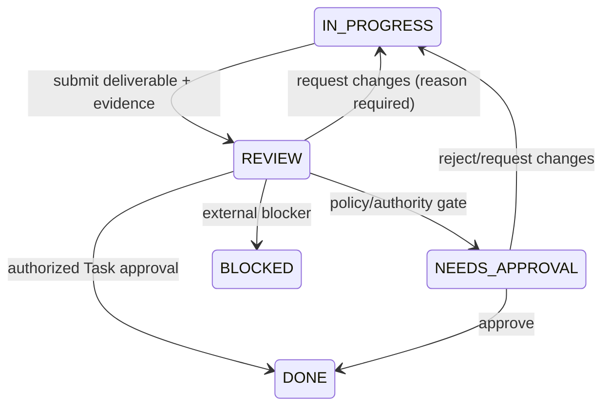

# Task Kanban and Work Order Enhancement Plan

## Executive summary

Keep the Tasks Kanban as Mission Control's central execution surface and make
Work Orders its governed parent contract. Do not merge the objects, replace the
board, or promote Runs into cards.

The repository already has credible Mission and Work Order governance plus a
functional Task board. The smallest safe path is:

1. add an optional, validated Task → Work Order relationship;
2. expose a single relationship/Attempt projection;
3. dual-write new UI creation paths;
4. prove compatibility and workspace isolation;
5. only then improve card context, READY, generation, and rollups in separate
   reviewable PRs.

This plan intentionally contains no product schema or UI implementation. It is
the approval boundary before PR 1.

## Product problem

Operators currently see 84 Tasks and eight Work Orders but cannot answer, from
a Task card:

- which deliverable this work fulfills;
- which Mission is affected;
- whether the current record is the work unit or a retry;
- who owns review/unblocking;
- whether Task completion makes the Work Order acceptable.

The result is inventory visibility without trustworthy delivery context.

## Canonical hierarchy

```text
Goal
  Mission
    Work Order
      Task
        Attempt (workflowRun)
          agent Runs, steps, tool calls, artifacts, evidence
```

Definitions:

- **Goal:** strategic result.
- **Mission:** governed multi-deliverable outcome.
- **Work Order:** one authorized delivery contract and its acceptance rules.
- **Task:** visible, assignable execution unit on the Kanban.
- **Attempt:** one execution try attached to a Task.
- **Evidence:** proof mapped to criteria; it is not the artifact itself.

## State ownership

Never show one ambiguous global status. Display independent state labels:

- Mission lifecycle;
- Work Order delivery lifecycle;
- Task operational lifecycle;
- current Attempt runtime;
- approval decision;
- verification result.

Parent completion is derived conservatively. A completed Task or Attempt does
not silently accept a Work Order or Mission.

## Target Tasks experience

### Board

Title:

```text
Tasks
Kanban execution board for Tasks across active Work Orders.
```

Default lanes:

`Inbox | Ready | In Progress | Review | Needs Approval | Blocked | Done`

Failed and Canceled are available as history filters/optional lanes. Assignment
is a card attribute, not a lane.

### Card information hierarchy

1. Task ID and outcome-oriented title;
2. Task state and highest-confidence next action;
3. parent Work Order and Mission;
4. agent, review owner, or unblock owner;
5. due date and state age;
6. current Attempt and retry count;
7. blocker/dependency;
8. evidence/verification coverage;
9. risk, repository, labels, and cost when relevant.

Keep only Open, Move, and one safe contextual action on the card. Put complex
governance in detail.

### Query and views

Support search plus filters for:

- Mission;
- Work Order;
- agent;
- repository;
- priority;
- risk;
- due date;
- Task status;
- review owner;
- blocker type/reason;
- current Attempt status.

Serialize the complete query in the URL. Saved views store the same versioned
query object; opening one updates the URL. Browser back/forward and refresh must
restore the view.

Initial saved views:

- My active Tasks;
- Needs operator attention;
- Review queue;
- Blocked Tasks;
- Overdue Tasks;
- By Mission;
- By Work Order;
- By agent;
- Recently completed;
- Ungoverned Inbox;
- Unclassified legacy.

### Modes and layout

- Kanban remains default.
- Table mode supports high-volume comparison.
- Swimlanes group by Work Order, Mission, or agent.
- WIP limits begin as warnings; hard enforcement is a later policy decision.
- left Agents and right Chat/Feed panels are collapsible and close by default
  below a tested width.
- board focus and query survive panel open/close.

## Target Work Orders experience

Work Orders remain a queue/detail contract surface.

Default tabs/quick filters:

- Needs attention;
- Active;
- Blocked;
- Awaiting approval;
- Awaiting verification;
- Ready to dispatch;
- Completed;
- Superseded;
- Canceled.

Completed records are not the default operational view.

Stable detail sections:

1. Overview;
2. Acceptance;
3. Tasks;
4. Runs;
5. Evidence;
6. Governance;
7. History.

The Tasks tab shows execution progress, blocked/review/overdue counts, child
Tasks, and Create/Generate actions. The Acceptance tab separately shows
criterion coverage and eligibility.

Remove or development-gate `Seed demo` from real workspaces.

## Task detail

### Overview

Parent breadcrumb, title, description, state, agent, priority, due date, state
age, current Attempt, cost, created/updated timestamps.

### Execution

Current Attempt first, previous Attempts retained, retry reason, workflow steps,
tool calls, logs, commands, runtime, model, worktree, cost, and recovery action.

### Dependencies

Blocking, blocked-by, downstream, status, relationship validity, and cross-Work
Order warning.

### Evidence

Artifacts, test results, screenshots, receipts, criterion mapping, freshness,
conflicts, coverage, and independent verifier.

### Review

Owner, entered time, SLA, findings, requested changes, decision, and
resubmission history.

### Governance

Inherited/overridden risk, approvals, policy decisions, waivers, exceptions, and
permission explanation.

### History

Immutable creation, linkage, assignment, transitions, Attempts, comments,
review, approvals, evidence, and operator actions.

## Run and retry behavior

- Start Attempt atomically assigns the next attempt number.
- A failed Attempt remains immutable and visible in Task detail.
- Retry creates a new Attempt under the same Task.
- The board card updates `Run 2 · Retry 1`; no duplicate card is created.
- Failed Task is used only when no retry/recovery is active or policy declares
  terminal failure.
- Work Order orchestration Runs remain distinct and can span child Tasks.
- low-level agent `runs` are turns nested under the Attempt projection.

## Review workflow



Requirements:

- submission captures summary, evidence digest, current Attempt, reviewer, and
  entered timestamp;
- reviewer cannot be the disallowed self-certifier;
- changes require a reason and structured findings;
- resubmission increments count and retains earlier decisions;
- review cards show owner, age, SLA state, findings, evidence, and next action;
- escalation does not auto-approve.

Suggested initial measurement-only SLA:

- high risk/P0: p50 under 4 hours, p75 under 8 hours;
- normal/P1: p50 under one business day, p75 under two;
- low risk: p75 under two business days.

## Blocked workflow

Blocking requires:

- reason;
- blocker type;
- optional blocking Task/external reference;
- responsible owner;
- required action;
- blocked-since timestamp;
- optional escalation date.

The board and Work Order rollup answer what, why, who, how long, and which
outcome is affected. Unblock requires a reason and records whether the
dependency was resolved, waived, or replaced.

## Creation workflows

### New Work Order

Collect outcome, Mission, repository, scope, risk, criteria, approvals,
verification method, lead, budget, deadline, and dependencies.

When Mission-linked, enforce approved Mission plan/blueprint rules.

### New Task

Collect title, description, Work Order, agent, priority, due date, dependencies,
and initial Inbox/Ready state.

- launched from Work Order: parent preselected and locked by default;
- launched globally with Work Order: governed;
- launched globally without Work Order: explicit Ungoverned Inbox;
- offer visible Convert to governed work;
- do not silently create Quick Work Orders.

### Work Order Task generation

Read-only preview first:

- title/purpose;
- proposed agent;
- dependencies;
- criterion contribution;
- artifacts;
- priority/deadline;
- mutating/read-only marker;
- approved plan revision.

Operator may approve all, edit, remove, add, regenerate, cancel, or confirm.
Confirmation is idempotent and records the generation event.

### PRD import

Preserve import and preview. Add destination choice:

1. selected approved Work Order;
2. new Work Order draft;
3. ungoverned Inbox.

Never imply imported Tasks are governed when they lack a contract.

## Deterministic rollups

### Work Order

```text
Execution: 8 of 10 required Tasks Done
Acceptance: 3 of 4 blocking criteria currently verified
Decision: not eligible — criterion security-test failed
```

Canceled optional Tasks are excluded. Canceled required Tasks block until scope
is revised. Failed Attempts do not double-count Tasks. Waivers count only when
approved, current, criterion-specific, and policy permits them.

### Mission

```text
Delivery: 3 of 4 required Work Orders accepted
Validation: 5 of 6 assertions passed
Correction: iteration 1 of 3
Decision: awaiting independent validation
```

Never use Task count alone for Mission completion.

## Implementation phases

### PR 1 — Domain relationships and compatibility

Scope:

- optional `tasks.workOrderId` and governance classification;
- indexes and same-workspace validation;
- relationship/Attempt read projection;
- dual-write New Task paths without changing default visuals broadly;
- Work Order child Task summary in shadow/display-only mode;
- compatibility for `legacyTaskId`;
- unit, integration, isolation, orphan, and query tests.

Acceptance:

- governed Task can resolve Work Order and derived Mission;
- orphan legacy Task still renders;
- cross-workspace linkage is rejected;
- no Work Order acceptance behavior changes;
- old Task board remains usable;
- no migration runs.

Estimated blast radius: schema, Task/Work Order queries/mutations, typed
projection, focused UI relationship display, tests. No state-machine change.

### PR 2 — Kanban hierarchy and query

- corrected subtitle;
- Work Order/Mission card context;
- Attempt/retry, due/age, blocker/review/evidence summaries;
- versioned URL query and expanded filters;
- initial saved views;
- responsive panel behavior;
- component and browser tests.

### PR 3 — Workflow-state cleanup

- add READY to schema and both state machines;
- compatibility-map ASSIGNED;
- structured review and blocker fields/mutations;
- shadow migration, then bounded backfill after approval;
- saved-view translation;
- migration and transition tests.

### PR 4 — Work Order Task generation

- preview/edit/confirm;
- plan revision and criterion linkage;
- PRD destination integration;
- idempotency and workspace tests;
- full UI creation journey through Task appearance.

### PR 5 — Task and Work Order detail

- stable tabs and breadcrumbs;
- Attempt hierarchy;
- dependency/evidence/governance/history projections;
- parent navigation and return-to-view state;
- responsive and accessibility tests.

### PR 6 — Swimlanes, attention, and operational scale

- table mode;
- Work Order/Mission/agent swimlanes;
- WIP warnings;
- review/blocked aging;
- carefully authorized bulk reassignment/priority;
- performance and large-volume tests.

### PR 7 — Enforced rollups and legacy closure

Only after observed shadow metrics:

- enable acceptance-blocking rollups;
- classify and migrate high-confidence retry Tasks;
- enforce governed parentage on governed writes;
- deprecate old queries/fields;
- retain audit/export manifests.

## Testing strategy

### Pure/unit

- relationship validation;
- state transition parity;
- current Attempt selection;
- retry count;
- review and blocker rules;
- execution and acceptance rollups;
- saved-query codec;
- legacy compatibility.

### Integration

- Task creation under Work Order;
- global ungoverned creation;
- conversion;
- Task generation;
- Mission/Work Order rollups;
- idempotent retries;
- workspace isolation;
- unauthorized review/approval;
- acceptance remains blocked by failed/missing criteria.

### Browser

Implement the supplied 40-step journey incrementally. Use UI-created disposable
records, semantic locators, trace-on-failure, console/page/network capture, and
cleanup through UI/API behavior owned by the test—not direct database seeding
as acceptance proof.

### Accessibility

- axe critical/serious checks;
- keyboard Task creation, filtering, Move, detail tabs, review, and close;
- focus restoration;
- live announcements;
- 320–400 px and 200% zoom;
- non-color status;
- named agent filters;
- reduced motion/drag alternative.

### Performance

- 100, 500, and 2,000 Task projection fixtures in unit/performance tests;
- query/index inspection;
- bounded subscription payloads;
- no unbounded timeline aggregation;
- target p75 board interactivity and filter response agreed before enforcement.

## Risks

- schema compatibility can accidentally change acceptance semantics;
- denormalization can drift;
- legacy retry grouping can destroy audit meaning;
- URL query expansion can break old saved views;
- large cross-table live joins can exceed Convex/query budgets;
- side-panel behavior can regress other v2 pages;
- broad bulk actions can bypass governance.

Mitigation is the PR order: relationship and measurements first, state/data
migration later, enforcement last.

## Explicit non-goals for PR 1

- no ASSIGNED-to-READY migration;
- no automated Quick Work Orders;
- no retry Task deletion/consolidation;
- no full visual redesign;
- no Task-count acceptance gate;
- no Mission state change;
- no Work Order acceptance change;
- no bulk mutations;
- no removal of legacy fields.

## Flow-completeness review

| Flow | Entry | Success | Failure/recovery that must be specified |
| --- | --- | --- | --- |
| Create governed Task | Work Order detail or global New Task | one linked Task visible on board | invalid/cross-workspace parent, duplicate submit, parent archived |
| Create ungoverned intake | global New Task without parent | visibly Ungoverned Inbox card | dispatch/approval blocked with conversion action |
| Convert intake | Task detail | visible Work Order + preserved Task/event history | cancel, duplicate conversion, conflicting concurrent link |
| Generate Tasks | approved Work Order plan | confirmed Tasks linked to criteria/revision | regeneration, partial failure, stale plan revision |
| Start/retry Attempt | Ready/In Progress Task | one Task card with incremented Attempt | timeout, cancellation, retry collision, paused squad |
| Submit for review | completed Attempt + evidence | Review owner/SLA captured | incomplete evidence, self-review, reviewer unavailable |
| Request changes | Review | same Task returns In Progress | reason required, findings retained, stale Attempt |
| Approve Task | Review/Needs Approval | Task Done; Work Order still independently governed | unauthorized decision, expired approval, duplicate click |
| Block/unblock | active Task | reason/owner/age visible; audited recovery | missing owner/reason, unresolved dependency, escalation |
| Accept Work Order | criteria/approval/verification complete | explicit accepted contract and Mission rollup | missing/stale evidence, required Task canceled, concurrent revision |

Open edge decisions are intentionally not hidden in implementation:

- whether global orphan creation defaults to Ungoverned Inbox or visible Quick
  Work Order conversion;
- whether cross-Work-Order dependencies are allowed or approval-gated;
- which review SLAs are policy versus measurement;
- whether WIP limits warn or block;
- whether Task approval is always independent or risk-dependent.

## Approval recommendation

Approve PR 1 with **visible Ungoverned Inbox** as the compatibility default.
Defer automatic Quick Work Orders. This is the simplest correct step that makes
the hierarchy real without pretending ambiguous legacy data is governed.
