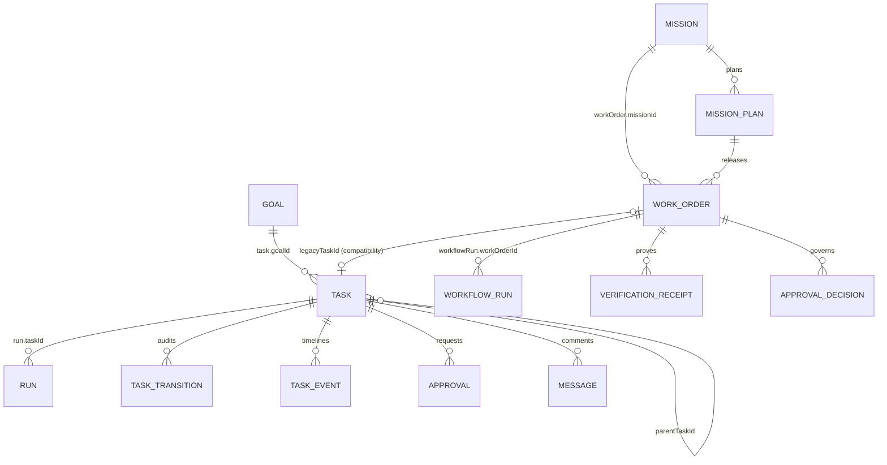

# Task and Work Order Current-State Assessment

## Executive assessment

Mission Control already has two useful but insufficiently connected delivery
surfaces:

- **Tasks** are operational records with a mature Kanban, assignment, guarded
  transitions, comments, approvals, low-level Runs, saved views, and audit data.
- **Work Orders** are governed delivery contracts with scope, acceptance
  criteria, verification receipts, approval decisions, revisions, and
  orchestration Runs.

The problem is not that one object should replace the other. The problem is that
the relationship is not modeled in the canonical direction. A Task has no
`workOrderId`, while a Work Order may have a `legacyTaskId`. That compatibility
field treats an older Task as the source or parent of a generated Work Order.
It cannot safely be reinterpreted as Work Order → child Tasks.

The Tasks page should remain the central execution board. The first change
should be a backward-compatible Task-to-Work-Order relationship and read model,
not a visual rewrite or state migration.

## Repository surfaces inspected

| Concern | Primary implementation |
| --- | --- |
| Task persistence and transitions | `convex/schema.ts`, `convex/tasks.ts` |
| Work Order governance | `convex/schema.ts`, `convex/workOrders.ts` |
| Mission governance | `convex/schema.ts`, `convex/missions.ts` |
| Task board | `apps/mission-control-ui/src/Kanban.tsx` |
| Task filtering and saved views | `apps/mission-control-ui/src/KanbanFilters.tsx` |
| Task creation | `apps/mission-control-ui/src/CreateTaskModal.tsx` |
| Task detail | `apps/mission-control-ui/src/TaskDrawerTabs.tsx` |
| Work Order queue/detail | `apps/mission-control-ui/src/controlPlane/WorkOrdersView.tsx` |
| PRD import | `apps/mission-control-ui/src/ImportPrdModal.tsx`, `convex/prd.ts` |
| Governed Mission contract | `docs/software-factory/governed-missions-contract.md` |

No repository-specific institutional learnings were available under
`docs/solutions/`.

## Current domain model



The desired Work Order → many Tasks relationship is absent.

## Schema inventory

### Task

Current Task ownership includes:

- optional tenant and workspace (`projectId`) scope;
- title, description, type, priority, and status;
- creator, assignees, agent instances, and reviewer;
- optional `goalId` and `parentTaskId`;
- work plan and planning Q&A;
- deliverable and review checklist;
- estimated/actual cost and budget fields;
- due, scheduled, started, submitted, and completed timestamps;
- labels, blocked reason, source, provenance, and metadata.

Missing for the canonical model:

- `workOrderId`;
- a derived parent relationship read model;
- structured dependency summary on the Task document;
- `currentRunId` or an explicit derived-current-run contract;
- state-entered timestamp;
- structured blocker type, owner, required action, and escalation date;
- review-entered/completed timestamps, result, findings, and resubmission count;
- criteria contribution links;
- explicit governed versus ungoverned intake classification.

Task indexes support status, type, priority, identifier, goal, source, project,
and project/status. There is no Work Order index.

### Work Order

Current Work Order ownership includes:

- optional Mission and Mission-plan linkage;
- requested outcome, context, repository, branch strategy, workflow, risk, and
  priority;
- requestor, assigned agent, and assigned squad;
- acceptance criteria, constraints, dependencies, source references, and
  approval requirements;
- governed state, verification, approval, blocking, current Run, revision, and
  human-action information;
- optional `legacyTaskId`.

Work Orders already enforce meaningful governance. Mission-linked creation
requires an approved current Mission plan and a matching blueprint. Acceptance
requires completed execution and sufficient evidence/approvals. Accepting a
Work Order may synchronize its `legacyTaskId` Task to Done.

What is missing is a first-class child Task collection and Task progress
projection. `legacyTaskId` must remain compatibility metadata until legacy
records are migrated and all callers stop relying on its current direction.

### Mission

Mission already owns the governed outcome:

- objective, context, constraints, source, owner, budget, limits, and stop
  conditions;
- a serial, approval-gated plan;
- Work Order blueprints and Mission-level validation assertions;
- active Work Order, blocker, required human action, and corrective iteration
  controls;
- explicit acceptance and immutable events.

Mission-to-Work-Order linkage exists. Mission progress should continue to derive
from Work Orders and assertions rather than direct Task counts.

### Run and workflow Run

There are two execution layers:

1. `runs` records low-level agent turns and optionally references a Task. It
   stores agent/session/model, tokens, cost, duration, status, and failure data.
2. `workflowRuns` records workflow orchestration and can reference a Task, Work
   Order, and Mission. It stores workflow identity, retry count, state, runtime,
   worktree, and execution detail.

This is not necessarily duplication. The target contract should define:

- a **Task Attempt** as the Task-scoped `workflowRun`;
- one or more low-level agent `runs` as turns within or associated with that
  attempt;
- a Work-Order-only `workflowRun` as orchestration, not a Task card.

The current UI mixes attempt information from Task metadata with `runs` in Task
detail. The relationship is not yet explicit enough for deterministic retry
history.

## Current workflows

### Task creation

- The global New Task modal collects title, description, type, priority, due
  date, and agents.
- `tasks.create` always creates `INBOX`.
- Assignment later transitions `INBOX` to `ASSIGNED`.
- The modal has no Work Order, Mission, dependency, governed/ungoverned, or
  initial-status control.
- Browser inspection confirmed that an operator can create an orphan Task
  without seeing a governance warning.

### Work Order creation

- New WorkOrder collects governed delivery-contract information.
- Standalone Work Orders may be created without a Mission.
- Mission-linked Work Orders require the approved plan and blueprint contract.
- The UI creates Work Orders but does not create or preview child Tasks.
- The queue automatically selects a record and opens a long detail surface.
- A visible `Seed demo` action appears in the live workspace and should be
  removed or development-gated.

### PRD import

- Import accepts pasted Markdown or a `.md` upload.
- It parses Task previews, stores a `prdDocuments` record, and bulk-creates
  Tasks.
- Each imported Task uses `source: PRD_IMPORT`, a document reference, and
  `INBOX`.
- The preview is useful, but Tasks are not linked to a Work Order, Mission,
  criteria, or approved plan revision.

PRD import should not be removed. It should become an intake/generation path:
either import into an explicitly selected Work Order or create ungoverned Inbox
Tasks that require conversion before governed execution.

### Task board

The board currently renders these nine columns:

`INBOX → ASSIGNED → IN_PROGRESS → REVIEW → NEEDS_APPROVAL → BLOCKED → FAILED → DONE → CANCELED`

Observed Research Lab state:

- 84 total Tasks;
- 44 labeled “In progress” by the header summary;
- 18% completion;
- 0 Inbox, 8 Assigned, and 1 In Progress visible at the start of the board;
- many Loop Engineering attempt/retry records;
- Mission source badges, but no parent Mission or Work Order names.

Strengths:

- live Convex updates;
- clear per-column counts;
- drag-and-drop plus a Move menu;
- invalid destinations omitted from Move menus;
- server-side transition validation;
- undo affordance;
- loading and lane-empty states;
- Task detail and comments;
- saved-view persistence in Convex.

Weaknesses:

- nine columns require excessive horizontal scanning;
- fixed-width left Agents panel plus right Feed/Chat consume the board;
- retry records are still visible as separate logical Tasks in seeded data;
- card context is dominated by source/type/attempt badges, not outcome,
  relationship, age, review owner, or blocker ownership;
- “Execution queue for active Work Orders” implies the cards are Work Orders;
- no Task search in the visible filter bar;
- no table or swimlane mode;
- terminal states occupy permanent columns;
- P1/agent/type filters are not URL-addressable.

### Drag and status transitions

Current transition enforcement is real:

- `INBOX → ASSIGNED | CANCELED`
- `ASSIGNED → IN_PROGRESS | INBOX | CANCELED`
- `IN_PROGRESS → REVIEW | BLOCKED | NEEDS_APPROVAL | FAILED | ...`
- `REVIEW → IN_PROGRESS | DONE | BLOCKED | NEEDS_APPROVAL | CANCELED`
- `NEEDS_APPROVAL` has human-governed recovery/decision paths
- `BLOCKED → ASSIGNED | IN_PROGRESS | NEEDS_APPROVAL | CANCELED`
- `FAILED → INBOX | ASSIGNED | CANCELED`
- `DONE` and `CANCELED` are terminal

The browser Move menu for an Assigned Task exposed only In Progress, Inbox, and
Canceled. Invalid Task transitions are therefore prevented in both the UI and
mutation layer.

Two state-machine implementations exist: `convex/tasks.ts` and
`packages/state-machine`. They must be changed together and protected by a
contract test before adding `READY`.

### Review and approval

Task detail has separate Approvals and Reviews tabs. The Task transition layer
can require deliverables/checklists and reserves Done review transitions for a
human. Approval requests preserve status and decisions.

However, review is not a complete operational queue:

- `submittedAt` exists, but state age and SLA are not first-class;
- reviewer identity exists, but review ownership is not on the card;
- rejection/request-changes history is split across transitions, peer review,
  messages, and approvals;
- no structured review reason, findings count, or resubmission count is shown;
- the relationship between Task approval and Work Order acceptance is not
  visible.

### Blocked work

Task has only `blockedReason`. The board does not display blocker type, owner,
required action, blocked-since, escalation, or affected Work Order/Mission.
Work Orders have richer blocking and required-human-action data, but it is not
projected onto child work because child linkage is absent.

### Runs and retries

Task detail has a Timeline and Cost summary backed by `runs`, and the board
reads attempt/retry metadata. Work Order detail lists orchestration Runs,
failures, retries, evidence, and an inspector.

The current Research Lab contains separate attempt-labeled Tasks. That conflicts
with the target rule that retry history stays on one Task. Existing attempt
Tasks need classification and migration; they must not simply be deleted.

### Saved views, filters, and URL state

Saved views are scoped to project, owner, and `KANBAN`. Current filters include:

- agent;
- priority;
- Task type.

Missing filters include Mission, Work Order, repository, risk, due date, status,
review owner, blocker, and current Run status.

Browser validation proved:

1. selecting P1 reduced the rendered Task set from 84 to 0;
2. the URL remained `/v2/tasks?workspace=...`;
3. refreshing restored the unfiltered 84-card view.

Workspace selection is persisted in URL and local storage. Kanban query state
is not.

### Workspace scoping

Primary list calls accept `projectId`, and saved views are project-scoped.
Mission detail includes scope protection. Parent-child mutations do not yet
have a Task-to-Work-Order same-project invariant because the relationship does
not exist.

The target mutation must reject:

- Task and Work Order from different projects;
- Work Order and Mission from different projects;
- criteria/dependency links crossing project boundaries;
- access by an operator without the relevant workspace.

## Test inventory and results

Existing automated coverage includes:

- 30 Convex Task tests;
- Work Order model, governance, dispatch, parent-sync, and revision tests;
- Mission governance and draft tests;
- workflow retry and Task guard tests;
- Work Order UI happy path;
- Mission draft routing/persistence/scope E2E;
- Tasks and Work Orders route smoke tests;
- critical accessibility route checks.

The Work Order UI E2E creates and dispatches a standalone Work Order. It does not
prove Mission → Work Order → Task → Attempt.

### Full suite

Command:

```text
pnpm run ci:prepare
pnpm test
```

Result:

- 941 tests passed;
- 0 failed;
- 101 test files passed;
- no source changes were needed.

The first unprepared run stopped because workspace packages were not built in
the isolated worktree. The repository `ci:prepare` step resolved the setup
condition; the prepared suite passed.

## Browser results

- Browser: Chromium through `agent-browser` 0.27.0
- Local UI: `http://localhost:5180`
- Backend/workspace: Software Factory Research Lab
- Remote URL: ngrok TLS negotiation failed in this environment

What passed:

- workspace selection;
- Tasks and Work Orders navigation;
- populated Task board;
- New Task modal validation without creating data;
- valid Move destinations;
- Work Order filters, selection, and governed details;
- Task detail Overview and Timeline navigation;
- reload and workspace persistence;
- clean browser console and page-error log in the isolated session.

The UI development server recorded one `/gateway/status` proxy
`ECONNREFUSED` because the optional local orchestration server on port 4100 was
not running. The inspected Tasks and Work Orders Convex workflows remained
available. This is a known local-environment dependency and should be asserted
explicitly in the later E2E fixture.

What was not mutated:

- no Task, Work Order, Mission, Run, approval, or evidence record was created;
- no Task was transitioned;
- no seed script or direct Convex mutation was used.

Screenshots are in `docs/testing/evidence/task-kanban-workorder/`.

## Accessibility assessment

Strengths:

- page headings exist;
- task cards expose Open and Move buttons;
- empty comment/title states disable submission;
- status has visible text, not color alone;
- dialogs and Task detail expose named controls.

Gaps:

- agent filter buttons expose only emoji names (`🔎`, `🧪`);
- card nesting produces both a clickable generic container and nested buttons;
- drag is not yet proven keyboard-operable end to end;
- no result-count live announcement after filtering;
- no state-change live announcement was verified;
- the board is visually subordinate when both side panels are open;
- dense horizontal content degrades at narrow widths and high zoom;
- Task detail tabs lack parent-relationship navigation because the data is
  absent.

## Classification

### What works

- Tasks are visible, assignable, mutable through guarded transitions, and
  auditable.
- Work Orders enforce evidence and approval gates.
- Missions gate plan execution.
- Runs, comments, approvals, and saved views persist.
- Browser-accessible Move menus provide drag parity for basic transitions.
- The full prepared test suite is green.

### What is partial

- Task review, blocked-work operations, retry projection, URL persistence,
  accessibility, and responsive board focus.
- Mission source is shown, but not a navigable parent relationship.
- Work Order Runs exist, but child Task Attempts are not coherently aggregated.

### What is confusing

- `ASSIGNED` is both assignment outcome and workflow lane.
- “Execution queue for active Work Orders” labels a Task board.
- Task, workflow Run, low-level Run, approval, verification, and Work Order
  state are shown without a single hierarchy explanation.
- seeded retry Tasks look like new units of work.

### What is duplicated

- Task transition definitions across Convex and the state-machine package.
- retry/attempt information in Task metadata, `runs`, and `workflowRuns`.
- some delivery outcome information in legacy Task and Work Order records.

### What is disconnected

- Task → Work Order;
- PRD Task → governed plan/criteria;
- Task card → Mission/Work Order navigation;
- Work Order detail → child Tasks and Task Runs;
- Kanban filters → URL;
- review/blocker state → actionable ownership.

### What is missing

- canonical relationship read model and same-workspace invariants;
- deterministic Task/Work Order/Mission rollups;
- READY state compatibility plan;
- structured review and blocker data;
- generation preview and criteria contribution;
- full browser journey and migration tests.

### What requires migration

- `ASSIGNED → READY`;
- orphan Task classification;
- legacy `legacyTaskId` records;
- separate retry/attempt Task records;
- direct `goalId` Task relationships;
- saved views that include `ASSIGNED`;
- audit-safe parent linkage and backfill confidence.

## Discovery decision

Proceed with a small PR 1 that adds the relationship and compatibility read
model only. Do not yet migrate `ASSIGNED`, create hidden Quick Work Orders,
collapse retry Tasks, redesign the board, or change governed acceptance.
