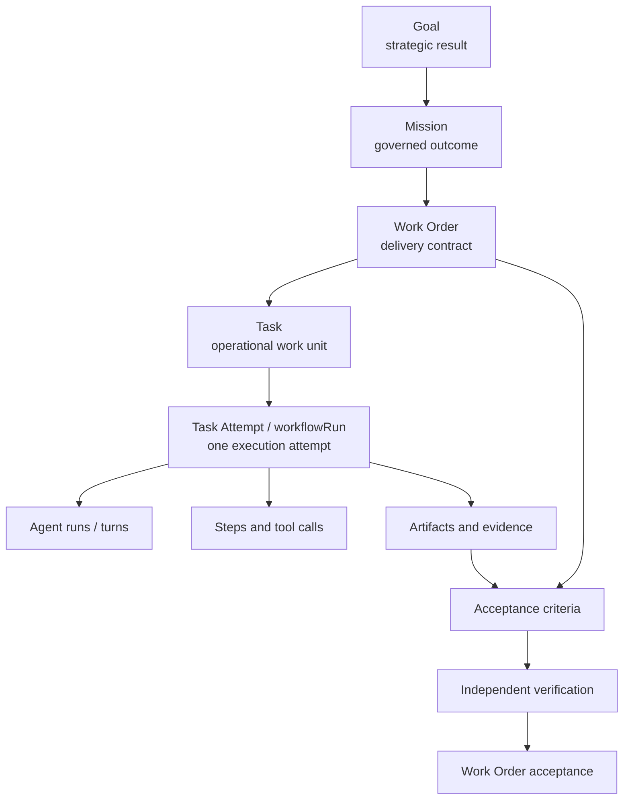

# Task and Work Order Target Model

## Decision

Adopt one explicit hierarchy:



Tasks remain the Kanban records. Attempts and retries remain nested under their
Task. Work Orders remain governed delivery contracts.

## Cardinality and invariants

### Mission

- has zero or many Work Orders;
- owns approved Work Order blueprints and validation assertions;
- does not own execution Tasks directly;
- progress derives through Work Orders.

### Work Order

- belongs to zero or one Mission;
- has zero or many Tasks;
- owns acceptance criteria, verification requirements, governance, budget, and
  acceptance;
- may have Work-Order-level orchestration Runs;
- aggregates child Task state, evidence, cost, and Attempts.

### Task

- belongs to exactly one Work Order when `governanceMode = GOVERNED`;
- may have no Work Order only while `governanceMode = UNGOVERNED_INBOX`;
- derives Mission through Work Order;
- has zero or many task-scoped Attempts;
- may depend on Tasks in the same workspace and normally the same Work Order;
- is the only level rendered as a Kanban card.

### Task Attempt

- is a Task-scoped `workflowRun`;
- belongs to exactly one Task;
- has an immutable attempt number;
- preserves failure and supersession history;
- contains or references low-level agent runs, steps, tool calls, artifacts, and
  evidence;
- never becomes a new Task card solely because it is retried.

### Workspace invariant

All linked records must have the same `projectId`. Server mutations must verify
scope; UI filtering is not authorization.

## Field ownership

| Field/concept | Canonical owner | Derived/projection rule |
| --- | --- | --- |
| Goal objective | Goal | never copied to Task |
| Mission objective and limits | Mission | Task shows linked label through Work Order |
| Delivery outcome/scope | Work Order | Task may describe its contribution |
| Repository and risk | Work Order | Task may override only with explicit reason |
| Acceptance criteria | Work Order | Task links contributions by criterion ID |
| Operational title/status | Task | Work Order aggregates |
| Assigned agent/team | Task | Work Order shows lead plus Task owners |
| Due date | Task or Work Order deadline | Task inherits display-only default unless overridden |
| Current Attempt | Task-derived | latest non-superseded Task workflowRun |
| Retry count | Task-derived | max(attemptNumber - 1), not number of Task cards |
| Task evidence | evidence/receipt records | linked to Task, Attempt, criterion |
| Work Order evidence | derived aggregation | includes direct Work Order receipts |
| Mission ID on Task | derived | `task.workOrderId → workOrder.missionId` |
| Cost to date | derived | sum immutable Runs/Attempts; cached projection allowed |
| Progress | derived | deterministic state/criteria rules below |
| Acceptance | Work Order/Mission | never inferred from Task Done alone |

Denormalized labels may be used in a query projection for performance, but they
are not write authority and must include source IDs/version timestamps.

## Proposed schema changes

### Task

Add in compatibility order:

```ts
workOrderId?: Id<"workOrders">
governanceMode?: "GOVERNED" | "UNGOVERNED_INBOX"
stateEnteredAt?: number
criteriaContributionIds?: string[]
review?: {
  ownerId?: Id<"agents">
  enteredAt?: number
  completedAt?: number
  result?: "APPROVED" | "CHANGES_REQUESTED" | "ESCALATED"
  reason?: string
  findingsCount?: number
  resubmissionCount: number
}
blocker?: {
  type: "TASK" | "EXTERNAL" | "POLICY" | "APPROVAL" | "CAPACITY" | "UNKNOWN"
  reason: string
  blockingTaskId?: Id<"tasks">
  ownerRef?: string
  requiredAction?: string
  blockedSince: number
  escalationAt?: number
}
```

Add indexes:

- `by_work_order`;
- `by_project_work_order`;
- `by_project_status_state_entered`;
- optionally `by_project_review_owner`.

Keep `blockedReason`, `reviewerId`, `goalId`, and metadata during compatibility.
New writes populate structured fields and mirror legacy fields until old
readers are removed.

Do not persist `missionId` on Task as the primary relationship. Return it from a
server-side projection joined through Work Order.

### Task Attempts

Prefer extending `workflowRuns` rather than adding a third Run table:

```ts
taskId: Id<"tasks">            // required for Task Attempt
workOrderId: Id<"workOrders"> // validated mirror for efficient queries
attemptNumber: number
supersedesRunId?: Id<"workflowRuns">
retryReason?: string
```

Invariant: Task-scoped Attempts require the linked Work Order to equal the
Task's `workOrderId`.

Low-level `runs` remain agent turns. Add `workflowRunId` if missing on any write
path and define their position in the detail read model.

### Work Order

No child Task ID array should be stored. Query Tasks by indexed
`task.workOrderId`.

Retain `legacyTaskId` with a deprecation comment and compatibility metrics. It
means “legacy source/parent Task” until removed. Do not invert its meaning.

Add only derived query projections:

- `taskSummary`;
- `executionProgress`;
- `acceptanceReadiness`;
- `activeAttempts`;
- `blockedTaskCount`;
- `reviewTaskCount`;
- `overdueTaskCount`;
- `costSummary`.

## State ownership

| Layer | State answers | Proposed states |
| --- | --- | --- |
| Mission | Is the governed outcome planned, executing, validated, and accepted? | existing Mission contract |
| Work Order | Is the agreed deliverable ready, executing, verifiable, and accepted? | existing Work Order contract |
| Task | What should the operator/agent do with this work unit? | INBOX, READY, IN_PROGRESS, REVIEW, NEEDS_APPROVAL, BLOCKED, DONE, FAILED, CANCELED |
| Attempt | What happened in this execution attempt? | PENDING/QUEUED, RUNNING, PAUSED, COMPLETED, FAILED, CANCELED, TIMEOUT |
| Approval | Has an authorized decision been made? | PENDING, APPROVED, REJECTED/DENIED, EXPIRED |
| Verification | Does current evidence prove the criterion? | PENDING, PASS, FAIL, STALE, WAIVED, UNKNOWN |

Rules:

- assignment is an attribute, not a Task state;
- Task Done means the Task-level completion gate passed;
- Work Order Done/Accepted additionally requires all blocking criteria,
  verification, approvals, and explicit acceptance;
- a failed Attempt does not force Task Failed while retry is active;
- missing or unknown evidence never counts as pass;
- workers cannot approve or independently validate their own mutating work;
- rejection returns a Task to an actionable state and retains the decision.

## Derived relationship read model

Introduce one query for board/detail consumers:

```ts
TaskExecutionProjection = {
  task,
  relationship: {
    governanceMode,
    workOrder?: { id, title, state, risk, repository },
    mission?: { id, title, state },
  },
  currentAttempt?: AttemptSummary,
  attemptCount,
  retryCount,
  reviewSummary,
  blockerSummary,
  dependencySummary,
  evidenceSummary,
  costSummary,
  allowedTransitions,
}
```

This prevents each React component from independently joining Tasks, Work
Orders, Missions, Runs, approvals, and evidence.

## Rollup behavior

### Task execution progress

Expose a label, not a false percentage:

| Task state | Execution phase |
| --- | --- |
| INBOX | intake |
| READY | ready |
| IN_PROGRESS | executing |
| REVIEW | reviewing |
| NEEDS_APPROVAL | governed decision |
| BLOCKED | blocked |
| DONE | complete |
| FAILED | failed |
| CANCELED | excluded |

If a percentage is needed for charts, use a documented display heuristic only;
never use it for acceptance.

### Work Order

Display two independent rollups:

```text
Execution progress: completed non-canceled Tasks / required non-canceled Tasks
Acceptance readiness: passed blocking criteria / required blocking criteria
```

Acceptance eligibility requires:

1. all required Tasks Done;
2. no blocking active/failed Attempt without a recovery decision;
3. every required criterion has current PASS evidence or approved waiver;
4. required approvals are current and sufficient;
5. independent validation requirements are satisfied;
6. an explicit authorized accept action.

### Mission

Display:

- Work Order execution distribution;
- accepted Work Orders / required Work Orders;
- validation assertions passed / required assertions;
- corrective iteration count / limit;
- approval and final-acceptance status.

Mission completion remains explicit and governed.

## Quick Work Order approach

Recommended V1 behavior:

- global New Task defaults to **Ungoverned Inbox** when no Work Order is
  selected;
- UI shows a persistent “Ungoverned” badge and explains limitations;
- ungoverned Tasks cannot dispatch mutating governed workflows, enter governed
  approval, or satisfy Mission/Work Order progress;
- operator action **Convert to governed work** opens a visible Quick Work Order
  form prefilled from the Task;
- confirmation creates the Work Order and links the Task in one idempotent
  transaction.

Do not silently create a hidden Quick Work Order. Automatic Quick Work Orders
may be considered later only after the operator can see, edit, and audit the
relationship.

This is an operator approval decision before implementation.

## API changes

### New or extended mutations

- `tasks.create`: accept `workOrderId?`, `governanceMode`, and initial
  `INBOX | READY`; validate parent scope.
- `tasks.linkWorkOrder`: idempotently link an ungoverned Inbox Task after
  eligibility checks.
- `tasks.convertToQuickWorkOrder`: transactional visible conversion.
- `workOrders.generateTasksPreview`: read-only proposal tied to plan revision.
- `workOrders.confirmGeneratedTasks`: idempotent bulk creation after operator
  approval.
- `workflowRuns.startTaskAttempt`: validate Task/Work Order and compute the next
  attempt number atomically.
- review/blocker mutations with structured required fields.

### Queries

- `tasks.listExecutionBoard` returns the projection;
- `tasks.getExecutionDetail` returns stable tabs;
- `workOrders.getDeliveryDetail` adds child Task and Attempt aggregation;
- `workOrders.getRollup` and `missions.getRollup` share pure tested functions.

Do not expose raw cross-workspace IDs in a mutation without server validation.

## UI changes

### Tasks

- retain Kanban as default central surface;
- subtitle: “Kanban execution board for Tasks across active Work Orders”;
- default lanes: Inbox, Ready, In Progress, Review, Needs Approval, Blocked,
  Done;
- Failed/Canceled available as optional historical lanes and filters;
- relationship, current Attempt, age, blocker, review owner, due date, and
  evidence on cards;
- URL-addressable filters and saved views;
- board/table modes and Work Order/Mission swimlanes;
- collapsible contextual side panels so the board remains primary.

### Work Orders

- remain a governed queue, not another Task board;
- default to active/attention records, not completed inventory;
- detail tabs: Overview, Acceptance, Tasks, Runs, Evidence, Governance, History;
- child Task progress and acceptance readiness remain visibly distinct;
- remove or development-gate Seed demo.

### Details

Use stable Task tabs:

Overview, Execution, Dependencies, Evidence, Review, Governance, History.

Breadcrumb:

`Goal → Mission → Work Order → Task → Attempt`

Every segment uses a stable URL, preserves the board query, and returns focus to
the invoking card.

## Backward compatibility

- all new schema fields begin optional;
- old Tasks read as `UNGOVERNED_INBOX` unless a validated relationship can be
  inferred;
- `ASSIGNED` remains accepted during the compatibility window;
- UI projection maps legacy Assigned to the current label until READY rollout;
- old saved views are translated at read time;
- `legacyTaskId` behavior remains unchanged;
- backfills are idempotent, checkpointed, dry-runnable, and emit counts;
- event history is appended, never rewritten.

## Legacy Task handling

Classify, do not guess:

1. confidently linked legacy source Task;
2. standalone legitimate Task;
3. Task generated by a workflow and recoverable to one Work Order;
4. retry/attempt Task that should be grouped under one logical Task;
5. ambiguous record requiring operator review.

Only categories with deterministic evidence are auto-linked. Ambiguous records
remain visible in an “Unclassified legacy” saved view.

## Migration strategy

1. Add optional fields, indexes, projections, metrics, and contract tests.
2. Dual-write new Task creation paths.
3. Run read-only classification and publish counts.
4. Backfill high-confidence Work Order links.
5. Create visible ungoverned classification for remaining Tasks.
6. Introduce READY as a compatibility state and update both state machines.
7. Migrate ASSIGNED in bounded workspace batches with audit events.
8. Group retry Task history only after verified mapping and operator approval.
9. enforce parent requirement for new governed writes.
10. remove compatibility only after zero legacy readers/writers are measured.

## Risks and mitigations

| Risk | Mitigation |
| --- | --- |
| Wrong legacy linkage changes acceptance | high-confidence-only backfill; no rollup enforcement during shadow phase |
| Cross-workspace data leak | server invariant and isolation tests |
| ASSIGNED migration breaks automations | compatibility mapper, dual transitions, saved-view translation |
| Two Run models remain ambiguous | explicit Attempt contract and read projection |
| Task Done silently accepts Work Order | separate eligibility and explicit accept mutation |
| Rollup query fan-out | indexed queries plus versioned cached projections |
| Quick Work Order hides governance | operator-visible conversion only |
| Retry consolidation loses audit | retain source IDs and immutable attempt history |
| Wide UI degrades | collapse side panels, table mode, responsive tests |

## Rollback

- feature-flag new projection and relationship UI;
- keep old Task queries and status validators during compatibility;
- backfills only add fields/events and can be logically disabled;
- disable rollup enforcement independently from relationship display;
- never delete legacy Task or Work Order records during rollout;
- READY migration rollback maps READY back to ASSIGNED with a compensating audit
  event, not history mutation;
- retain exportable before/after migration manifests.

## Approval gates

Operator approval is required before:

1. choosing visible ungoverned Inbox versus automatic Quick Work Orders;
2. implementing READY and migrating ASSIGNED;
3. grouping legacy retry Tasks into Attempts;
4. enforcing Work Order parentage on global Task creation;
5. enabling rollups as acceptance blockers rather than shadow calculations.
