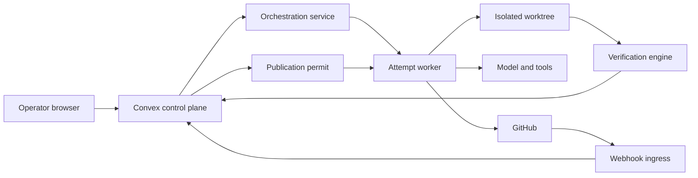

# Verification Plane Threat Model

## Executive summary

The highest risks are integrity failures: an attacker or compromised executor
could substitute a candidate after verification, forge or replay evidence,
weaken the verifier, escape repository scope, or obtain publication authority.
Mission Control already has strong foundations—frozen manifests, isolated
worktrees, deterministic checks, server-recomputed verdicts, signed service
commands, human-review suspension, and candidate-bound publication permits—but
remote verifier identity, evidence revocation, contradictory evidence, network
egress, and cross-tenant artifact access require continued hardening.

## Scope and assumptions

In scope: WorkOrder specification, execution manifest, local/worktree Codex
executor, verification engine, evidence persistence, human-review continuation,
GitHub publication, UI/API/CLI inspection, and relevant CI/webhook ingress.

Assumptions affecting ranking:

- Mission Control is intended as a multi-tenant control plane.
- Browser and GitHub webhook endpoints may be internet-accessible.
- Repository content, credentials, prompts, logs, and evidence may be sensitive.
- Agent-generated commands and repository content are untrusted.
- GitHub, model providers, package registries, and future remote sandboxes are
  external trust domains.
- Automatic production deployment is out of scope; V1 stops at human merge.

Open questions: current public exposure, use of real customer repositories,
runtime network segmentation, secret-broker deployment, artifact-store access
model, and tenant scale. Public customer use would raise cross-tenant evidence
access and availability threats.

## System model

### Primary components

- React operator UI and typed Convex control-plane functions.
- Hono orchestration service and authenticated service-command client.
- Factory Attempt worker, execution manifest, worktree/Git runtime, and Codex
  executor adapter.
- Verification engine and allowlisted command verifiers.
- Convex verification runs, evidence envelopes, receipts, approvals, events,
  and continuations.
- GitHub App installation tokens, signed webhook ingress, branches, CI, and PRs.

### Data flows and trust boundaries

- Operator browser → Convex: intent, approvals, and queries over authenticated
  application channels; server-side authorization remains mandatory.
- Convex → orchestration worker: frozen manifest, lease, and scoped authority;
  service commands are authenticated and replay-protected.
- Worker → model/tool process: prompts, repository context, and allowed tools;
  model output is untrusted.
- Worker → worktree/subprocess: files and direct-argv verification commands;
  filesystem scope, environment sanitization, timeout, and command policy apply.
- Worker → Convex: signed result packets, events, evidence, and terminal reports;
  server recomputes verdict and validates active lease/subject.
- GitHub → webhook/CI ingress: external events and evidence; signature,
  installation/repository scope, delivery dedupe, and SHA correlation apply.
- Worker → GitHub: branch and PR mutation using short-lived installation token
  plus consumed candidate-bound publication permit.

#### Diagram

## Assets and security objectives

| Asset | Why it matters | Objective |
| --- | --- | --- |
| Mission, Plan, WorkOrder, policy | Defines authorized intent and risk | Integrity, availability |
| Execution manifest and lease | Bounds executor authority | Integrity |
| Source and candidate revisions | Subject actually reviewed and published | Integrity |
| Verification results and evidence | Basis for advancement and audit | Integrity, availability, confidentiality |
| Human approvals and waivers | Record accountable risk acceptance | Integrity, non-repudiation |
| GitHub App and service credentials | Permit repository mutation | Confidentiality, integrity |
| Repository and worktree | Contains code and potentially sensitive context | Confidentiality, integrity |
| Events and audit history | Reconstructs actions and recovery | Integrity, availability |
| Tenant/workspace boundary | Prevents customer data and authority crossover | Confidentiality, integrity |

## Attacker model

### Capabilities

- Submit malicious issue text or repository content that influences an agent.
- Cause model output to request unsafe commands or misleading completion claims.
- Compromise a dependency, verifier process, CI job, or external integration.
- Replay, delay, duplicate, reorder, or spoof external events where controls fail.
- Exploit an authenticated low-privilege account or compromised agent/service
  identity.
- Attempt to exhaust workers, verification capacity, or evidence storage.

### Non-capabilities

- No assumed direct administrative database access, host root, GitHub
  organization ownership, or cryptographic-key compromise. Threats requiring
  those capabilities are conditional and generally lower likelihood.

## Entry points and attack surfaces

| Surface | How reached | Boundary | Notes | Evidence |
| --- | --- | --- | --- | --- |
| WorkOrder/UI mutations | Authenticated browser | User → control plane | Intent and policy inputs | `convex/workOrders.ts`, `apps/mission-control-ui/src/controlPlane/WorkOrdersView.tsx` |
| Orchestration WorkOrder routes | HTTP service call | Service → Hono | Dispatch, inspection, receipts | `apps/orchestration-server/src/index.ts` |
| Service commands | Signed internal command | Hono → Convex | Replay and capability-sensitive | `apps/orchestration-server/src/serviceCommandClient.ts`, `convex/serviceCommands.ts` |
| Model/executor | Worker process | Control → untrusted model | Prompt injection and unsafe output | `apps/orchestration-server/src/codexExecutorAdapter.ts` |
| Verification subprocess | Direct argv | Worker → local process | Command and environment boundary | `apps/orchestration-server/src/factoryVerification.ts` |
| Worktree/Git | Filesystem and Git | Worker → repository | Scope escape and candidate substitution | `apps/orchestration-server/src/factoryGitRuntime.ts`, `factoryPathScope.ts` |
| Evidence packet | Signed report | Worker → Convex | Forgery, replay, stale subject | `convex/factory/attempts.ts`, `convex/lib/verificationPersistence.ts` |
| GitHub webhooks/CI | Internet webhook | GitHub → ingress | Spoof, replay, mismatch | `convex/http.ts`, `convex/factory/githubCi.ts` |
| GitHub publication | HTTPS API | Worker → GitHub | Privileged external mutation | `apps/orchestration-server/src/githubAppRuntime.ts`, `factoryAttemptWorker.ts` |

## Top abuse paths

1. Malicious repository instructions influence the model → model requests an
   unsafe command → weak classification permits execution → credentials or
   repository integrity are lost.
2. Executor creates a passing candidate → verification completes → candidate is
   amended before push → unverified SHA is published.
3. Attacker replays an old passing evidence packet for a new WorkOrder revision
   → server accepts mismatched proof → gate advances incorrectly.
4. Candidate weakens tests or scanner configuration → ordinary checks turn
   green → insufficient assurance is presented as verification.
5. Compromised verifier signs fabricated results → server trusts producer name
   without strong workload identity → false evidence becomes authoritative.
6. Stolen GitHub App/service credential bypasses intended WorkOrder scope →
   attacker modifies another repository or publishes without current approval.
7. Cross-tenant IDOR exposes evidence, diffs, logs, or approvals → customer code
   and operational history leak.
8. Event flooding or expensive verifier inputs exhaust workers/storage →
   verification and operator decisions become unavailable.

## Threat model table

| Threat ID | Threat source | Prerequisites | Threat action | Impact | Impacted assets | Existing controls | Gaps | Recommended mitigations | Detection ideas | Likelihood | Impact severity | Priority |
| --- | --- | --- | --- | --- | --- | --- | --- | --- | --- | --- | --- | --- |
| TM-001 | Compromised executor/model | Active WorkOrder and tool access | Escape path/command/data boundaries | Code or credential compromise | Repository, secrets | Frozen manifest, path scope, direct argv, sanitized environment (`executionManifest.ts`, `factoryVerification.ts`) | Network/remote sandbox policy incomplete | Ephemeral sandbox, deny-by-default egress, secret broker, syscall/resource limits | Scope-denial and unexpected-egress alerts | medium | high | high |
| TM-002 | Executor or race | Verification completed | Change candidate before publication | Unverified code reaches PR | Candidate, evidence | Clean-candidate checks, SHA binding, publication permit (`factoryAttemptWorker.ts`, `attempts.ts`) | External reconciliation must cover all races | Recheck remote PR head, atomic permit consumption, reject force updates | Candidate/PR SHA mismatch alert | low | high | high |
| TM-003 | Replay/spoof actor | Captured packet or webhook | Reuse stale evidence or event | False advancement | Evidence, gate | HMAC service commands, delivery dedupe, idempotency, revision/SHA fields | Revocation and contradiction model incomplete | Nonce/time window, workload identity, evidence-set digest, explicit supersession/revocation | Duplicate semantic event and stale-subject metrics | medium | high | high |
| TM-004 | Malicious change | Ability to edit tests/config | Weaken assurance system | Escaped defect/security issue | Verification integrity | Change Budget, protected paths, diff evidence | Complete anti-gaming profile missing | Protected assurance paths, semantic test/config diff verifier, separate approval | Test deletion/skip/threshold-change findings | high | high | high |
| TM-005 | Compromised verifier/CI | Verifier identity or runner compromised | Fabricate passing evidence | False eligibility | Evidence, approvals | Independent run and server recomputation | Producer attestation/trust lifecycle incomplete | Workload identity, signed provenance, isolated verifier, revocation, two-method checks for critical work | Verifier drift and disagreement alerts | medium | high | high |
| TM-006 | Credential thief | Service or App credential exposed | Publish or mutate outside authority | Repository compromise | GitHub, source | Short-lived App token, install scope, publication permit, secret redaction | Host compromise remains material | KMS/secret broker, token audience/scope, rotation, outbound allowlist | Installation/repository anomaly alerts | low | high | high |
| TM-007 | Authenticated tenant attacker | Missing scope check | Read another tenant's proof or mutate decisions | Code/data leakage or authority crossover | Tenant data | Project/tenant IDs and authorization helpers | Optional legacy tenant fields and broad query risk | Mandatory scope resolution for every query/mutation/route; negative IDOR tests | Cross-scope denial audit | medium | high | high |
| TM-008 | Remote or repository attacker | Expensive inputs/event volume | Exhaust verification/runtime/storage | Factory unavailable | Workers, DB, evidence | Timeouts, leases, budgets, retry limits | Rate/cardinality/storage quotas incomplete | Per-tenant quotas, payload limits, backpressure, artifact retention | Queue age, cost spike, evidence-volume alerts | medium | medium | medium |

## Criticality calibration

- **Critical:** cross-tenant authority bypass, pre-auth remote code execution, or
  broad GitHub credential compromise with demonstrated external reach.
- **High:** candidate substitution, forged evidence, verifier compromise,
  sandbox escape, or test weakening that can authorize an unsafe PR.
- **Medium:** bounded verification denial of service, partial log exposure, or
  stale-event confusion that fails closed but impairs operations.
- **Low:** low-sensitivity metadata leakage or noisy failures with immediate
  operator recovery and no authority impact.

## Focus paths for security review

| Path | Why it matters | Threat IDs |
| --- | --- | --- |
| `convex/factory/attempts.ts` | Central lease, evidence, approval, and publication authority | TM-002, TM-003, TM-005, TM-006 |
| `convex/lib/verificationPersistence.ts` | Server recomputation and evidence persistence | TM-003, TM-005 |
| `convex/lib/executionManifest.ts` | Frozen authority envelope | TM-001, TM-002 |
| `apps/orchestration-server/src/factoryAttemptWorker.ts` | Executes, verifies, resumes, and publishes | TM-001, TM-002, TM-006 |
| `apps/orchestration-server/src/factoryVerification.ts` | Subprocess and command policy boundary | TM-001, TM-004, TM-005 |
| `apps/orchestration-server/src/factoryGitRuntime.ts` | Candidate and diff identity | TM-002, TM-004 |
| `apps/orchestration-server/src/githubAppRuntime.ts` | External privileged mutation | TM-002, TM-006 |
| `convex/serviceCommands.ts` | Service identity and replay boundary | TM-003, TM-006 |
| `convex/http.ts` and `convex/factory/githubCi.ts` | Internet event ingress and correlation | TM-003, TM-005, TM-008 |
| `convex/workOrders.ts` | Tenant scope, revisions, approvals, and acceptance | TM-003, TM-007 |

## Quality check

- Runtime, external ingress, and CI/build boundaries are separated.
- Browser, service, model, subprocess, filesystem, evidence, and GitHub entry
  points are represented.
- Every documented trust boundary appears in at least one abuse path.
- Existing controls cite repository evidence; recommendations are not presented
  as implemented.
- Public exposure and real-customer use remain explicit assumptions requiring
  confirmation before a production security review.
