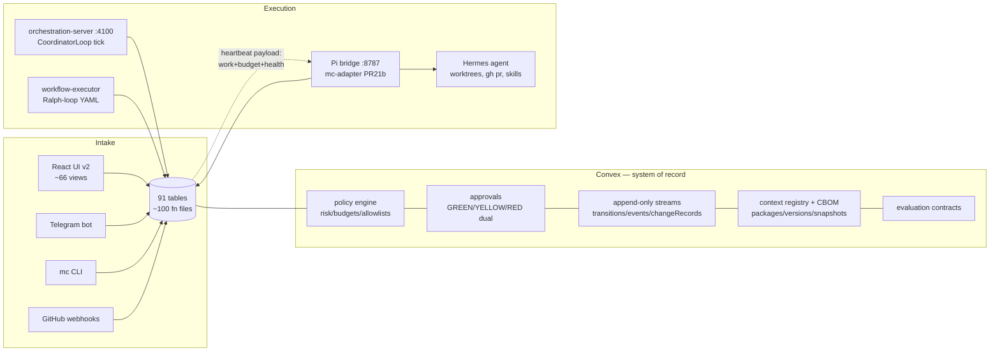
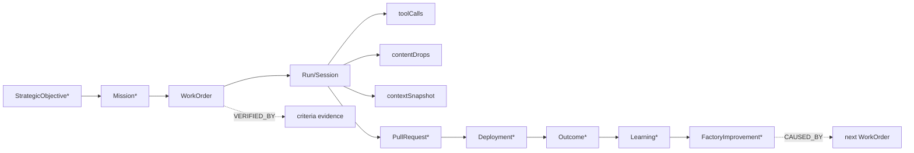
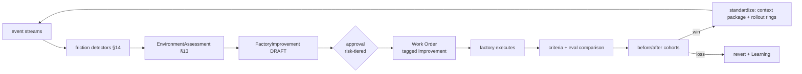

# Hermes Mission Control — Engineering Operating System Blueprint

**Version 1.0 · 2026-07-11 · Chief Architect proposal**
**Evidence basis:** five deep repository surveys (Convex backend, frontend, orchestration runtime, meta/CI, Pi/Hermes runtimes) conducted 2026-07-11, plus direct authorship of the Software Factory PR chain (#12–#29) landing context packages, CBOM, evaluation contracts, executor lineage, and the v2 UI. Where a claim rests on code written today, it is marked **[built-today]**; where on pre-existing code, **[verified]**; inferences and hypotheses are labeled.

---

## 1. Executive Summary

Mission Control is already three-quarters of a control plane and one-quarter of an operating system. The repository contains a genuinely strong execution spine — a 9-state task machine with actor- and artifact-gated transitions, risk-tiered dual-control approvals, idempotency-keyed mutations everywhere, append-only audit streams (`taskTransitions`, `taskEvents`, `changeRecords`, `workOrderEvents`), per-run token/cost accounting, and, as of today, a governed context registry, run-level Context Bills of Materials, an evaluation contract with honest statistics, and an executor contract whose state mapping makes it *impossible* for an agent to assert completion — verification authority is structural, not procedural.

What it lacks is not more execution machinery. It lacks **causal connective tissue and derived intelligence**: the lineage chain from intent to outcome exists as fragments (workOrder `correlation` chains **[built-today]**, `runs.sessionKey`, `codegenRequests.prUrl`) but no query answers "which mission caused this code change?"; costs are recorded but never attributed to outcomes; friction is experienced (485 Hermes session logs, bridge preflight denials, retry counters) but never mined; and nothing closes the loop from observation back into factory improvement — the promotion pipeline (Epic 9, `candidateKnowledge`) is designed but unbuilt.

The recommendation, in one sentence: **finish the traceability spine you already started (lineage + trace enrichment on existing tables), attribute the costs you already record, mine the friction you already log, and only then build the intelligence layers — as analytical projections over the existing Convex event streams, not as new services.** No graph database, no OpenTelemetry collector, no separate trace store in the first two horizons. The differentiated asset is that Mission Control *controls* execution rather than observing it from outside (contrast: Span), so causation can be recorded at write time instead of reconstructed statistically after the fact.

The first implementable release (§28) is Lineage v1: four PR-sized slices that make one query answerable end-to-end — *mission → work order → run → PR → verification → cost* — with a Trace Inspector UI over enriched existing events. Everything in it extends tables and functions that exist today.

---

## 2. Repository Evidence and Discovery Findings

Method: five parallel deep surveys (backend schema/functions; frontend; orchestration packages/CLI; docs/CI/git-state; Pi + Hermes runtimes) + external review of builderz-labs/mission-control and Tessl's product model + this program's own implementation work.

### Evidence table (capabilities against the assignment's context list)

| Capability | Status | Primary evidence | Surface | Tests | Observations |
|---|---|---|---|---|---|
| Work Orders | Implemented, flag-gated | `convex/workOrders.ts` (765 ln), `workOrderEvents`, `lib/workOrderDispatch.ts` (PR #14) | `mc dispatch`, orchestration `POST /workorders/:id/dispatch` | `workOrders.test.ts`, `workOrderDispatch.test.ts` | 9-state machine; verification derived from acceptance criteria via `deriveVerificationStatus` — executor cannot set DONE **[built-today ext.]** |
| Missions / higher-level constructs | Partial | `goals` table (COMPANY/TEAM/AGENT/TASK hierarchy, `tasks.goalId`), `mission.ts` (`getMission`/`setMission`/`reversePrompt`) | Overview Mission card | none | "Mission" = singular statement + goal hierarchy; no Mission entity linking to work orders |
| Workflow definitions/runs | Production-ready | `workflows`, `workflowRuns` tables; `packages/workflow-engine` (Ralph-loop executor, retry+backoff→PAUSED+approval) | `mc run`, `workflows:seed` | 3 pkg test files | Deterministic YAML DAGs; template context threading |
| Run Events | Implemented | `runs` (tokens incl. cache, costUsd, idempotency), `toolCalls` (riskLevel, `policyResult`), `opEvents` (RUN_*/TOOL_CALL_*/HEARTBEAT/COST_TICK), `taskEvents` | Run panels; `runs:listRecent` | thin | Three overlapping streams — consolidation target, not replacement |
| Run Artifacts | Partial | `contentDrops` (+ `idempotencyKey` dedup **[built-today]**), `qcArtifacts` (evidence packs w/ storageId), `captures` | ContentPipeline UI | thin | No unified artifact model; adequate |
| Execution Run Inspector | Prototype | `WorkflowRunPanel.tsx`, `tasks.getUnifiedTimeline`, `QcRunDetailView` | UI | none | Fragmented; no cross-stream trace view |
| Agent execution/orchestration | Production-ready | `agents.ts` (register/heartbeat/quarantine), CoordinatorLoop (`apps/orchestration-server`), `packages/{coordinator,agent-runtime,policy-engine}` | SKILL.md contract, `mc` CLI | `integration.test.ts`, pkg tests | Dual execution models (dynamic decompose + YAML) converge on same task machine |
| Human approval gates | Production-ready | `approvals.ts`: GREEN auto / YELLOW single / RED dual (`requiredDecisionCount: 2`), escalation + expiry crons, decision chains | UI modal, Telegram | `armPolicy.test.ts` partial | One of the strongest subsystems |
| Autonomy policies | Production-ready | `packages/policy-engine` (risk map, budgets, allowlists, spawn/loop limits, secret patterns), ARM `policyEnvelopes` (precedence tested) | `policy.ts:explainTaskPolicy` | 4 pkg files | Two policy systems (legacy + ARM) — debt |
| Verification receipts | Contract-only / orphan | `verificationReceipts` table exists only as undeclared data in local dev deployment (from deleted `mc-workorder-revision` session); acceptance-criteria verification is the live mechanism **[verified via deploy validation errors]** | — | — | See §32 open question; concept validated by a parallel prototype |
| Evidence collection/links | Partial | `qcArtifacts` evidence packs, `evidenceHash` on qcRuns, `recordVerificationEvidence` (criterion → evidence string, audited) **[built-today]** | — | executor tests | Evidence exists per-subsystem; no cross-linking model |
| GitHub / PR creation | Prototype | `github.ts` (issue sync, `linkTaskToGitHubPR`), `codegen.generateDiff` returns **mock PR URLs**; real `gh pr create` lives in workflow prompt text and in Hermes `web_git.py` | workflow YAML | none | Weakest link in the delivery chain |
| CI/CD orchestration | Minimal | `.github/workflows/ci.yml` (smoke/typecheck/lint/unit + sf/* triggers **[built-today]**) | — | — | No deployment records; `vercel.json` UI-only |
| Skills | Implemented **[built-today]** | `skills/` (9 skills, frontmatter standard), `packages/context-tools` (linter 10 rules, self-hosting CI gate), `contextPackages`/`contextPackageVersions` (immutable, content-hashed), registry UI | `mc skill lint`, `mc context *` | 193 + 34 + 20 tests | Two-tier scoring: structural lint (live) + scenario evals (contracts landed, execution PR 8 pending) |
| Agent definitions | Production-ready | `agents/*.yaml` (13 personas), ARM `agentTemplates`/`agentVersions` (immutable genome + `genomeHash` + provenance), `agentIdentities` (SOUL validation) | `hiring` pipeline + eval runner (`roles/support_triage_agent/evals/`) | armPolicy tests | Version-immutability pattern predates and inspired context packages |
| Mission/execution history | Implemented | append-only `taskTransitions`/`taskEvents`/`changeRecords`/`activities`/`opEvents` | Audit view | tasks tests | Strong recording; weak querying |
| Convex backend | Production-ready | 91-table schema (merged), ~100 function files | — | 9 suites, 163 tests | Local dev deployment gotcha: module-scope `Date.now()` frozen **[verified today]** |
| CLI | Implemented | `scripts/mc` (doctor/status/run/tasks/claim/dispatch/flags/skill/context/executor/demo) | — | smoke | |
| Worktrees / isolation | Split-brain | MC: recorded only (`workOrders.correlation.worktree`); real machinery in Hermes (`cli.py` `_create_worktree`, PID locks, unpushed-commit preservation) and Pi bridge (`subagents/worktree.ts`) | — | — | Deliberate: MC records, Hermes executes (approved authority model) |
| Software Factory contracts | Implemented | `docs/software-factory/` (domain contracts, EXECUTOR_CONTRACT.md, CBOM.md, EVALUATION.md, CONTEXT_MANIFESTS.md, FEATURE_FLAGS.md, UI_STYLE_GUIDE.md) **[built-today]** | — | — | Contract-first culture is real |
| CBOM / context snapshots | Implemented **[built-today]** | `contextSnapshots` (immutable per-run; packages+hashes, model, flags captured server-side; `cbom/v1` deterministic envelope) | `compareSnapshots`, `exportSnapshot` | 22 tests | The reproducibility spine |
| Cost accounting | Implemented | `runs.costUsd` + auto-pause at budget, `costEvents` cents-ledger (by project/agent/goal/run), `quotaSnapshots`, `alertRules` cron | CostAnalytics, Analytics page **[built-today]** | none | Recorded, never attributed to outcomes |
| Evaluations | Contracts landed **[built-today]** | `evaluationScenarios/Criteria/Runs/Comparisons`, pure lift/regression lib (null stats < n=2), `recordComparison` recomputes server-side | — | 36 tests | Execution (PR 8) and comparison pipeline (PR 9) pending |
| Executor contract / external agents | Implemented **[built-today]** | `workOrdersExecutor.ts` (claim leases, `pib:*` deterministic keys, correlation merge), Pi-repo `src/mc/` adapter (state-map mirror, DEGRADED-not-quarantine, redacted session-log refs) | fake-executor walk | 21 + 62 tests | Live verification pending environment window |
| Telemetry/observability | Partial | `opEvents`, `monitoring.ts` (audit log export), health endpoints, Analytics aggregations **[built-today]** | Analytics/Telemetry views | none | No spans, no sampling, no retention policy |
| AuthZ | Weak | RBAC tables exist (`roles`, `permissions`, `orgMembers.systemRole`) but Convex functions are unauthenticated; `operators.authId` unbound | — | — | Deferred deliberately (local single-operator) — must precede any org rollout |

### Classification summary
- **Production-ready:** task machine, approvals, policy engine, agent lifecycle, workflow engine, audit streams, budgets.
- **Implemented-incomplete:** work orders (UI pending), context registry (detail page pending), CBOM (capture wired only for fake executor), analytics (new), cost (unattributed).
- **Prototype:** GitHub/PR delivery (mock URLs), run inspector, RBAC.
- **Contract-only:** evaluation execution, memory→context promotion (Epic 9), verification receipts (orphan data).
- **Planned:** trust scoring, dispatch v2, rollout rings, drift detection (approved program PRs 10–17).

---

## 3. Current-State Architecture



**Control flow:** all writes converge on Convex mutations; agents pull work via heartbeat responses (no push). **State ownership:** Convex owns everything durable; packages own pure logic (state-machine, policy math, resolvers, lint, eval math — all unit-tested); runtimes own execution only. **Event flow:** five append streams (`taskTransitions`, `taskEvents`, `activities`, `changeRecords`, `opEvents`, `workOrderEvents`) — write-rich, query-poor. **Failure/retry:** idempotency keys on every create/transition; workflow retries with backoff → PAUSED + approval; heartbeat-miss quarantine (cron, env-gated). **AuthZ boundary:** deployment URL possession (local trust model). **Deployment:** one laptop — Convex local backend + launchd daemons (Hermes gateway, Pi bridge); Vercel for UI only.

### Architectural philosophy visible in code (evidence-backed)
- **Contract-first** — `docs/software-factory/` contracts precede code; OpenAPI-style shapes in `domain-contracts.md`.
- **Append-only execution records** — six audit streams, no update-in-place on history.
- **Policy-controlled autonomy** — `AUTONOMY_RULES`: RED always requires humans, no level exempt.
- **Immutable versioned artifacts** — `agentVersions` genome → `contextPackageVersions` → `contextSnapshots`; content-hash everywhere.
- **Idempotent orchestration** — deterministic keys (`pib:*` family is timestamp-free by design).
- **Human-in-the-loop as structure** — REVIEW→DONE is human-only in the task machine; DONE derivation for work orders lives inside MC-owned verification, unreachable by executors.
- **Evidence-based verification** — `recordVerificationEvidence` per criterion; qc evidence packs with hashes.

### Debt (evidence-backed)
1. **Three run/event vocabularies** (`runs`+`toolCalls`, `opEvents`, `taskEvents`) with overlapping semantics and no join discipline.
2. **Two policy systems** (legacy `policies` + ARM `policyEnvelopes`) bridged by compat code.
3. **`lib/stateMachine.ts` is a stale mirror** of `tasks.transition` (lowercase enum, missing states).
4. **PR delivery is fictional** in MC (`codegen.generateDiff` mock URLs) while real capability sits in Hermes — the recorded/actual split is unlinked.
5. **RBAC tables without enforcement.**
6. **Orphan concepts in the dev deployment** (revision-session data: `verificationReceipts`, `governancePolicies`, work-order revisions) — schema archaeology risk; see §32.
7. **65-view UI migrated but flag-off in prod**; legacy shell still default until chain merges.

---

## 4. Existing Strengths

1. **Causation is recordable at write time.** Because MC dispatches work (not merely observes it), `workOrders.correlation` accumulates missionId→workOrderId→executionId→bridgeRunId→hermesSessionId→runId→pullRequestId as execution proceeds **[built-today]**. Span must infer; MC can *know*.
2. **Reproducibility spine exists.** CBOM (`contextSnapshots`) answers "which instructions/skills/model/flags shaped this run" with hashes — the hard part of trace semantics is done.
3. **Governance is structural.** Dual-control RED approvals, risk upgrading on secret/production patterns, budget auto-pause, quarantine — not aspirational policy documents but enforced code paths with tests.
4. **Honest-measurement culture, enforced.** Eval lib returns null stddev below n=2; the UI displays "Impact scores appear once the evaluation framework runs" instead of invented lift numbers; kill-ai-slop audit is committed with sanctioned-pattern triage. This is the exact cultural prerequisite for Phase-6-style effectiveness metrics.
5. **Contract + test discipline:** 460+ tests across pure libs; every subsystem flag-gated with documented rollback.
6. **A real external-executor boundary** with an authority model (MC governs / Pi supervises / Hermes defends) that generalizes to any future runtime.

---

## 5. Current Gaps and Constraints

| Gap | Evidence | Consequence |
|---|---|---|
| No queryable lineage | correlation data exists; zero queries traverse it; no `getLineage(prUrl)` | Phase-4 questions unanswerable |
| Cost recorded, not attributed | `costEvents` has `goalId` but nothing computes cost-per-outcome; Analytics shows spend only | Phase 7 blocked on a projection, not on data |
| No trace view | events split across 5 streams; no UI walks one execution end-to-end | operators reconstruct manually |
| Delivery chain breaks at PR | mock URLs; no `pullRequests` table (PR 21 planned); no deployment records at all | outcome side of lineage missing |
| Friction logged, never mined | 485 Hermes session JSONLs, `flakySteps`, retryCount, preflight denials, `loops.ts` detection | Phase 8/9 have raw material and no pipeline |
| No outcome entity | nothing represents "did this change achieve intent" | Phase 6's numerator undefined |
| Single-operator trust model | no authenticated Convex access | blocks any multi-user intelligence layer |
| Laptop deployment | local backend, launchd daemons, three-watcher port fights (today) | reliability ceiling for "operating system" claims |

**Constraint to respect:** Convex is the right store for the operational plane but aggregation queries `.collect()` whole tables (see `analytics.ts` **[built-today]**) — fine at local scale, a real ceiling later. Intelligence layers should be *projections* with their own materialization cadence, not live full-table scans (§19, §25).

---

## 6. North-Star Product Positioning

**Verified current identity:** a governed control plane for autonomous software delivery (approved program, in flight).
**Proposed north star:** *the causal system of record for engineering* — every consequential engineering event (intent, decision, execution, evidence, cost, outcome) recorded with its cause at write time, queryable at every altitude from board metric to tool call.

Positioning tests (opinionated):
- If a feature collects **status from humans**, it fails the test (anti-Jira principle). MC infers status from execution.
- If a metric cannot **drill to events**, it doesn't ship (Evidence Over Claims).
- If a capability could be satisfied by **reading MC's own event streams**, it must not become a new collector (differentiation vs Span: we own the write path).

Challenge to the vision as given: "Engineering Operating System coordinating strategy, humans, agents, knowledge, governance, execution, verification, economics, learning" is nine nouns; the repo supports seven of them today at some maturity. The two genuinely absent — *strategy* and *outcomes* — are also the two where over-building is most dangerous (vanity dashboards). Hence the roadmap gates executive intelligence behind lineage + telemetry (§27), exactly as the assignment demands.

---

## 7. Target Operating Model

The assignment's six-layer model survives contact with the repository with two amendments: Layer 4 and 5 must be **projections, not services**, and Layer 2 is partly *outside* the repo (Hermes/Pi) by approved design — the model must treat external runtimes as first-class.

| Layer | Purpose | Owns (domain objects) | Exists today | Non-goals |
|---|---|---|---|---|
| L1 Infrastructure & external | GitHub, CI, models, deploy targets | adapters only | webhooks, gh-in-prompts | never a system of record |
| L2 Autonomous Factory | execute governed work | Hermes worktrees/PRs, Pi bridge sessions, workflow-executor, CoordinatorLoop | ✅ (split-brain by design) | MC never re-implements worktree/PR machinery (approved: records, doesn't execute) |
| L3 Control plane (system of record) | policy, state, approvals, context, verification, audit, cost recording | tasks, workOrders, approvals, contextPackages/Snapshots, runs/toolCalls, evaluation*, featureFlags, all audit streams | ✅ core; PR chain completes | no analytics here; no derived scores stored as truth |
| L4 Effectiveness intelligence | metrics, friction, waste, environment readiness | EffectivenessSnapshot, FrictionEvent, EnvironmentAssessment (projections + one new event type) | `analytics.ts` seed [built-today] | no real-time guarantees; no per-individual rankings |
| L5 Memory & learning | promoted knowledge, practices, improvements | candidateKnowledge (Epic 9), FactoryImprovement, Learning | contracts partial | no graph DB in first three horizons |
| L6 Leadership intelligence | allocation, risk, decisions | typed intelligence products (queries + insight objects) | ✗ | no chatbot over raw tables; gated behind L4 confidence thresholds |

**System-of-record vs projection rule:** L3 tables are authoritative and append-only where historical. L4/L5 artifacts must be **recomputable from L3 streams** — deletion of any projection is always safe. This single invariant prevents the "two sources of truth" failure mode and defers all analytics-store decisions (§25).

## 8. Bounded Contexts and Service Boundaries

Keep one Convex deployment; enforce boundaries by module + naming convention (already emergent: `convex/context/`, `convex/evaluation/`, `convex/governance/`, `convex/registry/`, `convex/operations/`):

- **work** (tasks, workOrders, dispatch) · **governance** (approvals, policies, flags, audit) · **context** (packages, manifests, snapshots) · **evaluation** · **execution-telemetry** (runs, toolCalls, opEvents — consolidation owner) · **delivery** (pullRequests, deployments — mostly new) · **intelligence** (analytics, friction, effectiveness — projections) · **memory** (candidateKnowledge, improvements, learnings).

Physical service separation is justified today for exactly one thing (already done): external execution (Pi bridge). Nothing else meets the bar. The orchestration server and workflow-executor remain thin Convex clients.

---

## 9. Intent-to-Outcome Lineage

### What exists (verified)
`goals` hierarchy → `tasks.goalId` → `workOrders.legacyTaskId` → `workOrders.correlation{executionId,bridgeRunId,hermesSessionId,runId,pullRequestId}` **[built-today]** → `runs.sessionKey`/`metadata` → `contextSnapshots.runId` → `costEvents.{taskId,goalId,runId}` → `codegenRequests.prUrl` (mock) → `github.linkTaskToGitHubPR`. Verification: acceptance criteria on work orders; approval decision chains.

### Missing links
Mission entity (goals are close but carry no budget/priority/portfolio semantics) · PR as entity · Deployment (nothing) · Incident (alerts exist, unlinked to changes) · Outcome (nothing) · Learning (nothing).

### Canonical chain and relationship semantics
Adopt **five typed relationship kinds**, not eight — the assignment's list over-splits. Evidence shows we need: `CAUSED_BY` (causation, write-time), `PART_OF` (composition/ownership), `DERIVED_FROM` (projections, CBOM→run), `VERIFIED_BY` (evidence edges), `SUPERSEDES` (versions/revisions). Correlation is not a relationship kind — it's the *id-propagation mechanism* (the `correlation` object) that lets the others be recorded cheaply. Attribution and dependency collapse into `PART_OF` + `CAUSED_BY` with role fields.

**Smallest viable implementation:** one table.

```
lineageEdges {
  fromType, fromId, toType, toId,      // string-typed refs (cross-system: PR URLs, deploy ids)
  kind: CAUSED_BY|PART_OF|DERIVED_FROM|VERIFIED_BY|SUPERSEDES,
  recordedBy (actor), confidence: RECORDED|INFERRED,   // write-time vs backfilled
  metadata, createdAt
}  idx: by_from(fromType,fromId), by_to(toType,toId), by_kind
```

Writers: `claimForExecutor`, `reportExecutionEvent`, `runs.start/complete`, `createSnapshot`, PR-link mutation, deployment webhook. Every writer already exists and already has the ids in hand **[built-today]** — edges are one extra insert per event.

Query surface (new `convex/lineage.ts`): `traceForward(type,id)` / `traceBack(type,id)` (bounded BFS, depth ≤ 8) answering, verbatim, the Phase-4 questions: *which mission caused this code change* = traceBack(PR) through CAUSED_BY; *what did this work order cost* = traceForward → runs → join costEvents; *agent-vs-environment failures* = friction events (§14) joined at the run node.



## 10. Agent Trace and Execution Observability

**Decision: enrich, project, don't duplicate.** The assignment's menu resolves as:
- **Enrich Run Events** — yes: add `spanId`/`parentSpanId`/`seq` to `toolCalls` and `opEvents` (additive optional fields); the Pi adapter already reports monotonic `seq` per bridge run **[built-today]**.
- **Typed trace spans as a new store** — no. `runs` (root span) + `toolCalls` (leaf spans) + `opEvents` (events) already *are* a trace tree missing only parent pointers.
- **Analytical trace projection** — yes: `traceView(runId)` query assembling the tree + CBOM + session-log refs + lineage edges into one document; later materialized if slow.
- **OpenTelemetry semantics** — adopt *naming* (span/trace vocabulary, genai.* attribute names where they map) for future export; do **not** run a collector. Export is a Horizon-3 adapter, not a foundation.
- **Separate bounded context** — only the projection module (`convex/intelligence/`), not storage.

Relationships: `workflowRuns ⟂ runs` unify under trace via lineage `PART_OF`; verification receipts (if adopted, §32) attach as `VERIFIED_BY` edges; PRs via correlation.

**Redaction/retention/access:** session logs already ship as **refs + sha256 + ≤4KB redacted excerpts, never full content** **[built-today]** — extend the same posture: prompts referenced by CBOM hash (content stays in the registry, access-controlled); tool-call `inputPreview/outputPreview` already truncate + hash **[verified]**; add `retentionClass: OPERATIONAL(90d)|EVIDENCE(kept)|SENSITIVE(30d, redact-on-read)` to the three event streams; sampling: none needed at current volume — revisit at >10⁵ events/day.

**Drill-down UX (Trace Inspector, extends Run Detail):** metric → cohort (workflow/repo) → representative runs list → trace tree (spans, retries, interventions) → event → artifact/diff → verification evidence. Every level is a link because every level is a row.

## 11. AI Effectiveness Model

Grounding rule already in-code: the eval lib refuses fake statistics **[built-today]**. Extend the same discipline. **No composite "AI score" in Horizons 1–2** — publish component metrics with drill-downs; a weighted composite only after component metrics survive two quarters of use (long-term hypothesis).

Priority metrics (all computable from existing/near-term tables; formulas abbreviated — full formula sheet becomes `docs/software-factory/EFFECTIVENESS.md` in H2):

| Metric | Formula (num/den) | Sources | Type | Min n | Misuse risk |
|---|---|---|---|---|---|
| Verified completion rate | workOrders reaching DONE via criteria PASS / claimed | workOrderEvents | outcome | 10 | gaming via weak criteria → pair with evidence-completeness |
| Autonomous completion | DONE with 0 human interventions / DONE | events + approvals | leading | 10 | autonomy ≠ success; always show beside rescue rate |
| Human rescue rate | runs with intervention after failure / runs | opEvents, workOrderEvents | diagnostic | 10 | — |
| Retry rate | retries / steps | workflowRuns.steps.retryCount **[verified]** | diagnostic | 20 | — |
| Cost per validated outcome | Σ costUsd over lineage of DONE WOs / count | costEvents × lineage | outcome | 5 | excludes exploratory work by design — label it |
| Token efficiency | tokens on DONE lineage / total tokens | runs | diagnostic | 20 | not a target, a smell detector |
| Rework rate | WOs REOPENED or superseding PRs / DONE | events, SUPERSEDES edges | lagging | 10 | needs revision concept (§32) |
| Evidence completeness | criteria with evidence / criteria on DONE | acceptanceCriteria | quality | any | — |
| Context lift | eval framework (built) | evaluationComparisons | outcome | per-scenario trials | already guarded in lib |

Scorecards: organization / repository / workflow / agent-role / agent-version / model / skill / task-type — all are existing group-by keys (CBOM carries model+skills; workOrders carry repo; agents carry role). **Team and individual scorecards: not built.** Individual data appears only in a private "my friction" view (Phase-17 engineer persona), never ranked — enforced by the aggregation-threshold rule (§23).

## 12. AI Economics and Cost Attribution

Data exists (runs.costUsd cache-aware; costEvents cents-ledger with goal/task/run attribution; per-role budget defaults; auto-pause; alert rules; quota burn-rate). Missing: classification + outcome join.

**Smallest viable:** add `spendClass: USEFUL|FAILED|EXPLORATORY|VERIFICATION|REWORK|WASTE_ENV|WASTE_COORD` — *derived, not recorded*: classification function over run status + lineage position + friction tags (§14), materialized into an `effectivenessSnapshots` projection nightly. Comparisons (model-vs-quality, cost-before/after-improvement) are then group-bys over snapshot + eval tables. Budget controls: already implemented at agent/run level; add mission-level budget when Mission entity lands (H2); provider fallback stays in Hermes (its native fallback chain **[verified]**), MC records which model actually served via CBOM.

## 13. Environment Readiness

Reuse two existing engines rather than building a scanner from scratch: **(a)** the qc subsystem (`qcRulesets` presets, findings, evidence packs) as the assessment executor; **(b)** friction events (§14) as the learning signal. `RepositoryReadinessAssessment` (approved program PR 13) becomes: dimension scores = static checks (docs present, test harness, `mc-context.json` present, setup skill lint score) ⊕ dynamic signals (friction rates for that repoSlug). The recommendation object is the assignment's structure verbatim — it maps 1:1 onto `FactoryImprovement` (§20), avoiding a second recommendation shape.

## 14. Friction and Waste Intelligence

Raw signals already emitted: retryCount, `flakySteps` (failureRatio + GitHub issue links!), `loops.ts` loop detection cron, approval expiry/escalation events, bridge preflight denials + stuck-run detection, tool-call DENIED, quarantines, context-window churn visible in Hermes session logs (refs available).

**Smallest viable:** one event type, one detector set.
```
frictionEvents { runId?, workOrderId?, repoSlug?, agentId?,
  category (taxonomy below), attribution: AGENT|WORKFLOW|ENVIRONMENT|REPOSITORY|POLICY|TASK_COMPLEXITY,
  evidenceRefs[], costUsdEstimate?, wastedMs?, detectorVersion, createdAt }
```
Taxonomy v1 (only categories with a live signal — the assignment's 25 shrink to 9 detectable now): excessive-retry, flaky-test, loop-detected, approval-latency, permission-denial, env-setup-failure (bridge preflight), tool-unavailable, stuck-run, budget-exhaustion. Detectors run as a cron over the event streams (versioned, replayable — projection rule). Waste report = group-by over frictionEvents × costEvents; ships as an Analytics tab, drill-down to runs.

## 15. Effective-Practice Discovery

Gate behind eval execution (PRs 8–9). Mechanism: cohort comparison over `evaluationComparisons` + effectiveness snapshots (same task-type/repo cohorts; min-n enforced by the lib). Strong practices exit through the **already-designed promotion pipeline**: finding → `candidateKnowledge` (Epic 9) → review → context package → rollout rings (PR 17) → measured lift (evals). No new machinery — this is the pipeline's intended second intake **[approved: Epic 9 source enum includes PI_RECEIPT | HERMES_SKILL_EDIT]**. Correlation-vs-causation guard: a practice can only be *recommended* from observational data; it becomes *standard* only after a controlled eval comparison (BLOCK/APPROVE recommendation from `recommendationFor`).

## 16. Digital Workforce

Verdict against the role list: **archetypes and skill bundles, not permanent agents.** Evidence: 13 persona YAMLs + ARM template/version/instance registry already model role-as-configuration; the hiring pipeline (`roles/support_triage_agent/` with scorecards, assessments, autonomy recommendations) is a working certification prototype. Map: Planning/Implementation/QA/Verification → existing personas + skills; Factory Improvement Engineer → the one genuinely new archetype (owns FactoryImprovement WOs; = Pi-supervisor's analysis half, Epic 18 P1). Security/Release → workflow roles (steps), not identities.

**Reputation = trust scoring (approved PR 15), constrained:** task-contextual (keyed by task-type × repo), version-specific (ARM `agentVersions` + CBOM give exact versions), evidence-based (trustEvents reference runs), time-decayed (approved design), explainable (event-sourced). Anti-gaming: reputation influences *dispatch weighting* (PR 14) and *risk ceilings* only — never rendered as a leaderboard (§23).

## 17. Organizational Memory and Knowledge Graph

**No graph database.** Evidence-based sizing: even ambitious growth keeps nodes <10⁶; `lineageEdges` + Convex indexes serve the eight example queries via bounded BFS; `knowledgeChunks` already provides vector retrieval (1536-dim) for semantic search. Staged plan: H1 relationship table (lineage) → H2 typed queries over it → H3 event-derived projections for hot paths (e.g., decision→incident chains) → graph engine *only if* a concrete query exceeds Convex's practical join depth (re-evaluate with data, per assignment's own warning). Decisions/ADRs enter as context packages of type ARCHITECTURE_GUIDE (registry already supports the type **[built-today]**) linked by lineage edges — no separate Decision store until usage proves need.

## 18. Engineering and Organizational Intelligence

Typed intelligence products, each a named query + insight shape (answer, evidence refs, confidence, freshness, scope, assumptions, alternatives, action, drill-down) — the assignment's structure adopted verbatim as the `Insight` interface. First five products (H2, ordered by evidence availability): (1) missions-at-risk (budget burn × verified-completion trend), (2) repo-readiness ranking (§13), (3) approval-gate value report (approval latency × override/deny rates — answers "which gates add delay without reducing risk"), (4) friction leaderboard by category/repo, (5) spend-vs-outcome by workflow. Explicitly rejected: free-form chatbot over tables (assignment concurs); LLM narration is allowed *on top of* typed products only.

## 19. Factory Health Model

One pattern: `HealthScore { family, scope, value?, status: HEALTHY|WATCH|AT_RISK|CRITICAL|INSUFFICIENT_EVIDENCE, components[], confidence, computedAt, detectorVersion }` — computed in projections, never stored as truth (recomputable). Families in order of activation: Delivery, Verification, Cost-efficiency, Environment-readiness, Autonomy/Intervention (H2); Quality, Knowledge, Learning-velocity (H3); Strategic-alignment (H4). INSUFFICIENT_EVIDENCE is a first-class status rendered in UI (the eval lib's null-statistics discipline, generalized). Anti-gaming: every family documents its counter-metric pair (e.g., autonomy ⟂ rescue rate) and the pair renders together, always.

## 20. Self-Improving Factory Loop



`FactoryImprovement` (H3 entity, fields per assignment §15 list — adopted nearly verbatim, it matches Pi's `learning_candidate` receipt design **[verified: docs/AGENTIC-OPERATING-MODEL-CROSSWALK.md]**): autonomy ladder per improvement type — instruction/doc updates: auto-draftable, human-approved; skill additions: draft + eval-gated; policy/model-routing changes: recommend-only until two successful supervised cycles. Every rung uses existing machinery: WOs, approvals, evals, rollout rings. **Nothing autonomous touches policy or production in any horizon of this blueprint.**

---

## 21. Strategy and Allocation Intelligence

Prerequisite entities: Mission (H2) with `plannedBudgetUsd`, `priority`, `strategic: boolean`; capacity = agent-hours + spend from runs. Allocation report = lineage rollup: spend and DONE-outcomes grouped by mission vs `maintenance` tag. Answerable then: strategic-vs-maintenance capacity, over-budget missions, interrupt analysis (WOs created with `source: INCIDENT` displacing planned work — task `source` enum already exists **[verified]**). Scenario planning: **explicitly deferred to H4** and constrained to assumption-visible arithmetic (move X capacity → these WOs delay, based on historical cycle times) — no predictive modeling. This is the layer most at risk of vanity; it ships last and only over ≥2 quarters of lineage data.

## 22. User Experience Evolution

Existing v2 shell + persona mapping (all extend pages that exist **[built-today]**):
- **Factory Operator** (today's primary user): Overview + Approvals + ATC — add live exceptions strip (frictionEvents) H2.
- **Engineer:** Run Detail → Trace Inspector (H1); "my friction" private view (H2).
- **Platform Engineer:** Repo Readiness (program PR 13) + Waste Report tab (H2).
- **Manager:** Work Orders board + friction-by-team aggregates (H2, min-n gated).
- **Director/Exec:** Analytics KPI band (exists) → Mission portfolio (H2) → allocation/Command Center (H4). Every executive tile links to the query that produced it — the Insight object carries `drillDown` refs by construction.
- **Architect:** registry ARCHITECTURE_GUIDE packages + lineage queries (H3).

## 23. Governance, Security, Privacy, Anti-Surveillance

Extend what's enforced; add what's absent:
- **Enforced today:** risk-tiered approvals w/ dual control; secret-pattern blocking + risk upgrading; budget auto-pause + kill-switch (`operatorControls`); immutable audit streams; session-log refs-not-content + redacted excerpts; content-hash provenance; emergency quarantine.
- **Required before multi-user (H2 gate):** authenticated Convex access binding `operators.authId`; role enforcement in mutations (tables exist, unenforced); retention classes on event streams; purpose-limitation note on every intelligence product.
- **Anti-surveillance product principles (binding):** (1) no individual rankings or cross-person comparison views — enforced by code review checklist + absence of person-keyed scorecard queries; (2) aggregation threshold n≥5 for any human-attributed metric; (3) individuals see everything collected about them (self-view = superset of manager view for their own data); (4) metrics ship with misuse-risk documentation (pattern established in §11 table); (5) agent reputation ≠ human evaluation — trustEvents reference agent versions, never humans.

## 24. Target Domain Model (new/changed entities)

| Entity | Verdict | Owner ctx | Notes |
|---|---|---|---|
| `lineageEdges` | **Build H1** | intelligence | §9; five kinds; RECORDED vs INFERRED confidence |
| `pullRequests` | **Build H1** | delivery | repo, number, url, branch, state, checks, dependsOn[] (stacked), workOrderId; replaces mock URLs; approved program PR 21 scope |
| `deployments` (delivery) | **Build H2** | delivery | webhook-fed; env, sha, prIds, status; distinct from ARM agent-`deployments` (naming: `releaseDeployments`) |
| `frictionEvents` | **Build H2** | intelligence | §14 |
| `Mission` | **Build H2** | work | thin: name, objective, plannedBudgetUsd, priority, strategic, goalId link; WOs get missionId |
| `FactoryImprovement` | **Build H3** | memory | §20; absorbs EnvironmentRecommendation |
| `effectivenessSnapshots` | **Build H2 (projection)** | intelligence | nightly materialization; recomputable |
| `Outcome` | **Build H3, thin** | delivery | assertion object: workOrder/deployment ref, kind (SHIPPED/VALIDATED/REVERTED), evidence refs; human-recorded first, telemetry-fed later |
| `Learning` | **H3** | memory | = promoted candidateKnowledge with outcome link; mostly exists via Epic 9 |
| AgentTrace/TraceSpan | **Do not build** | — | enrichment + projection (§10) |
| StrategicObjective, Initiative | **Defer H4** | — | Mission suffices for two horizons; Initiative only if mission count proves unmanageable |
| AgentCertification | **Defer** | — | hiring pipeline prototype exists; formalize only when >1 org uses it |
| KnowledgeRelationship | **Do not build** | — | lineageEdges covers it |
| Decision/Risk entities | **Defer** | — | ARCHITECTURE_GUIDE packages + edges first (§17) |
| CapacityAllocation | **Defer H4** | — | derived report, not an entity, until proven otherwise |

Migrations: all additive (program discipline); Mission backfills from `goals` COMPANY rows; PR entity backfills from `codegenRequests.prUrl` + `correlation.pullRequestId` with `confidence: INFERRED`.

## 25. Build / Buy / Integrate

| Capability | Verdict | Rationale |
|---|---|---|
| Lineage, traces, effectiveness, friction | **Build** | differentiated core; data already in-house at write time |
| OpenTelemetry | **Adopt semantics H1, export adapter H3** | interop without collector overhead at local scale |
| OpenLineage | **Evaluate H3** | maps to lineageEdges cleanly if external consumers appear |
| GitHub/Actions | **Integrate deeper** (webhooks→pullRequests/deployments) | never rebuild |
| Incident platforms | **Integrate H3** (webhook → alerts + lineage edge) | |
| Model-provider billing APIs | **Integrate H2** (reconcile costEvents) | catch drift between recorded and billed |
| Coding-agent traces (Span-style external IDE telemetry) | **Defer/consume-only** | MC's factory work doesn't need it; optional intake if humans' IDE agents matter later |
| Graph DB | **Don't** (re-evaluate H4 with query evidence) | §17 |
| Analytics store (columnar) | **Don't until projection latency hurts** | Convex projections + nightly materialization first; measured trigger: p95 snapshot query >2s |
| Span (buy) | **No** | its wedge is observation-side; MC owns the control side — integration possible, dependency unnecessary |

## 26. Migration Strategy

Continue the program's proven pattern: additive schema + flags + worktree PRs + evidence in PR bodies. Specific moves: (1) event-stream consolidation is **virtual first** — `traceView` joins the three streams; physical unification only if the join proves hot; (2) mock PR URLs: backfill `pullRequests` rows marked INFERRED, then flip `codegen` to write real rows; (3) `lib/stateMachine.ts` stale mirror: delete in the first PR that touches it, tests pinned to `tasks.transition`; (4) legacy/ARM policy duality: freeze legacy `policies` writes in H2, read-through until H3, single ADR documents the winner (ARM envelopes); (5) revision-session orphan data: adopt-or-drop decision at §32, then either declare tables in schema or archive rows to export and delete — never leave undeclared data past H1 (it blocks every deploy, proven today).

## 27. Sequenced Roadmap

**Current Foundation (done/in-flight):** PR chain #12–#29 + Pi adapter — governed context, CBOM, eval contracts, executor lineage seed, v2 UI, analytics seed, demo environment.

**H1 — Traceability Foundation (≈4–6 wks):** lineageEdges + writers; pullRequests entity + real GitHub wiring; span enrichment (parentSpanId/seq); Trace Inspector UI; `mc trace <id>`; CBOM capture on all execution paths (workflow-executor + coordinator, not just fake executor); finish program PRs 8–9 (eval execution/comparison) since effectiveness needs them. *Gate to H2: one real work order traced intent→PR→verification→cost in production data.*

**H2 — Effectiveness & Environment Intelligence (≈6–8 wks):** frictionEvents + detectors; effectivenessSnapshots projection + scorecards UI; spend classification; Mission entity + budgets; repo readiness (program PR 13) fused with friction; auth enforcement (multi-user gate); approval-gate value report. *Gate: metrics survive 4 weeks of operator use without a single unexplained number.*

**H3 — Memory & Factory Improvement (≈8 wks):** Epic 9 promotion pipeline; FactoryImprovement loop (§20) with recommend→draft rungs; Outcome + Learning thin entities; deployments intake; incident intake; practice discovery over eval cohorts; OTel export adapter. *Gate: one improvement completes the full loop with measured before/after.*

**H4 — Strategic & Executive Intelligence:** allocation reports, Command Center, scenario arithmetic, StrategicObjective if warranted.

**Long-term hypothesis:** self-tuning dispatch/model-routing from reputation + economics — explicitly out of scope for this blueprint's commitments.

Dependency spine: lineage → (attribution, friction) → (effectiveness, readiness) → (improvement loop, memory) → (allocation, executive). Prioritization applied: leverage > evidence-availability > user value > validation > risk (per assignment).

## 28. First Implementable Release — "Lineage v1"

**Objective:** every consequential id is connected; one UI walks any execution end-to-end; cost is visible per work order. **Users:** factory operator, engineer. **Non-goals:** scores, recommendations, missions, new stores.

Slices (PR-sized, each independently green):
1. **`lineageEdges` + writers + `lineage.ts` queries** — schema (1 table), edge writes in the 6 existing mutations, traceBack/traceForward, 25+ pure tests. *Accept:* fake-executor walk yields a complete chain queryable both directions.
2. **`pullRequests` entity + GitHub wiring** — table, webhook/poll intake, `linkTaskToGitHubPR` upgraded, codegen mock retired (INFERRED backfill), edges to WOs/runs. *Accept:* a real PR opened by the factory appears with live check status and traces back to its work order.
3. **Span enrichment + `traceView`** — optional `parentSpanId`/`seq` on toolCalls/opEvents; adapter + workflow-executor populate; `traceView(runId)` assembles tree+CBOM+refs+edges. *Accept:* Trace Inspector JSON for any seeded demo run renders a coherent tree.
4. **Trace Inspector UI + `mc trace`** — Run Detail tab: span tree, retries, interventions, cost rollup, lineage breadcrumb (mission→…→PR), evidence links; CLI mirror. *Accept:* operator answers "what happened between intent and PR" for the demo narrative without leaving the page; screenshot in PR.
5. **Cost-per-work-order rollup** — lineage×costEvents query + Overview/WorkOrder surfacing. *Accept:* demo WOs show non-zero attributed cost equal to sum of their runs.

Rollout: flags `lineage.v1`, `trace.inspector`; demo-seed extended to emit edges (validates in demo before real use). Rollback: flags off; table inert. Observability: edge-write counters in `mc doctor`. Tests: pure lib + Convex function suites per slice + one E2E walk extension of the existing fake-executor script.

## 29. PR-Sized Implementation Plan

Slice 1 → `sf/30-lineage-edges` · Slice 2 → `sf/31-pull-requests` · Slice 3 → `sf/32-span-enrichment` · Slice 4 → `sf/33-trace-inspector` · Slice 5 → `sf/34-cost-rollup`. Base: post-merge main (or current chain tip). Each: additive schema, tests, docs page update, screenshots for UI slices, rollback note — the established program template.

## 30. Risks and Tradeoffs

| Risk | Mitigation |
|---|---|
| Lineage write burden slows mutations | one insert per event; measure; batch if needed |
| INFERRED edges pollute analysis | confidence field mandatory; intelligence queries default RECORDED-only |
| Projection drift vs truth | recomputability invariant + detectorVersion on every projection |
| Metric misuse culturally | §23 principles are product constraints, not docs; misuse-risk column mandatory in metric specs |
| Convex scale ceiling on projections | measured trigger defined (§25); nightly materialization buys headroom |
| Two-runtime complexity (MC+Pi+Hermes) | authority model already approved; contract tests mirror both sides (established pattern) |
| Blueprint over-reach vs one-operator reality | H2 auth gate; every horizon has an exit gate; H4 deliberately thin |

## 31. Explicit Non-Goals

No graph database (first three horizons) · no OTel collector infrastructure · no separate trace store · no individual performance rankings, ever · no composite AI score before component maturity · no chatbot-over-tables · no scenario prediction engine · no rebuild of Hermes worktree/PR machinery inside MC · no microservice split of the Convex plane · no buying Span · no autonomous policy/production changes · no status-collection from humans.

## 32. Open Questions Requiring Human Decisions

1. **Verification receipts & work-order revisions:** the deleted `mc-workorder-revision` session left data (receipts, governancePolicies, revision states) and possibly unpushed code. Decide: recover and harvest that design (if a ref exists), or let acceptance-criteria evidence + `SUPERSEDES` edges own the concept and delete the orphan rows. Blocks: rework-rate metric, §26 item 5.
2. **Multi-user timeline:** auth enforcement is H2's gate — is multi-operator use actually planned in that window, or can it slip to H3?
3. **Mission vs goals:** thin new entity (recommended) vs extending `goals` with budget/priority fields — either works; pick before H2.
4. **Deployment intake source:** Vercel is UI-only today; what deploy target should `releaseDeployments` first integrate (SellerFi? this repo's CI?)?
5. **Retention numbers:** proposed 90d operational / 30d sensitive / evidence-kept — confirm against your actual compliance needs.
6. **Hermes IDE-side traces:** in-scope for intake ever, or factory-only forever?

## 33. Final Recommendation

Approve Horizon 1 (Lineage v1, five slices) as the immediate program extension after the current PR chain merges. It is small (≈5 PRs), entirely additive, reuses six mutations and three streams that already exist, and converts the platform's genuine differentiator — write-time causation — from an architectural property into a user-visible product. Defer every intelligence claim until that spine carries real traffic; then H2's metrics inherit credibility instead of asserting it. The five-to-ten-year vision holds — but it is earned one recorded edge at a time, and the repository, as of tonight, is closer to it than the assignment's framing assumes.
