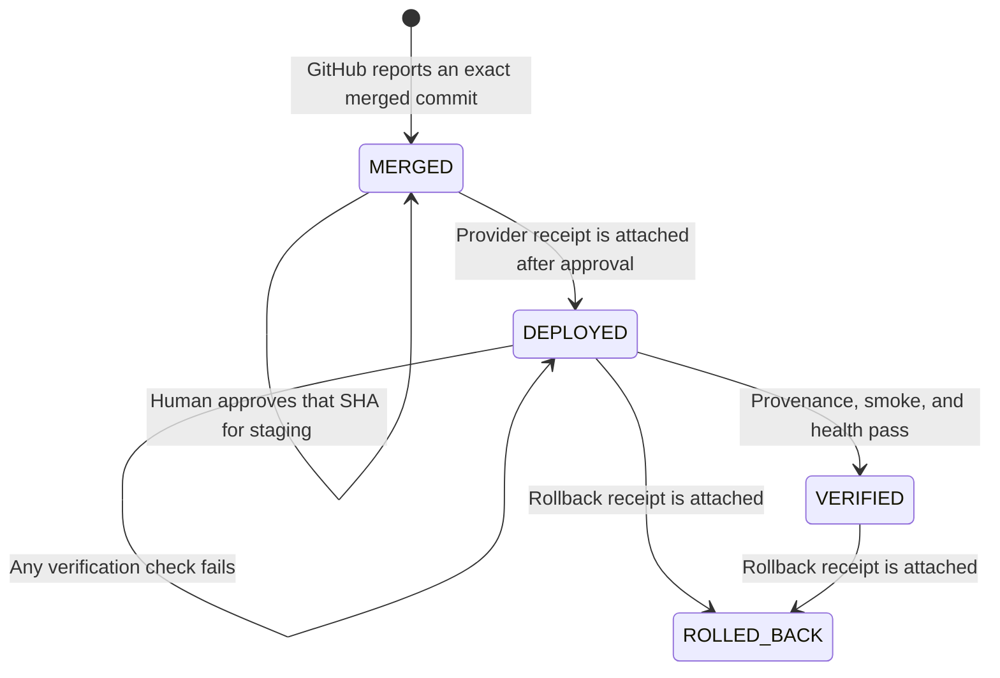

# Governed Staging Release

## Purpose

This contract closes the V1 Software Factory path after pull-request creation.
Mission Control tracks the exact GitHub-reported merge commit through human
staging approval, provider deployment receipt, independent verification, and
rollback evidence. It does not deploy to production or grant deployment
authority to an agent.

## Authoritative lineage

`Mission → WorkOrder → Task → Attempt → verified candidate → pull request → GitHub merge commit → staging release → release evidence`

The factory creates a code release only when the merged pull request has exact,
verified WorkOrder, Attempt, repository, PR-head, Factory-version, and staging
environment lineage. GitHub is authoritative for the merge actor, merge time,
and full 40-character merge commit SHA.

## State model



Approval and evidence are immutable records, not additional optimistic states.
A failed verification remains `DEPLOYED` and exposes the failure and next
action. A rolled-back release is terminal; a new merge creates a new release.

## Required controls

- Only a full, exact merge SHA is accepted.
- The Factory version must resolve to a `staging` environment.
- A human with `factory.approve` must approve the exact SHA before a deployment
  receipt can be recorded.
- A workspace manager configures the one allowed staging origin on environment
  metadata before evidence is accepted.
- Deployment, provenance, smoke, and health URLs must be credential-free,
  fragment-free, same-origin URLs. HTTPS is mandatory outside explicitly
  enabled local development.
- The verifier fetches evidence server-side with a 10-second timeout and a
  64-KiB response limit. It stores status, latency, URL, SHA-256 digest, and a
  short result—not response bodies.
- Provenance JSON must contain the exact `commitSha`, `deploymentId`, and
  `environment: "staging"` values bound to the release.
- Rollback requires a different full restored SHA, provider rollback receipt,
  rationale, and evidence URL on the approved deployment origin.

## Operator procedure

1. Open **Delivery → Deployments** and locate the `MERGED` code release.
2. Confirm the WorkOrder, pull request, PR head, merge commit, repository, and
   staging environment all describe the intended change.
3. If the origin is not configured, set the exact HTTPS staging origin.
4. Approve the displayed merge commit with a durable rationale.
5. Deploy that commit using the external staging provider. Record the provider
   name, immutable deployment ID, deployment URL, provenance URL, smoke URL,
   and health URL.
6. Run **Verify staging**. Inspect each immutable evidence row; do not treat a
   `DEPLOYED` state or a reachable page as verified.
7. If every check passes, confirm the release is `VERIFIED` and the WorkOrder
   is `DONE`. If a check fails, correct staging or record an evidence-backed
   rollback. Do not edit or waive the failed proof.

## Staging endpoint contract

The provenance endpoint returns JSON:

```json
{
  "commitSha": "0123456789abcdef0123456789abcdef01234567",
  "deploymentId": "provider-deployment-123",
  "environment": "staging"
}
```

Smoke and health endpoints pass only with a 2xx response. Redirects, network
errors, timeouts, oversized bodies, non-2xx responses, unsafe URLs, and
provenance mismatches fail closed.

## Recovery and audit

GitHub ingestion, release creation, approval, deployment, verification attempts,
and rollback use stable idempotency identities. Refresh and webhook replay must
not create parallel releases or duplicate evidence. Every material write uses
server-derived actor identity and records the required WorkOrder action.

For a failed check, preserve the `DEPLOYED` release and either repair the same
immutable deployment evidence source and retry verification or roll back. For a
rollback, preserve both the failed/reverted merge SHA and the restored SHA.

## Deliberately deferred

Production deployment, automatic provider deployment, canaries, progressive
delivery, automatic rollback, trust scoring, and release analytics remain out
of scope until three real staging releases complete this path with deterministic
evidence.
