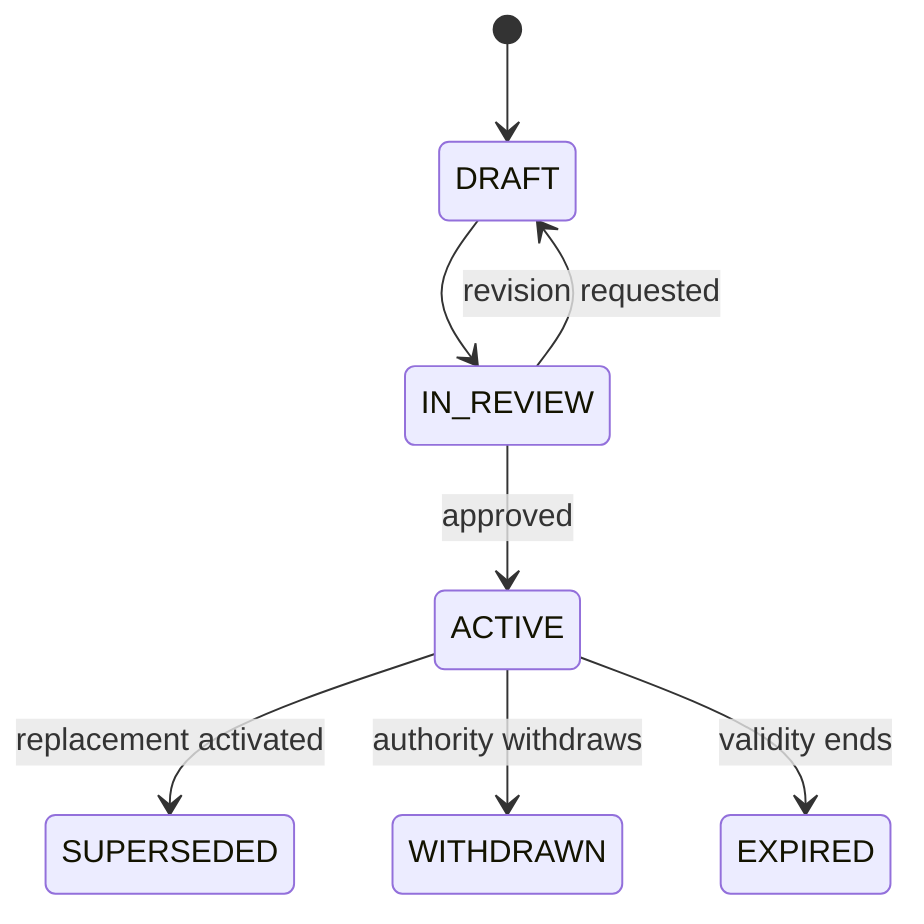
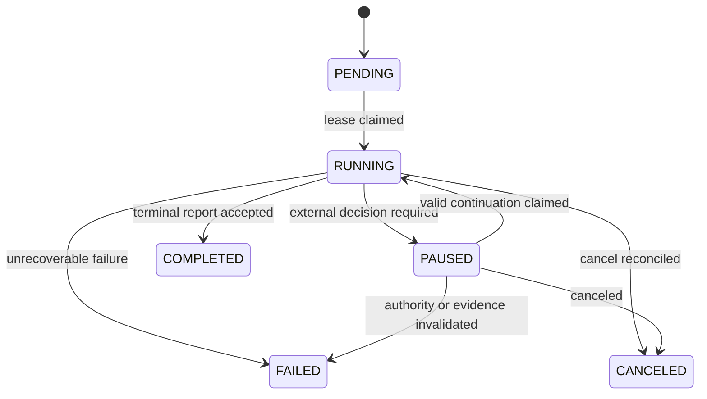
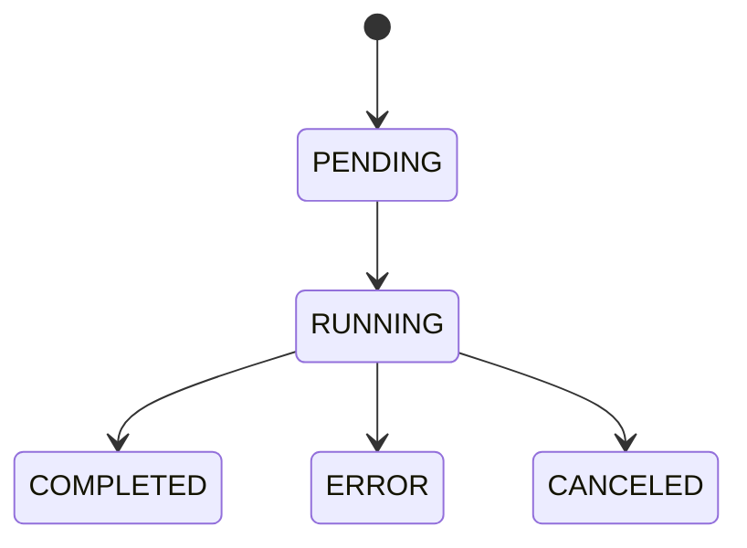
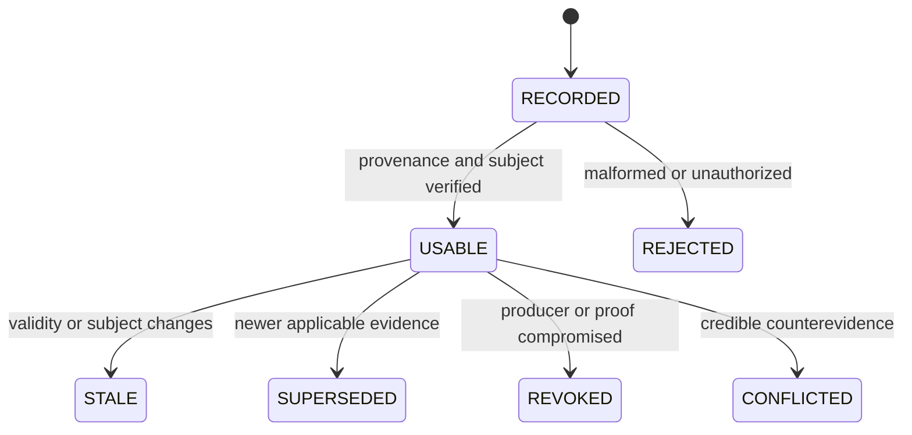
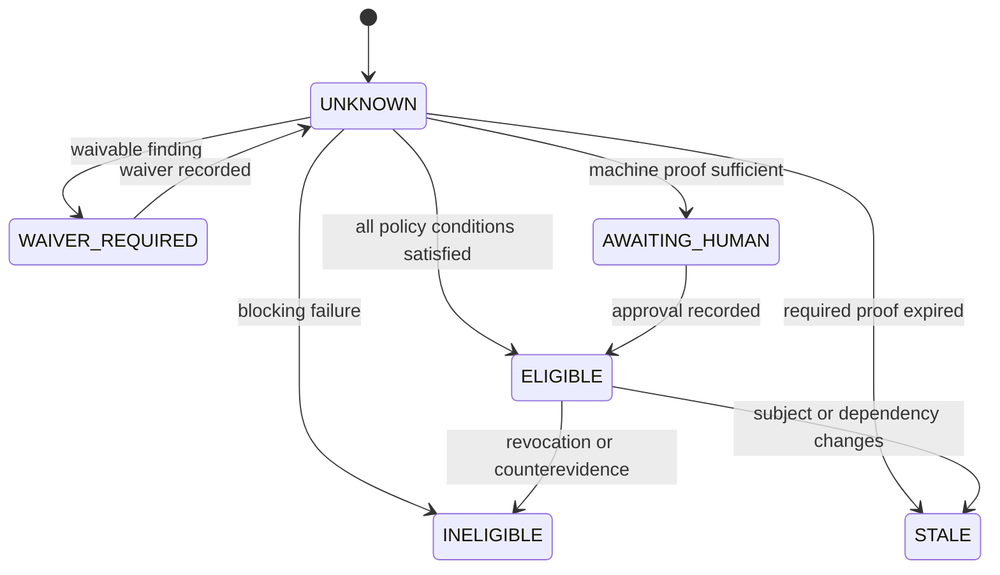

# Verification and Gate State Machines

This document defines cross-record semantics. It does not require a broad rename
of existing WorkOrder or WorkflowRun states.

## Governing invariant

```text
execution completed != verification passed
verification passed != gate eligible
gate eligible != WorkOrder accepted
WorkOrder accepted != pull request merged
pull request merged != production verified
```

## Quality Contract — target



Only an active contract may compile an enforced WorkOrder projection. Editing
an active contract is prohibited; create a new revision.

## WorkflowRun/Attempt — implemented mapping



A retry that represents a new execution try creates a new Attempt identity.
Resume continues the same Attempt only when candidate, manifest, evidence,
approval, lease, and continuation checkpoint remain valid.

## Verification Run — implemented behavior



The persisted baseline may store terminal results without every intermediate
state as a separate column; ordered run events retain the lifecycle. Completed
results are immutable.

### Check results

```text
PASS | FAIL | SKIPPED | NOT_CONFIGURED | ERROR
```

Only `PASS` satisfies a mandatory check. An explicitly optional check may be
`SKIPPED` only when the active contract and policy authorize that outcome.

### P0 verification verdict

```text
VERIFIED | NOT_VERIFIED | BLOCKED | REQUIRES_HUMAN_REVIEW
```

- `VERIFIED`: mandatory checks pass and criteria have sufficient evidence.
- `NOT_VERIFIED`: proof is missing, failed, skipped, unconfigured, or errored.
- `BLOCKED`: scope, budget, negative constraint, or hard policy failed.
- `REQUIRES_HUMAN_REVIEW`: deterministic proof passed but policy reserves
  advancement for a human.

## Evidence lifecycle



Stale, superseded, revoked, rejected, and conflicted evidence remains visible.
State changes append reason, actor, time, and triggering record.

## Quality Gate Decision — target



Every evaluation creates or supersedes a decision. Policy modes are
`OBSERVE_ONLY`, `SHADOW`, `ENFORCED`, and `EMERGENCY_BYPASS`. Only `ENFORCED`
decisions authorize normal advancement. Emergency bypass requires named human
authority, exact scope, expiration, compensating controls, and audit.

## Human review continuation — implemented

1. Verification produces `REQUIRES_HUMAN_REVIEW` for an exact candidate.
2. Control plane reserves an approval and pauses the same Attempt.
3. Conditional approval, rejection, revision, expiry, or invalid authority
   closes the continuation; it cannot publish.
4. Unconditional approval queues the same Attempt.
5. Worker verifies manifest, candidate, receipt, approval, lease, and checkpoint.
6. Control plane issues and atomically consumes a short-lived publication
   permit immediately before GitHub mutation.
7. Restart recovery reconciles existing branch/PR identity idempotently.

## Transition audit contract

Every authoritative transition records subject and prior version, actor and
identity source, reason, policy/contract version, idempotency key, timestamp,
required evidence IDs, before/after state, and invalidated dependent records.
