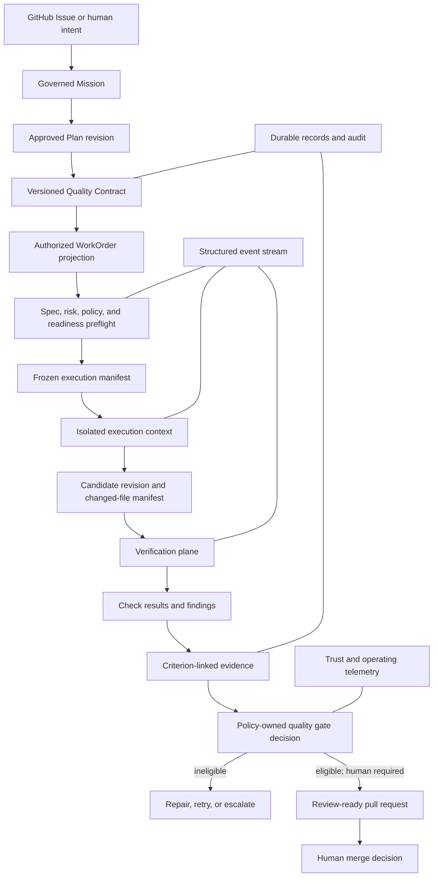

# Verification-First AI Software Factory

## Executive decision

Mission Control should evolve into a verification-first AI Software Factory by
extending its existing governed delivery hierarchy, not by creating a second
agent platform or quality lifecycle.

The first production-worthy proof remains:

`Governed Issue or Human Intent -> Approved Plan -> WorkOrder -> bounded
execution -> independent verification -> criterion-linked evidence -> policy
decision -> review-ready pull request -> human approval`

The factory does not trust work because an implementation agent reports
completion. It permits a governed transition only when the active specification
is satisfied by sufficient, current, independently produced evidence tied to
the exact candidate revision.

This document combines current-state architecture and proposed evolution. At
baseline `2b1a7c4`, Mission Control implements the P0 WorkOrder specification,
Change Budget, verification engine, verification runs, evidence envelopes,
server-recomputed WorkOrder receipt, pre-publication human review, and
candidate-bound publication permit. Production deployment verification,
provider CI as a complete verifier source, calibrated trust, and governed
learning remain future work.

## Problem

Code generation is becoming cheaper while specification, verification,
governance, and human attention remain scarce. A coding agent can misunderstand
intent, produce incomplete tests, weaken an assertion, exceed its authorized
scope, and then confidently report success. A green CI run can prove that
selected commands passed without proving that the requested behavior exists or
that prohibited changes did not occur.

Mission Control therefore needs an explicit assurance boundary between
execution completion and WorkOrder acceptance. That boundary must answer:

- What exact specification was approved?
- Which artifact and source revision were evaluated?
- Which required checks ran, and which did not?
- Which evidence supports each acceptance criterion?
- Which constraints and change limits were evaluated?
- Is the evidence current, attributable, and sufficiently independent?
- Which policy produced the advancement decision?
- What human judgment remains necessary?

The credible guarantee is not “this software has no defects.” It is:

> No WorkOrder reaches an accepted or verified-PR state unless its active,
> versioned verification contract is satisfied by policy-required evidence and
> approvals for the exact candidate revision.

## Scope and non-goals

### In scope for the first vertical slice

- Convert one approved Mission Plan into a versioned verification contract and
  bounded WorkOrder projection.
- Represent positive requirements, negative constraints, risk, change budget,
  required checks, evidence expectations, and approval conditions.
- Execute real deterministic verifiers through the current runtime.
- Enforce allowed paths, denied paths, changed-file limits, and dependency or
  schema-change permissions before a candidate can advance.
- Preserve check results and criterion-linked evidence without overwriting
  history.
- Produce an explainable policy gate decision and concise review package.
- Surface specification, execution, verification, evidence, and required human
  action in the existing Work Orders and Execution Run Inspector experience.
- Prove one Governed Issue to Verified Pull Request journey, including failure.

### Explicitly deferred

- Automatic merge or deployment.
- Production rollout, rollback, and production verification.
- Automatic trust promotion or demotion algorithms.
- Autonomous creation or promotion of learned gates.
- A broad sandbox-provider marketplace.
- A second CLI, quality dashboard, navigation domain, or workflow hierarchy.
- Superficial integrations that report `PASS` without executing a real check.

The architecture should expose clean extension points for these capabilities,
but they do not belong in the first implementation change.

## Repository audit at `2b1a7c4`

### Existing capabilities to reuse

| Area | Existing implementation | Disposition |
| --- | --- | --- |
| Governed intent | `missions`, versioned `missionPlans`, `validationAssertions`, Plan approval and WorkOrder release | Treat the approved Plan revision as the top-level quality contract source |
| Work authorization | `workOrders`, criteria, constraints, risk, revisions, supersession, reopen decisions, governance policy | Extend the WorkOrder as the scoped executable projection; do not replace it |
| Execution hierarchy | Task, `workflowRuns`, agent `runs`, workflow steps, WorkOrder linkage, model/executor fields | Preserve the hierarchy; define “Attempt” as the immutable execution try rather than adding a generic AgentRun |
| Runtime observation | `runEvents`, `runArtifacts`, `toolCalls`, Execution Run Inspector, changed-file and evidence-lineage views | Extend the event and artifact vocabularies; do not create a parallel event store |
| Verification | criterion-level `verificationReceipts`, receipt validity/invalidation, validation assertions, receipt ingestion endpoints | Keep receipts as immutable criterion observations; do not overload one receipt into the final policy decision |
| Governance | `approvalDecisions`, `governancePolicies`, WorkOrder acceptance rules, policy engine, tool risk and budgets | Reuse authority records; consolidate policy inputs rather than introducing another Approval model |
| Execution controls | implementation policy, allowed-command validation, repository/worktree checks, Hono orchestration boundary, executor adapters | Extend with a typed change budget and frozen execution manifest |
| GitHub | GitHub CI ingestion, PR checks, repository lineage concepts | Use GitHub first and require exact base/head/candidate correlation |
| UX | Work Orders view, approvals, receipts, Evidence Lineage Panel, Execution Run Inspector | Add verification as tabs/sections in these surfaces, not a new top-level product |
| Tests | schema/domain tests, WorkOrder lifecycle tests, run inspector tests, policy tests, adapter tests | Add contract, enforcement, result-semantics, and end-to-end failure fixtures alongside existing tests |

### Remaining incomplete capabilities

1. The WorkOrder verification contract is versioned in the specification and
   frozen into the execution manifest, but the approved Mission Plan is not yet
   compiled into a separately digestible top-level Quality Contract.
2. Deterministic P0 checks and Change Budget enforcement exist; provider CI,
   security, dependency, browser, performance, and critical-path profiles are
   not yet a complete registered verifier ecosystem.
3. Evidence envelopes and verification runs exist, but contradiction handling,
   revocation, retention enforcement, and explicit independence levels need
   further hardening.
4. The server computes `VERIFIED`, `NOT_VERIFIED`, `BLOCKED`, and
   `REQUIRES_HUMAN_REVIEW`; richer operator gate states such as `UNKNOWN`,
   `STALE`, and `WAIVER_REQUIRED` are not yet a unified gate-decision record.
5. Test-weakening and verification-infrastructure change detection need a
   complete policy profile rather than isolated checks.
6. Runtime suspension/resume and candidate-bound publication authority are
   implemented; external CI and webhook reconciliation still require complete
   late, duplicate, conflicting, and stale-result semantics.
7. Verified-throughput and trust telemetry must remain unclaimed until factual
   production outcome sources exist.
8. The accepted browser-initiated Mission-to-verified-PR capstone remains the
   release-level proof even though component and runtime evidence now exists.

### Architectural conflicts to resolve

| Conflict | Decision |
| --- | --- |
| Risk uses both `GREEN/YELLOW/RED` and `LOW/MEDIUM/HIGH/CRITICAL` | Retain `LOW/MEDIUM/HIGH/CRITICAL` as consequence severity. Derive governance bands where useful; do not migrate the core risk model merely for display language. |
| Existing `verificationReceipts` versus a proposed aggregate final receipt | Keep criterion receipts as observations. Add a separate quality-gate decision and derive a human-readable Verification Proof Package from the contract, results, receipts, findings, and approvals. |
| `runArtifacts` versus a proposed generic Evidence table | Treat artifacts as stored evidence objects and receipts as claim observations. Add a normalized evidence envelope only if existing fields cannot express subject digest, producer, method, and provenance without ambiguity. |
| WorkflowRun, run, Task, and Attempt terminology | Preserve existing records. Document which record is the immutable Attempt for each supported executor before changing schema or UI labels. |
| Agent self-review versus independent verification | Self-review is execution telemetry. It may inform a validator, but it cannot satisfy an independence requirement by itself. |
| Verification result versus workflow completion | A completed WorkflowRun means execution ended. It never implies a verified WorkOrder or accepted Mission. |

## Critical architectural improvement

The supplied proposal correctly makes the WorkOrder executable, but the
approved Mission Plan must remain the top-level source of truth. The recommended
compilation model is:

```text
Human-owned Mission intent
  -> approved Plan revision and validation assertions
    -> canonical Quality Contract digest
      -> scoped WorkOrder specification and Change Budget
        -> frozen execution manifest
          -> Verification Run and evidence
            -> policy-owned Quality Gate Decision
```

This prevents individual WorkOrders from silently redefining Mission-level
requirements. A WorkOrder is a bounded projection of an approved contract, not
an independent source of “done.”

## Target architecture



### Plane responsibilities

- **Control plane:** owns contract versions, authority, policy, state
  transitions, gate decisions, exceptions, and human approvals.
- **Execution plane:** performs only the work described by a frozen manifest and
  reports structured facts. It cannot expand its own scope or accept its work.
- **Verification plane:** invokes registered verifier capabilities, preserves
  results, detects missing or conflicting evidence, and supplies facts to
  policy. It does not merge or deploy.
- **Evidence plane:** preserves immutable, subject-bound proof and native
  artifacts with classification, retention, freshness, and provenance.
- **Human governance:** owns intent, material exceptions, risk acceptance,
  merge, deployment, and promotion of learned rules or autonomy.

## Executable specification

### Requirement model

Every requirement and constraint needs a stable ID. The factory should
distinguish:

- **Requirement:** what must be true.
- **Acceptance criterion:** the observable boundary for acceptance.
- **Validation assertion:** a specific claim a verifier can evaluate.
- **Verification method:** how evidence is produced.
- **Evidence requirement:** what makes the proof sufficient and current.

Functional and non-functional requirements should include actor, condition,
expected outcome, measure, threshold, operating context, rationale, owner, and
risk where applicable. Vague requirements remain `UNKNOWN`; agents must not
invent missing business decisions.

### Negative-space constraints

Represent prohibited behavior as typed constraints rather than prose alone:

```yaml
negative_constraints:
  denied_paths:
    - src/auth/provider.ts
    - infrastructure/**
  prohibited_change_types:
    - PUBLIC_API
    - DATABASE_SCHEMA
    - NEW_DEPENDENCY
    - TEST_WEAKENING
  prohibited_actions:
    - PRODUCTION_ACCESS
    - SECRET_READ
    - SECURITY_CONTROL_DISABLE
```

Each violation becomes a first-class finding with constraint ID, affected
artifact, detection method, severity, evidence, and disposition. A violation
cannot be converted to success by a high aggregate score.

### Change Budget

The Change Budget should be a typed, versioned part of the approved WorkOrder
projection:

```yaml
change_budget:
  max_files_changed: 12
  max_lines_added: 500
  max_lines_deleted: 250
  allowed_paths: [src/missions/**, tests/missions/**]
  denied_paths: [src/auth/**, infrastructure/**]
  allowed_command_classes: [READ, BUILD, TEST, FORMAT]
  prohibited_command_classes: [DEPLOY, IAM, DESTRUCTIVE_FILESYSTEM]
  dependencies: DENY
  schema_changes: DENY
  migrations: DENY
  infrastructure_changes: DENY
```

The budget is evaluated at three boundaries:

1. **Preflight:** the manifest and requested capabilities fit the budget.
2. **During execution:** command, tool, and file events outside scope stop or
   suspend work before further mutation where technically possible.
3. **Candidate reconciliation:** the actual diff, dependency graph, symlinks,
   generated files, binary changes, and repository status are compared with the
   approved base SHA and budget before verification can pass.

This closes the time-of-check/time-of-use gap. If a budget allows 12 files and
the candidate changes 13, the quality gate is ineligible even if all tests pass.

## Risk and command policy

Use deterministic risk reasons first. Authentication, authorization, payments,
customer data, migrations, infrastructure, secrets, dependencies, destructive
operations, and public contracts should raise scrutiny. Persist the risk level,
reasons, policy revision, classifier version, and operator-visible explanation.

Command authorization should behave as privilege escalation:

- `ALLOW`: within the manifest, budget, identity, and policy.
- `DENY`: prohibited regardless of approval.
- `REQUIRE_APPROVAL`: allowed only after a scoped, current human decision.

Approval must be bound to the exact WorkOrder revision, command class or action,
resource scope, environment, requester identity, conditions, expiration, and
idempotency key. A human approval does not turn an otherwise impossible or
unsafe action into an unrestricted grant.

## Verification plane contracts

### Verifier registration

Each verifier declares:

- stable ID and version;
- category and supported evidence type;
- deterministic or probabilistic method;
- required inputs and execution environment;
- capability and credential requirements;
- timeout, retry, and resource limits;
- independence level;
- produced artifact types; and
- result schema version.

Initial categories are build, typecheck, unit, integration, contract, security,
secrets, dependency, policy, change budget, acceptance, browser, and independent
review. Categories do not imply separate agents; deterministic tools are
preferred when they can answer the question.

### Result semantics

Check results must remain explicit:

- `PASS`: the configured method ran against the correct subject and satisfied
  its pass condition.
- `FAIL`: the method ran and observed a failing condition.
- `SKIPPED`: policy intentionally did not run an otherwise available check; the
  recorded reason determines whether advancement is possible.
- `NOT_CONFIGURED`: the required verifier capability is unavailable.
- `ERROR`: the method could not produce a trustworthy result.

`SKIPPED`, `NOT_CONFIGURED`, and `ERROR` never silently become `PASS`.

The final gate should use richer decision states than a single verification
boolean:

- `ELIGIBLE`
- `INELIGIBLE`
- `UNKNOWN`
- `STALE`
- `WAIVER_REQUIRED`
- `AWAITING_HUMAN`

These states map into the existing WorkOrder lifecycle without replacing it.
For example, a machine-eligible high-risk change may remain
`AWAITING_APPROVAL`; missing required evidence remains
`AWAITING_VERIFICATION` or `BLOCKED`.

### Independence levels

Record independence rather than inferring it from an agent name:

- **I0 — self-observation:** produced by the implementation context; useful
  telemetry, not independent proof.
- **I1 — separate run:** separate invocation and frozen criteria, but shared
  service or credentials.
- **I2 — separate execution context:** separate identity, environment, inputs,
  and immutable evidence path.
- **I3 — external or qualified human:** independent system/provider or
  designated reviewer for material risk.

Policy chooses the minimum level by risk and criterion. An AI reviewer remains
supporting evidence and cannot replace missing deterministic controls.

## Evidence and the Verification Proof Package

Evidence must be immutable and bound to:

- WorkOrder and revision;
- Quality Contract digest;
- source/base SHA and candidate/head SHA or artifact digest;
- assertion or criterion IDs;
- producer identity and independence level;
- verifier/method/tool version;
- environment and relevant inputs;
- observed time and validity window;
- result and measurements;
- native artifact hash and storage reference; and
- classification and retention policy.

Re-running verification creates new evidence. Old failures remain visible. A
new candidate revision, changed contract, expired result, revoked verifier, or
contradictory observation invalidates or makes affected evidence stale through
append-only records rather than deletion.

The final operator artifact should be called a **Verification Proof Package**.
It is a projection, not a second evidence store. It combines:

- approved intent and contract digest;
- exact candidate identity;
- requirement and criterion coverage;
- every required check and its honest result;
- evidence links and provenance;
- constraint and change-budget findings;
- risk and remaining uncertainty;
- waivers and approvals;
- quality-gate decision and explanation; and
- pull-request lineage and human decision required.

## Preventing verification gaming

The factory must inspect changes to its own assurance surface. Raise risk or
block when a candidate deletes tests, changes assertions, adds skip/focus
markers, lowers coverage thresholds, disables linters or scanners, suppresses
compiler errors, broadens exclusions, changes verification workflows, modifies
protected fixtures, or alters the contract after approval.

Compare verification configuration and tests against the approved base SHA.
Policy should distinguish legitimate test improvement from weakening, but the
implementation agent cannot make that decision alone. Material changes to the
assurance system require a separate approval and fresh verification.

## Event, durability, and reconciliation model

Extend the existing `runEvents` and WorkOrder event streams with the smallest
typed vocabulary needed for specification compilation, risk classification,
budget evaluation, verifier lifecycle, evidence creation, gate decisions, and
human attention. Events report facts; authoritative mutations decide state.

Every command and result must be idempotent. External CI and GitHub events are
at-least-once inputs and require delivery deduplication plus semantic
reconciliation. A late result for an old candidate remains historical evidence
and cannot advance the current WorkOrder revision.

Waiting for CI or approval must not require a live model session. Persist the
checkpoint, expected external event, timeout, current lease/owner, remaining
budget, and resume command. Start with one working suspend/resume path before
generalizing the workflow engine.

## Mission Control UX

Keep verification inside the existing WorkOrder and Execution Run Inspector
journey.

### WorkOrder summary

Show objective, repository, risk and reasons, autonomy ceiling, active contract
revision, change budget, current phase, latest candidate SHA, gate state, and
the exact human action required.

### Specification

Show requirements, acceptance criteria, positive and negative constraints,
protected areas, required checks, independence requirements, and change budget.
Changes after approval must appear as a versioned diff.

### Verification

Show requirement coverage, criterion evidence, mandatory gate results, missing
or stale proof, conflicting findings, and verifier availability. Every summary
drills into the exact evidence and native artifact.

### Needs attention

Prefer actionable explanations:

```text
AC-7 has no current integration-test evidence for candidate 4a71e9f.

Change Budget exceeded:
allowed files: 12
modified files: 14

Protected path modified:
src/auth/provider.ts

Decision required:
reject the candidate or approve a new WorkOrder revision with expanded scope.
```

Do not promote a separate verification dashboard until the WorkOrder journey is
complete with real scoped data, authorization, recovery, and browser evidence.

## API and CLI boundary

Use typed Convex functions for authoritative product state and the existing
Hono service boundary for executor, agent, and external-system ingress. Extend
the current CLI rather than creating another one.

The supported interfaces should retrieve or act on concepts equivalent to:

- WorkOrder specification and active contract digest;
- current candidate and changed-file manifest;
- verification run and check results;
- criterion evidence and evidence freshness;
- gate decision and explanation;
- Verification Proof Package; and
- suspend, resume, cancel, retry, approve, waive, and reject actions authorized
  for the caller.

Verifier ingestion submits observations. It cannot directly accept a WorkOrder,
create a merge decision, or raise its own autonomy.

## Metrics

The primary operating measure is **verified throughput**: accepted WorkOrders
with complete required proof per observation period. It must be read with lead
time, change failure, rework, human attention, and evidence quality.

Initial metrics should be derived only from authoritative events:

- verification success and first-pass success;
- verification duration and retries;
- evidence completeness and freshness;
- missing or unavailable verifier rate;
- constraint and change-budget violations;
- human intervention and review time;
- agent-generated candidate rejection and rework;
- cost per accepted WorkOrder; and
- critical-path criterion coverage.

Do not display fabricated historical values. Empty states should name the
missing source event and what must be instrumented.

Keep four concepts separate: change risk, artifact confidence, agent
reliability, and release eligibility. A generic “Trust Score” must not average
away a blocking security failure or grant authority.

## Learning and autonomy

The Learning Ledger is a later, governed promotion workflow. A proposed learned
gate should record origin, evidence, owner, affected scope, severity, expected
cost, version, last trigger, review date, and retirement rationale. No gate is
created or promoted automatically in the first slice.

Trust telemetry may record verified outcomes, human rejection, rework,
constraint violations, security findings, rollbacks, and intervention. Human
policy promotion remains mandatory. A more capable model does not receive more
authority merely because it is newer.

## Delivery sequence

### Phase 0 — Contract and authority freeze

- Map every proposed concept to current tables, functions, UI, and tests.
- Decide the authoritative Attempt record for the first executor.
- Define Quality Contract, Change Budget, verifier, check-result, evidence, and
  gate-decision schemas and versioning.
- Define subject identity, digest rules, invalidation, waiver, and independence.
- Add no enforcement yet.

**Exit:** reviewers can trace one approved Plan into a deterministic contract
and explain every current/proposed record without duplicate ownership.

### Phase 1 — Observe-only contract compiler

- Compile the approved Plan and Factory Configuration into a contract digest
  and WorkOrder projection.
- Report ambiguity, missing criteria, non-testable claims, required verifier
  gaps, risk, and proposed change budget.
- Compare decisions with qualified human review.

**Exit:** the compiler is deterministic and produces no false advancement.

### Phase 2 — Enforced bounded verification slice

- Freeze the execution manifest.
- Enforce allowed/denied paths and changed-file budget.
- Execute real build, typecheck, unit-test, secrets, and policy verifiers where
  configured.
- Preserve honest `PASS`, `FAIL`, `SKIPPED`, `NOT_CONFIGURED`, and `ERROR`
  results.
- Link at least one acceptance criterion to independently produced evidence.

**Exit:** missing evidence, unavailable verifier, protected-path change, or
failed mandatory check prevents eligibility.

### Phase 3 — Gate decision and operator proof

- Evaluate the contract and evidence under one versioned policy.
- Produce the Verification Proof Package.
- Integrate the Work Orders and Execution Run Inspector views.
- Publish a concise PR evidence summary linked to Mission Control.
- Demonstrate failure, correction, fresh evidence, and human decision.

**Exit:** the browser-operated Governed Issue to Verified Pull Request path
passes without direct database mutation or manually fabricated receipts.

### Phase 4 — Durability and calibrated expansion

- Add one real suspend/resume external-CI or approval path.
- Add independent verifier isolation appropriate to risk.
- Add factual metrics and critical-path policies.
- Shadow trust/autonomy recommendations; do not auto-promote.

Production deployment and governed learning follow only after this path is
stable.

## Required deterministic demonstration

Use a small controlled-repository change that touches frontend and backend and
requires tests. Retain the exact Mission Control commit, contract digest,
WorkOrder revision, base/head SHAs, run and event IDs, evidence, policy decision,
PR URL, screenshots, commands, and agent-assistance disclosure.

The demonstration must include:

1. **Success:** all mandatory criteria and checks produce current evidence; the
   gate becomes eligible for human review and a PR is created.
2. **Missing evidence:** ordinary tests pass but one required criterion lacks
   proof; the gate is `UNKNOWN` or `INELIGIBLE`, never eligible.
3. **Budget violation:** the candidate exceeds file count or modifies a denied
   path; execution stops or the candidate is blocked.
4. **Verification failure:** a mandatory deterministic check fails; the gate is
   ineligible.
5. **Missing verifier:** a required capability is unavailable; result is
   `NOT_CONFIGURED` and the WorkOrder cannot become verified.
6. **Stale result:** a passing result for the previous candidate arrives late;
   it remains in history but cannot advance the current candidate.
7. **Gaming attempt:** a test or verification configuration is weakened;
   risk increases and separate review is required.

## Acceptance criteria for a future implementation

1. The approved Plan compiles into a versioned contract with a canonical digest.
2. WorkOrders carry a scoped, immutable projection of intent, constraints,
   change budget, risk, required checks, and evidence expectations.
3. Positive and negative constraints are machine evaluable.
4. Change budgets are enforced against the actual candidate diff, not merely
   recorded.
5. Check results distinguish pass, fail, skip, unavailable configuration, and
   execution error.
6. Every required criterion is linked to current evidence for the exact
   candidate revision.
7. Missing, stale, conflicting, or insufficiently independent evidence prevents
   an eligible decision.
8. Builder self-assessment cannot satisfy an independent-verification rule.
9. Criterion receipts remain immutable and a separate policy gate explains the
   final decision.
10. WorkOrder, run, event, artifact, receipt, approval, candidate, and PR lineage
    can be reconstructed.
11. The UI presents actionable failures and evidence without requiring raw-log
    interpretation.
12. Existing WorkOrder and Execution Run Inspector concepts are reused.
13. One real issue-to-verified-PR journey and all required failure cases are
    demonstrated through supported interfaces.
14. No production-deployment or automatic-trust capability is claimed.
15. Existing supported flows remain compatible or have an explicit migration
    and rollback plan.

## Recommendations and additional safeguards

1. **Start in observe-only mode.** A new gate should explain what it would have
   blocked before it controls a production workflow.
2. **Version everything that affects a verdict.** Contract, policy, verifier,
   tool, environment, source, candidate, and evidence schemas require explicit
   versions or digests.
3. **Fail closed at governed transitions.** Unknown is not pass; telemetry
   silence is not evidence.
4. **Separate policy modes.** Support `OBSERVE_ONLY`, `SHADOW`, `ENFORCED`, and
   tightly controlled `EMERGENCY_BYPASS`, with visible audit and expiry.
5. **Require waiver precision.** Every waiver names the exact failed/missing
   criterion, approver, reason, compensating control, scope, expiration, and
   revalidation trigger.
6. **Plan for contradictory evidence.** Preserve both results and escalate risk;
   do not resolve validator disagreement through majority voting.
7. **Protect the verifier supply chain.** Pin tool versions, retain checksums,
   restrict credentials, and later add signed provenance and SBOM evidence.
8. **Treat evidence retention as policy.** Store large or sensitive artifacts
   outside the primary database while retaining immutable identifiers, hashes,
   classification, and access records.
9. **Test reconciliation and replay.** Duplicate, late, out-of-order, and
   unmatched GitHub/CI events are normal distributed-system conditions.
10. **Measure scarce judgment.** Optimize validated customer value and review
    quality, not tokens, lines changed, or raw PR count.

## Open decisions before implementation

- Which existing record is the canonical immutable Attempt for the first
  executor path?
- Should verification runs/check results be first-class tables or a constrained
  specialization of `workflowRuns` and `runEvents`?
- Which current evidence fields are insufficient for exact subject digest,
  producer identity, method version, and independence?
- Which checks form the minimum enforced V1 profile for the controlled lab?
- Which policy authority may grant waivers, and which failures are never
  waivable?
- How are symlinks, generated files, submodules, lockfiles, and binary changes
  counted against a Change Budget?
- What evidence retention and classification rules apply to prompts, command
  output, screenshots, and external CI artifacts?
- Which GitHub App identity and branch-protection rules bind the final PR to the
  verified candidate SHA?

These decisions should be resolved in a reviewed implementation plan before any
schema or runtime change begins.

## Evidence boundary

Current P0 behavior is described in
`docs/software-factory/verification-first-workorder-contract.md` and evidenced
under `docs/testing/evidence/verification-first-p0/`. Target structures,
richer states, production controls, metrics, and later phases remain
recommendations until a future change provides source, tests, runtime evidence,
and browser proof.
