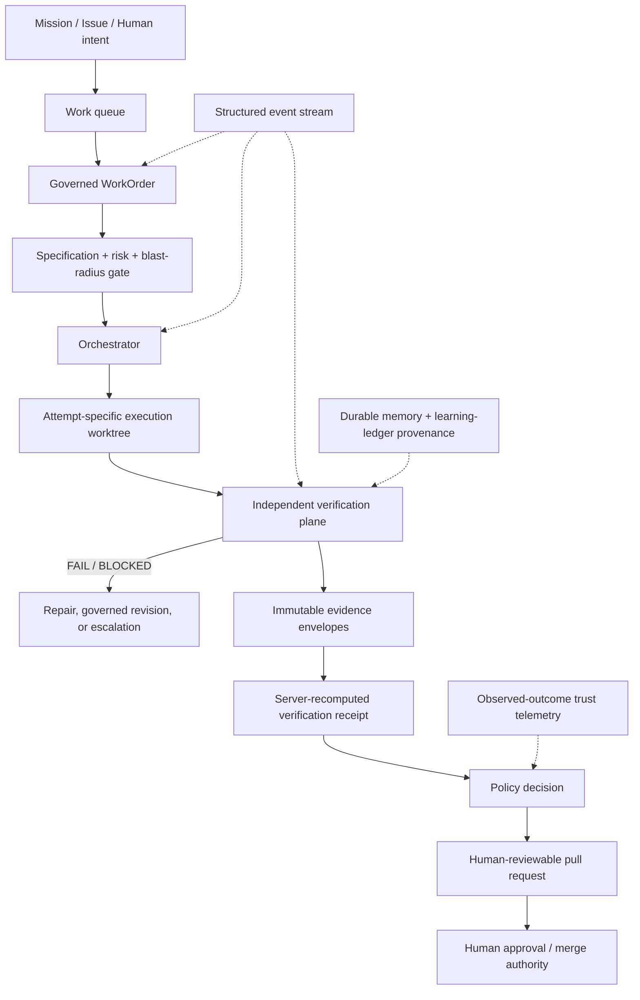

# Verification-first WorkOrder contract

Status: implemented P0 vertical slice (2026-08-11)

Mission Control now treats a WorkOrder as an executable, versioned engineering
contract. The execution worker may propose and implement a change, but it
cannot certify that change and it cannot create a pull request for an enforced
contract until independent verification produces a server-recomputed
`VERIFIED` receipt.

Verification is the constraint because generation is cheap while credible
proof is scarce. A passing agent process, a confident completion message, and a
green command reported by the implementation agent are all claims. The factory
advances only when it can bind the approved intent to exact, durable evidence.

## Architecture



The P0 execution provider is the existing bounded Codex adapter operating in an
attempt-specific Git worktree. The existing executor abstraction remains the
extension point for Docker, Kubernetes, or remote sandbox providers; those
providers are not simulated here.

## Contract model

Each verification-first WorkOrder can declare:

- functional and non-functional requirements with stable IDs;
- acceptance criteria mapped to requirements and required evidence categories;
- positive constraints, typed negative-space constraints, and protected data
  boundaries;
- a change budget for files, changed lines, paths, command classes, dependency,
  schema, migration, and infrastructure authority;
- an explainable risk classification and required approvals;
- a versioned verification contract containing mandatory checks and an
  optional human-review reservation.

The initial P0 command verifier is `factory-command/v1`. It invokes an
allowlisted executable directly, without a shell, with a sanitized environment
and a bounded timeout. Package installation, publishing, deployment,
production administration, secret access, destructive actions, and other
prohibited command classes fail closed.

Risk is a server-owned minimum classification. Deterministic signals cover
requested schema, migration, dependency, infrastructure, public-contract,
identity, secret, and critical-path scope. The stored `riskReasons` explain the
classification. Negative constraints and protected paths describe forbidden
behavior without being mistaken for requested scope.

Command policy is privilege escalation, not blanket confirmation. Harmless
configured verification commands can run automatically. Prohibited command
classes are denied, the decision is attached to the check, and the attempt
emits structured command-policy and verification events. Future approval-backed
command execution can extend this decision record without weakening the P0
deny-by-default boundary.

## Authoritative sequence

```text
approved WorkOrder revision
  → frozen execution manifest
  → agent implementation in isolated worktree
  → local candidate commit
  → exact diff / change-budget evaluation
  → negative-space evaluation
  → independent mandatory commands
  → clean-candidate invariant check
  → signed report to Convex
  → server recomputes evidence coverage and verdict
  → WorkOrder-level VerificationReceipt
  → push branch
  → create pull request
```

For an `ENFORCED` contract, the final two steps are rejected unless the current
attempt owns a `VERIFIED` WorkOrder-level receipt and the pull-request head SHA
matches the verified candidate SHA. Agent-reported command names are retained
as context only; they are never proof.

## Evidence and verdict semantics

Every independent check returns exactly one of:

- `PASS`
- `FAIL`
- `SKIPPED`
- `NOT_CONFIGURED`
- `ERROR`

The verification engine derives exactly one overall verdict:

- `VERIFIED`: every mandatory check passed and every acceptance criterion has
  enough usable, correctly categorized evidence;
- `NOT_VERIFIED`: mandatory proof is missing, skipped, unconfigured, errored,
  or failed;
- `BLOCKED`: a blocking policy, negative constraint, or change-budget check
  failed;
- `REQUIRES_HUMAN_REVIEW`: deterministic proof passed, but the approved
  contract reserves advancement for a named approval.

Evidence envelopes bind check, criterion IDs, independent producer, attempt,
WorkOrder revision, source SHA, candidate SHA, artifacts, content hash,
provenance, and timestamp. A new verification attempt stales prior receipts;
revisions invalidate affected proof.

Run events record verification start, check results, evidence creation, policy
decisions, receipt creation, PR creation, and terminal state. Together with the
frozen manifest, append-only evidence, and receipt, they reconstruct why the
factory advanced or stopped without relying on raw logs.

Trust and autonomy remain separate from agent self-description. This slice
captures the durable inputs needed for later calculations—risk, verification
outcome, first-pass/failure history, policy and budget violations, evidence
completeness, and human intervention—but does not invent a trust score or
automatically promote autonomy.

The existing meta-loop and governance records are the foundation for a future
learning ledger. A learned gate must retain its originating WorkOrder or
incident, evidence, owner, version, last trigger, and retirement rationale.
Automatic gate creation is deliberately deferred; unexplained permanent rules
would reduce trust rather than increase it.

## Operator workflow

1. Open **Delivery → Work Orders**.
2. Create a WorkOrder and define requirements, acceptance criteria, allowed and
   protected paths, file/line budget, verification command, evidence category,
   and enforcement mode.
3. Review the server-classified risk reasons and mandatory verification checks
   in **Executable specification**.
4. Dispatch through the normal approval and Factory preflight gates.
5. Inspect **Independent verification**. Missing proof is displayed as no
   receipt; it is never inferred from agent output.
6. Open **Evidence lineage** to inspect check timing, exact candidate SHA,
   evidence envelopes, violations, and the immutable event sequence.

Manual criterion receipts remain available for legacy or observe-only
WorkOrders. They cannot satisfy the WorkOrder-level gate of an enforced
contract.

## API and CLI

The authenticated orchestration API exposes:

```text
GET /workorders/:workOrderId/verification
```

The response includes the current contract, risk, budget, verification runs,
latest WorkOrder receipt, and evidence envelopes.

The CLI exposes:

```bash
mc work-order inspect <work-order-id>
mc work-order inspect <work-order-id> --json
```

## Failure recovery

- `NOT_CONFIGURED`: install or bind the required verifier, or revise the
  contract. Do not waive it implicitly.
- `BLOCKED`: revise the requested scope or budget through a governed WorkOrder
  revision; do not expand authority inside the attempt.
- `FAIL`: correct the implementation and dispatch a new attempt. Prior proof is
  retained and staled.
- `ERROR`: correct the verifier/runtime problem and retry. An error is never
  treated as a pass.
- dirty worktree or changed candidate after verification: the attempt fails
  before the receipt is recorded or the branch is pushed.
- `REQUIRES_HUMAN_REVIEW`: the P0 worker stops before branch push/PR creation.
  The control plane persists the exact Attempt, candidate SHA, verification
  receipt, and Factory-owned approval checkpoint. Unconditional approval queues
  that same Attempt at publication without rerunning `codex/v1` or independent
  verification. Immediately before the first GitHub write, the worker consumes
  a short-lived permit bound to the active lease and candidate. Conditions,
  rejection, revision, elapsed evidence, or invalid authority close the Attempt
  so the operator can use the governed retry path.

## Deliberately deferred

This original P0 slice does not include remote sandbox policy enforcement,
network egress controls, coverage-delta calculation, mutation testing,
flaky-test quarantine, or automatic workflow improvement. Provider CI/GitHub
check ingestion and staging deployment verification are implemented by the
downstream PR and governed-release contracts; see
`docs/software-factory/durable-codex-github-pr.md` and
`docs/software-factory/governed-staging-release.md`. Production deployment,
automatic provider deployment, Factory-level verified-throughput metrics,
learning-ledger CRUD, and trust scoring remain deferred until their underlying
outcomes exist. Those capabilities build on the same WorkOrder, Attempt,
evidence, receipt, and event contracts rather than introducing parallel
lifecycles.
