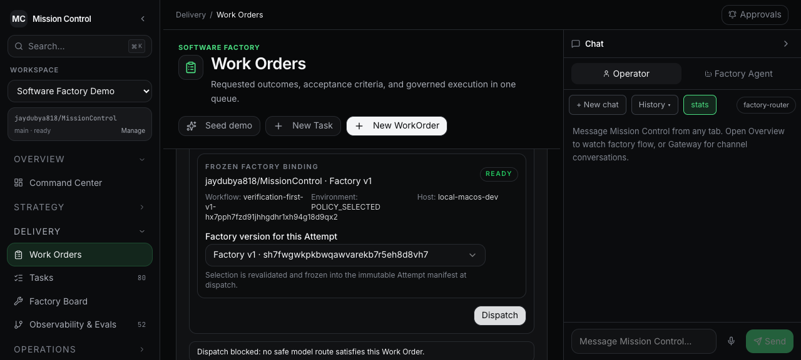

# Governed Planning Agent V1 — go/no-go record

Date: 2026-08-27
Decision: **NO-GO**
Live golden-path readiness: **NO-GO**
Feature branch: `codex/governed-planning-agent-v1`

## 2026-08-30 superseding continuation

The full implementation-to-PR decision remains **NO-GO**. The planning path is
live-proven and demo-ready, but the single final authorized implementation
Attempt ended without a candidate or independent Verification Subject.

WorkOrder revision 3 increased only the cumulative cap from $24 to $48. Four
fresh browser-recorded approvals authorized one final Factory v3 Attempt capped
at $24 and explicitly withheld publication, merge, deployment, waiver, and
acceptance. Run `gq16ag6e` / WorkflowRun
`sh7tfppxgpabn1cbesnd6j43318de6b2` was claimed by the real worker against exact
SHA `470057334800c7cddfc268b3f26d5ef3fc632088`, canonical Task
`ph7h5vq1043kms52c2r52kvjed8ddswr`, WorkOrder revision 3, Factory v3
`sh7ahq69kg6vzb0yykkz9fydas8dcw3v`, and manifest digest
`sha256:e78bfcc6d8d297f880a43108c3579966f82e72b10c400df76332d2b4a6e1ceff`.

The real Codex executor wrote eight in-scope files and returned `BLOCKED`
because its linked worktree lacked a usable pnpm dependency graph. It therefore
could not complete full typechecking or the frozen `pnpm run test:e2e:critical`
contract. The run is terminal `FAILED`; there is no candidate commit, verifier
Attempt, Verification Subject, publication permit, or Factory-created PR.

Commit `7344b42` corrects that control-plane defect for future builder and
detached verifier worktrees using offline, frozen-lockfile, no-lifecycle-script
dependency preparation plus a source-state integrity check. The fix passes 16
focused orchestration tests, orchestration typecheck, full workspace typecheck,
9/9 local critical browser checks, and all GitHub checks. It does not rewrite
the terminal Attempt or create new execution authority.

The customer walkthrough is therefore **GO** only as a governed-planning and
fail-closed-execution demonstration. It is **NO-GO** as a claim that Mission
Control autonomously implemented, independently verified, and published this
change.

Demo preflight was refreshed through the browser after the correction:
Factory v3 assessment `t97c1jvvbvnkatqh7w5zdpzz1s8dekhc` is `PASS` with
16/16 checks and is valid through Monday 2026-08-31 11:11 PDT. The canonical
worker is `READY`, clean, and has zero active runs.

## Decision

The governed Planning Agent path is now live-proven through verified GitHub App authority, Factory readiness 16/16, exact-SHA repository research, real two-phase `mission-planner/v1` execution, strict candidate validation, editable-draft adoption, human submission, human approval, WorkOrder materialization, and explicit WorkOrder risk approvals.

The path is still NO-GO because the browser dispatch request correctly stopped before Task/Attempt creation. The implementation WorkOrder is `CRITICAL` and therefore requires a `RED` execution tuple. The sole frozen Factory route is qualified only for `MISSION_PLANNING` at `YELLOW`, the Factory risk boundary is `YELLOW`, and the route exposes no cost estimate under a hard Factory budget. Routing decision `zh7dqvsgbw0h0sj6j6wxspqmed8d9typ` rejected the tuple with `MODEL_NOT_APPROVED`, `RISK_BOUNDARY_EXCEEDED`, and `BUDGET_ESTIMATE_UNKNOWN`.

Expanding the exact route's workload/risk authority or manufacturing a cost estimate would be a new qualification decision, not a defect correction. No override, fake evidence, direct backend dispatch, downgraded WorkOrder, or synthetic Attempt was used.

## Authority and Factory result

- GitHub App readiness: `VERIFIED`.
- App ID / slug: `4543062` / `mission-control-factory-jaywest`.
- Installation: `152563527`, account `jaydubya818`, repository selection `SELECTED`, status `CONNECTED`.
- Repository: `jaydubya818/MissionControl` (`sx7swdarky96tbckcfw3bz6zfx8d9dcp`).
- Permissions: metadata read, contents write, pull requests write, checks read.
- Events: `check_run`, `pull_request`, `pull_request_review`.
- Factory: `sn7d8kh8gxs0h4n1yr25jzgv5s8d9nt4`.
- Factory version: `sh7fwgwkpkbwqawvarekb7r5eh8d8vh7`.
- Configuration digest: `factory-v1-d2b4fdf9`.
- Readiness assessment: `t970981g39zy310035c1s74e658d9zke`, `PASS`, 16/16 `VERIFIED`.

See [GitHub App readiness](./github-app-readiness.md).

## Live planning result

- Mission: `z97914e3pxmw9pscxm12jcw2rd8d9jyr`, state `READY`.
- Successful Planning Run: `yn71gwer0h1jrdy257n0c9cdq18d9dz6`.
- Planning SHA: `470057334800c7cddfc268b3f26d5ef3fc632088`.
- Planner: built-in `Mission Planner`, `mission-planner/v1`.
- Model route: `openai/gpt-5.6-sol` via the exact qualified `codex-cli/chatgpt-auth` route.
- Research receipt: `yn71gwer0h1jrdy257n0c9cdq18d9dz6:1:research`.
- Generation receipt: `yn71gwer0h1jrdy257n0c9cdq18d9dz6:1:generation`.
- Research packet: 9 files, 26 exact citations, 11 findings, 7 explicit unknowns.
- Research digest: `sha256:77857e509ab16db0bc4b57fe13470c5840f90a55fb4500f37885c197a9b1f90c`.
- Candidate digest: `sha256:08119091e4979201aced72e9b5c83d6260999937a9a500f98f99a4012da8f736`.
- Plan: `ys7at6f5rkhgwd4z36e9mr2jfh8d866g`, revision 1, `APPROVED`.
- Quality contract digest: `sha256:eb3a560344c23213dc6d122445f8e0f882c581323a5973432c7d9be8823342c3`.
- Released implementation WorkOrder: `s57xr6201qh1wt83ca7y9v09dh8d87wj`.
- Released validator WorkOrder: `s57tz4nvwvja0ktgzefjsh8ytd8d9fdm`.

See [live planning proof](./live-planning-proof.md) and the [UI operation ledger](./07-ui-operation-log.md).

## Dispatch result

The implementation WorkOrder completed all four explicit human approval decisions and remained `READY` with `approvalStatus: APPROVED`. The operator inspected its scope and frozen Factory version, then clicked `Dispatch` in the browser.

The UI reported: `Dispatch blocked: no safe model route satisfies this Work Order.` The backend persisted the exhausted routing decision and created no Task and no execution run. The WorkOrder remains `READY`; current verification reports that no source Attempt has published a candidate-ready Verification Subject.

## Revision binding

The live persisted chain is:

`470057334800c7cddfc268b3f26d5ef3fc632088`
→ Planning Run `yn71gwer0h1jrdy257n0c9cdq18d9dz6`
→ candidate `sha256:08119091e4979201aced72e9b5c83d6260999937a9a500f98f99a4012da8f736`
→ approved Plan `ys7at6f5rkhgwd4z36e9mr2jfh8d866g`
→ implementation WorkOrder `s57xr6201qh1wt83ca7y9v09dh8d87wj`
→ validator WorkOrder `s57tz4nvwvja0ktgzefjsh8ytd8d9fdm`.

The Task, Attempt, execution-manifest, execution-candidate, Verification Subject, and PR stages do not exist. Same-SHA proof is complete only through WorkOrder materialization and therefore does not satisfy the mandatory GO chain. See [revision chain](./revision-chain.md).

## Concurrency, refresh, and retry durability

- Live dual-session request: exactly one active run, `yn796304jr54zrcs1pnjqx9ma58d9m21`, persisted. The losing browser response payload was not captured.
- Deterministic race proof: the second serialized request returns the first run with `created: false` and `duplicateReason: ACTIVE_RUN_EXISTS`; one row exists.
- Live refresh proof: run `yn796304jr54zrcs1pnjqx9ma58d9m21` retained the same ID, state, attempt, SHA, planner, and Factory bindings across reload.
- Retry durability: three failed runs remain separate durable records before the successful fourth run. Completed phase receipts on failed runs were not overwritten. The architecture intentionally creates a new run and reruns exact-SHA research after a non-retryable validation failure.
- Duplicate authoritative candidates: none. Only successful run `yn71gwer0h1jrdy257n0c9cdq18d9dz6` owns the adopted candidate.

## Drift proof

The successful live lineage was not disturbed to create an artificial drift. Deterministic `executionManifest` coverage proves planning SHA `A` plus execution base SHA `B` throws before manifest persistence. Production dispatch also emits `planning-revision-drift` when the canonical worker base differs from the WorkOrder's approved planning SHA. This is deterministic proof, not a separate live browser drift scenario.

## Qualification

| Command | Result |
|---|---|
| Focused planning, compiler, decision, concurrency, and drift regressions | PASS: 6 files / 42 tests. |
| `pnpm run ci:runtime-contract` | PASS; accepted public contract remains v34. |
| `pnpm run lint` | PASS; all 19 checked workspace projects and 10 Skills passed. |
| `pnpm run typecheck` | PASS across 19 checked workspace projects. |
| `pnpm run test` | PASS: UI 69 files / 313 tests; orchestration 28 files / 185 tests plus one opt-in skip; Convex 107 files / 781 tests; all workspace suites passed. |
| `pnpm run test:e2e:critical` | PASS: 9 Chromium checks, including Work Orders and Decision Center accessibility. |
| `pnpm run release:security` | PASS: no critical/high production advisories; authorization baseline remains 637; repository secret scan and Factory docs passed. |
| `pnpm run smoke:orchestration-start` | PASS; built Node ESM orchestration artifact loaded. |
| `pnpm run qualify:factory` | PASS: all 16 canonical system-qualification stages, including full repository tests, build, security, runtime contract, smoke, and whitespace integrity. |

The first Factory-qualification rerun reached the final whitespace check and reported three Markdown line-break spaces in this record. They were removed, `git diff --check` passed, and the complete qualifier was rerun from the start to `PASS`. No gate was weakened.

## Work intentionally not executed

- Internal controlled Attempt: not created.
- Bounded mutation and immutable execution candidate: not executed.
- Independent Verification Attempt and Verification Subject: not created.
- Controlled GitHub PR publication: not executed.
- Acceptance, merge, deployment, Leonardo, and learning: not executed.

## Known limitations

- The admitted exact route is scoped to `MISSION_PLANNING`/`YELLOW`; it is not qualified for this `CRITICAL`/`RED` implementation WorkOrder.
- The frozen Factory risk boundary is `YELLOW`, below the WorkOrder's required `RED` tier.
- The ChatGPT-authenticated Codex route exposes no cost estimate; the hard Factory budget therefore rejects it for governed execution routing.
- Factory's repository-level `readyForBrowserDispatch` projection can show `Ready` before WorkOrder-specific risk/model/cost routing runs. The dispatch mutation remains authoritative and failed closed.
- The UI host projection selected the legacy `local-macos-dev` readiness row after evidence writes made `planning-pilot-local` dirty. No Attempt reached host binding; the canonical pilot worker must be cleanly reattested before any future dispatch.
- Same-SHA live proof stops at WorkOrder basis; Task, Attempt, and execution manifest do not exist.
- SHA-drift proof is deterministic rather than live-browser evidence.
- The live concurrent request proved one persisted active run, but the losing browser response body was not captured; exact `created: false` / `ACTIVE_RUN_EXISTS` evidence is deterministic.
- A later failed or unadopted run can remain visible as `Latest unadopted candidate` after a successful run is bound to a Plan, which is truthful but can be visually confusing.
- General native-tool authorization and exact-version Skill subjects remain outside this planning-specific qualification.
- Remote Sandbox remains Preview and was not used.
- GitHub publication, merge, deployment, Plan approval, acceptance, and learning remain outside agent authority.

## Interview-safe claim

Mission Control now proves the browser-operated governed planning lifecycle from verified repository authority through an approved, exact-SHA-bound Plan and authorized WorkOrders. It also proves that execution fails closed when the frozen Factory tuple lacks the WorkOrder-specific risk, workload, and cost authority. It does not yet prove an internal Attempt, immutable execution candidate, independent verification, or controlled PR.
