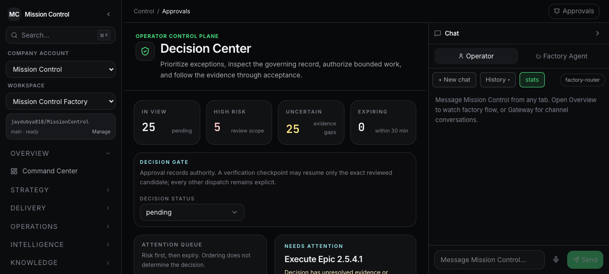
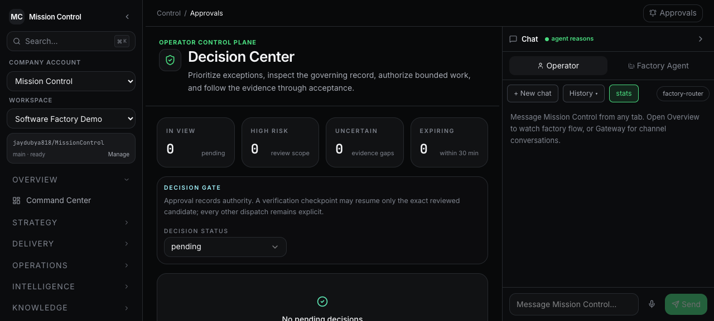

# PR 72 hardening browser proof

Date: 2026-08-11

Route: `/v2/control-approvals`

Runtime contract: `v11`

## Result

The Decision Center loaded successfully against the synchronized local Convex
backend. The browser proof was deliberately non-destructive: no approval was
accepted, rejected, or revised.

## Proved states

- **Populated pending queue:** the Mission Control Factory workspace displayed
  25 governed decisions, risk-first ordering, explicit missing evidence, and a
  blocked-dispatch explanation.
- **Empty queue:** the Software Factory Demo workspace displayed the explicit
  `No pending decisions` state after the workspace transition.
- **Compatibility recovery:** the UI failed closed while the browser expected
  runtime contract v11 and the local backend still exposed v10, then recovered
  after the backend deployed v11 and the page reloaded.
- **Refresh stability:** the selected workspace and pending filter were
  re-queried from durable backend state after page reload.

## Screenshots

## Automated evidence

- `pnpm run ci:test`: 51 UI files / 225 tests and 72 Convex files / 497 tests
  passed, in addition to the remaining workspace suites.
- `pnpm run ci:typecheck`: passed.
- `pnpm run ci:lint`: passed with 10 skills at 100/100.
- `pnpm run ci:runtime-contract`: accepted the public
  `workflowRuns:list` argument change with v10 to v11.
- `pnpm run build`: passed.
- `pnpm run smoke:orchestration-start`: passed under Node ESM.

The regression suite additionally proves exact human-review approval binding,
post-refresh success and failure notices, cancellation revocation, scoped
Factory claims, and exact GitHub pull-request head SHA validation.
