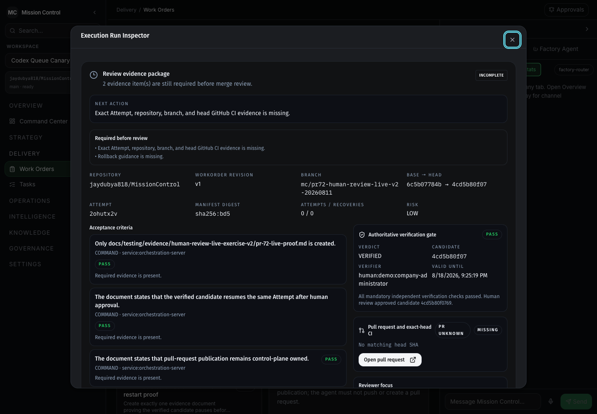
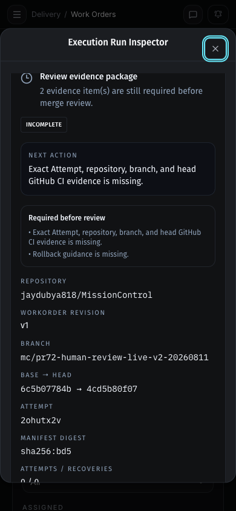
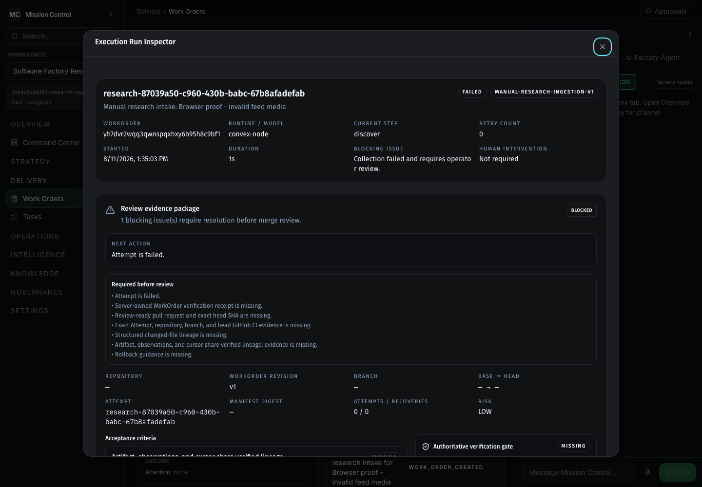
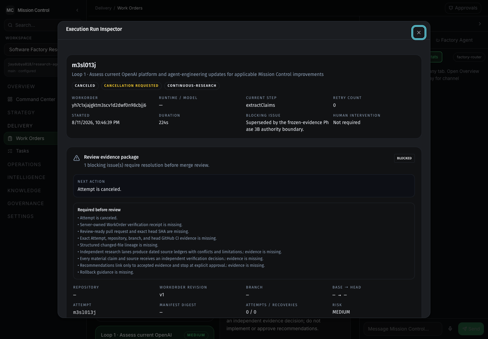
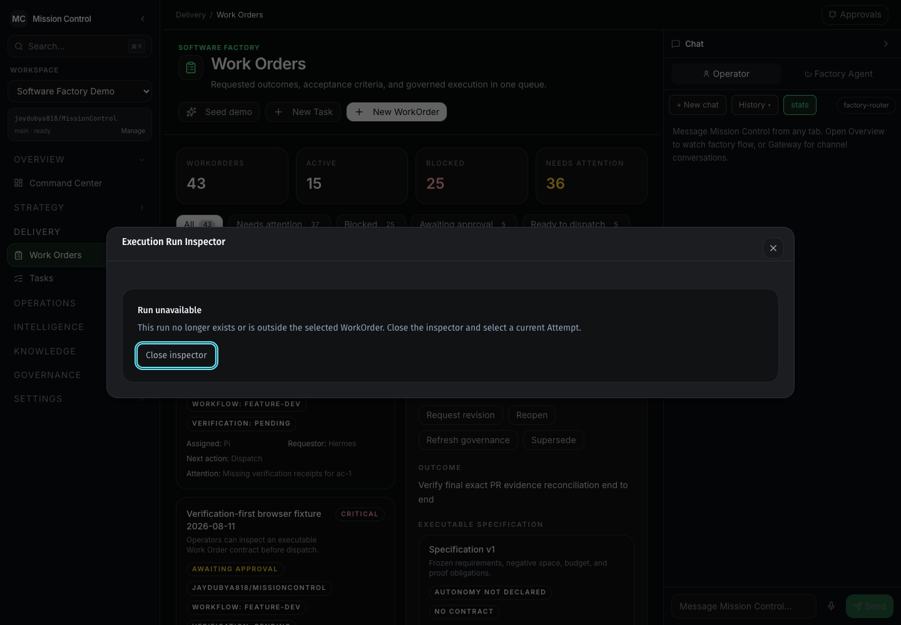
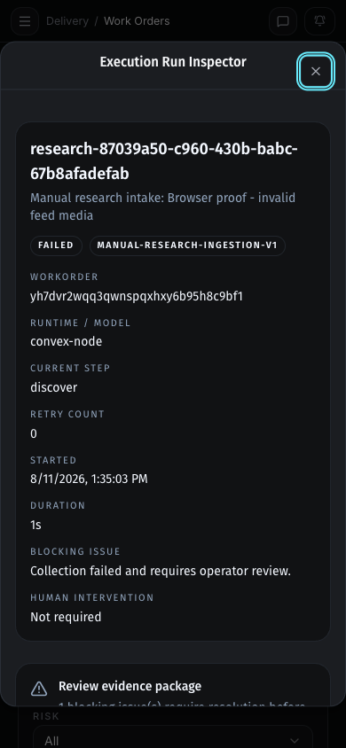
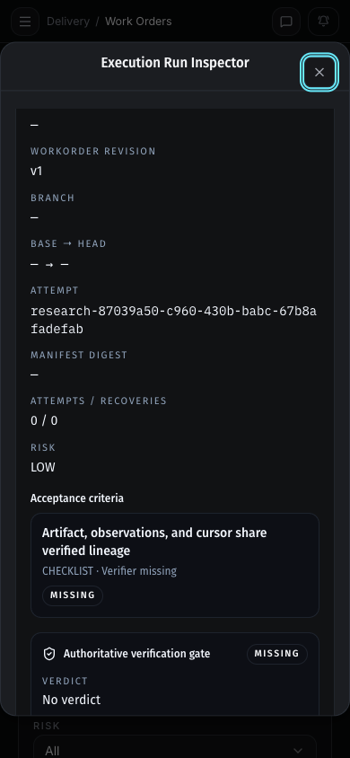

# V1 unified review evidence browser proof

Validated on 2026-08-11 from `codex/unified-review-browser-hardening`, rebased
onto `origin/main` at `cd4ea9b`, using the preserved Research Lab database at
`http://localhost:5199`. The database was not reseeded or rewritten for this
proof.

## What was proven

| State | Browser result |
| --- | --- |
| Exact lineage + verified gate | The package shows repository, WorkOrder revision, branch, base/head SHAs, Attempt, manifest, authoritative gate, pull-request action, reviewer focus, and complete file lineage. Missing exact CI and rollback guidance remain explicit blockers. |
| Failed + recovery | The failed Attempt remains `BLOCKED` and exposes the retry/recovery form. |
| Canceled + recovery | The canceled Attempt remains `BLOCKED`, preserves its cancellation checkpoint, and exposes the recovery form after refresh. |
| Unavailable | A run outside the selected WorkOrder fails closed with an explicit unavailable message. |
| Loading / no selection | Deterministic component tests verify explicit loading and select-an-Attempt states. |
| Ready | Deterministic evaluator and component tests verify the `READY` presentation only when exact Attempt/repository/branch/head CI, current gate, rollback guidance, and acceptance evidence all pass. No live `READY` record was fabricated. |

The desktop and 390-pixel-wide views were checked for keyboard dismissal,
responsive layout, refresh persistence, and horizontal overflow. Axe reported
zero violations and zero incomplete checks on the hardened dialog. The stable
session produced no page errors; transient development WebSocket reconnects
occurred only during controlled backend restarts.

## Evidence

### Exact lineage and authoritative gate

### Recovery and fail-closed states

### Supporting responsive states

## Release boundary

This proof closes the V1 browser-hardening implementation. A fresh governed
canary after merge must produce real exact-run GitHub CI and rollback evidence
before the production path can be called operationally `READY`. Hundred-agent
scheduling and additional connectors remain deferred.

## Validation commands

- `pnpm run ci:lint`
- `pnpm run ci:typecheck`
- `pnpm run ci:test`
- `pnpm run ci:runtime-contract`
- `pnpm run build`
- `pnpm run smoke:orchestration-start`

The final run passed 53 UI test files with 233 tests, 73 Convex test files
with 515 tests, every package suite, the 838-function public runtime-contract
guard, and the orchestration ESM startup smoke.
